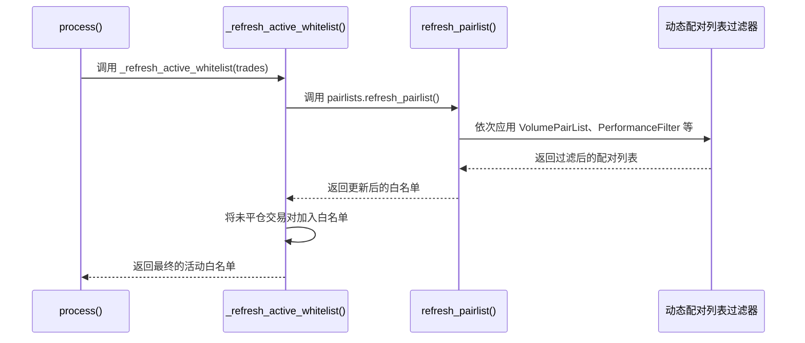
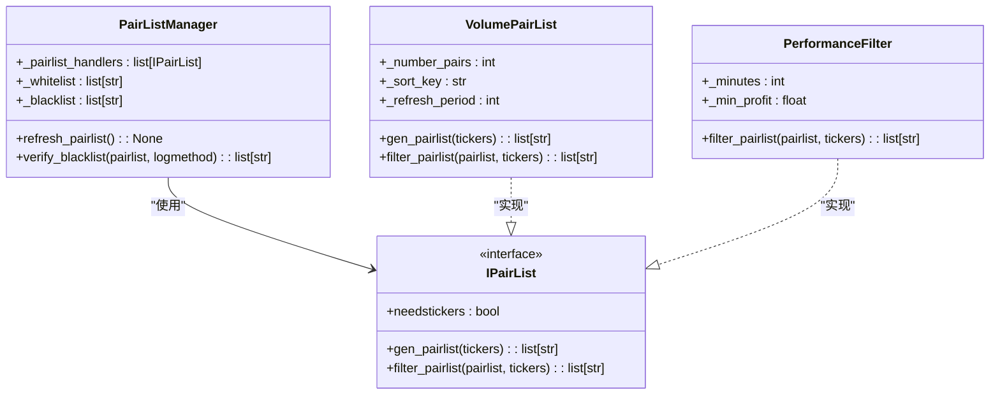
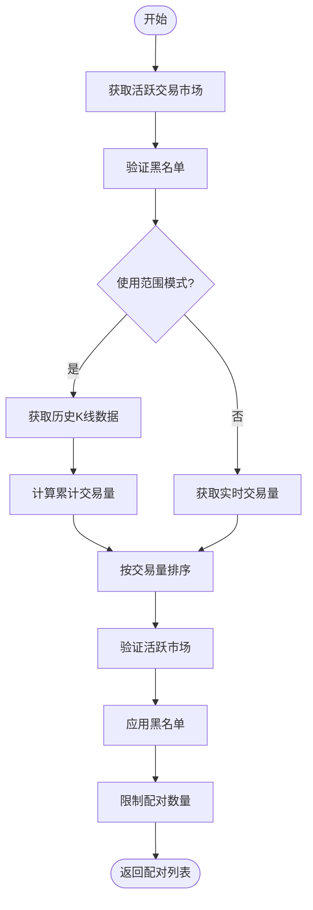
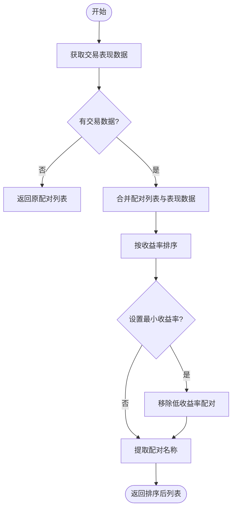
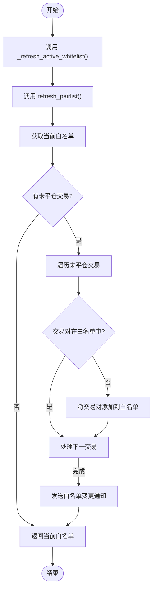

# 配对列表刷新机制

<cite>
**本文档中引用的文件**   
- [freqtradebot.py](file://freqtrade/freqtradebot.py#L78-L346)
- [pairlistmanager.py](file://freqtrade/plugins/pairlistmanager.py#L132-L179)
- [VolumePairList.py](file://freqtrade/plugins/pairlist/VolumePairList.py#L26-L314)
- [PerformanceFilter.py](file://freqtrade/plugins/pairlist/PerformanceFilter.py#L18-L110)
</cite>

## 目录
1. [配对列表刷新机制概述](#配对列表刷新机制概述)
2. [核心调用流程分析](#核心调用流程分析)
3. [动态配对列表实现原理](#动态配对列表实现原理)
4. [未平仓交易对处理机制](#未平仓交易对处理机制)
5. [刷新频率与时间协调](#刷新频率与时间协调)

## 配对列表刷新机制概述

FreqtradeBot 的配对列表刷新机制是交易系统的核心组件之一，负责动态维护候选交易对的白名单。该机制通过 `_refresh_active_whitelist()` 方法协调 `PairListManager.refresh_pairlist()` 方法，结合市场数据和交易表现实时调整交易对集合。系统在每次主循环执行时都会刷新配对列表，并确保所有未平仓交易对的 K 线数据持续更新，以支持交易决策。

## 核心调用流程分析

### 主循环中的配对列表刷新

`_refresh_active_whitelist()` 方法在 FreqtradeBot 的主循环 `process()` 中被调用，是交易决策流程的关键环节。该方法接收当前所有未平仓交易作为参数，首先调用 `PairListManager.refresh_pairlist()` 方法获取最新的动态白名单，然后将未平仓交易对强制加入活动白名单。

**Diagram sources**
- [freqtradebot.py](file://freqtrade/freqtradebot.py#L246-L300)
- [freqtradebot.py](file://freqtrade/freqtradebot.py#L327-L346)
- [pairlistmanager.py](file://freqtrade/plugins/pairlistmanager.py#L135-L156)

**Section sources**
- [freqtradebot.py](file://freqtrade/freqtradebot.py#L246-L346)
- [pairlistmanager.py](file://freqtrade/plugins/pairlistmanager.py#L135-L156)

## 动态配对列表实现原理

### 配对列表管理器架构

`PairListManager` 类负责管理所有配对列表处理器，通过链式调用的方式依次应用多个过滤器。第一个处理器作为生成器创建初始配对列表，后续处理器作为过滤器对列表进行排序和筛选，最终通过黑名单验证确保合规性。

**Diagram sources**
- [pairlistmanager.py](file://freqtrade/plugins/pairlistmanager.py#L135-L179)
- [VolumePairList.py](file://freqtrade/plugins/pairlist/VolumePairList.py#L26-L314)
- [PerformanceFilter.py](file://freqtrade/plugins/pairlist/PerformanceFilter.py#L18-L110)

### 交易量配对列表实现

`VolumePairList` 类基于交易量数据动态生成配对列表，支持两种模式：实时交易量模式和历史 K 线模式。在实时模式下，系统通过 `fetchTickers` 接口获取各交易对的最新交易量数据；在历史模式下，系统通过 `refresh_ohlcv_with_cache` 方法获取指定时间段内的 K 线数据，计算累计交易量。

**Diagram sources**
- [VolumePairList.py](file://freqtrade/plugins/pairlist/VolumePairList.py#L26-L314)

### 交易表现过滤器实现

`PerformanceFilter` 类基于历史交易表现对配对列表进行排序和过滤。该过滤器从数据库中获取指定时间范围内的交易表现数据，按收益率从高到低排序，可选择性地移除收益率低于阈值的交易对。

**Diagram sources**
- [PerformanceFilter.py](file://freqtrade/plugins/pairlist/PerformanceFilter.py#L18-L110)

**Section sources**
- [VolumePairList.py](file://freqtrade/plugins/pairlist/VolumePairList.py#L26-L314)
- [PerformanceFilter.py](file://freqtrade/plugins/pairlist/PerformanceFilter.py#L18-L110)

## 未平仓交易对处理机制

### 强制加入活动白名单

当存在未平仓交易时，系统会将这些交易对强制加入活动白名单，确保其 K 线数据持续更新。这一机制通过 `_refresh_active_whitelist()` 方法中的条件判断实现：如果传入的 `trades` 参数不为空，则遍历所有未平仓交易，将不在当前白名单中的交易对添加到白名单末尾。

**Diagram sources**
- [freqtradebot.py](file://freqtrade/freqtradebot.py#L327-L346)

### 数据更新保障

通过强制将未平仓交易对加入活动白名单，系统确保了这些交易对的 K 线数据能够被 `dataprovider.refresh()` 方法持续更新。这为策略分析、止损计算和仓位调整等后续操作提供了必要的数据支持，避免了因数据缺失导致的交易风险。

**Section sources**
- [freqtradebot.py](file://freqtrade/freqtradebot.py#L327-L346)

## 刷新频率与时间协调

### 刷新周期控制

配对列表的刷新频率由 `pairlist_refresh_period` 配置参数控制，默认值为 3600 秒（1 小时）。`PairListManager` 类继承自 `LoggingMixin`，利用其时间间隔控制功能确保刷新操作不会过于频繁。对于 `VolumePairList` 等特定处理器，还可以通过 `refresh_period` 参数设置独立的刷新周期。

### 主循环时间协调

配对列表刷新与主循环的时间协调通过以下机制实现：在 `FreqtradeBot.__init__()` 方法中进行初始配对列表刷新，随后在每次 `process()` 循环开始时调用 `_refresh_active_whitelist()` 方法。这种设计确保了每次交易决策都基于最新的市场数据和交易状态，同时避免了不必要的频繁刷新操作。

**Section sources**
- [freqtradebot.py](file://freqtrade/freqtradebot.py#L78-L187)