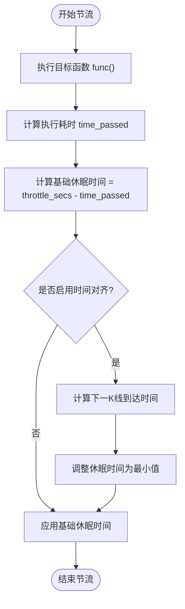
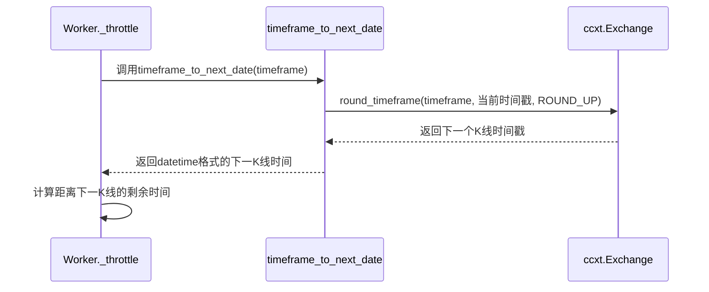
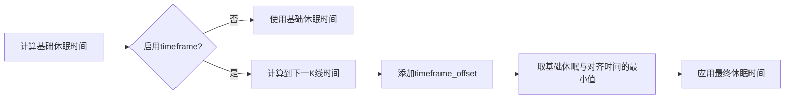
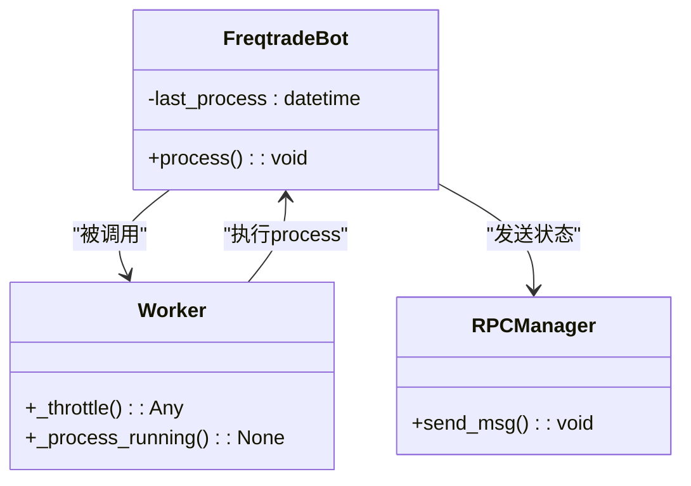
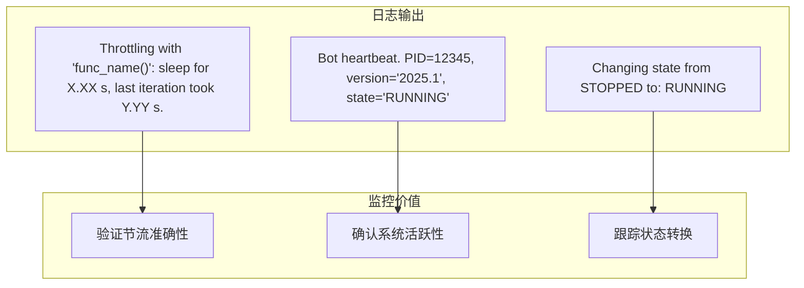

# 时间同步与节流控制

<cite>
**本文档中引用的文件**   
- [worker.py](file://freqtrade/worker.py)
- [exchange_utils_timeframe.py](file://freqtrade/exchange/exchange_utils_timeframe.py)
- [freqtradebot.py](file://freqtrade/freqtradebot.py)
</cite>

## 目录
1. [简介](#简介)
2. [节流机制核心逻辑](#节流机制核心逻辑)
3. [时间对齐实现原理](#时间对齐实现原理)
4. [休眠时间动态选择策略](#休眠时间动态选择策略)
5. [last_process时间戳的作用](#last_process时间戳的作用)
6. [日志监控与调试](#日志监控与调试)

## 简介
Freqtrade系统通过Worker类的节流机制确保策略在每个新K线开始时执行。该机制结合了固定节流和基于K线周期的时间对齐功能，通过精确计算休眠时间来实现与市场数据同步。核心组件包括_throttle()方法、timeframe_to_next_date()函数以及last_process时间戳，共同构成了一个可靠的循环执行框架。

## 节流机制核心逻辑

Worker._throttle()方法是整个节流系统的核心，负责控制每次迭代的最小执行时间。该方法接收一个可调用函数和节流秒数作为参数，在函数执行后计算实际耗时，并根据预设的throttle_secs参数确定需要休眠的时间。

**节流机制核心逻辑**
- [worker.py](file://freqtrade/worker.py#L144-L186)

## 时间对齐实现原理

当timeframe参数被指定时，系统会启用时间对齐模式。通过调用timeframe_to_next_date()函数，系统能够精确计算出下一个K线周期的开始时间。该函数利用ccxt库的round_timeframe功能，将当前时间向上取整到最近的K线边界。

**时间对齐实现原理**
- [exchange_utils_timeframe.py](file://freqtrade/exchange/exchange_utils_timeframe.py#L67-L77)
- [worker.py](file://freqtrade/worker.py#L144-L186)

## 休眠时间动态选择策略

系统采用动态策略在正常节流和时间对齐模式之间选择最短的休眠时间。具体逻辑如下：首先计算基础节流所需的休眠时间，然后计算到下一个K线开始的时间间隔。如果启用了timeframe_offset（默认为1秒），则会在下一个K线时间基础上增加偏移量，以确保新K线数据已经生成。

关键决策点在于比较基础节流时间和带偏移的K线对齐时间，选择两者中的较小值作为最终休眠时间。这种设计避免了在新旧K线切换期间可能出现的竞争条件，确保策略总是在完整的新K线数据基础上运行。

**休眠时间动态选择策略**
- [worker.py](file://freqtrade/worker.py#L144-L186)

## last_process时间戳的作用

last_process时间戳记录了最后一次处理循环完成的时间，在系统中扮演着重要角色。该时间戳在FreqtradeBot.process()方法的末尾被更新，标志着一次完整交易处理周期的结束。

其主要作用包括：
1. **状态监控**：外部系统可以通过查询last_process时间戳来判断机器人是否正常运行
2. **性能分析**：结合heartbeat机制，可以评估系统的处理延迟和响应时间
3. **故障排查**：长时间未更新的时间戳可能表明系统卡顿或异常
4. **数据一致性**：确保所有操作都在最新的市场数据基础上进行

**last_process时间戳的作用**
- [freqtradebot.py](file://freqtrade/freqtradebot.py#L246-L300)
- [worker.py](file://freqtrade/worker.py#L196-L211)

## 日志监控与调试

系统通过详细的日志输出帮助用户观察循环执行的规律性。每次节流操作都会生成一条调试日志，包含以下关键信息：
- 执行的函数名称
- 实际休眠时间（精确到百分之一秒）
- 上次迭代的实际耗时
- 当前状态变化信息

这些日志使得用户能够清晰地看到：
1. 每次循环的实际间隔是否符合预期
2. 系统是否存在处理延迟
3. 时间对齐机制是否正常工作
4. 休眠时间的选择逻辑是否正确

此外，结合heartbeat机制，系统还会定期输出心跳日志，包含PID、版本号和当前状态，为长期运行的监控提供了便利。

**日志监控与调试**
- [worker.py](file://freqtrade/worker.py#L144-L186)
- [worker.py](file://freqtrade/worker.py#L82-L142)