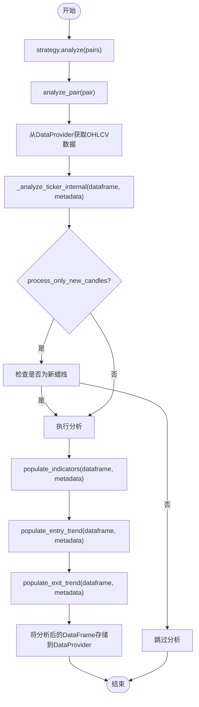
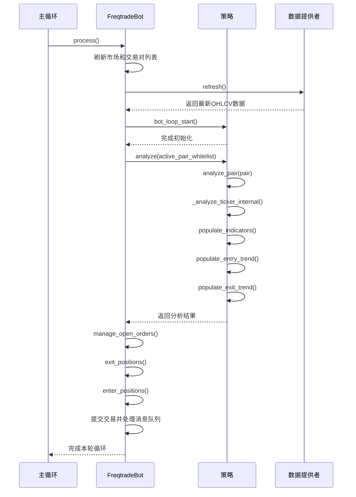

# 信号生成流程

<cite>
**本文档中引用的文件**   
- [interface.py](file://freqtrade/strategy/interface.py)
- [freqtradebot.py](file://freqtrade/freqtradebot.py)
- [hlhb.py](file://user_data/strategies/hlhb.py)
- [Scalp.py](file://user_data/strategies/Scalp.py)
- [Low_BB.py](file://user_data/strategies/Low_BB.py)
- [Simple.py](file://user_data/strategies/Simple.py)
- [AdxSmas.py](file://user_data/strategies/AdxSmas.py)
- [BinHV27.py](file://user_data/strategies/BinHV27.py)
- [BinHV45.py](file://user_data/strategies/BinHV45.py)
- [Diamond.py](file://user_data/strategies/Diamond.py)
- [GodStra.py](file://user_data/strategies/GodStra.py)
- [MultiMa.py](file://user_data/strategies/MultiMa.py)
</cite>

## 目录
1. [信号生成流程概述](#信号生成流程概述)
2. [策略接口与核心方法](#策略接口与核心方法)
3. [指标与信号生成方法执行顺序](#指标与信号生成方法执行顺序)
4. [DataFrame结构与数据处理](#dataframe结构与数据处理)
5. [主循环中的信号生成集成](#主循环中的信号生成集成)
6. [买卖信号格式与数据类型](#买卖信号格式与数据类型)

## 信号生成流程概述

信号生成流程是Freqtrade交易系统的核心，它从`strategy.analyze()`调用开始，通过一系列方法协调指标计算和信号生成。该流程首先获取指定交易对的历史数据，然后依次调用`populate_indicators`、`populate_entry_trend`和`populate_exit_trend`等方法来计算技术指标并生成买卖信号。整个过程由`IStrategy`接口定义，并在主循环中通过`freqtradebot.py`的`process()`方法进行集成和执行。

**信号来源**
- [interface.py](file://freqtrade/strategy/interface.py#L1264-L1270)
- [freqtradebot.py](file://freqtrade/freqtradebot.py#L300-L305)

## 策略接口与核心方法

`IStrategy`接口定义了策略类必须遵循的结构和方法。其中，`analyze()`方法是信号生成的入口点，负责协调整个分析过程。该方法接收一个交易对列表作为参数，并为每个交易对调用`analyze_pair()`方法。`analyze_pair()`方法从数据提供者（DataProvider）获取指定交易对和时间框架的OHLCV数据，然后调用`_analyze_ticker_internal()`方法进行实际的分析。

`_analyze_ticker_internal()`方法是策略分析的核心，它根据`process_only_new_candles`配置决定是否对新蜡烛进行分析。如果配置为`True`，则只在新蜡烛出现时运行分析；否则，每次都会重新计算。该方法调用`analyze_ticker()`，后者依次执行`populate_indicators`、`populate_entry_trend`和`populate_exit_trend`等方法，并将结果存储在数据提供者中，以便后续使用。

**信号来源**
- [interface.py](file://freqtrade/strategy/interface.py#L1200-L1230)
- [interface.py](file://freqtrade/strategy/interface.py#L1232-L1262)

## 指标与信号生成方法执行顺序

信号生成的执行顺序严格按照以下步骤进行：首先调用`populate_indicators`方法计算所有必要的技术指标，如RSI、EMA、ADX等；然后调用`populate_entry_trend`方法基于这些指标生成入场信号；最后调用`populate_exit_trend`方法生成出场信号。这些方法都接收一个`DataFrame`和一个`metadata`字典作为参数，其中`metadata`包含了当前交易对等附加信息。

以`hlhb.py`策略为例，`populate_indicators`方法计算了RSI、EMA和ADX等指标；`populate_entry_trend`方法在RSI上穿50、5日EMA上穿10日EMA且ADX大于25时生成买入信号；`populate_exit_trend`方法在RSI下穿50、5日EMA下穿10日EMA且ADX大于25时生成卖出信号。其他策略如`Scalp.py`、`Low_BB.py`等也遵循类似的模式，但具体的指标和条件有所不同。

**图表来源**
- [interface.py](file://freqtrade/strategy/interface.py#L1200-L1230)
- [hlhb.py](file://user_data/strategies/hlhb.py#L123-L169)

## DataFrame结构与数据处理

`DataFrame`是信号生成过程中使用的数据结构，它包含了OHLCV数据以及通过`populate_indicators`等方法添加的各种技术指标。`'date'`列是`DataFrame`的关键列之一，它表示每根蜡烛的时间戳。在`analyze_pair()`方法中，系统会检查`DataFrame`是否过时，如果最新蜡烛的时间戳距离当前时间超过一定阈值（通常是2个时间框架加上偏移量），则会发出警告并跳过分析。

`metadata`参数在多交易对分析中起着重要作用，它包含了当前交易对等附加信息，使得策略可以根据不同的交易对调整其行为。例如，在`populate_indicators`方法中，可以通过`metadata['pair']`获取当前交易对，并根据该信息进行特定的计算或调整。

**信号来源**
- [interface.py](file://freqtrade/strategy/interface.py#L1232-L1262)
- [interface.py](file://freqtrade/strategy/interface.py#L1272-L1310)

## 主循环中的信号生成集成

信号生成流程在`freqtradebot.py`的`process()`方法中被集成到主循环中。该方法首先刷新市场和交易对列表，然后调用`dataprovider.refresh()`获取最新的OHLCV数据。接着，它调用`strategy.bot_loop_start()`进行每轮循环的初始化，最后通过`strategy.analyze()`对所有活跃交易对进行分析。

`process()`方法还负责处理已打开的交易，包括检查退出条件、调整仓位和进入新交易。在分析完成后，系统会提交交易并处理消息队列，确保所有操作都已正确执行。整个过程在一个循环中不断重复，确保系统能够实时响应市场变化。

**图表来源**
- [freqtradebot.py](file://freqtrade/freqtradebot.py#L300-L305)
- [interface.py](file://freqtrade/strategy/interface.py#L1264-L1270)

## 买卖信号格式与数据类型

买卖信号以布尔值的形式存储在`DataFrame`中，具体列名为`enter_long`、`exit_long`、`enter_short`和`exit_short`。当某个条件满足时，相应的列会被设置为1，表示生成了一个信号；否则为0。这些信号随后被`get_entry_signal()`和`get_exit_signal()`方法读取，用于决定是否执行交易。

例如，在`Simple.py`策略中，当MACD在零轴之上且快线上穿慢线、布林带上轨向上且RSI进入超买区时，`enter_long`列会被设置为1，表示生成了一个买入信号。类似地，当RSI进入极度超买区时，`exit_long`列会被设置为1，表示生成了一个卖出信号。这些信号的生成和处理确保了交易决策的自动化和一致性。

**信号来源**
- [Simple.py](file://user_data/strategies/Simple.py#L85-L113)
- [interface.py](file://freqtrade/strategy/interface.py#L1312-L1390)