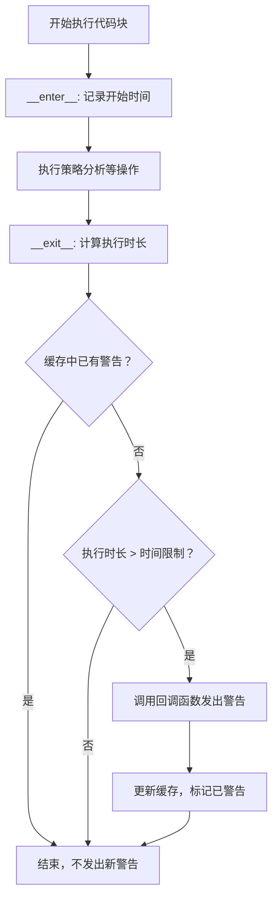
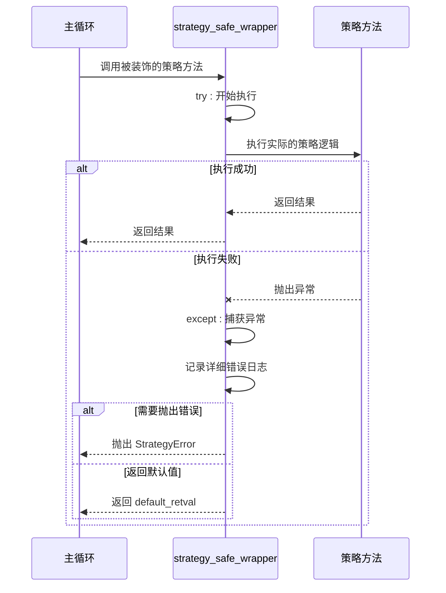

# 性能监控与异常处理

<cite>
**本文档中引用的文件**
- [measure_time.py](file://freqtrade/util/measure_time.py)
- [strategy_wrapper.py](file://freqtrade/strategy/strategy_wrapper.py)
- [freqtradebot.py](file://freqtrade/freqtradebot.py)
- [interface.py](file://freqtrade/strategy/interface.py)
</cite>

## 目录
1. [性能监控器 `MeasureTime` 工作原理](#性能监控器-measuretime-工作原理)
2. [`strategy_safe_wrapper` 异常处理机制](#strategy_safe_wrapper-异常处理机制)
3. [性能监控与异常处理的协同作用](#性能监控与异常处理的协同作用)
4. [日志分析与策略优化](#日志分析与策略优化)
5. [结论](#结论)

## 性能监控器 `MeasureTime` 工作原理

`MeasureTime` 类是 Freqtrade 交易机器人中用于性能监控的核心组件，其主要功能是测量代码块的执行时间，并在执行时间超过预设阈值时发出警告。该类通过 Python 的上下文管理器协议（`__enter__` 和 `__exit__` 方法）实现，确保在代码块执行前后自动记录开始和结束时间。

`MeasureTime` 的初始化方法接受三个参数：回调函数 `callback`、时间限制 `time_limit` 和缓存生存时间 `ttl`。回调函数在执行时间超时时被调用，用于处理警告或日志记录。时间限制定义了允许的最大执行时间，而 `ttl` 参数通过 `TTLCache` 实现了警告的冷却机制，防止在短时间内重复发出相同警告，避免日志泛滥。

在交易机器人的主循环中，`MeasureTime` 被用于监控策略分析的执行时间。具体实现位于 `FreqtradeBot` 类的 `__init__` 方法中，通过 `self._measure_execution = MeasureTime(log_took_too_long, timeframe_secs * 0.25)` 创建了一个监控器实例。该实例的 `log_took_too_long` 回调函数会在策略分析耗时超过当前时间框架（timeframe）25% 时触发，向用户发出警告，提示可能存在延迟订单或错失信号的风险。

**图表来源**
- [measure_time.py](file://freqtrade/util/measure_time.py#L10-L44)
- [freqtradebot.py](file://freqtrade/freqtradebot.py#L72-L763)

**本节来源**
- [measure_time.py](file://freqtrade/util/measure_time.py#L10-L44)
- [freqtradebot.py](file://freqtrade/freqtradebot.py#L72-L763)

## `strategy_safe_wrapper` 异常处理机制

`strategy_safe_wrapper` 是一个装饰器函数，用于包裹策略中的用户自定义方法，其核心作用是捕获并处理策略执行过程中可能发生的异常，防止异常中断主循环，从而保障交易机器人的稳定运行。

该装饰器通过 `try...except` 语句捕获所有异常。当捕获到 `ValueError` 或 `Exception` 时，它会记录详细的错误日志。对于 `ValueError`，它会以警告级别（warning）记录日志；对于其他所有 `Exception`，则以错误级别（exception）记录，这能捕获更严重的错误并包含完整的堆栈跟踪信息。日志中包含了错误消息和发生错误的函数信息，便于后续排查。

装饰器的行为可以通过参数进行控制。`default_retval` 参数允许为异常情况指定一个默认返回值，而不是抛出 `StrategyError`。`supress_error` 参数则可以完全抑制错误的抛出。在 `FreqtradeBot` 的 `process` 方法中，`strategy_safe_wrapper` 被用来包裹 `self.strategy.bot_loop_start` 方法，并设置了 `supress_error=True`，这确保了即使 `bot_loop_start` 方法出现错误，主循环也能继续执行，不会导致整个机器人崩溃。

此外，该装饰器还包含一个保护机制：当传入的参数包含 `trade` 对象时，它会使用 `deepcopy` 对 `trade` 对象进行深拷贝，防止策略代码意外修改原始的交易对象，保证了数据的一致性和安全性。

**图表来源**
- [strategy_wrapper.py](file://freqtrade/strategy/strategy_wrapper.py#L15-L42)
- [freqtradebot.py](file://freqtrade/freqtradebot.py#L72-L763)

**本节来源**
- [strategy_wrapper.py](file://freqtrade/strategy/strategy_wrapper.py#L15-L42)
- [interface.py](file://freqtrade/strategy/interface.py#L72-L763)

## 性能监控与异常处理的协同作用

性能监控与异常处理是保障交易机器人稳定、可靠运行的两大基石，它们在 `Freqtrade` 系统中协同工作，共同构建了一个健壮的运行环境。

性能监控器 `MeasureTime` 作为“预警系统”，专注于检测潜在的性能瓶颈。它不处理致命错误，而是关注那些可能导致交易延迟或错失机会的“亚健康”状态。例如，当策略分析耗时过长时，`MeasureTime` 发出的警告提示用户需要优化策略或减少交易对数量，从而主动避免因延迟导致的交易失败。这种机制将问题从“事后处理”转变为“事前预防”。

异常处理机制 `strategy_safe_wrapper` 则扮演“安全网”的角色，负责处理程序运行中发生的各种意外和错误。它确保了即使策略代码存在缺陷或外部环境出现异常（如网络问题），这些错误也不会导致整个机器人进程崩溃。通过捕获异常、记录日志并选择性地返回默认值，它保证了主循环的持续运行，使得机器人能够从错误中恢复并继续执行后续任务。

两者的结合体现了分层防御的思想。`strategy_safe_wrapper` 处理了最严重的、可能导致程序终止的异常，而 `MeasureTime` 则监控了那些虽然不致命但会影响交易质量的性能问题。这种设计使得交易机器人既能抵御突发的致命错误，又能持续优化自身的性能表现，从而在复杂多变的市场环境中保持稳定和高效。

## 日志分析与策略优化

详细的日志信息是优化策略代码的关键。`MeasureTime` 和 `strategy_safe_wrapper` 生成的日志为开发者提供了宝贵的诊断数据。

当 `MeasureTime` 发出“策略分析耗时过长”的警告时，开发者应首先检查策略的 `populate_indicators` 方法。该方法是计算技术指标的核心，如果包含过于复杂的计算或循环，很容易成为性能瓶颈。优化方法包括：简化指标计算逻辑、减少不必要的数据遍历、利用向量化操作（如 Pandas）替代循环，以及避免在策略中进行耗时的网络请求。

当 `strategy_safe_wrapper` 记录了异常日志时，开发者可以根据日志中的错误类型和堆栈信息精确定位问题。例如，`ValueError` 可能源于数据类型不匹配或无效的参数，而 `Exception` 则可能指向更广泛的系统性问题。通过分析这些日志，开发者可以修复代码中的逻辑错误、边界条件处理不当等问题，从而提高策略的健壮性。

通过持续监控日志并针对性地优化，可以显著减少策略的执行时间，降低被 `MeasureTime` 触发警告的频率，最终实现更快速、更可靠的交易执行。

**本节来源**
- [measure_time.py](file://freqtrade/util/measure_time.py#L10-L44)
- [strategy_wrapper.py](file://freqtrade/strategy/strategy_wrapper.py#L15-L42)

## 结论

`MeasureTime` 性能监控器和 `strategy_safe_wrapper` 异常处理机制是 `Freqtrade` 交易机器人稳定运行的核心保障。`MeasureTime` 通过精确计时和智能警告，帮助用户及时发现并解决性能瓶颈，防止因延迟导致的交易损失。`strategy_safe_wrapper` 则通过强大的异常捕获和日志记录功能，构建了一个坚固的“安全网”，确保了主循环的持续运行，避免了因单个策略错误而导致的系统崩溃。两者相辅相成，共同构成了一个既能主动预警又能被动容错的健壮系统。开发者应充分利用其生成的详细日志，持续分析和优化策略代码，以实现更高效、更可靠的自动化交易。