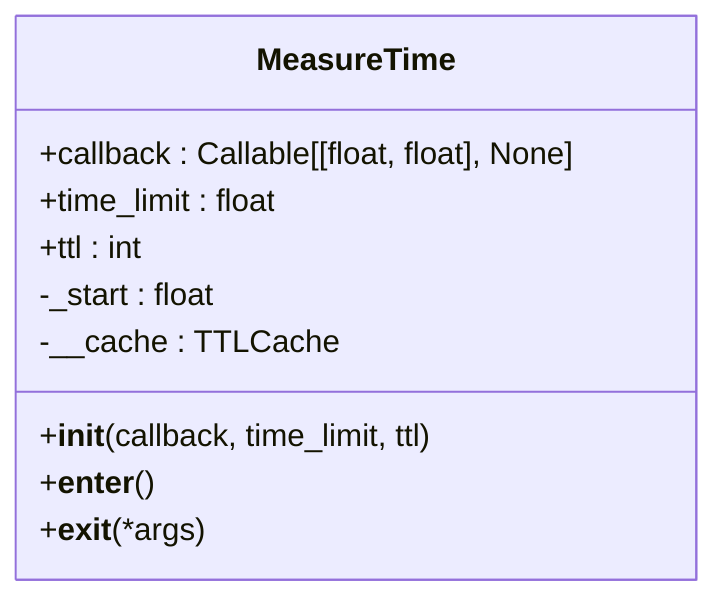
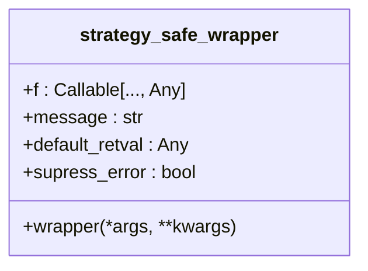
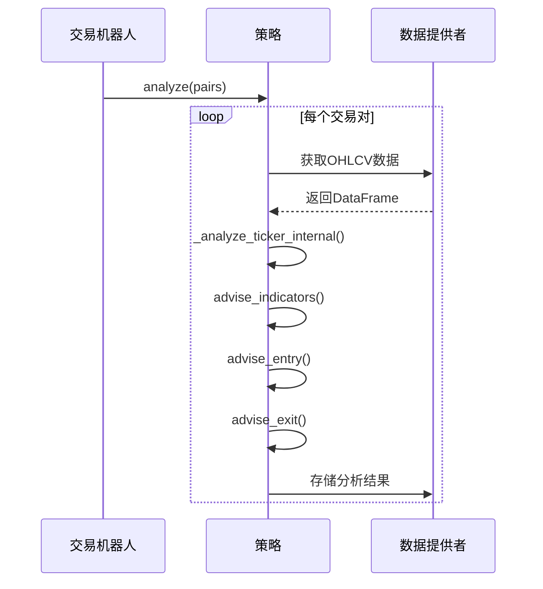
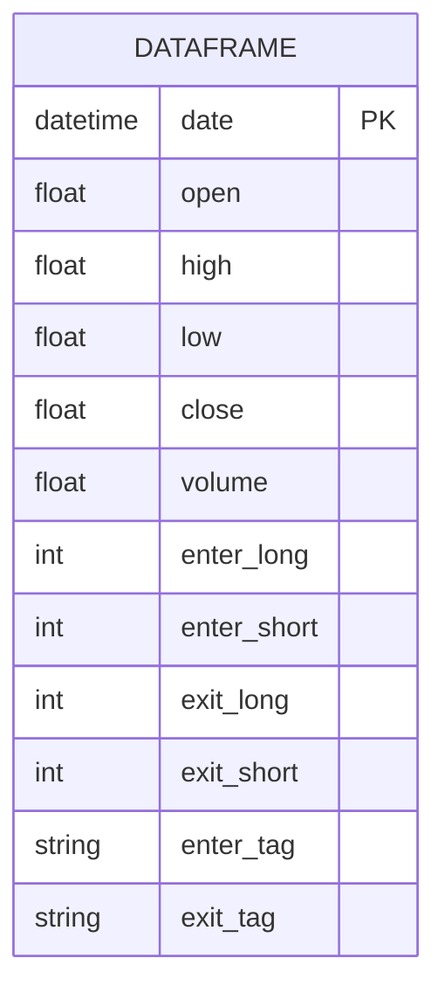

# 策略执行流程

<cite>
**本文档引用的文件**
- [IStrategy.py](file://freqtrade\strategy\interface.py)
- [freqtradebot.py](file://freqtrade\freqtradebot.py)
- [MeasureTime.py](file://freqtrade\util\measure_time.py)
- [strategy_wrapper.py](file://freqtrade\strategy\strategy_wrapper.py)
</cite>

## 目录
1. [策略分析阶段执行流程](#策略分析阶段执行流程)
2. [性能监控与异常处理](#性能监控与异常处理)
3. [策略接口调用时序与数据流](#策略接口调用时序与数据流)
4. [DataFrame结构与信号返回格式](#dataframe结构与信号返回格式)

## 策略分析阶段执行流程

策略分析阶段从`strategy.analyze()`调用开始，该方法会遍历所有交易对并调用`analyze_pair()`方法进行分析。`analyze_pair()`方法首先从数据提供者（DataProvider）获取指定交易对和时间框架的OHLCV数据，然后通过`_analyze_ticker_internal()`方法进行技术指标计算和信号生成。

在`_analyze_ticker_internal()`方法中，系统会检查是否只处理新蜡烛数据（由`process_only_new_candles`参数控制）。如果是新蜡烛或配置允许处理所有数据，则调用`analyze_ticker()`方法进行完整的技术分析。分析完成后，结果数据框会被存储到数据提供者中，以便后续使用。

`analyze_ticker()`方法依次调用`advise_indicators()`、`advise_entry()`和`advise_exit()`方法来计算指标、生成入场信号和出场信号。这些方法最终会调用用户定义的`populate_indicators()`、`populate_entry_trend()`和`populate_exit_trend()`方法来实现具体的策略逻辑。

**Section sources**
- [IStrategy.py](file://freqtrade\strategy\interface.py#L1264-L1270)
- [IStrategy.py](file://freqtrade\strategy\interface.py#L1232-L1262)
- [IStrategy.py](file://freqtrade\strategy\interface.py#L1200-L1230)

## 性能监控与异常处理

系统使用`MeasureTime`类来监控策略执行时间。`MeasureTime`是一个上下文管理器，它在代码块执行前后记录时间，并在执行时间超过预设阈值时调用回调函数。在`FreqtradeBot`类中，`_measure_execution`实例被用来监控策略分析的执行时间，如果分析时间超过时间框架的25%，就会发出警告。

**Diagram sources**
- [MeasureTime.py](file://freqtrade\util\measure_time.py#L10-L44)

为了确保策略异常不会中断主循环，系统使用`strategy_safe_wrapper`装饰器来包装策略方法。这个装饰器会捕获所有异常，记录警告日志，并根据配置决定是返回默认值还是重新抛出异常。这样即使策略代码出现错误，也不会导致整个交易机器人停止运行。

**Diagram sources**
- [strategy_wrapper.py](file://freqtrade\strategy\strategy_wrapper.py#L15-L42)

## 策略接口调用时序与数据流

策略接口（IStrategy）的核心方法调用时序如下：首先调用`populate_indicators()`计算所有技术指标，然后调用`populate_entry_trend()`生成入场信号，最后调用`populate_exit_trend()`生成出场信号。这些方法的输出数据流通过DataFrame传递，每个方法都会在DataFrame中添加新的列来存储计算结果。

`get_entry_signal()`方法用于获取当前的入场信号，它会检查DataFrame中的`enter_long`和`enter_short`列来确定是否有有效的入场信号。同样，`get_exit_signal()`方法用于获取出场信号，检查`exit_long`和`exit_short`列。

**Diagram sources**
- [IStrategy.py](file://freqtrade\strategy\interface.py#L1345-L1399)
- [IStrategy.py](file://freqtrade\strategy\interface.py#L1312-L1343)

## DataFrame结构与信号返回格式

策略使用的DataFrame包含标准的OHLCV数据列（open、high、low、close、volume）以及'date'列。'date'列存储每个蜡烛的时间戳，用于确定数据的新鲜度和处理顺序。系统会检查最新蜡烛的时间是否过期，如果过期则不会使用该数据进行交易决策。

买卖信号通过在DataFrame中添加特定的列来返回。入场信号使用`enter_long`和`enter_short`列，值为1表示有入场信号，0表示没有。出场信号使用`exit_long`和`exit_short`列。此外，还可以使用`enter_tag`和`exit_tag`列来提供信号的标签或原因。

**Diagram sources**
- [IStrategy.py](file://freqtrade\strategy\interface.py#L1345-L1399)
- [IStrategy.py](file://freqtrade\strategy\interface.py#L1312-L1343)