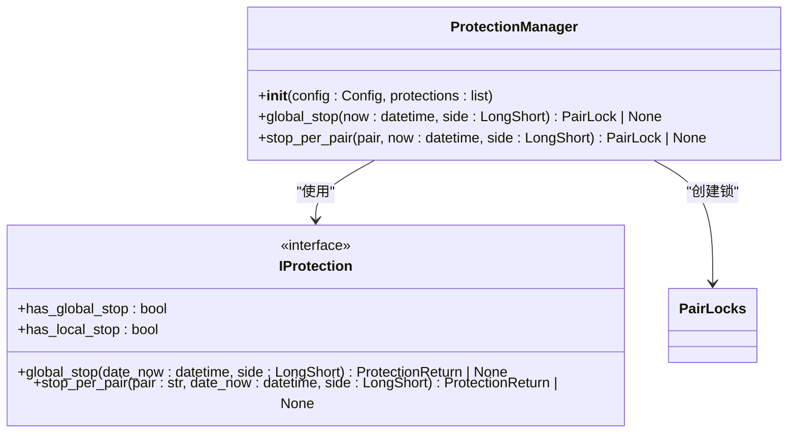
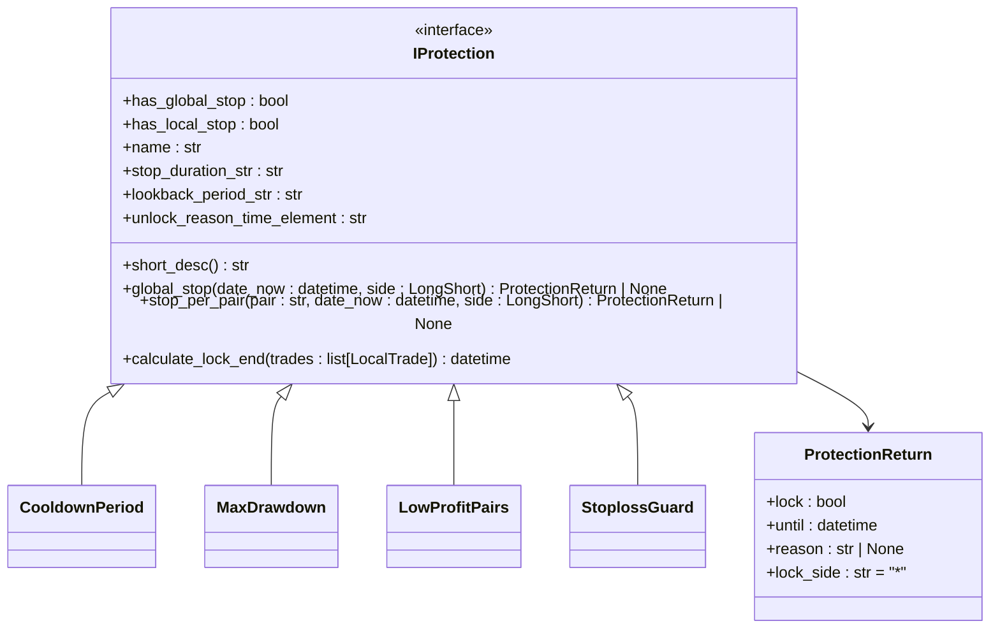
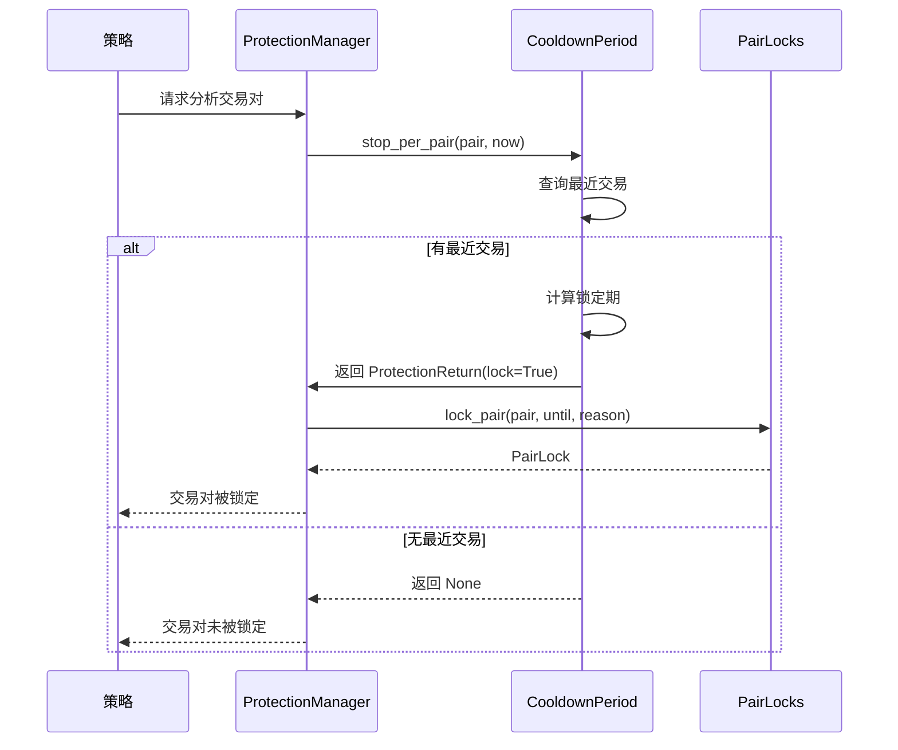
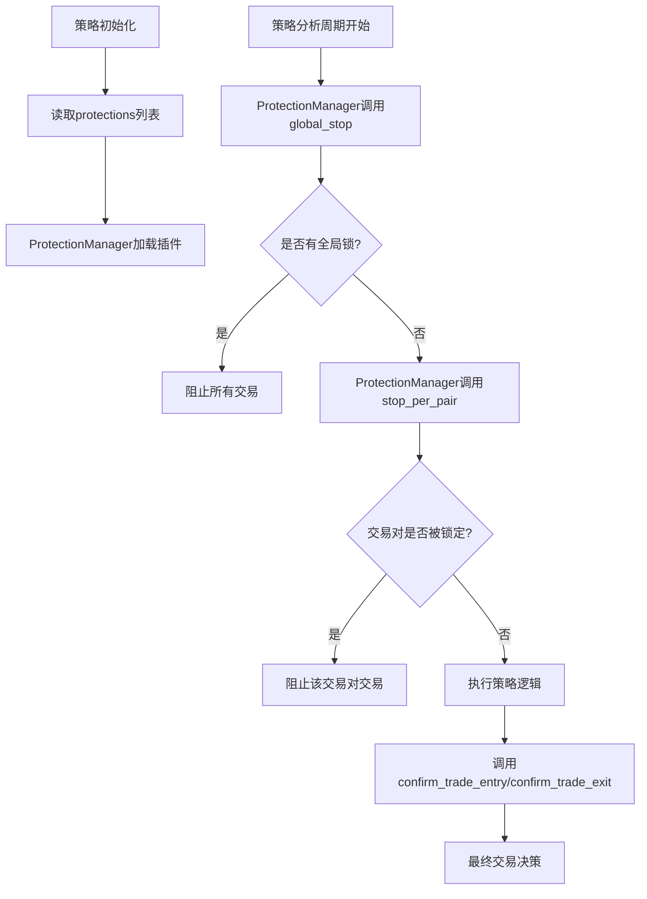

# 风险管理与保护机制

<cite>
**本文档引用的文件**   
- [protectionmanager.py](file://freqtrade/plugins/protectionmanager.py)
- [iprotection.py](file://freqtrade/plugins/protections/iprotection.py)
- [cooldown_period.py](file://freqtrade/plugins/protections/cooldown_period.py)
- [max_drawdown_protection.py](file://freqtrade/plugins/protections/max_drawdown_protection.py)
- [interface.py](file://freqtrade/strategy/interface.py)
</cite>

## 目录
1. [引言](#引言)
2. [保护机制核心组件](#保护机制核心组件)
3. [保护管理器 (ProtectionManager)](#保护管理器-protectionmanager)
4. [保护插件接口 (IProtection)](#保护插件接口-iprotection)
5. [具体保护插件分析](#具体保护插件分析)
6. [与策略的协同工作](#与策略的协同工作)
7. [配置与自定义](#配置与自定义)

## 引言
Freqtrade 提供了一套强大的风险管理框架，其核心是“保护机制”（Protections）。该机制允许用户在策略执行前，通过一系列可配置的规则来评估和控制风险。这些规则以插件的形式存在，由 `ProtectionManager` 统一加载和管理。在每次策略分析前，`ProtectionManager` 会调用所有已配置的保护插件，根据其返回值决定是否阻止交易。这种设计实现了交易决策的精细化控制，是构建稳健交易系统的关键。

## 保护机制核心组件
保护机制主要由三个核心组件构成：`ProtectionManager`、`IProtection` 接口和具体的保护插件（如 `CooldownPeriod`）。`ProtectionManager` 负责加载和协调所有保护插件；`IProtection` 定义了所有保护插件必须遵循的接口规范；而具体的保护插件则实现了特定的风险控制逻辑。

**Section sources**
- [protectionmanager.py](file://freqtrade/plugins/protectionmanager.py#L19-L114)
- [iprotection.py](file://freqtrade/plugins/protections/iprotection.py#L24-L140)

## 保护管理器 (ProtectionManager)
`ProtectionManager` 是保护机制的中枢，负责在策略分析前调用各个保护插件。它在初始化时接收一个配置对象和一个 `protections` 列表，并通过 `ProtectionResolver` 动态加载列表中指定的保护插件。



**Diagram sources **
- [protectionmanager.py](file://freqtrade/plugins/protectionmanager.py#L19-L114)
- [iprotection.py](file://freqtrade/plugins/protections/iprotection.py#L24-L140)

### 初始化与加载
`ProtectionManager` 的 `__init__` 方法首先验证 `protections` 列表的配置有效性，然后遍历该列表，为每个配置项加载对应的保护插件实例，并将其存储在 `_protection_handlers` 列表中。这确保了所有保护插件在策略运行前都已准备就绪。

**Section sources**
- [protectionmanager.py](file://freqtrade/plugins/protectionmanager.py#L20-L34)

### 执行流程
在每次策略分析前，`ProtectionManager` 会调用 `global_stop` 和 `stop_per_pair` 方法。`global_stop` 方法会检查所有具有全局停止功能的插件，如果任何一个插件返回了有效的锁（lock），则会通过 `PairLocks.lock_pair("*", ...)` 创建一个全局交易锁，阻止所有交易对的开仓。`stop_per_pair` 方法则针对特定交易对，检查具有本地停止功能的插件，并可能创建针对该交易对的锁。

**Section sources**
- [protectionmanager.py](file://freqtrade/plugins/protectionmanager.py#L49-L77)

## 保护插件接口 (IProtection)
`IProtection` 是一个抽象基类，定义了所有保护插件必须实现的接口。它继承自 `LoggingMixin`，提供了日志记录功能。



**Diagram sources **
- [iprotection.py](file://freqtrade/plugins/protections/iprotection.py#L24-L140)

### 核心属性与方法
- `has_global_stop` 和 `has_local_stop`: 布尔值，指示该插件是否具有全局或本地停止交易的能力。
- `global_stop` 和 `stop_per_pair`: 抽象方法，是插件的核心逻辑入口。它们返回一个 `ProtectionReturn` 对象，其中 `lock` 字段决定是否阻止交易，`until` 字段指定阻止的截止时间，`reason` 字段提供阻止原因。
- `calculate_lock_end`: 根据最近的交易记录计算锁定期的结束时间，支持基于持续时间或固定时间点的锁定。

**Section sources**
- [iprotection.py](file://freqtrade/plugins/protections/iprotection.py#L26-L140)

## 具体保护插件分析
### 冷却期保护 (CooldownPeriod)
`CooldownPeriod` 插件实现了交易对级别的冷却机制。它通过 `stop_per_pair` 方法检查指定交易对在 `lookback_period` 内是否有过交易。如果有，则返回一个 `ProtectionReturn`，将该交易对锁定 `stop_duration` 时间，防止在短时间内重复交易。



**Diagram sources **
- [cooldown_period.py](file://freqtrade/plugins/protections/cooldown_period.py#L11-L73)

### 最大回撤保护 (MaxDrawdown)
`MaxDrawdown` 插件用于监控全局最大回撤。它通过 `global_stop` 方法计算在 `lookback_period` 内所有已关闭交易的最大回撤值。如果该值超过了配置的 `max_allowed_drawdown`，则返回一个 `ProtectionReturn`，创建一个全局交易锁，暂停所有交易，以防止风险进一步扩大。

**Section sources**
- [max_drawdown_protection.py](file://freqtrade/plugins/protections/max_drawdown_protection.py#L15-L101)

## 与策略的协同工作
保护机制与策略通过 `IStrategy` 接口中的 `protections` 属性紧密集成。用户在策略类中定义 `protections` 列表，该列表在策略初始化时被传递给 `ProtectionManager`。



**Diagram sources **
- [interface.py](file://freqtrade/strategy/interface.py#L129-L129)
- [protectionmanager.py](file://freqtrade/plugins/protectionmanager.py#L49-L77)

此外，`confirm_trade_entry` 和 `confirm_trade_exit` 等回调方法在保护机制之后执行，为策略提供了最后一次确认交易的机会。这种分层的决策流程确保了风险控制的优先级。

**Section sources**
- [interface.py](file://freqtrade/strategy/interface.py#L352-L386)
- [interface.py](file://freqtrade/strategy/interface.py#L388-L424)

## 配置与自定义
用户可以通过在策略配置文件或策略类中定义 `protections` 列表来启用和配置保护机制。例如：

```python
protections = [
    {
        "method": "CooldownPeriod",
        "stop_duration": 60,
        "lookback_period": 30
    },
    {
        "method": "MaxDrawdown",
        "lookback_period_candles": 24,
        "trade_limit": 3,
        "stop_duration": 60,
        "max_allowed_drawdown": 0.1
    }
]
```
此配置将同时启用冷却期和最大回撤保护。用户也可以通过继承 `IProtection` 类来创建自定义的保护插件，实现更复杂的风险控制逻辑。

**Section sources**
- [interface.py](file://freqtrade/strategy/interface.py#L129-L129)