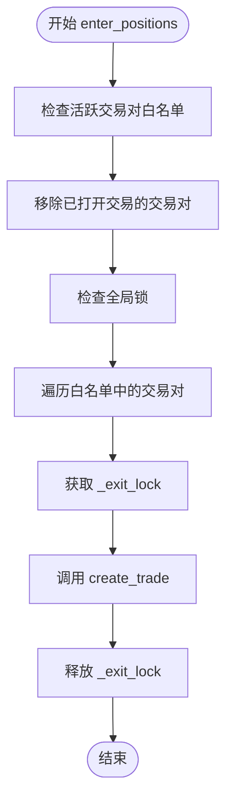
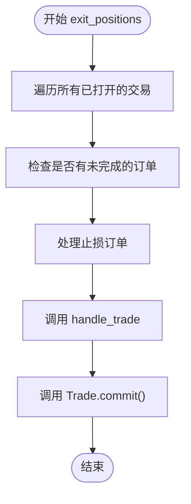
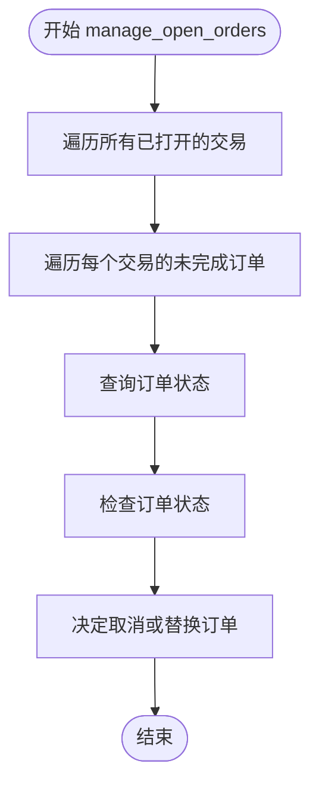
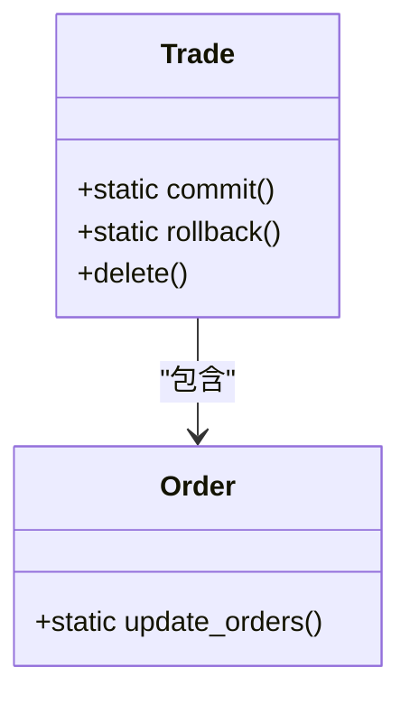
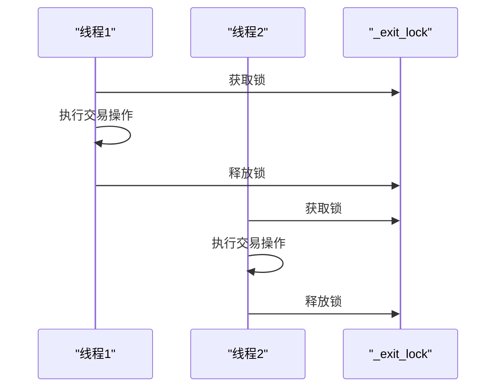

# 事务一致性与锁机制

<cite>
**本文档引用的文件**   
- [freqtradebot.py](file://freqtrade\freqtradebot.py)
- [trade_model.py](file://freqtrade\persistence\trade_model.py)
- [pairlock_middleware.py](file://freqtrade\persistence\pairlock_middleware.py)
- [pairlock.py](file://freqtrade\persistence\pairlock.py)
</cite>

## 目录
1. [引言](#引言)
2. [锁机制与竞争条件防护](#锁机制与竞争条件防护)
3. [数据库事务与commit()调用](#数据库事务与commit调用)
4. [锁的粒度、范围与死锁避免](#锁的粒度范围与死锁避免)
5. [结论](#结论)

## 引言
本文档旨在全面解释Freqtrade交易系统中`_exit_lock`锁机制如何防止在订单操作中出现竞争条件，特别是在`enter_positions()`、`exit_positions()`和`manage_open_orders()`等关键方法中的应用。同时，文档将详细描述`Trade.commit()`方法在何时被调用以确保数据库事务的一致性，以及为什么在每次重要操作后（如交易关闭）都需要提交事务。结合代码实例，说明锁的粒度和范围，以及如何避免死锁情况的发生。

## 锁机制与竞争条件防护

### _exit_lock锁机制概述
`_exit_lock`是一个`threading.Lock`对象，用于保护与退出交易相关的操作，防止在多线程环境下发生竞争条件。该锁在`FreqtradeBot`类的初始化过程中被创建，并在多个关键方法中使用，以确保同一时间只有一个线程可以执行特定的交易操作。

### enter_positions()方法中的锁应用
`enter_positions()`方法负责为新的交易执行进入订单。在该方法中，通过`with self._exit_lock:`语句获取锁，确保在创建新交易时不会与其他线程的退出操作发生冲突。具体流程如下：
1. 检查活跃交易对白名单。
2. 移除已打开交易的交易对。
3. 检查全局锁。
4. 遍历白名单中的交易对，尝试创建交易。

**Diagram sources**
- [freqtradebot.py](file://freqtrade\freqtradebot.py#L602-L650)

**Section sources**
- [freqtradebot.py](file://freqtrade\freqtradebot.py#L602-L650)

### exit_positions()方法中的锁应用
`exit_positions()`方法负责为已打开的交易执行退出订单。在该方法中，同样通过`with self._exit_lock:`语句获取锁，确保在处理退出订单时不会与其他线程的进入操作发生冲突。具体流程如下：
1. 遍历所有已打开的交易。
2. 检查是否有未完成的订单。
3. 处理止损订单。
4. 调用`handle_trade()`方法处理交易。

**Diagram sources**
- [freqtradebot.py](file://freqtrade\freqtradebot.py#L1277-L1321)

**Section sources**
- [freqtradebot.py](file://freqtrade\freqtradebot.py#L1277-L1321)

### manage_open_orders()方法中的锁应用
`manage_open_orders()`方法负责管理交易所上的未完成订单。在该方法中，通过`with self._exit_lock:`语句获取锁，确保在管理未完成订单时不会与其他线程的操作发生冲突。具体流程如下：
1. 遍历所有已打开的交易。
2. 遍历每个交易的未完成订单。
3. 查询订单状态。
4. 根据订单状态决定是否取消或替换订单。

**Diagram sources**
- [freqtradebot.py](file://freqtrade\freqtradebot.py#L1564-L1595)

**Section sources**
- [freqtradebot.py](file://freqtrade\freqtradebot.py#L1564-L1595)

## 数据库事务与commit调用

### Trade.commit()方法的作用
`Trade.commit()`方法用于提交数据库事务，确保所有对数据库的更改被永久保存。该方法在`Trade`类中定义为静态方法，通过`Trade.session.commit()`调用。

### commit()调用时机
`Trade.commit()`方法在多个关键操作后被调用，以确保数据库事务的一致性。主要调用时机包括：
1. **交易创建**：在`execute_entry()`方法中，当新交易被创建并添加到数据库后，调用`Trade.commit()`。
2. **交易更新**：在`update_trade_state()`方法中，当交易状态被更新后，调用`Trade.commit()`。
3. **交易删除**：在`delete()`方法中，当交易被删除后，调用`Trade.commit()`。
4. **订单更新**：在`Order.update_orders()`方法中，当订单被更新后，调用`Trade.commit()`。

**Diagram sources**
- [trade_model.py](file://freqtrade\persistence\trade_model.py#L1762-L1763)
- [trade_model.py](file://freqtrade\persistence\trade_model.py#L1752-L1759)
- [trade_model.py](file://freqtrade\persistence\trade_model.py#L323-L337)

**Section sources**
- [trade_model.py](file://freqtrade\persistence\trade_model.py#L1762-L1763)
- [trade_model.py](file://freqtrade\persistence\trade_model.py#L1752-L1759)
- [trade_model.py](file://freqtrade\persistence\trade_model.py#L323-L337)

## 锁的粒度、范围与死锁避免

### 锁的粒度和范围
`_exit_lock`锁的粒度较粗，覆盖了整个交易的进入、退出和管理过程。这种设计确保了在处理交易时的原子性，但可能会降低并发性能。锁的范围包括：
1. `enter_positions()`方法
2. `exit_positions()`方法
3. `manage_open_orders()`方法

### 死锁避免策略
为了避免死锁，Freqtrade系统采取了以下策略：
1. **单一锁**：使用单一的`_exit_lock`锁，避免了多个锁之间的复杂交互。
2. **锁的获取顺序**：确保所有线程按照相同的顺序获取锁，避免了循环等待。
3. **锁的释放**：在所有操作完成后立即释放锁，减少了锁的持有时间。

**Diagram sources**
- [freqtradebot.py](file://freqtrade\freqtradebot.py#L602-L650)
- [freqtradebot.py](file://freqtrade\freqtradebot.py#L1277-L1321)
- [freqtradebot.py](file://freqtrade\freqtradebot.py#L1564-L1595)

**Section sources**
- [freqtradebot.py](file://freqtrade\freqtradebot.py#L602-L650)
- [freqtradebot.py](file://freqtrade\freqtradebot.py#L1277-L1321)
- [freqtradebot.py](file://freqtrade\freqtradebot.py#L1564-L1595)

## 结论
Freqtrade系统通过`_exit_lock`锁机制有效地防止了在订单操作中出现的竞争条件，确保了交易操作的原子性和一致性。`Trade.commit()`方法在关键操作后被调用，确保了数据库事务的一致性。锁的粒度较粗，但通过单一锁和严格的获取顺序避免了死锁。这些机制共同保证了系统的稳定性和可靠性。