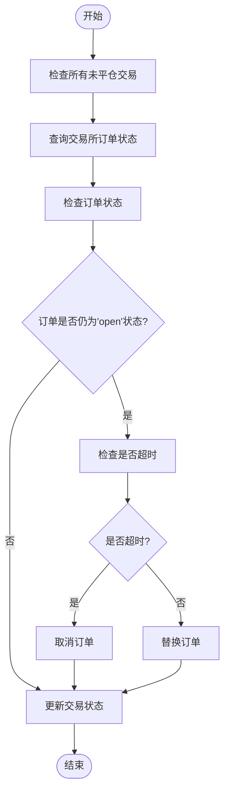
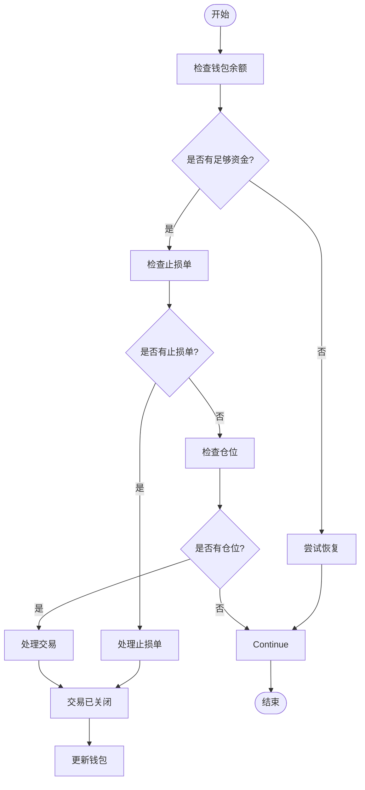
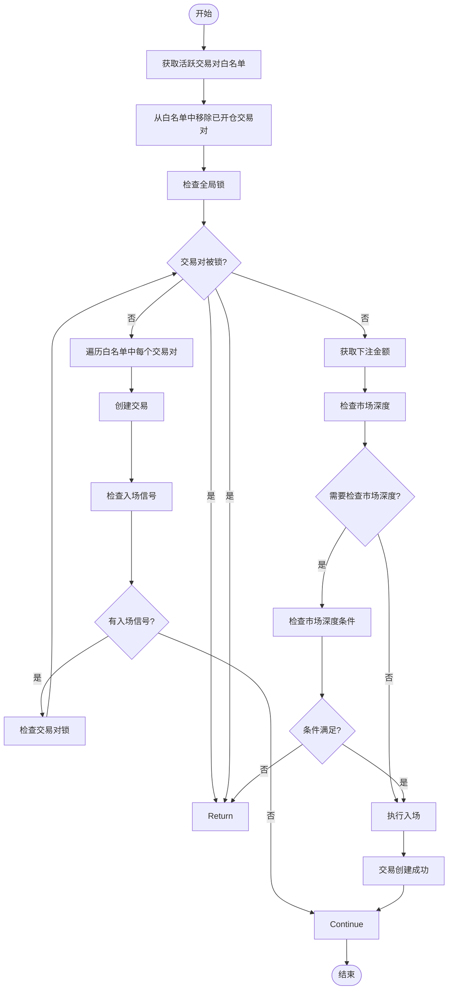
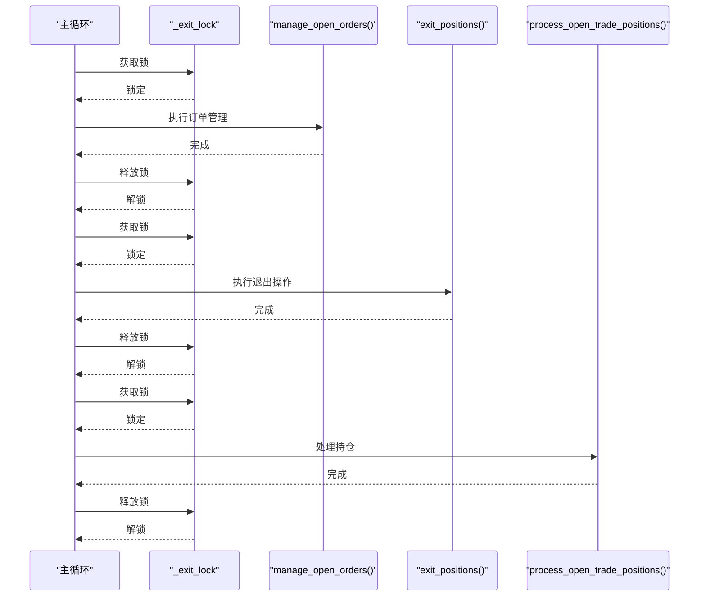
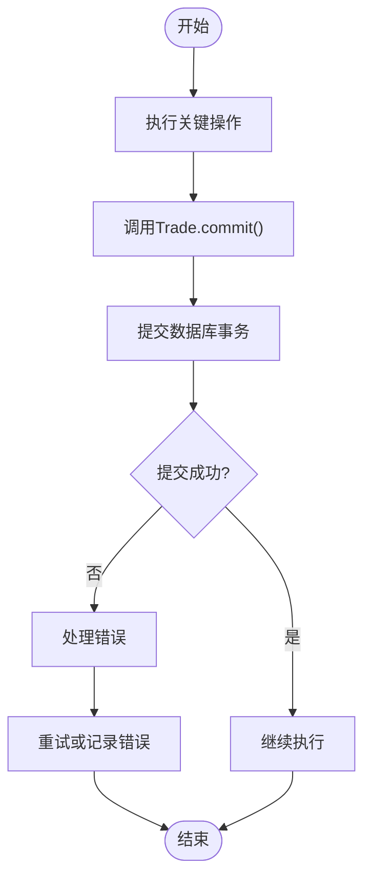
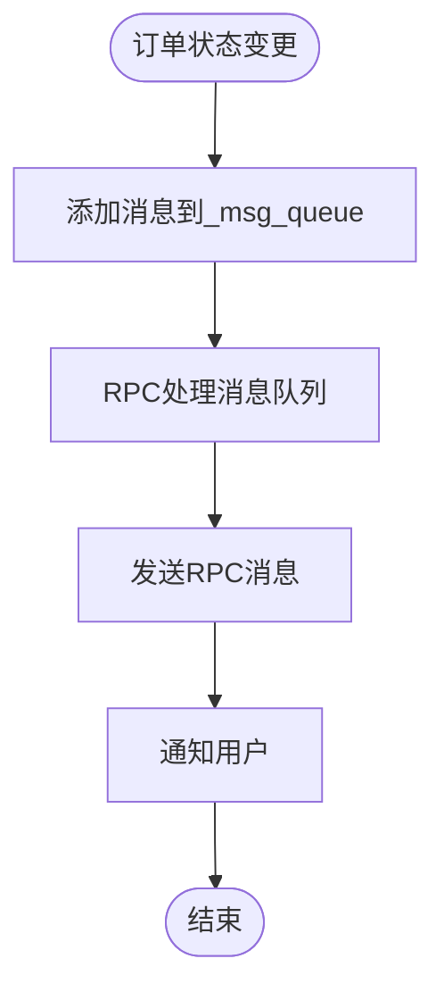

# 订单与交易管理

<cite>
**本文档中引用的文件**  
- [freqtradebot.py](file://freqtrade/freqtradebot.py)
- [trade_model.py](file://freqtrade/persistence/trade_model.py)
- [dataprovider.py](file://freqtrade/data/dataprovider.py)
</cite>

## 目录
1. [主循环中的订单管理机制](#主循环中的订单管理机制)
2. [订单状态更新处理](#订单状态更新处理)
3. [退出逻辑执行](#退出逻辑执行)
4. [入场决策流程](#入场决策流程)
5. [锁机制与事务提交](#锁机制与事务提交)
6. [异步通知机制](#异步通知机制)

## 主循环中的订单管理机制

主循环中的订单管理机制是Freqtrade系统的核心部分，负责处理交易所订单状态更新、执行退出逻辑以及入场决策流程。该机制通过`manage_open_orders()`、`exit_positions()`、`enter_positions()`和`create_trade()`等方法实现订单的全生命周期管理。

**Section sources**
- [freqtradebot.py](file://freqtrade/freqtradebot.py#L269-L300)

## 订单状态更新处理

`manage_open_orders()`方法负责管理交易所中的未成交订单。当订单超时或用户请求替换时，该方法会取消或替换未成交订单。超时设置优先于限价单调整请求。

**Diagram sources**
- [freqtradebot.py](file://freqtrade/freqtradebot.py#L1564-L1595)

## 退出逻辑执行

`exit_positions()`方法尝试为未平仓交易执行退出订单。该方法首先检查是否有足够的资金退出交易，然后处理止损单，最后检查是否可以退出当前仓位。

**Diagram sources**
- [freqtradebot.py](file://freqtrade/freqtradebot.py#L1277-L1321)

## 入场决策流程

`enter_positions()`和`create_trade()`方法共同实现了入场决策流程。`enter_positions()`遍历白名单中的交易对，为每个交易对调用`create_trade()`方法创建交易。

**Diagram sources**
- [freqtradebot.py](file://freqtrade/freqtradebot.py#L602-L710)

## 锁机制与事务提交

### _exit_lock锁机制

`_exit_lock`锁机制用于防止订单操作的竞争条件。在主循环中，多个操作如`manage_open_orders()`、`exit_positions()`和`process_open_trade_positions()`都使用此锁来确保操作的原子性。

**Diagram sources**
- [freqtradebot.py](file://freqtrade/freqtradebot.py#L151-L151)

### Trade.commit()事务提交

`Trade.commit()`方法用于提交数据库事务。在关键操作完成后，如退出交易或处理订单后，都会调用此方法确保数据持久化。

**Diagram sources**
- [trade_model.py](file://freqtrade/persistence/trade_model.py#L1762-L1763)

## 异步通知机制

RPC消息队列(`dataprovider._msg_queue`)在订单状态变更时提供异步通知机制。当订单状态发生变化时，相关消息会被添加到消息队列中，由RPC系统异步处理。

**Diagram sources**
- [dataprovider.py](file://freqtrade/data/dataprovider.py#L620-L622)
- [freqtradebot.py](file://freqtrade/freqtradebot.py#L269-L300)