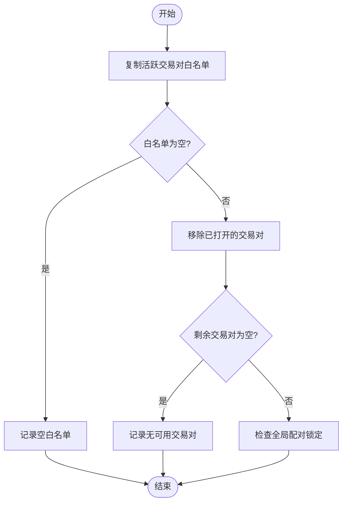
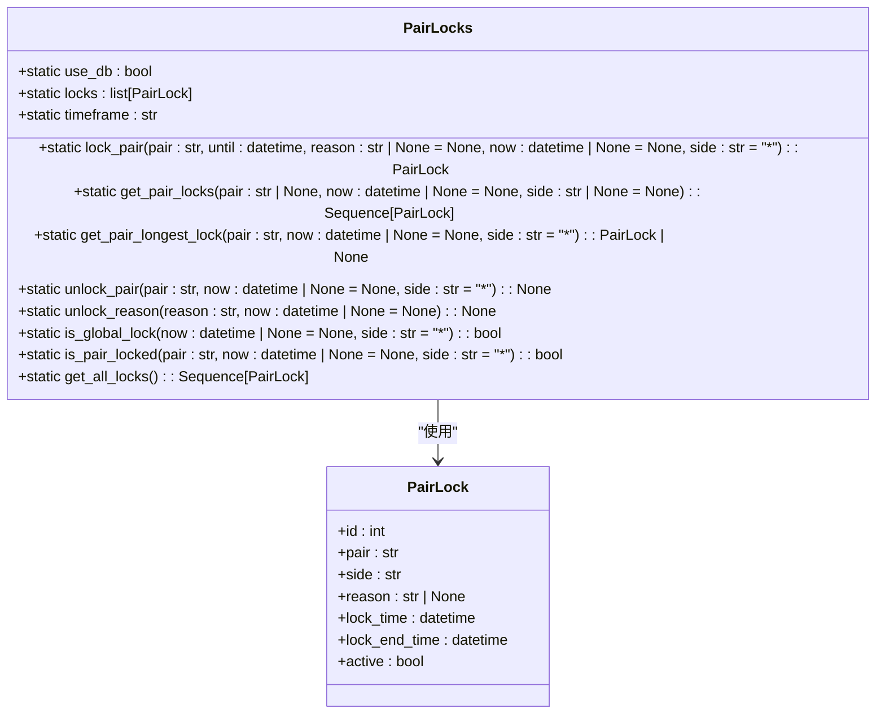
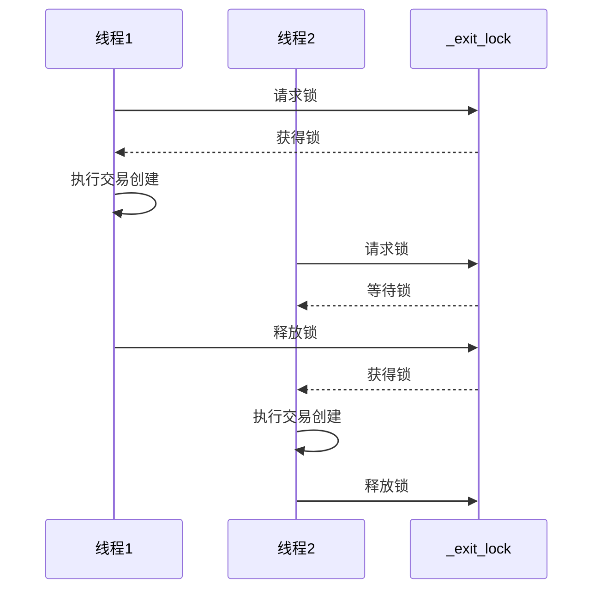
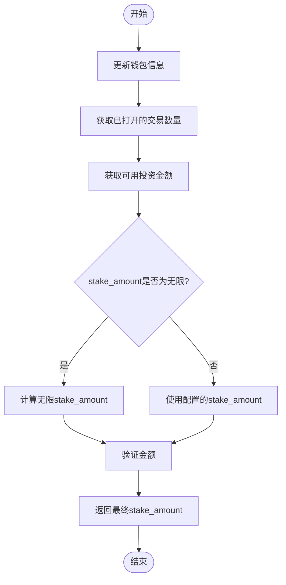
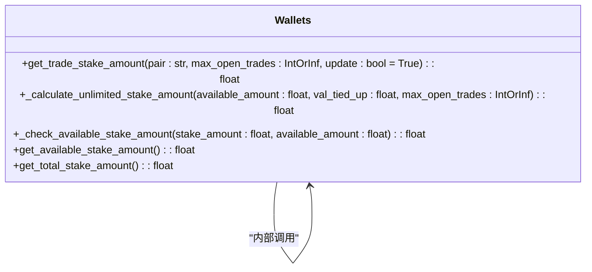
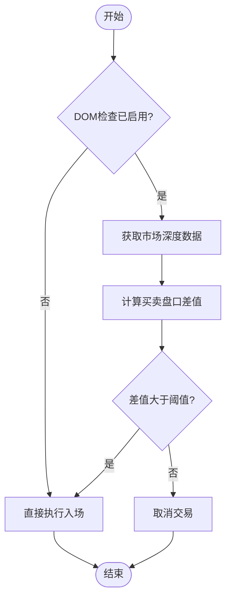
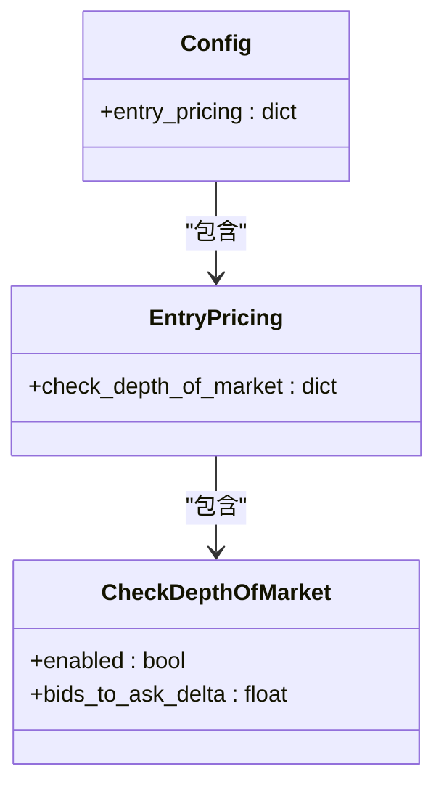

# 订单入场管理

<cite>
**本文档引用的文件**   
- [freqtradebot.py](file://freqtrade/freqtradebot.py)
- [wallets.py](file://freqtrade/wallets.py)
- [pairlock_middleware.py](file://freqtrade/persistence/pairlock_middleware.py)
</cite>

## 目录
1. [引言](#引言)
2. [核心方法协同工作](#核心方法协同工作)
3. [白名单过滤与配对锁定](#白名单过滤与配对锁定)
4. [线程安全机制](#线程安全机制)
5. [stake_amount计算方式](#stake_amount计算方式)
6. [深度市场检查](#深度市场检查)
7. [完整流程示例](#完整流程示例)
8. [结论](#结论)

## 引言
本文档详细解释了`enter_positions()`和`create_trade()`方法如何协同工作以管理新交易的入场。我们将深入探讨白名单过滤、全局配对锁定、线程安全机制、stake_amount计算以及深度市场检查等关键概念。

## 核心方法协同工作
`enter_positions()`和`create_trade()`是管理新交易入场的核心方法。`enter_positions()`负责遍历白名单中的交易对并尝试创建交易，而`create_trade()`则负责具体的交易创建逻辑。

```mermaid
sequenceDiagram
participant enter_positions as enter_positions()
participant create_trade as create_trade()
participant strategy as 策略
participant wallets as 钱包
participant exchange as 交易所
enter_positions->>enter_positions : 复制活跃交易对白名单
enter_positions->>enter_positions : 过滤已打开的交易对
enter_positions->>enter_positions : 检查全局配对锁定
loop 遍历白名单中的每个交易对
enter_positions->>create_trade : 调用create_trade(pair)
create_trade->>strategy : 获取入场信号
strategy-->>create_trade : 返回信号和标签
create_trade->>create_trade : 检查交易对是否被锁定
create_trade->>wallets : 计算stake_amount
create_trade->>create_trade : 检查深度市场
create_trade->>exchange : 执行入场
create_trade-->>enter_positions : 返回创建结果
end
enter_positions-->> : 返回创建的交易数量
```

**Diagram sources**
- [freqtradebot.py](file://freqtrade/freqtradebot.py#L602-L710)

**Section sources**
- [freqtradebot.py](file://freqtrade/freqtradebot.py#L602-L710)

## 白名单过滤与配对锁定
白名单过滤和配对锁定是确保交易安全的重要机制。系统首先从活跃交易对白名单中移除已打开的交易对，然后检查全局配对锁定和单个交易对锁定。

### 白名单过滤
白名单过滤通过移除已打开的交易对来避免重复交易。这个过程在`enter_positions()`方法中实现。



### 配对锁定
配对锁定机制通过`PairLocks`类实现，可以防止在特定条件下创建新交易。



**Diagram sources**
- [pairlock_middleware.py](file://freqtrade/persistence/pairlock_middleware.py#L13-L189)
- [freqtradebot.py](file://freqtrade/freqtradebot.py#L602-L710)

**Section sources**
- [freqtradebot.py](file://freqtrade/freqtradebot.py#L602-L710)
- [pairlock_middleware.py](file://freqtrade/persistence/pairlock_middleware.py#L13-L189)

## 线程安全机制
`_with_exit_lock`锁确保在创建交易时的线程安全，防止多个线程同时修改交易状态。

### 锁机制
`_exit_lock`是一个线程锁，用于保护交易创建和退出操作。



**Diagram sources**
- [freqtradebot.py](file://freqtrade/freqtradebot.py#L602-L710)

**Section sources**
- [freqtradebot.py](file://freqtrade/freqtradebot.py#L602-L710)

## stake_amount计算方式
`stake_amount`的计算方式决定了每次交易的投资金额，是风险管理的重要组成部分。

### 计算流程
`stake_amount`的计算涉及多个步骤，包括获取可用金额、计算理论金额和验证最终金额。



### 代码实现
`get_trade_stake_amount`方法负责计算交易的stake_amount。



**Diagram sources**
- [wallets.py](file://freqtrade/wallets.py#L35-L437)
- [freqtradebot.py](file://freqtrade/freqtradebot.py#L602-L710)

**Section sources**
- [wallets.py](file://freqtrade/wallets.py#L35-L437)
- [freqtradebot.py](file://freqtrade/freqtradebot.py#L602-L710)

## 深度市场检查
深度市场检查（Depth of Market, DOM）用于评估市场流动性，确保交易能够在预期价格执行。

### 检查流程
深度市场检查通过比较买卖盘口的深度来决定是否执行交易。



### 配置参数
深度市场检查的配置参数包括是否启用和买卖盘口差值阈值。



**Diagram sources**
- [freqtradebot.py](file://freqtrade/freqtradebot.py#L602-L710)

**Section sources**
- [freqtradebot.py](file://freqtrade/freqtradebot.py#L602-L710)

## 完整流程示例
以下是一个基于实际代码的完整流程示例，展示从信号生成到执行入场的全过程。

### 流程图
```mermaid
sequenceDiagram
participant Bot as 交易机器人
participant Strategy as 策略
participant DataProvider as 数据提供者
participant Wallets as 钱包
participant Exchange as 交易所
Bot->>Bot : 开始enter_positions()
Bot->>Bot : 复制活跃交易对白名单
Bot->>Bot : 过滤已打开的交易对
Bot->>Bot : 检查全局配对锁定
loop 遍历白名单中的每个交易对
Bot->>Strategy : 调用create_trade(pair)
Strategy->>DataProvider : 获取分析后的数据帧
DataProvider-->>Strategy : 返回数据帧
Strategy->>Strategy : 检查最大开放交易数
Strategy->>Strategy : 获取入场信号
Strategy->>Strategy : 检查交易对是否被锁定
Strategy->>Wallets : 计算stake_amount
Wallets-->>Strategy : 返回stake_amount
Strategy->>Strategy : 检查深度市场
Strategy->>Exchange : 执行入场
Exchange-->>Strategy : 返回订单信息
Strategy-->>Bot : 返回创建结果
end
Bot-->> : 返回创建的交易数量
```

### 关键步骤
1. **信号生成**: 策略分析市场数据并生成入场信号
2. **配对锁定检查**: 检查交易对是否被全局或特定锁定
3. **资金计算**: 根据可用资金和配置计算stake_amount
4. **市场深度检查**: 评估市场流动性以确保交易可执行
5. **执行入场**: 向交易所发送订单并创建交易

**Diagram sources**
- [freqtradebot.py](file://freqtrade/freqtradebot.py#L602-L710)
- [wallets.py](file://freqtrade/wallets.py#L35-L437)
- [pairlock_middleware.py](file://freqtrade/persistence/pairlock_middleware.py#L13-L189)

**Section sources**
- [freqtradebot.py](file://freqtrade/freqtradebot.py#L602-L710)
- [wallets.py](file://freqtrade/wallets.py#L35-L437)
- [pairlock_middleware.py](file://freqtrade/persistence/pairlock_middleware.py#L13-L189)

## 结论
`enter_positions()`和`create_trade()`方法通过协同工作实现了新交易的有序入场。白名单过滤确保不会重复交易已打开的交易对，全局配对锁定防止在特定条件下创建新交易，`_with_exit_lock`锁确保了线程安全。`stake_amount`的计算方式综合考虑了可用资金和配置参数，而深度市场检查则确保了交易的可执行性。这些机制共同构成了一个稳健的交易入场管理系统。