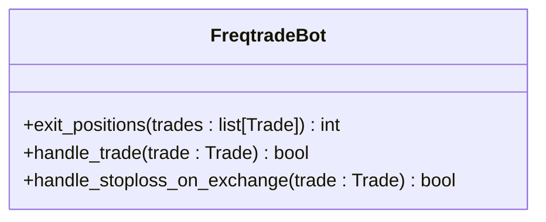
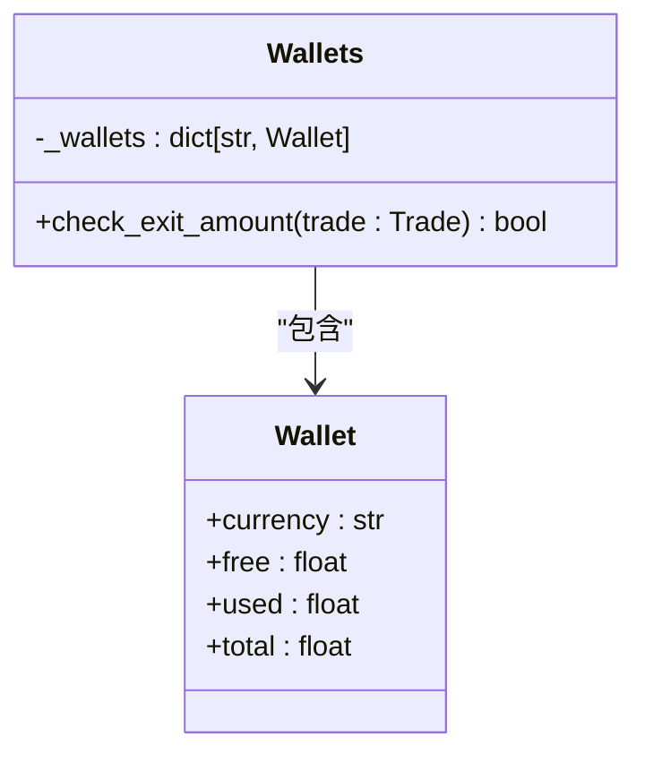
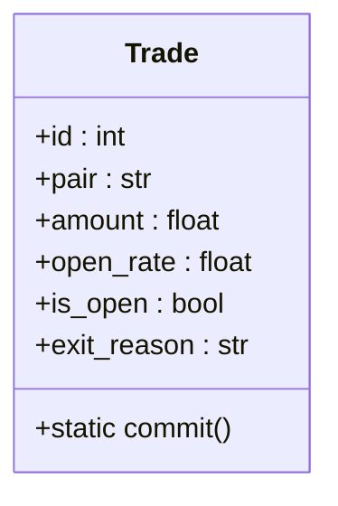
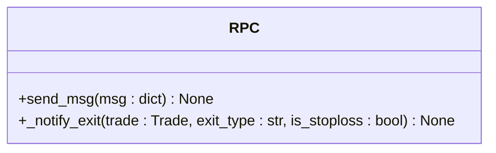

# 订单出场管理

<cite>
**本文档中引用的文件**   
- [freqtradebot.py](file://freqtrade/freqtradebot.py)
- [wallets.py](file://freqtrade/wallets.py)
- [trade_model.py](file://freqtrade/persistence/trade_model.py)
- [rpc.py](file://freqtrade/rpc/rpc.py)
</cite>

## 目录
1. [引言](#引言)
2. [退出逻辑处理流程](#退出逻辑处理流程)
3. [核心组件分析](#核心组件分析)
4. [stoploss_on_exchange功能优先处理机制](#stoploss_on_exchange功能优先处理机制)
5. [基于策略信号的退出决策](#基于策略信号的退出决策)
6. [钱包余额验证与资金不足防护](#钱包余额验证与资金不足防护)
7. [交易提交与状态持久化](#交易提交与状态持久化)
8. [RPC消息队列与外部系统通知](#rpc消息队列与外部系统通知)
9. [结论](#结论)

## 引言
订单出场管理是交易系统中的关键环节，负责处理开放交易的退出逻辑。该机制确保在满足特定条件时，如止损触发或策略信号发出，能够及时、安全地关闭交易。本文档深入分析`exit_positions()`方法如何协调多个组件，包括止损处理、策略信号判断、钱包余额验证、交易状态提交和外部系统通知，以实现高效且可靠的交易退出流程。

## 退出逻辑处理流程
`exit_positions()`方法是处理开放交易退出的核心入口。它遍历所有开放交易，首先检查钱包余额是否足够执行退出操作。如果余额不足，系统会尝试恢复交易状态。随后，该方法优先检查`stoploss_on_exchange`功能是否启用，并调用`handle_stoploss_on_exchange()`处理止损订单。如果止损未触发，则调用`handle_trade()`方法根据策略信号决定是否退出。每次成功退出后，都会调用`Trade.commit()`更新数据库，并在所有交易处理完毕后更新钱包状态。

**Section sources**
- [freqtradebot.py](file://freqtrade/freqtradebot.py#L1277-L1321)

## 核心组件分析
订单出场管理涉及多个核心组件的协同工作。`FreqtradeBot`类负责协调整个退出流程，`Wallets`类管理钱包余额和资产，`Trade`类代表单个交易并处理其状态变化，`RPC`类负责与外部系统通信。这些组件通过清晰的接口和方法调用，共同实现了复杂的退出逻辑。

### FreqtradeBot组件
`FreqtradeBot`是交易机器人的主类，它包含了`exit_positions()`、`handle_trade()`和`handle_stoploss_on_exchange()`等关键方法。这些方法共同构成了退出逻辑的核心。

**Diagram sources**
- [freqtradebot.py](file://freqtrade/freqtradebot.py#L1277-L1321)
- [freqtradebot.py](file://freqtrade/freqtradebot.py#L1323-L1356)
- [freqtradebot.py](file://freqtrade/freqtradebot.py#L1429-L1483)

### Wallets组件
`Wallets`类负责管理用户的资产余额。`_wallets`字段存储了所有货币的余额信息，`check_exit_amount()`方法用于验证退出交易所需的余额是否充足。

**Diagram sources**
- [wallets.py](file://freqtrade/wallets.py#L40-L40)
- [wallets.py](file://freqtrade/wallets.py#L200-L250)

### Trade组件
`Trade`类代表一个具体的交易，包含了交易的所有状态和属性。`commit()`静态方法用于将交易状态的变更提交到数据库。

**Diagram sources**
- [trade_model.py](file://freqtrade/persistence/trade_model.py#L1641-L2125)

### RPC组件
`RPC`类负责与外部系统（如Telegram、Web UI）通信，发送交易状态更新等消息。

**Diagram sources**
- [rpc.py](file://freqtrade/rpc/rpc.py#L101-L1696)

## stoploss_on_exchange功能优先处理机制
`exit_positions()`方法在处理每个交易时，首先检查`stoploss_on_exchange`配置项。如果该功能启用，系统会立即调用`handle_stoploss_on_exchange()`方法。此方法负责检查交易所上是否存在已触发的止损订单。如果发现止损订单已成交，系统会立即标记交易为已退出，并通过RPC通知外部系统。这种优先处理机制确保了止损指令能够以最快的速度被执行，最大限度地减少潜在损失。

**Section sources**
- [freqtradebot.py](file://freqtrade/freqtradebot.py#L1277-L1321)
- [freqtradebot.py](file://freqtrade/freqtradebot.py#L1429-L1483)

## 基于策略信号的退出决策
如果`stoploss_on_exchange`未触发或未启用，系统会调用`handle_trade()`方法。该方法首先检查交易是否仍处于开放状态，然后从数据提供者获取最新的分析数据。接着，它调用策略的`get_exit_signal()`方法，根据策略逻辑判断是否应该退出。如果策略返回了退出信号，系统会获取当前的退出价格，并调用`_check_and_execute_exit()`方法来执行退出操作。

**Section sources**
- [freqtradebot.py](file://freqtrade/freqtradebot.py#L1323-L1356)

## 钱包余额验证与资金不足防护
在尝试执行任何退出操作之前，`exit_positions()`方法会调用`wallets.check_exit_amount(trade)`来验证钱包中是否有足够的基础货币（base currency）来完成退出。如果余额不足，系统会记录警告信息，并尝试通过`handle_onexchange_order()`方法恢复交易状态。这一步骤至关重要，因为它可以防止因资金不足而导致的退出失败，确保交易的完整性和系统的稳定性。

**Section sources**
- [freqtradebot.py](file://freqtrade/freqtradebot.py#L1277-L1321)
- [wallets.py](file://freqtrade/wallets.py#L200-L250)

## 交易提交与状态持久化
每当一个交易成功退出时，`exit_positions()`方法都会调用`Trade.commit()`。这个静态方法负责将交易对象的当前状态（包括已更新的`is_open`标志、`close_rate`、`close_profit`等）持久化到数据库中。这是确保交易状态不会因程序崩溃或重启而丢失的关键步骤。在所有交易处理完毕后，如果至少有一个交易被关闭，系统会调用`self.wallets.update()`来同步最新的钱包余额。

**Section sources**
- [freqtradebot.py](file://freqtrade/freqtradebot.py#L1277-L1321)
- [trade_model.py](file://freqtrade/persistence/trade_model.py#L1800-L1805)

## RPC消息队列与外部系统通知
当交易状态发生变更时，例如成功退出或止损触发，系统会通过RPC机制通知外部系统。`RPC`类的`send_msg()`方法被用来将状态更新消息（如`RPCMessageType.EXIT`）放入消息队列。这些消息随后会被发送到配置的通信渠道，如Telegram机器人或Web UI，让用户能够实时了解交易的最新动态。这种异步通知机制保证了核心交易逻辑的高效运行，同时提供了及时的用户反馈。

**Section sources**
- [rpc.py](file://freqtrade/rpc/rpc.py#L101-L1696)

## 结论
`exit_positions()`方法通过一个精心设计的流程，有效地管理了开放交易的退出。它优先处理`stoploss_on_exchange`以确保风险控制，利用`handle_trade()`根据策略信号做出智能决策，并通过`wallets.check_exit_amount()`防止资金不足导致的失败。`Trade.commit()`确保了状态的持久化，而RPC消息队列则保证了外部系统的及时通知。这一系列组件的紧密协作，构成了一个健壮、可靠且高效的订单出场管理系统。