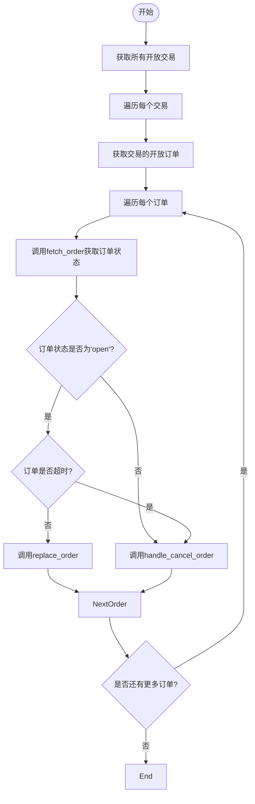
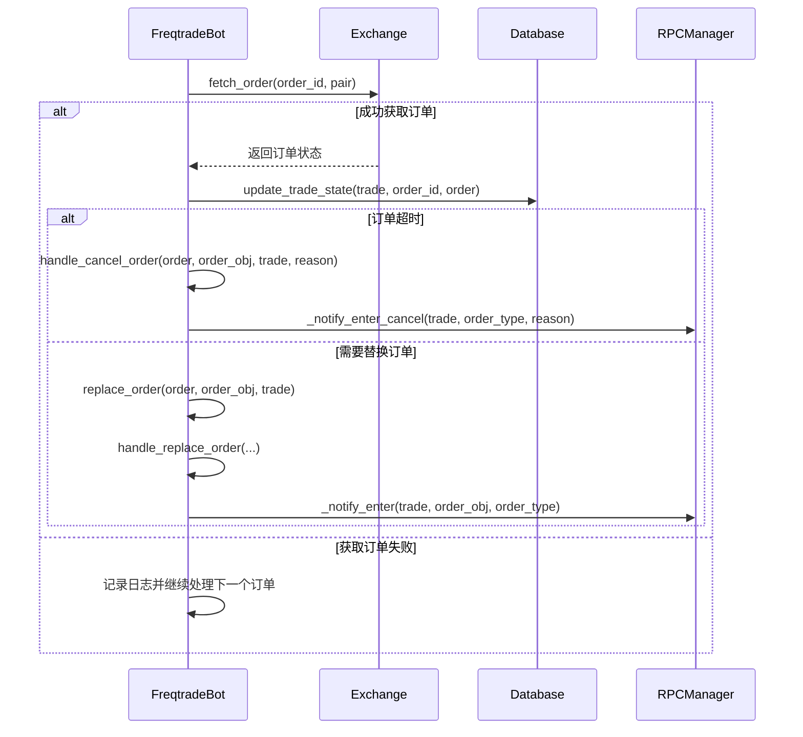

# 订单状态管理

<cite>
**本文档中引用的文件**   
- [freqtradebot.py](file://freqtrade/freqtradebot.py)
- [exchange.py](file://freqtrade/exchange/exchange.py)
- [trade_model.py](file://freqtrade/persistence/trade_model.py)
- [rpc.py](file://freqtrade/rpc/rpc.py)
- [constants.py](file://freqtrade/constants.py)
</cite>

## 目录
1. [介绍](#介绍)
2. [核心组件分析](#核心组件分析)
3. [订单状态轮询与更新流程](#订单状态轮询与更新流程)
4. [异常处理机制](#异常处理机制)
5. [数据库同步机制](#数据库同步机制)
6. [订单取消与替换逻辑](#订单取消与替换逻辑)
7. [并发控制机制](#并发控制机制)
8. [异步通知机制](#异步通知机制)
9. [序列图：订单管理流程](#序列图订单管理流程)

## 介绍
本文档系统阐述了 `manage_open_orders()` 方法如何轮询并更新交易所上所有开放订单的状态。详细说明了在 `fetch_order()` 调用失败时的异常处理机制，`update_trade_state()` 如何同步订单状态到数据库，以及 `handle_cancel_order()` 和 `replace_order()` 如何根据超时或用户请求来取消或替换订单。同时，强调了 `_with_exit_lock` 在防止并发操作中的关键作用，并解释了订单状态变更时如何通过 RPC 消息队列进行异步通知。

## 核心组件分析

**Section sources**
- [freqtradebot.py](file://freqtrade/freqtradebot.py#L1564-L1595)
- [exchange.py](file://freqtrade/exchange/exchange.py#L1587-L1614)
- [trade_model.py](file://freqtrade/persistence/trade_model.py#L100-L200)

## 订单状态轮询与更新流程
`manage_open_orders()` 方法负责管理交易所上的所有开放订单。该方法会遍历所有开放交易，并对每个交易的开放订单进行状态检查。首先，通过 `exchange.fetch_order()` 方法从交易所获取订单的最新状态。如果订单状态为“open”且未超时，则调用 `replace_order()` 方法检查是否需要根据新的市场数据替换订单。如果订单已超时或被完全取消，则调用 `handle_cancel_order()` 方法进行取消处理。

**Diagram sources**
- [freqtradebot.py](file://freqtrade/freqtradebot.py#L1564-L1595)

**Section sources**
- [freqtradebot.py](file://freqtrade/freqtradebot.py#L1564-L1595)

## 异常处理机制
当 `fetch_order()` 调用失败时，系统会捕获 `ExchangeError` 异常，并记录相关信息后继续处理下一个订单。对于其他类型的异常，如 `InvalidOrderException`，系统会记录警告信息并返回 `False`，表示无法获取订单信息。此外，系统还会处理 `RetryableOrderError` 和 `TemporaryError` 等临时性错误，确保在短暂的网络问题后能够重试。

**Section sources**
- [exchange.py](file://freqtrade/exchange/exchange.py#L1587-L1614)
- [freqtradebot.py](file://freqtrade/freqtradebot.py#L1564-L1595)

## 数据库同步机制
`update_trade_state()` 方法负责将订单的最新状态同步到数据库。该方法首先尝试从交易所获取订单的最新状态，然后更新交易对象中的订单信息。如果订单已被取消且未部分成交，则返回 `True`；否则，更新交易对象并提交到数据库。此方法还负责处理订单费用，并在订单关闭时发送通知。

**Section sources**
- [freqtradebot.py](file://freqtrade/freqtradebot.py#L2288-L2340)

## 订单取消与替换逻辑
`handle_cancel_order()` 方法根据订单的方向（entry 或 exit）调用相应的取消处理方法。对于入口订单，调用 `handle_cancel_enter()`；对于出口订单，调用 `handle_cancel_exit()`。`replace_order()` 方法则检查是否有新的蜡烛图数据，如果有，则根据新的市场数据计算新的订单价格，并调用 `handle_replace_order()` 方法取消旧订单并创建新订单。

**Section sources**
- [freqtradebot.py](file://freqtrade/freqtradebot.py#L1597-L1622)
- [freqtradebot.py](file://freqtrade/freqtradebot.py#L1655-L1712)

## 并发控制机制
`_with_exit_lock` 是一个锁机制，用于防止在处理订单取消和替换时发生并发操作。在 `process()` 方法中，`manage_open_orders()` 和 `exit_positions()` 都使用了 `_exit_lock`，确保在同一时间只有一个线程可以执行这些操作，从而避免了数据竞争和不一致的问题。

**Section sources**
- [freqtradebot.py](file://freqtrade/freqtradebot.py#L1564-L1595)
- [freqtradebot.py](file://freqtrade/freqtradebot.py#L2038-L2155)

## 异步通知机制
当订单状态发生变化时，系统会通过 RPC 消息队列发送异步通知。例如，在订单被取消或替换时，会调用 `_notify_enter_cancel()` 或 `_notify_exit()` 方法，这些方法会向 RPC 管理器发送消息，进而通知用户或其他系统组件。通知类型包括 `ENTRY_CANCEL`、`EXIT_CANCEL` 等。

**Section sources**
- [rpc.py](file://freqtrade/rpc/rpc.py#L100-L200)
- [freqtradebot.py](file://freqtrade/freqtradebot.py#L2288-L2340)

## 序列图：订单管理流程

**Diagram sources**
- [freqtradebot.py](file://freqtrade/freqtradebot.py#L1564-L1595)
- [exchange.py](file://freqtrade/exchange/exchange.py#L1587-L1614)
- [rpc.py](file://freqtrade/rpc/rpc.py#L100-L200)

**Section sources**
- [freqtradebot.py](file://freqtrade/freqtradebot.py#L1564-L1595)
- [exchange.py](file://freqtrade/exchange/exchange.py#L1587-L1614)
- [rpc.py](file://freqtrade/rpc/rpc.py#L100-L200)