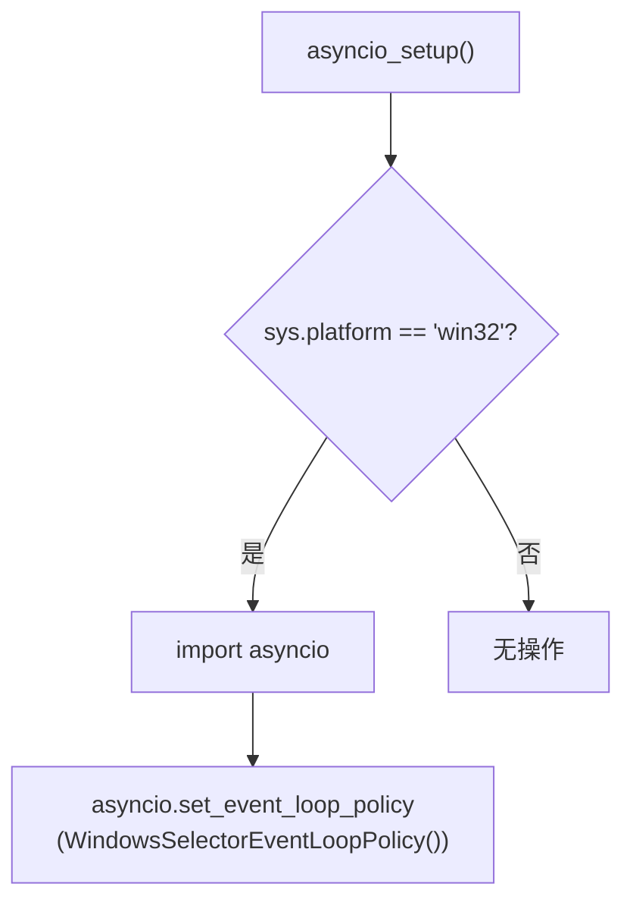
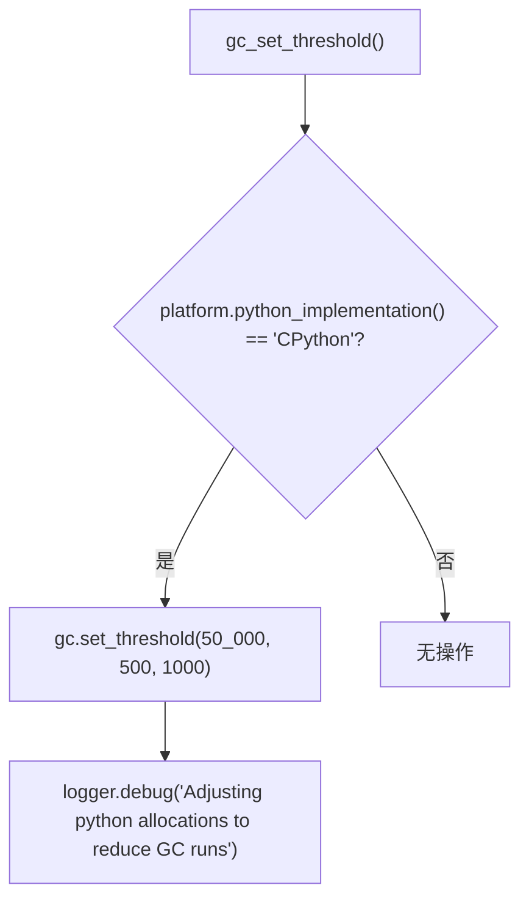
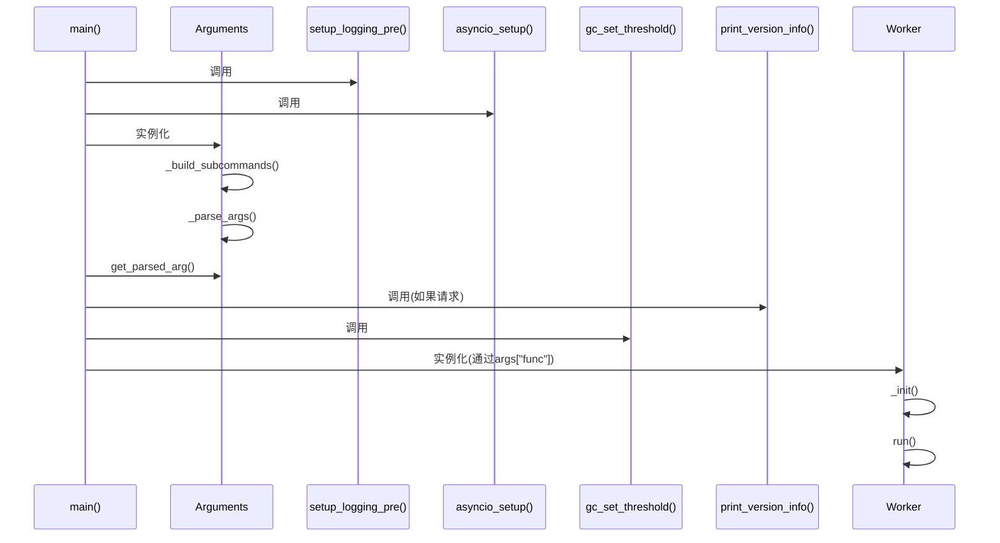

# 启动入口点

<cite>
**Referenced Files in This Document**   
- [main.py](file://freqtrade/main.py)
- [arguments.py](file://freqtrade/commands/arguments.py)
- [asyncio_config.py](file://freqtrade/system/asyncio_config.py)
- [gc_setup.py](file://freqtrade/system/gc_setup.py)
- [worker.py](file://freqtrade/worker.py)
- [version_info.py](file://freqtrade/system/version_info.py)
</cite>

## 目录
1. [程序入口执行流程](#程序入口执行流程)
2. [命令行参数解析](#命令行参数解析)
3. [日志系统预初始化](#日志系统预初始化)
4. [异步事件循环配置](#异步事件循环配置)
5. [垃圾回收阈值优化](#垃圾回收阈值优化)
6. [版本检查机制](#版本检查机制)
7. [异常处理流程](#异常处理流程)
8. [调用时序分析](#调用时序分析)

## 程序入口执行流程

`main.py` 文件作为程序的主入口点，定义了 `main()` 函数作为程序的启动函数。该函数负责协调整个程序的启动流程，包括环境检查、日志配置、参数解析、版本检查和核心功能调用。当程序启动时，`if __name__ == "__main__":` 语句会调用 `main()` 函数，从而启动整个交易机器人系统。

**Section sources**
- [main.py](file://freqtrade/main.py#L30-L80)

## 命令行参数解析

程序通过 `Arguments` 类来解析命令行参数。`Arguments` 类位于 `freqtrade/commands/arguments.py` 文件中，它使用 Python 的 `argparse` 模块构建了一个复杂的命令行接口。该类在初始化时接收命令行参数列表，并通过 `_build_subcommands()` 方法构建所有可用的子命令（如 `trade`、`backtesting`、`hyperopt` 等）。当调用 `get_parsed_arg()` 方法时，它会解析参数并返回一个字典，其中包含了所有解析后的命令行选项。这些选项随后被用于确定程序的运行模式和配置。

**Section sources**
- [arguments.py](file://freqtrade/commands/arguments.py#L299-L706)

## 日志系统预初始化

`setup_logging_pre()` 函数在程序早期阶段设置日志系统。该函数位于 `freqtrade/loggers/__init__.py` 文件中，其主要作用是为程序提供一个基本的日志记录机制，以便在完整配置加载之前就能输出日志信息。它使用 `logging.basicConfig()` 配置日志级别为 `INFO`，并设置了一个 `FtRichHandler` 处理器来格式化和输出日志消息。这种预初始化确保了即使在配置加载失败的情况下，用户也能看到有意义的错误信息。

**Section sources**
- [__init__.py](file://freqtrade/loggers/__init__.py#L36-L54)

## 异步事件循环配置

`asyncio_setup()` 函数负责配置异步事件循环，主要针对 Windows 平台进行特殊处理。该函数位于 `freqtrade/system/asyncio_config.py` 文件中。在 Windows 系统上，它会设置事件循环策略为 `WindowsSelectorEventLoopPolicy`，以确保异步操作的正确执行。这个配置对于程序中涉及网络请求、文件 I/O 等异步操作的模块至关重要，确保了程序在不同操作系统上的兼容性和稳定性。

**Diagram sources**
- [asyncio_config.py](file://freqtrade/system/asyncio_config.py#L3-L9)

**Section sources**
- [asyncio_config.py](file://freqtrade/system/asyncio_config.py#L3-L9)

## 垃圾回收阈值优化

`gc_set_threshold()` 函数用于调整 Python 垃圾回收器的阈值，以优化程序性能。该函数位于 `freqtrade/system/gc_setup.py` 文件中。它主要针对 CPython 实现，将垃圾回收的触发阈值从默认值调整为更高的值（50,000, 500, 1000）。通过减少垃圾回收的频率，程序可以将更多时间用于核心交易逻辑的执行，从而提高整体性能。这是一个性能优化技巧，特别适用于长时间运行且内存分配频繁的应用程序。

**Diagram sources**
- [gc_setup.py](file://freqtrade/system/gc_setup.py#L8-L17)

**Section sources**
- [gc_setup.py](file://freqtrade/system/gc_setup.py#L8-L17)

## 版本检查机制

版本检查机制是程序启动流程中的一个重要环节。当用户通过命令行参数指定 `--version` 或 `--version-main` 时，程序会调用 `print_version_info()` 函数并立即退出。该函数位于 `freqtrade/system/version_info.py` 文件中，它会打印出程序及其关键依赖项（如 Python、CCXT）的版本信息。这个机制允许用户快速验证安装的程序版本，对于故障排除和确保环境兼容性非常有用。

**Section sources**
- [version_info.py](file://freqtrade/system/version_info.py#L3-L14)

## 异常处理流程

程序的异常处理流程设计得非常全面，能够捕获并妥善处理各种类型的异常。在 `main()` 函数的 `try-except` 块中，程序区分了多种异常类型：
- `SystemExit` 和 `KeyboardInterrupt`：用于正常退出程序
- `ConfigurationError`：处理配置文件错误，并提示用户查阅文档
- `FreqtradeException`：处理程序特定的业务逻辑异常
- 通用 `Exception`：捕获所有未预期的致命异常，并记录完整的堆栈跟踪

这种分层的异常处理策略确保了程序的健壮性，即使在发生错误时也能提供清晰的错误信息，并以适当的退出码终止程序。

**Section sources**
- [main.py](file://freqtrade/main.py#L50-L75)

## 调用时序分析

从 `main()` 函数到 `Worker` 实例化的调用时序如下：程序首先进行 Python 版本检查，然后依次调用 `setup_logging_pre()` 进行日志预初始化和 `asyncio_setup()` 配置异步环境。接着，创建 `Arguments` 实例来解析命令行参数。如果用户请求版本信息，则调用 `print_version_info()` 并退出。否则，程序会调用 `gc_set_threshold()` 优化性能，并根据解析出的参数调用相应的功能函数。对于交易模式，这最终会实例化 `Worker` 类，该类位于 `freqtrade/worker.py` 文件中，负责管理交易机器人的核心运行循环。

**Diagram sources**
- [main.py](file://freqtrade/main.py#L30-L80)
- [worker.py](file://freqtrade/worker.py#L25-L238)

**Section sources**
- [main.py](file://freqtrade/main.py#L30-L80)
- [worker.py](file://freqtrade/worker.py#L25-L238)