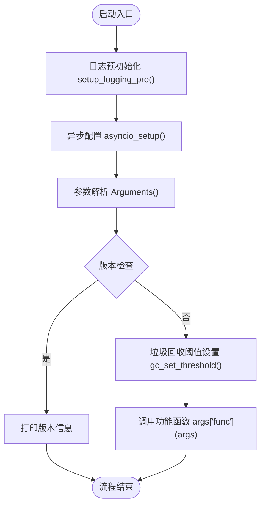
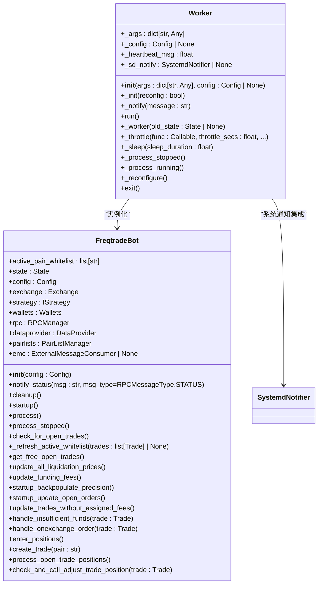
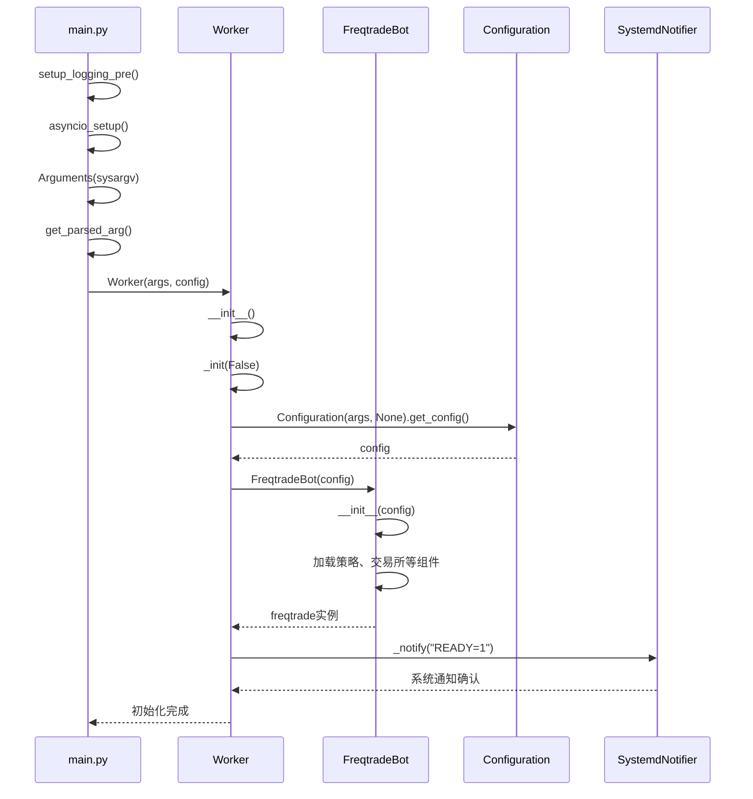
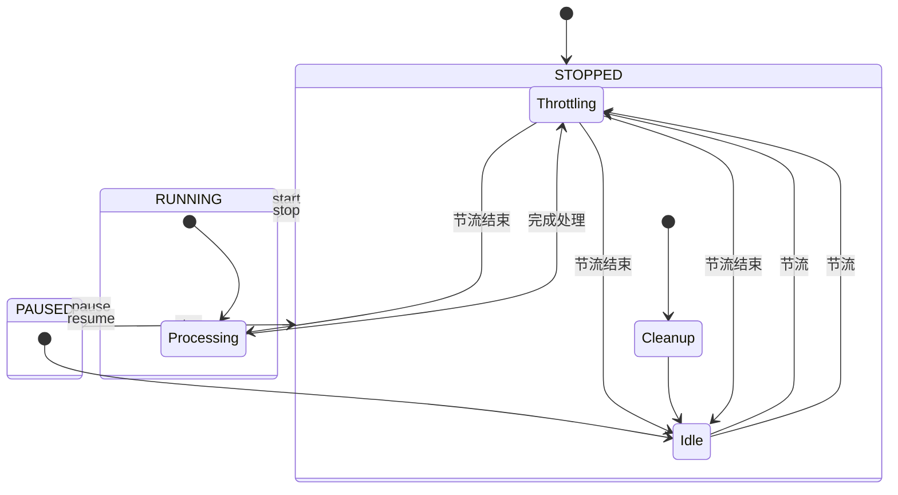
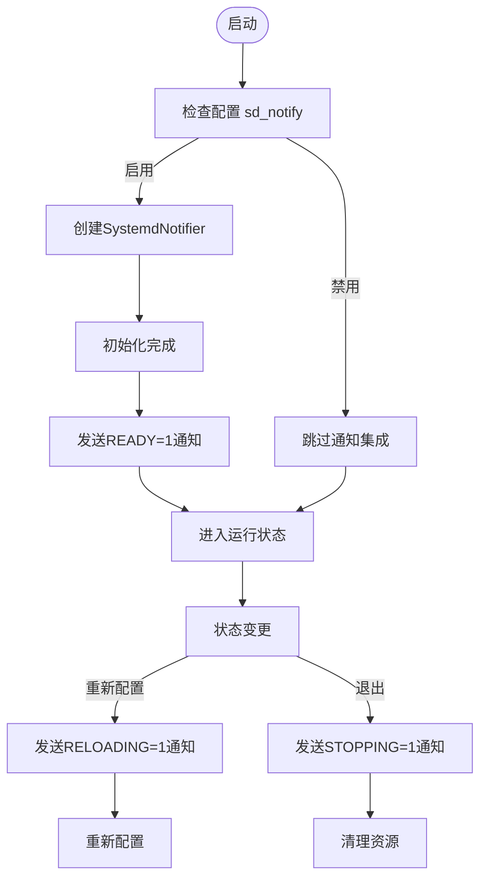

# 启动流程

<cite>
**本文档中引用的文件**   
- [main.py](file://freqtrade/main.py)
- [worker.py](file://freqtrade/worker.py)
- [freqtradebot.py](file://freqtrade/freqtradebot.py)
- [asyncio_config.py](file://freqtrade/system/asyncio_config.py)
- [gc_setup.py](file://freqtrade/system/gc_setup.py)
- [version_info.py](file://freqtrade/system/version_info.py)
- [__init__.py](file://freqtrade/loggers/__init__.py)
</cite>

## 目录
1. [启动流程概述](#启动流程概述)
2. [入口点分析](#入口点分析)
3. [核心组件初始化](#核心组件初始化)
4. [启动时序图](#启动时序图)
5. [关键状态转换](#关键状态转换)
6. [系统通知集成](#系统通知集成)
7. [异常处理机制](#异常处理机制)

## 启动流程概述

Freqtrade的启动流程从`main.py`入口开始，经过参数解析、异步事件循环配置、日志预初始化等步骤，最终实例化Worker并启动FreqtradeBot。整个流程设计严谨，确保了系统的稳定性和可维护性。

**Section sources**
- [main.py](file://freqtrade/main.py#L26-L74)

## 入口点分析

启动流程始于`main.py`文件中的`main()`函数。该函数首先进行日志预初始化和异步事件循环配置，然后解析命令行参数。如果用户请求版本信息，则显示版本信息后退出；否则，根据解析的参数调用相应的功能函数。

在执行主要功能之前，系统会进行版本检查，确保运行环境满足最低要求（Python 3.11及以上版本）。这一设计确保了软件的兼容性和稳定性。

**Diagram sources **
- [main.py](file://freqtrade/main.py#L26-L74)
- [system/asyncio_config.py](file://freqtrade/system/asyncio_config.py#L0-L10)
- [system/gc_setup.py](file://freqtrade/system/gc_setup.py#L0-L17)
- [system/version_info.py](file://freqtrade/system/version_info.py#L0-L15)

**Section sources**
- [main.py](file://freqtrade/main.py#L0-L79)
- [system/asyncio_config.py](file://freqtrade/system/asyncio_config.py#L0-L10)
- [system/gc_setup.py](file://freqtrade/system/gc_setup.py#L0-L17)
- [system/version_info.py](file://freqtrade/system/version_info.py#L0-L15)

## 核心组件初始化

Worker的初始化过程是启动链路的关键环节。`Worker.__init__()`方法首先记录启动日志，然后调用`_init()`方法进行核心组件的加载和实例化。

`_init()`方法根据配置参数加载系统配置，并实例化FreqtradeBot核心组件。这一过程包括配置加载、机器人实例化、节流设置以及系统通知（sd_notify）的集成。系统通过`sdnotify.SystemdNotifier()`实现与systemd的集成，确保服务状态能够正确通知给系统管理器。

**Diagram sources **
- [worker.py](file://freqtrade/worker.py#L25-L238)
- [freqtradebot.py](file://freqtrade/freqtradebot.py#L72-L763)

**Section sources**
- [worker.py](file://freqtrade/worker.py#L0-L239)
- [freqtradebot.py](file://freqtrade/freqtradebot.py#L0-L799)

## 启动时序图

以下时序图展示了从`main.py`入口到Worker实例化再到FreqtradeBot初始化的完整启动链路，包括Argument解析、异步事件循环配置、日志预初始化等关键步骤的执行顺序。

**Diagram sources **
- [main.py](file://freqtrade/main.py#L26-L74)
- [worker.py](file://freqtrade/worker.py#L25-L238)
- [freqtradebot.py](file://freqtrade/freqtradebot.py#L72-L763)

## 关键状态转换

Worker通过`_worker()`方法管理系统的状态转换。该方法根据FreqtradeBot的当前状态执行相应的处理逻辑，包括状态变更日志记录、状态转换通知以及不同状态下的具体处理。

系统支持多种状态，包括RUNNING（运行中）、PAUSED（暂停）和STOPPED（停止）。状态转换时，系统会发送相应的RPC状态通知，并记录详细的日志信息。在RUNNING和PAUSED状态下，系统会定期执行交易处理循环；在STOPPED状态下，系统会检查并处理未完成的订单。

**Diagram sources **
- [worker.py](file://freqtrade/worker.py#L25-L238)

## 系统通知集成

系统通过`sdnotify`库实现与systemd的集成，确保服务状态能够正确通知给系统管理器。在Worker的初始化过程中，系统会根据配置决定是否启用sd_notify功能。

当`internals.sd_notify`配置项为True时，系统会创建`SystemdNotifier`实例，并在关键生命周期节点发送相应的通知消息。例如，在初始化完成后发送"READY=1"通知，在重新配置时发送"RELOADING=1"通知，在退出时发送"STOPPING=1"通知。

这种集成方式使得Freqtrade能够更好地与Linux系统服务管理器协同工作，提高了系统的可靠性和可管理性。

**Diagram sources **
- [worker.py](file://freqtrade/worker.py#L56-L93)

## 异常处理机制

系统实现了完善的异常处理机制，确保在各种异常情况下能够优雅地处理并提供有意义的错误信息。在`main()`函数的try-catch块中，系统捕获了多种类型的异常，包括系统退出、键盘中断、配置错误、Freqtrade异常以及其他未预期的异常。

对于不同的异常类型，系统采取了相应的处理策略：
- **SystemExit**: 直接传递退出码
- **KeyboardInterrupt**: 记录SIGINT接收日志，正常退出
- **ConfigurationError**: 记录配置错误信息，提供文档链接
- **FreqtradeException**: 记录异常信息
- **其他异常**: 记录致命异常的完整堆栈信息

此外，系统还通过`finally`块确保无论发生何种情况，都会正确地退出进程，释放系统资源。

**Section sources**
- [main.py](file://freqtrade/main.py#L26-L74)