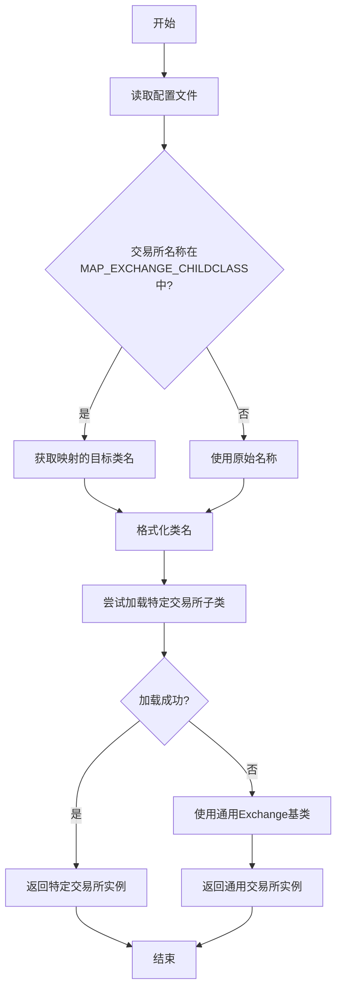
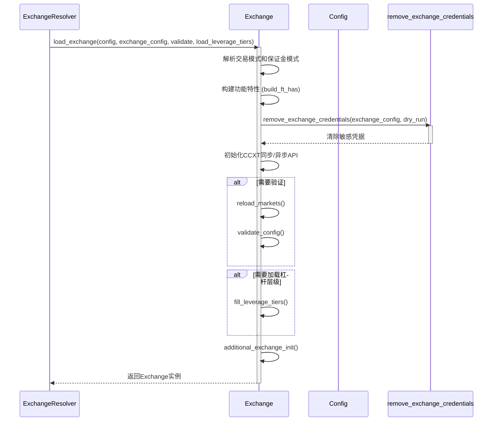

# 交易所初始化

<cite>
**Referenced Files in This Document**   
- [exchange_resolver.py](file://freqtrade/resolvers/exchange_resolver.py)
- [exchange.py](file://freqtrade/exchange/exchange.py)
- [common.py](file://freqtrade/exchange/common.py)
- [config_secrets.py](file://freqtrade/configuration/config_secrets.py)
</cite>

## 目录
1. [ExchangeResolver.load_exchange() 动态加载机制](#exchangeresolverload_exchange-动态加载机制)
2. [交易所名称映射 (MAP_EXCHANGE_CHILDCLASS)](#交易所名称映射-map_exchange_childclass)
3. [Exchange 基类初始化流程](#exchange-基类初始化流程)
4. [配置验证与安全实践](#配置验证与安全实践)

## ExchangeResolver.load_exchange() 动态加载机制

`ExchangeResolver.load_exchange()` 方法是交易所实例化的核心入口，它根据配置文件中的交易所名称动态加载并返回相应的交易所对象。该方法首先从配置中提取交易所名称，然后通过 `MAP_EXCHANGE_CHILDCLASS` 映射表将别名（如 "binanceus"）转换为实际的交易所类名（如 "binance"），以避免为功能相同的交易所创建重复的子类。

转换后的名称经过格式化后，方法会尝试通过 `_load_exchange` 内部方法加载特定于该交易所的子类。此过程会将配置、验证标志、交易所特定配置和杠杆层级加载标志作为参数传递给交易所构造函数。如果特定交易所的子类不存在（例如，用户使用的是通用交易所），则会捕获 `ImportError` 异常，并回退到使用通用的 `Exchange` 基类来创建实例。

**Section sources**
- [exchange_resolver.py](file://freqtrade/resolvers/exchange_resolver.py#L25-L62)

## 交易所名称映射 (MAP_EXCHANGE_CHILDCLASS)

`MAP_EXCHANGE_CHILDCLASS` 是一个字典，用于维护交易所别名到其主类名的映射关系。这个映射机制允许系统将多个相似的交易所（如 Binance 的美国分站 "binanceus" 和其主站 "binance"）视为同一个实体，从而共享相同的实现逻辑，避免代码冗余。

例如，当配置中指定 `"exchange": "binanceus"` 时，`load_exchange` 方法会查询此映射表，发现 "binanceus" 对应的是 "binance"，于是最终会加载 `binance.py` 中定义的交易所类。这确保了即使用户使用不同的交易所域名，系统也能正确地初始化功能一致的交易所实例。

**Diagram sources**
- [common.py](file://freqtrade/exchange/common.py#L46-L53)
- [exchange_resolver.py](file://freqtrade/resolvers/exchange_resolver.py#L30-L35)

## Exchange 基类初始化流程

`Exchange` 基类的 `__init__` 方法负责初始化交易所实例的绝大部分核心组件。其初始化流程是一个复杂且有序的过程，主要步骤如下：

1.  **参数解析与配置合并**：方法接收主配置 `config` 和可选的 `exchange_config`。如果未提供 `exchange_config`，则直接使用 `config` 中的 `exchange` 部分。这允许为不同的交易所实例传递特定的配置。
2.  **交易模式与保证金模式设置**：根据配置中的 `trading_mode` 和 `margin_mode` 设置交易模式（现货、杠杆、期货）和保证金模式（全仓、逐仓），并更新主配置。
3.  **功能特性构建**：调用 `build_ft_has()` 方法，将交易所默认支持的功能 (`_ft_has_default`) 与配置中指定的覆盖项进行深度合并，生成最终的功能特性字典 `self._ft_has`。
4.  **凭据安全处理**：调用 `remove_exchange_credentials()` 函数。在 `dry_run`（模拟运行）模式下，且交易所未强制要求凭据时，该函数会清除配置中的 `api_key`、`secret` 等敏感信息，以增强安全性。
5.  **CCXT API 初始化**：根据同步/异步需求和交易模式，使用合并后的配置初始化 `ccxt` 和 `ccxt_pro` 的同步与异步 API 客户端。
6.  **市场数据加载与验证**：如果 `validate` 标志为 `True`，则调用 `reload_markets()` 加载市场信息，并调用 `validate_config()` 对配置进行一系列验证，包括时间框架、交易对、订单类型等。
7.  **杠杆层级加载**：如果交易模式不是现货且 `load_leverage_tiers` 标志为 `True`，则调用 `fill_leverage_tiers()` 方法从交易所获取并填充杠杆层级信息。
8.  **附加初始化**：最后调用 `additional_exchange_init()` 钩子方法，允许子类在初始化流程的末尾执行特定于交易所的额外初始化逻辑。

**Section sources**
- [exchange.py](file://freqtrade/exchange/exchange.py#L178-L302)

## 配置验证与安全实践

### 配置验证 (validate_config)

`validate_config` 方法是确保交易所配置正确性的关键环节。它会执行一系列检查，包括：
- **时间框架验证**：确认配置中的 `timeframe` 被当前交易所支持。
- **基础币种验证**：检查 `stake_currency` 是否能在交易所的交易对中作为报价币（quote currency）使用。
- **订单类型验证**：确认策略中使用的订单类型（如市价单、限价单）和止损订单类型在当前交易所上是可用的。
- **交易模式验证**：确保配置的 `trading_mode` 和 `margin_mode` 组合是交易所所支持的。
- **定价策略验证**：验证入口和出口定价策略的配置是否有效。

这些验证在交易所初始化时自动执行，能有效防止因配置错误而导致的运行时异常。

### 凭据移除的安全实践

`remove_exchange_credentials` 函数是系统安全实践的重要组成部分。它被设计用于在非实盘交易场景（如回测、超参数优化）中，自动清除配置中的敏感凭据信息。

该函数通过一个名为 `_SENSITIVE_KEYS` 的列表来定义所有需要被保护的敏感键名（如 `exchange.api_key`, `exchange.secret`）。当 `dry_run` 模式开启时，函数会遍历这些键名，如果它们存在于 `exchange_config` 中，则将其值清空。这种设计确保了用户的 API 密钥不会在日志或调试信息中意外暴露，极大地提升了系统的安全性。

**Diagram sources**
- [exchange.py](file://freqtrade/exchange/exchange.py#L343-L357)
- [config_secrets.py](file://freqtrade/configuration/config_secrets.py#L51-L66)

**Section sources**
- [exchange.py](file://freqtrade/exchange/exchange.py#L343-L357)
- [config_secrets.py](file://freqtrade/configuration/config_secrets.py#L51-L66)