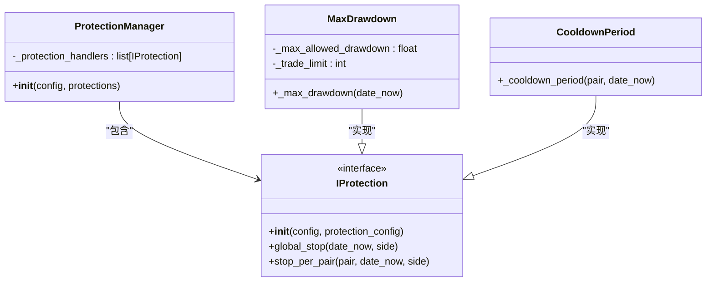

# 保护机制初始化

<cite>
**本文档中引用的文件**   
- [protectionmanager.py](file://freqtrade/plugins/protectionmanager.py)
- [freqtradebot.py](file://freqtrade/freqtradebot.py)
- [max_drawdown_protection.py](file://freqtrade/plugins/protections/max_drawdown_protection.py)
- [cooldown_period.py](file://freqtrade/plugins/protections/cooldown_period.py)
- [interface.py](file://freqtrade/strategy/interface.py)
</cite>

## 目录
1. [保护管理器初始化时机](#保护管理器初始化时机)
2. [保护规则配置读取与实例化](#保护规则配置读取与实例化)
3. [保护规则启用条件与交易对锁定](#保护规则启用条件与交易对锁定)

## 保护管理器初始化时机

`ProtectionManager` 的初始化时机被刻意安排在 `strategy.ft_bot_start()` 之后，这是为了确保策略的完整配置和参数能够被正确加载。在 `FreqtradeBot` 的构造函数中，策略对象首先被加载并初始化，随后调用 `strategy.ft_bot_start()` 方法。此方法不仅执行了策略的启动逻辑，更重要的是，它会加载与策略相关的所有超参数和配置，包括 `protections` 属性。如果在 `ft_bot_start()` 之前就尝试初始化 `ProtectionManager`，那么传递给它的 `self.strategy.protections` 将是空的或不完整的，导致保护机制无法根据策略配置正确地实例化。因此，将 `ProtectionManager` 的初始化置于 `ft_bot_start()` 之后，是保证保护机制能够获取到完整、准确配置信息的关键步骤。

**Section sources**
- [freqtradebot.py](file://freqtrade/freqtradebot.py#L830-L860)

## 保护规则配置读取与实例化

保护规则的配置来源于策略的 `protections` 属性。当 `ProtectionManager` 被创建时，它会接收一个包含保护配置的列表作为参数。该列表中的每个元素都是一个字典，定义了保护方法（`method`）及其相关参数（如 `stop_duration`, `lookback_period`, `max_allowed_drawdown` 等）。`ProtectionManager` 通过 `ProtectionResolver.load_protection` 方法，根据配置中的 `method` 名称动态加载对应的保护类（例如 `MaxDrawdown` 或 `CooldownPeriod`）。随后，它使用从策略中读取的 `protection_config` 字典来实例化这些保护类。例如，在 `max_drawdown_protection.py` 中，`MaxDrawdown` 类的构造函数会从 `protection_config` 中提取 `max_allowed_drawdown` 和 `trade_limit` 等值，并将其存储为实例属性，从而完成保护规则的实例化和配置。

**Diagram sources **
- [protectionmanager.py](file://freqtrade/plugins/protectionmanager.py#L19-L114)
- [max_drawdown_protection.py](file://freqtrade/plugins/protections/max_drawdown_protection.py#L1-L103)
- [cooldown_period.py](file://freqtrade/plugins/protections/cooldown_period.py#L1-L75)

## 保护规则启用条件与交易对锁定

保护规则的启用条件由其具体的实现逻辑决定。`ProtectionManager` 通过调用其内部所有 `IProtection` 实例的 `global_stop` 和 `stop_per_pair` 方法来检查是否应触发保护。`global_stop` 方法用于判断是否应触发全局交易停止，例如 `MaxDrawdown` 保护会计算最近一段时间内的最大回撤，如果回撤超过 `max_allowed_drawdown` 阈值，则返回一个全局锁定。`stop_per_pair` 方法则用于判断是否应针对特定交易对进行锁定，例如 `CooldownPeriod` 保护会在一个交易对最近被卖出后，根据配置的冷却时间进行锁定。

当保护规则决定触发时，它会返回一个包含锁定信息的 `ProtectionReturn` 对象。`ProtectionManager` 随后会调用 `PairLocks.lock_pair` 方法，将此锁定信息持久化到数据库中。这个锁定会阻止 `FreqtradeBot` 为被锁定的交易对（或所有交易对，如果是全局锁定）创建新的交易。在 `create_trade` 方法中，会调用 `strategy.is_pair_locked` 来检查当前交易对是否被锁定，如果被锁定，则直接返回，放弃创建交易。这种机制确保了保护规则的决策能够有效地影响交易执行流程。

**Section sources**
- [protectionmanager.py](file://freqtrade/plugins/protectionmanager.py#L49-L77)
- [max_drawdown_protection.py](file://freqtrade/plugins/protections/max_drawdown_protection.py#L1-L103)
- [cooldown_period.py](file://freqtrade/plugins/protections/cooldown_period.py#L1-L75)
- [freqtradebot.py](file://freqtrade/freqtradebot.py#L652-L710)
- [interface.py](file://freqtrade/strategy/interface.py#L1163-L1182)