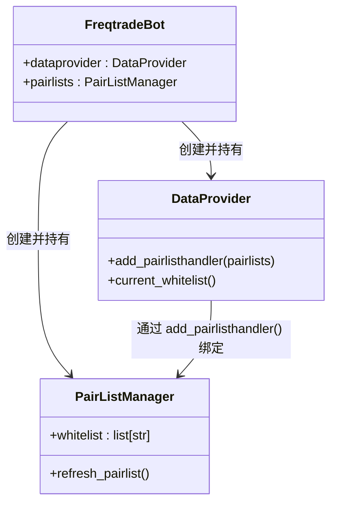
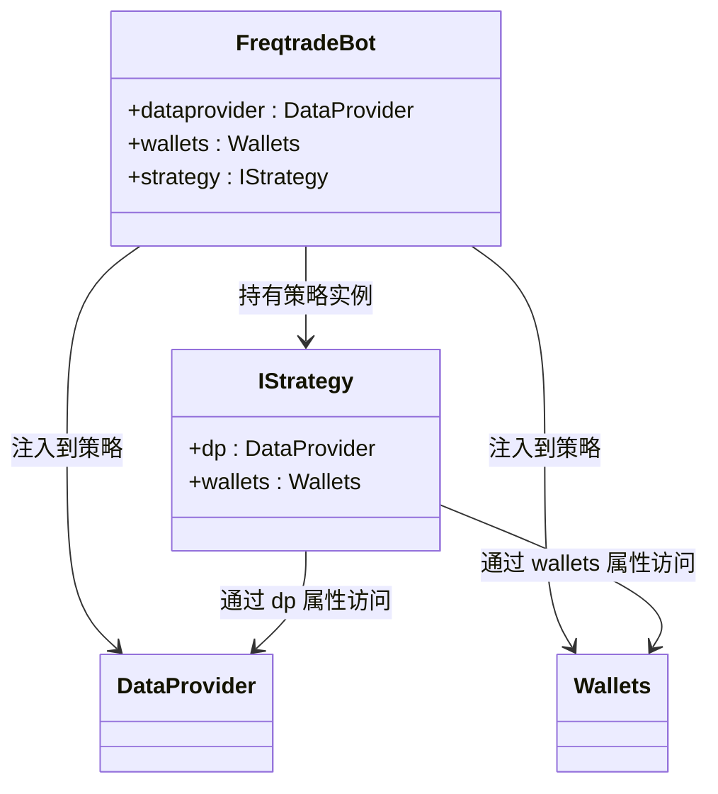
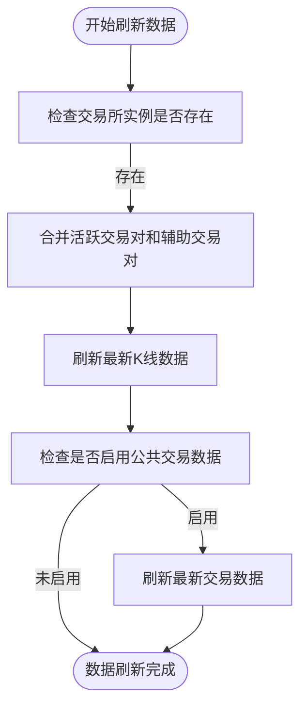

# 数据提供者初始化

<cite>
**本文档中引用的文件**   
- [DataProvider.py](file://freqtrade\data\dataprovider.py)
- [FreqtradeBot.py](file://freqtrade\freqtradebot.py)
- [PairListManager.py](file://freqtrade\plugins\pairlistmanager.py)
- [Wallets.py](file://freqtrade\wallets.py)
</cite>

## 目录
1. [数据提供者初始化过程](#数据提供者初始化过程)
2. [核心组件集成](#核心组件集成)
3. [数据刷新机制](#数据刷新机制)

## 数据提供者初始化过程

`DataProvider` 类在 `FreqtradeBot` 初始化过程中被创建，其主要职责是为策略提供市场数据。初始化时，`DataProvider` 接收配置对象、交易所实例、配对列表处理器和 RPC 管理器作为参数。这些参数被用于设置数据提供者的内部状态，包括默认的K线周期和K线类型。`DataProvider` 还初始化了多个缓存字典，用于存储已分析的数据框、切片索引和外部生产者的数据。

**Section sources**
- [freqtradebot.py](file://freqtrade\freqtradebot.py#L108-L150)
- [dataprovider.py](file://freqtrade\data\dataprovider.py#L39-L69)

## 核心组件集成

### PairListManager 绑定

`DataProvider` 通过 `attach_pairlisthandler()` 方法与 `PairListManager` 绑定。在 `FreqtradeBot` 的初始化过程中，首先创建 `PairListManager` 实例，然后将其作为参数传递给 `DataProvider` 的 `add_pairlisthandler` 方法。这使得 `DataProvider` 能够访问最新的活跃交易对白名单，从而确保只获取相关交易对的数据。

**Diagram sources **
- [freqtradebot.py](file://freqtrade\freqtradebot.py#L148-L150)
- [dataprovider.py](file://freqtrade\data\dataprovider.py#L288-L292)
- [pairlistmanager.py](file://freqtrade\plugins\pairlistmanager.py#L97-L99)

**Section sources**
- [freqtradebot.py](file://freqtrade\freqtradebot.py#L148-L150)
- [dataprovider.py](file://freqtrade\data\dataprovider.py#L288-L292)

### 策略对象注入

在 `FreqtradeBot` 初始化的最后阶段，`DataProvider` 和 `Wallets` 实例被注入到策略对象中。具体来说，`self.strategy.dp = self.dataprovider` 这行代码将 `DataProvider` 实例赋值给策略对象的 `dp` 属性。同样地，`Wallets` 实例也被注入到策略对象中，使得策略可以访问钱包信息。

**Diagram sources **
- [freqtradebot.py](file://freqtrade\freqtradebot.py#L150-L152)
- [interface.py](file://freqtrade\strategy\interface.py#L134-L135)

**Section sources**
- [freqtradebot.py](file://freqtrade\freqtradebot.py#L150-L152)

## 数据刷新机制

`refresh` 方法负责协调活跃交易对白名单和信息性K线数据的获取。该方法在每个交易周期开始时被调用，接收当前的活跃交易对列表和辅助交易对列表作为参数。首先，它合并这两个列表以形成最终的交易对列表。然后，调用交易所实例的 `refresh_latest_ohlcv` 方法来刷新最新的K线数据。此外，如果配置中启用了公共交易数据，则还会调用 `refresh_latest_trades` 方法来刷新最新的交易数据。

**Diagram sources **
- [dataprovider.py](file://freqtrade\data\dataprovider.py#L437-L451)
- [dataprovider.py](file://freqtrade\data\dataprovider.py#L453-L461)

**Section sources**
- [dataprovider.py](file://freqtrade\data\dataprovider.py#L437-L461)