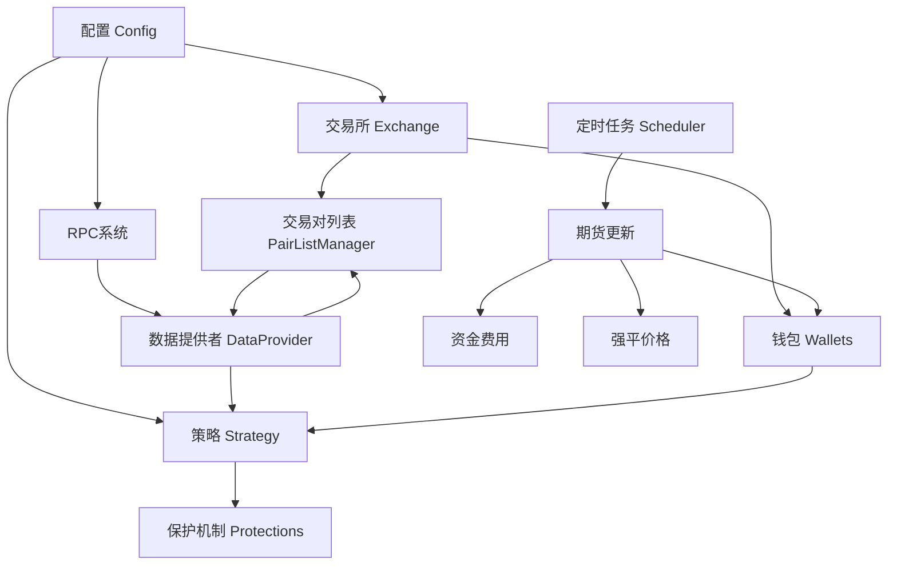
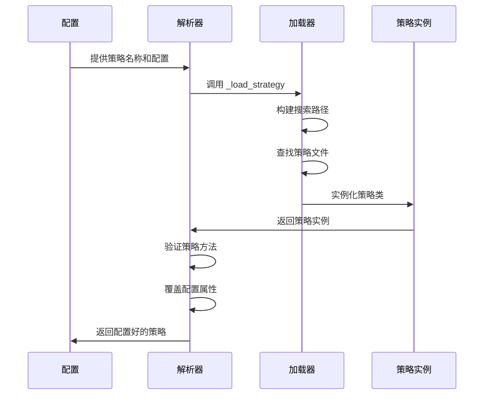
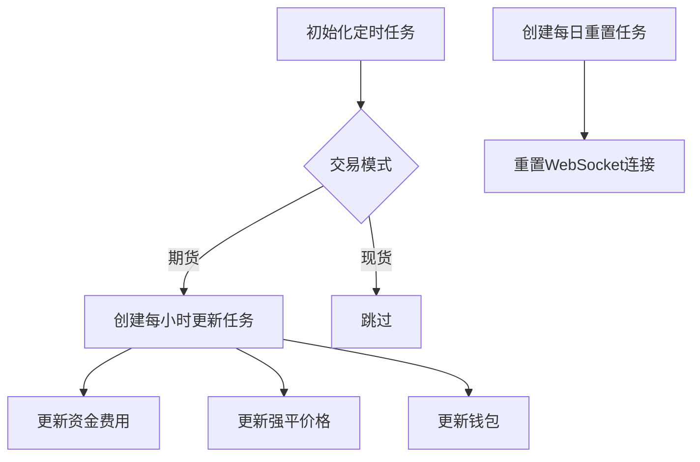

# 核心组件初始化

<cite>
**本文档引用的文件**   
- [freqtradebot.py](file://freqtrade/freqtradebot.py)
- [exchange_resolver.py](file://freqtrade/resolvers/exchange_resolver.py)
- [strategy_resolver.py](file://freqtrade/resolvers/strategy_resolver.py)
- [dataprovider.py](file://freqtrade/data/dataprovider.py)
- [wallets.py](file://freqtrade/wallets.py)
- [rpc_manager.py](file://freqtrade/rpc/rpc_manager.py)
- [protectionmanager.py](file://freqtrade/plugins/protectionmanager.py)
- [pairlock_middleware.py](file://freqtrade/persistence/pairlock_middleware.py)
- [measure_time.py](file://freqtrade/util/measure_time.py)
- [logging_mixin.py](file://freqtrade/mixins/logging_mixin.py)
</cite>

## 目录
1. [初始化流程概述](#初始化流程概述)
2. [核心组件依赖关系](#核心组件依赖关系)
3. [动态加载机制](#动态加载机制)
4. [组件间通信机制](#组件间通信机制)
5. [保护机制与定时任务](#保护机制与定时任务)
6. [状态管理与配置](#状态管理与配置)

## 初始化流程概述

`FreqtradeBot.__init__()` 方法是整个交易机器人的核心初始化入口，负责按特定顺序创建和配置所有核心组件。该方法首先初始化基本状态和配置，然后按依赖关系顺序创建各个组件实例。初始化流程始于机器人状态和配置的设置，随后通过 `ExchangeResolver` 加载交易所接口，通过 `StrategyResolver` 加载策略实例。在策略加载后，进行配置一致性验证和交易所兼容性检查。接着初始化数据库、钱包管理器和RPC系统。数据提供者（DataProvider）和交易对列表管理器（PairListManager）在RPC系统之后创建，并与策略实例建立通信连接。最后，初始化保护机制、定时任务和执行时间测量器，完成整个系统的初始化。

**Section sources**
- [freqtradebot.py](file://freqtrade/freqtradebot.py#L78-L187)

## 核心组件依赖关系

核心组件的初始化遵循严格的依赖关系顺序，确保每个组件在使用前都已正确配置。交易所接口（Exchange）是最早初始化的组件之一，因为它为后续的市场数据获取和交易执行提供基础。策略实例（Strategy）在交易所之后初始化，因为策略可能需要根据交易所特性进行配置。数据提供者（DataProvider）依赖于交易所和RPC系统，因此在它们之后创建。钱包管理器（Wallets）依赖于配置和交易所实例，用于管理资金和仓位。RPC系统（RPCManager）在大多数核心组件之后初始化，但必须在数据提供者之前完成，以便数据提供者可以向RPC发送消息。保护机制（ProtectionManager）的初始化被特意安排在策略的 `ft_bot_start()` 方法调用之后，以确保策略的保护参数已完全加载。

**Diagram sources **
- [freqtradebot.py](file://freqtrade/freqtradebot.py#L78-L187)

**Section sources**
- [freqtradebot.py](file://freqtrade/freqtradebot.py#L78-L187)
- [wallets.py](file://freqtrade/wallets.py#L35-L52)
- [rpc_manager.py](file://freqtrade/rpc/rpc_manager.py#L21-L54)
- [dataprovider.py](file://freqtrade/data/dataprovider.py#L39-L69)

## 动态加载机制

`StrategyResolver` 和 `ExchangeResolver` 实现了动态加载机制，允许系统在运行时根据配置加载相应的策略和交易所类。`ExchangeResolver.load_exchange()` 方法首先从配置中获取交易所名称，然后尝试从 `freqtrade.exchanges` 模块中加载特定于该交易所的子类。如果找不到特定子类，则回退到通用的 `Exchange` 基类。`StrategyResolver.load_strategy()` 方法则通过 `build_search_paths` 构建搜索路径，从用户指定的目录和默认路径中查找策略文件。它支持从文件系统、临时目录甚至Base64编码的字符串中加载策略。加载后，解析器会验证策略的必要方法是否已实现，并根据配置覆盖策略的默认属性，如 `minimal_roi`、`stoploss` 等，确保策略行为符合用户配置。

**Diagram sources **
- [exchange_resolver.py](file://freqtrade/resolvers/exchange_resolver.py#L17-L113)
- [strategy_resolver.py](file://freqtrade/resolvers/strategy_resolver.py#L25-L307)

**Section sources**
- [exchange_resolver.py](file://freqtrade/resolvers/exchange_resolver.py#L17-L113)
- [strategy_resolver.py](file://freqtrade/resolvers/strategy_resolver.py#L25-L307)

## 组件间通信机制

组件间的通信主要通过直接引用和事件驱动两种方式实现。数据提供者（DataProvider）与策略（Strategy）的绑定是通过直接赋值实现的：在 `FreqtradeBot.__init__()` 中，`self.strategy.dp = self.dataprovider` 将数据提供者实例直接赋给策略的 `dp` 属性。同样，钱包管理器也通过 `self.strategy.wallets = self.wallets` 绑定到策略。这种设计允许策略在 `populate_indicators` 或 `get_entry_signal` 等方法中直接调用 `self.dp.get_analyzed_dataframe()` 来获取市场数据。此外，数据提供者还通过 `add_pairlisthandler` 方法与交易对列表管理器建立连接，确保在刷新交易对列表时能同步更新。RPC系统作为消息中心，接收来自各组件的消息（如状态更新、警告），并将其转发给Telegram、Discord等通知渠道。

**Section sources**
- [freqtradebot.py](file://freqtrade/freqtradebot.py#L78-L187)
- [dataprovider.py](file://freqtrade/data/dataprovider.py#L39-L69)

## 保护机制与定时任务

保护机制和定时任务的初始化时机至关重要。保护机制（ProtectionManager）在策略的 `ft_bot_start()` 方法调用之后才被初始化，这是因为保护机制需要访问策略中定义的 `protections` 参数，而这些参数可能在 `ft_bot_start()` 中被动态设置。定时任务（Scheduler）用于在期货交易模式下定期执行关键任务。当 `trading_mode` 为 `FUTURES` 时，会创建一个每小时执行的定时任务，用于更新资金费用、强平价格和钱包余额。该任务被安排在每天的01:02和01:32等时间点执行，以确保在资金费发生前更新相关数据。另一个定时任务 `ws_connection_reset` 被安排在每天00:02执行，用于重置WebSocket连接，保持与交易所的稳定通信。

**Diagram sources **
- [freqtradebot.py](file://freqtrade/freqtradebot.py#L78-L187)

**Section sources**
- [freqtradebot.py](file://freqtrade/freqtradebot.py#L78-L187)
- [protectionmanager.py](file://freqtrade/plugins/protectionmanager.py#L20-L34)

## 状态管理与配置

状态管理贯穿整个初始化过程。机器人初始状态（`self.state`）从配置中读取，若未设置则默认为 `STOPPED`。`PairLocks.timeframe` 被设置为配置中的 `timeframe`，用于管理交易对的锁定。`_exit_lock` 锁机制用于防止退出逻辑与强制卖出操作发生冲突。`_exit_reason_cache` 是一个周期性缓存，用于存储退出原因，其生存时间（TTL）等于策略的时间框架，确保缓存数据的时效性。`LoggingMixin` 被初始化以实现日志去重，其刷新周期也基于时间框架设置。`_measure_execution` 用于监控策略分析的执行时间，如果分析耗时超过时间框架的25%，会触发警告，提示用户可能因延迟而错失信号。

**Section sources**
- [freqtradebot.py](file://freqtrade/freqtradebot.py#L78-L187)
- [pairlock_middleware.py](file://freqtrade/persistence/pairlock_middleware.py#L20-L23)
- [measure_time.py](file://freqtrade/util/measure_time.py#L10-L44)
- [logging_mixin.py](file://freqtrade/mixins/logging_mixin.py#L5-L41)