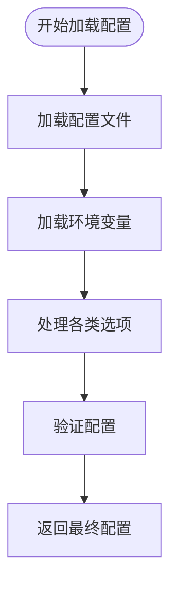
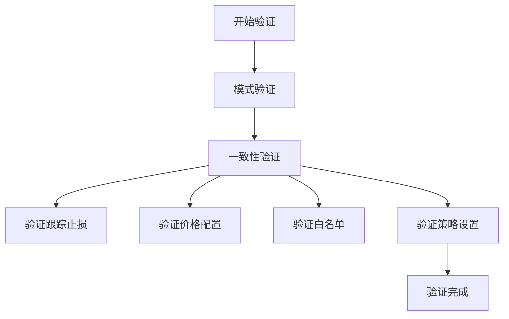

# 配置加载机制

<cite>
**本文档中引用的文件**  
- [configuration.py](file://freqtrade/configuration/configuration.py)
- [load_config.py](file://freqtrade/configuration/load_config.py)
- [config_validation.py](file://freqtrade/configuration/config_validation.py)
- [config_secrets.py](file://freqtrade/configuration/config_secrets.py)
- [environment_vars.py](file://freqtrade/configuration/environment_vars.py)
- [directory_operations.py](file://freqtrade/configuration/directory_operations.py)
- [worker.py](file://freqtrade/worker.py)
- [constants.py](file://freqtrade/constants.py)
</cite>

## 目录
1. [配置加载流程概述](#配置加载流程概述)  
2. [配置合并与优先级策略](#配置合并与优先级策略)  
3. [环境检测与默认值填充](#环境检测与默认值填充)  
4. [秘密信息管理](#秘密信息管理)  
5. [配置验证机制](#配置验证机制)  
6. [配置热重载流程](#配置热重载流程)  
7. [配置对象内存结构](#配置对象内存结构)

## 配置加载流程概述

`Configuration` 类在 `Worker._init()` 方法中被调用，负责整合命令行参数和配置文件生成最终的配置对象。该过程始于 `Worker` 类的初始化，其中 `Configuration` 实例通过传入的命令行参数 `args` 和运行模式 `runmode` 进行初始化。当调用 `get_config()` 方法时，若配置尚未加载，则触发 `load_config()` 方法执行完整的配置加载流程。

**Diagram sources**  
- [worker.py](file://freqtrade/worker.py#L50-L54)
- [configuration.py](file://freqtrade/configuration/configuration.py#L50-L100)

**Section sources**  
- [worker.py](file://freqtrade/worker.py#L50-L54)
- [configuration.py](file://freqtrade/configuration/configuration.py#L50-L100)

## 配置合并与优先级策略

配置加载采用多源合并策略，优先级从低到高依次为：默认配置、配置文件、环境变量、命令行参数。`load_from_files()` 函数递归加载所有指定的配置文件，使用 `deep_merge_dicts()` 实现后加载的配置覆盖先加载的同名参数。环境变量通过 `FREQTRADE__{section}__{key}` 格式解析为嵌套字典，并在 `load_config()` 中与文件配置合并。命令行参数则在 `_args_to_config()` 系列方法中逐个应用，具有最高优先级。

**Diagram sources**  
- [load_config.py](file://freqtrade/configuration/load_config.py#L79-L119)
- [configuration.py](file://freqtrade/configuration/configuration.py#L60-L65)
- [misc.py](file://freqtrade/misc.py#L97-L114)

**Section sources**  
- [load_config.py](file://freqtrade/configuration/load_config.py#L79-L119)
- [configuration.py](file://freqtrade/configuration/configuration.py#L60-L65)

## 环境检测与默认值填充

系统通过 `create_userdata_dir()` 和 `create_datadir()` 函数自动检测并创建必要的目录结构。若未指定 `user_data_dir`，则默认使用当前工作目录下的 `user_data` 文件夹。数据目录 `datadir` 基于交易所名称自动生成。对于数据库连接，干运行模式下默认使用内存数据库 `sqlite:///tradesv3.dryrun.sqlite`，实盘模式则使用 `sqlite:///tradesv3.sqlite`。这些默认值在 `_process_trading_options()` 和 `_process_datadir_options()` 方法中被设置。

**Section sources**  
- [directory_operations.py](file://freqtrade/configuration/directory_operations.py#L19-L89)
- [configuration.py](file://freqtrade/configuration/configuration.py#L180-L185)
- [constants.py](file://freqtrade/constants.py#L10-L11)

## 秘密信息管理

为保护敏感信息，系统通过 `_SENSITIVE_KEYS` 列表定义了需要脱敏的配置项，如 API 密钥、密码、Telegram 令牌等。`sanitize_config()` 函数在输出配置前将这些字段的值替换为 "REDACTED"。在干运行模式下，`remove_exchange_credentials()` 函数会清除交易所的认证信息，确保不会意外使用真实凭据。此机制在 `config_secrets.py` 中实现，保障了配置在日志和输出中的安全性。

**Section sources**  
- [config_secrets.py](file://freqtrade/configuration/config_secrets.py#L1-L67)

## 配置验证机制

配置验证分为两个阶段：模式验证和一致性验证。`validate_config_schema()` 根据运行模式（交易、回测、超参数优化等）选择相应的 JSON Schema 进行结构验证。`validate_config_consistency()` 则执行业务逻辑检查，例如验证止损设置、价格配置、白名单完整性等。该方法还会调用 `validate_migrated_strategy_settings()` 处理已弃用的配置项迁移。验证过程在 `load_config()` 的末尾执行，确保配置的完整性和正确性。

**Diagram sources**  
- [config_validation.py](file://freqtrade/configuration/config_validation.py#L45-L97)

**Section sources**  
- [config_validation.py](file://freqtrade/configuration/config_validation.py#L45-L97)

## 配置热重载流程

配置热重载通过 `Worker._reconfigure()` 方法实现。该方法首先调用 `freqtrade.cleanup()` 清理现有模块，然后以 `reconfig=True` 参数调用 `_init()` 重新初始化。在 `_init()` 中，由于 `reconfig` 为真，系统会重新执行 `Configuration(self._args, None).get_config()` 流程，重新加载所有配置文件、环境变量和命令行参数，并进行完整的验证。热重载完成后，系统会通过通知系统发送状态更新，确保新配置生效。

**Section sources**  
- [worker.py](file://freqtrade/worker.py#L220-L239)

## 配置对象内存结构

最终的配置对象是一个嵌套字典，其核心结构包含 `stake_currency`、`dry_run`、`exchange` 等顶级键。`exchange` 字典包含交易所名称、API 凭据和交易对白名单。配置还包含 `original_config` 键，保存了加载和处理前的原始配置副本。运行时动态添加的字段如 `runmode`、`verbosity` 和 `datadir` 也存在于最终配置中。该结构在内存中作为 `Config` 类型的字典存在，贯穿整个应用生命周期。

**Section sources**  
- [configuration.py](file://freqtrade/configuration/configuration.py#L110-L115)
- [constants.py](file://freqtrade/constants.py#L178-L188)