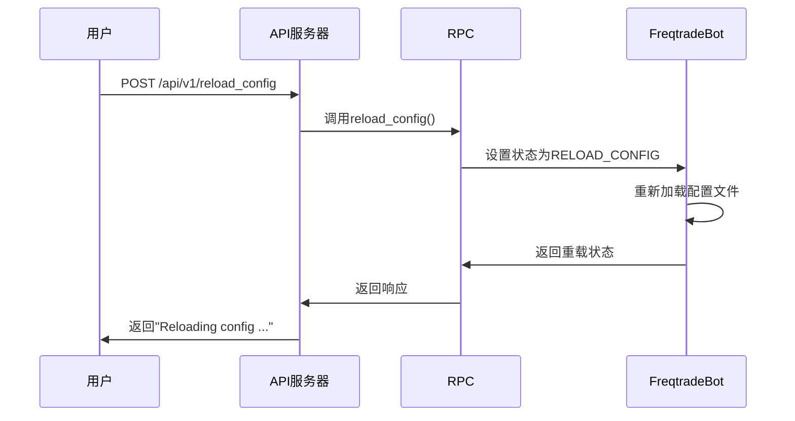
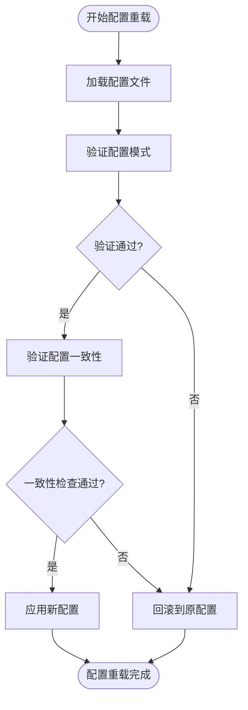
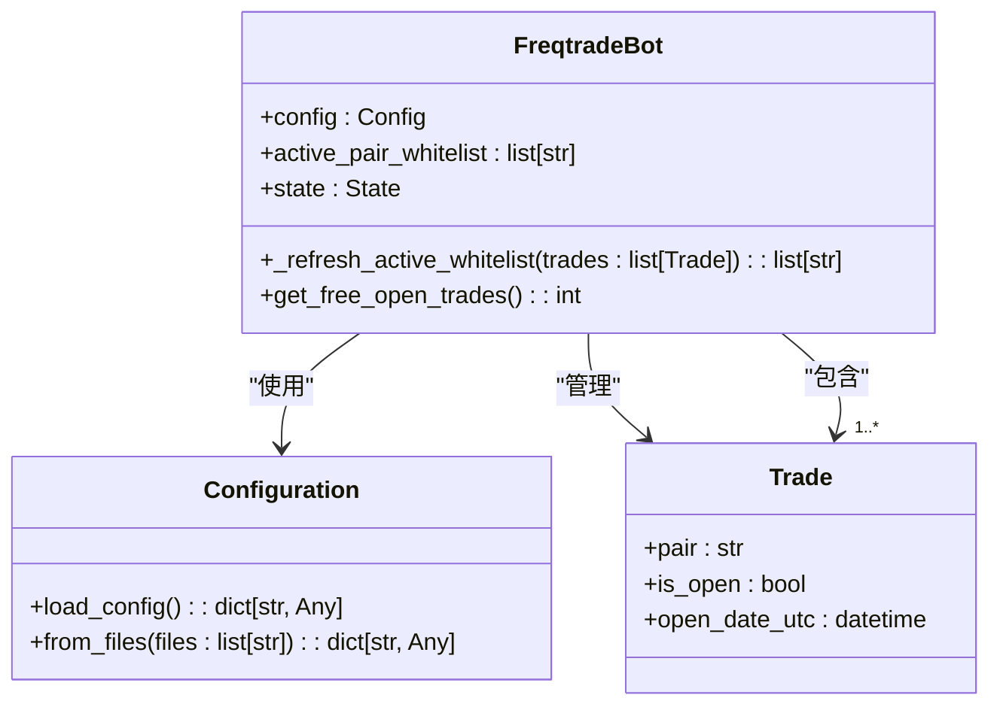
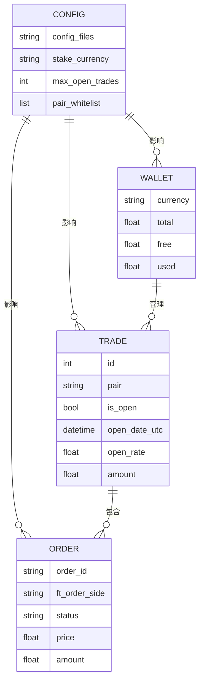
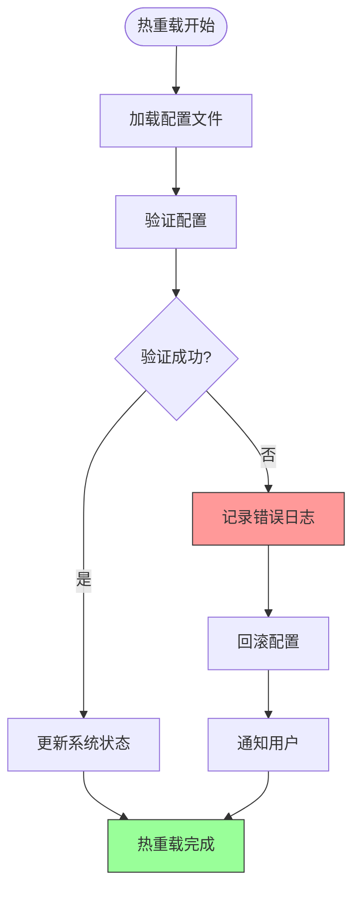

# 配置热重载机制

<cite>
**本文档引用的文件**   
- [api_v1.py](file://freqtrade/rpc/api_server/api_v1.py)
- [rpc.py](file://freqtrade/rpc/rpc.py)
- [freqtradebot.py](file://freqtrade/freqtradebot.py)
- [configuration.py](file://freqtrade/configuration/configuration.py)
- [load_config.py](file://freqtrade/configuration/load_config.py)
</cite>

## 目录
1. [配置热重载触发条件与执行流程](#配置热重载触发条件与执行流程)
2. [配置验证与回滚机制](#配置验证与回滚机制)
3. [关键参数变更的平滑过渡策略](#关键参数变更的平滑过渡策略)
4. [热重载对交易系统的影响](#热重载对交易系统的影响)
5. [错误恢复方案与日志记录](#错误恢复方案与日志记录)

## 配置热重载触发条件与执行流程

配置热重载功能允许在不重启交易机器人的情况下动态更新配置文件。该功能通过API调用触发，主要执行路径如下：

当用户通过API发送`reload_config`请求时，系统会将机器人的状态设置为`RELOAD_CONFIG`，从而触发配置重载流程。此过程由`RPC`类中的`_rpc_reload_config`方法处理，该方法会通知`FreqtradeBot`实例进行配置重载。

**Diagram sources**
- [api_v1.py](file://freqtrade/rpc/api_server/api_v1.py#L396-L397)
- [rpc.py](file://freqtrade/rpc/rpc.py#L1145-L1148)
- [freqtradebot.py](file://freqtrade/freqtradebot.py#L78-L187)

**Section sources**
- [api_v1.py](file://freqtrade/rpc/api_server/api_v1.py#L396-L397)
- [rpc.py](file://freqtrade/rpc/rpc.py#L1145-L1148)

## 配置验证与回滚机制

在热重载过程中，系统会对新配置进行严格的验证，以确保其完整性和一致性。配置验证主要通过`validate_config_schema`和`validate_config_consistency`函数实现。

如果配置验证失败，系统会自动回滚到之前的配置状态，确保交易机器人的稳定运行。这种机制防止了因配置错误导致的系统故障。

**Diagram sources**
- [configuration.py](file://freqtrade/configuration/configuration.py#L55-L68)
- [config_validation.py](file://freqtrade/configuration/config_validation.py#L25-L422)

**Section sources**
- [configuration.py](file://freqtrade/configuration/configuration.py#L55-L68)
- [config_validation.py](file://freqtrade/configuration/config_validation.py#L25-L422)

## 关键参数变更的平滑过渡策略

对于交易对列表、最大开仓数等关键参数的变更，系统采用平滑过渡策略，确保正在运行的交易策略不受影响。

当交易对列表发生变化时，系统会保留已开仓交易的交易对，同时根据新的白名单添加新的交易机会。对于最大开仓数的变更，系统会立即生效，但不会影响已开仓的交易。

这种设计确保了关键参数变更的平滑过渡，避免了因配置变更导致的交易中断或异常。

**Diagram sources**
- [freqtradebot.py](file://freqtrade/freqtradebot.py#L78-L187)
- [configuration.py](file://freqtrade/configuration/configuration.py#L33-L546)

**Section sources**
- [freqtradebot.py](file://freqtrade/freqtradebot.py#L327-L346)
- [freqtradebot.py](file://freqtrade/freqtradebot.py#L348-L354)

## 热重载对交易系统的影响

配置热重载对正在运行的交易策略、订单状态和资金管理有特定的影响机制。系统设计确保了热重载过程中的交易安全性和数据一致性。

对于正在运行的交易策略，热重载不会中断其执行。策略实例保持不变，但会使用新的配置参数进行后续的交易决策。订单状态管理通过数据库持久化，确保热重载后订单状态的完整性。

资金管理方面，热重载会重新初始化钱包对象，但会保留当前的资金状态。这种设计确保了资金数据的准确性和一致性。

**Diagram sources**
- [freqtradebot.py](file://freqtrade/freqtradebot.py#L90-L90)
- [freqtradebot.py](file://freqtrade/freqtradebot.py#L108-L108)
- [freqtradebot.py](file://freqtrade/freqtradebot.py#L95-L97)

**Section sources**
- [freqtradebot.py](file://freqtrade/freqtradebot.py#L90-L90)
- [freqtradebot.py](file://freqtrade/freqtradebot.py#L108-L108)

## 错误恢复方案与日志记录

系统提供了完善的错误恢复方案和日志记录机制，确保配置热重载过程的可追溯性和可靠性。

当热重载失败时，系统会自动回滚到之前的配置状态，并记录详细的错误信息。日志记录遵循严格的规范，包括时间戳、日志级别和详细的上下文信息。

日志记录包括配置文件加载、验证过程、状态变更等关键步骤，为故障排查和系统审计提供了完整的数据支持。

**Diagram sources**
- [rpc.py](file://freqtrade/rpc/rpc.py#L1145-L1148)
- [configuration.py](file://freqtrade/configuration/configuration.py#L55-L68)

**Section sources**
- [rpc.py](file://freqtrade/rpc/rpc.py#L1145-L1148)
- [configuration.py](file://freqtrade/configuration/configuration.py#L55-L68)