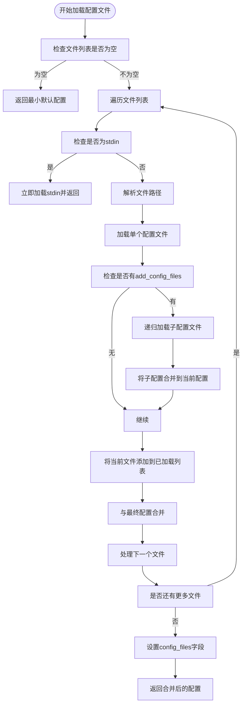
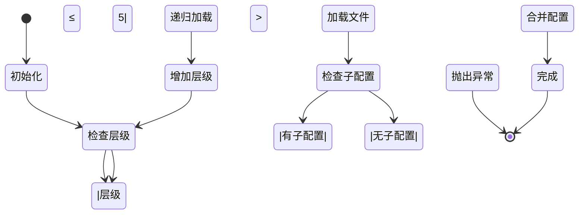
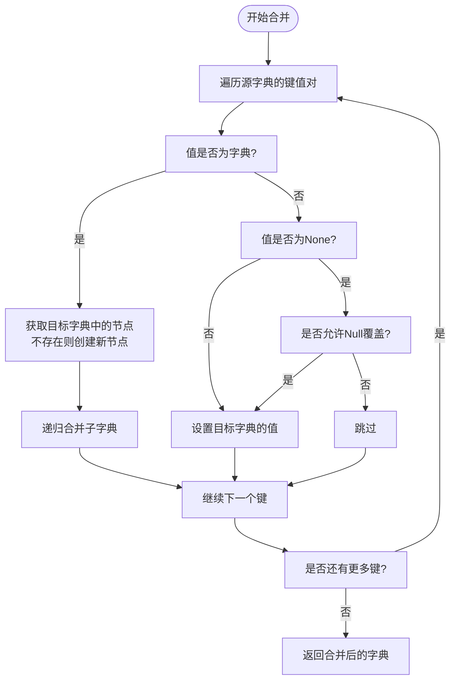

# 配置解析流程

<cite>
**本文档中引用的文件**  
- [load_config.py](file://freqtrade/configuration/load_config.py)
- [misc.py](file://freqtrade/misc.py)
- [configuration.py](file://freqtrade/configuration/configuration.py)
</cite>

## 目录
1. [简介](#简介)
2. [配置文件递归加载与合并机制](#配置文件递归加载与合并机制)
3. [JSON解析模式实现](#json解析模式实现)
4. [配置循环引用检测](#配置循环引用检测)
5. [从stdin读取配置](#从stdin读取配置)
6. [配置文件路径解析策略](#配置文件路径解析策略)
7. [配置合并与深度合并算法](#配置合并与深度合并算法)

## 简介
本文件详细分析Freqtrade系统中配置文件的加载、解析与合并机制。重点阐述`load_from_files`函数如何递归加载多个配置文件，解释参数覆盖规则、JSON解析特性、循环引用保护、stdin输入处理以及深度字典合并算法的实现细节。

## 配置文件递归加载与合并机制

`load_from_files`函数实现了递归加载多个配置文件的核心逻辑。该函数接收配置文件列表，按顺序加载并合并配置，后定义的参数优先覆盖先定义的参数。

配置文件加载遵循以下顺序规则：
1. 按参数中指定的文件顺序依次加载
2. 每个文件加载时，其内部通过`add_config_files`字段指定的子配置文件会递归加载
3. 子配置文件相对于父配置文件的目录进行解析
4. 所有配置最终合并为一个统一的配置对象

参数覆盖规则采用"后定义优先"原则，即后加载的配置值会覆盖先前加载的相同键的值。这种设计允许用户通过主配置文件设置默认值，然后通过特定环境配置文件覆盖特定参数。



**Diagram sources**
- [load_config.py](file://freqtrade/configuration/load_config.py#L79-L119)

**Section sources**
- [load_config.py](file://freqtrade/configuration/load_config.py#L79-L119)
- [configuration.py](file://freqtrade/configuration/configuration.py#L50-L60)

## JSON解析模式实现

系统使用`rapidjson`库进行JSON解析，并启用了特殊解析模式以支持更灵活的配置文件格式。通过`CONFIG_PARSE_MODE`常量定义了解析选项：

```python
CONFIG_PARSE_MODE = rapidjson.PM_COMMENTS | rapidjson.PM_TRAILING_COMMAS
```

该配置实现了以下两个重要功能：

1. **注释支持**：允许在JSON配置文件中使用C/C++风格的注释（`//`单行注释和`/* */`多行注释）
2. **尾随逗号支持**：允许在对象和数组的最后一个元素后添加逗号，提高配置文件的可维护性

这些扩展功能使得配置文件更易于编写和维护，开发者可以在配置中添加说明性注释，同时避免因删除最后一个元素而忘记移除逗号的常见错误。

当解析失败时，系统会捕获`JSONDecodeError`异常，并通过`log_config_error_range`函数提取错误位置附近的代码片段，帮助用户快速定位和修复配置文件中的语法错误。

**Section sources**
- [load_config.py](file://freqtrade/configuration/load_config.py#L12-L15)
- [load_config.py](file://freqtrade/configuration/load_config.py#L53-L76)

## 配置循环引用检测

为防止配置文件出现无限递归加载导致的系统崩溃，系统实现了循环引用检测机制。该机制通过递归层级计数器实现：



**Diagram sources**
- [load_config.py](file://freqtrade/configuration/load_config.py#L79-L119)

**Section sources**
- [load_config.py](file://freqtrade/configuration/load_config.py#L82-L84)

具体实现细节：
- 使用`level`参数跟踪当前递归层级，初始值为0
- 每次递归调用`load_from_files`时，层级递增1
- 当层级超过5时，抛出`ConfigurationError`异常，提示"Config loop detected"
- 最大层级限制为5，这是一个合理的平衡点，既允许足够的配置模块化，又防止无限递归

此保护机制确保了系统的稳定性，即使用户意外创建了循环引用的配置文件（如A引用B，B又引用A），系统也能安全地终止加载过程并给出明确错误提示。

## 从stdin读取配置

系统支持从标准输入（stdin）读取配置，为管道操作和动态配置生成提供了便利。当文件名参数为"-"时，系统会立即从stdin读取配置并返回，不再处理其他文件。

```mermaid
flowchart LR
A[文件名] --> B{是否为"-"}
B --> |是| C[从stdin读取配置]
B --> |否| D[从文件读取配置]
C --> E[返回配置]
D --> F[继续处理]
```

**Diagram sources**
- [load_config.py](file://freqtrade/configuration/load_config.py#L79-L119)

**Section sources**
- [load_config.py](file://freqtrade/configuration/load_config.py#L90-L92)
- [load_config.py](file://freqtrade/configuration/load_config.py#L53-L76)

这一特性允许用户通过管道将其他程序生成的配置传递给Freqtrade，例如：
```bash
generate_config.py | freqtrade --config -
```

从stdin读取配置时，系统同样使用`rapidjson`进行解析，并应用相同的注释和尾随逗号支持。这种方式为自动化部署、CI/CD集成和动态配置管理提供了强大的支持。

## 配置文件路径解析策略

系统采用灵活的路径解析策略，支持绝对路径、相对路径和基于基础路径的解析。路径解析遵循以下规则：

1. **基础路径机制**：通过`base_path`参数指定基础目录，所有相对路径都相对于此目录解析
2. **父目录继承**：子配置文件的基础路径为其父配置文件所在目录，实现层级化的路径解析
3. **路径合并**：使用`Path`对象的运算符重载实现路径拼接

当处理`add_config_files`中指定的子配置文件时，系统会：
1. 获取父配置文件的完整路径
2. 提取其父目录作为基础路径
3. 将子配置文件路径与基础路径合并

这种设计使得配置文件可以组织成模块化的结构，每个模块可以包含自己的配置文件，而无需关心它们在文件系统中的实际位置。

**Section sources**
- [load_config.py](file://freqtrade/configuration/load_config.py#L94-L98)

## 配置合并与深度合并算法

配置合并的核心是`deep_merge_dicts`函数，它实现了深度字典合并算法，能够递归地合并嵌套的字典结构。



**Diagram sources**
- [misc.py](file://freqtrade/misc.py#L97-L114)

**Section sources**
- [misc.py](file://freqtrade/misc.py#L97-L114)
- [load_config.py](file://freqtrade/configuration/load_config.py#L113-L115)

深度合并算法的关键特性：

1. **递归合并**：当遇到嵌套字典时，算法会递归地合并子字典，而不是简单地替换整个子字典
2. **Null值处理**：通过`allow_null_overrides`参数控制是否允许`None`值覆盖现有值
3. **原地修改**：目标字典被直接修改，提高性能并减少内存占用
4. **键存在性检查**：只处理源字典中存在的键，保留目标字典中独有的键

算法实现采用递归方式，对源字典的每个键值对进行处理：
- 如果值是字典，则递归合并到目标字典的对应节点
- 如果值不是`None`或允许`Null`覆盖，则直接赋值到目标字典

这种深度合并策略确保了配置的精细控制，允许用户只覆盖需要修改的特定参数，而保留其他所有配置不变。