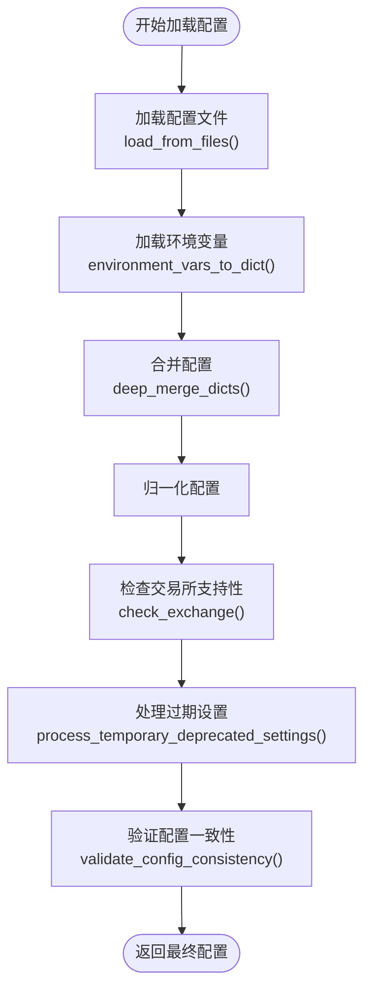
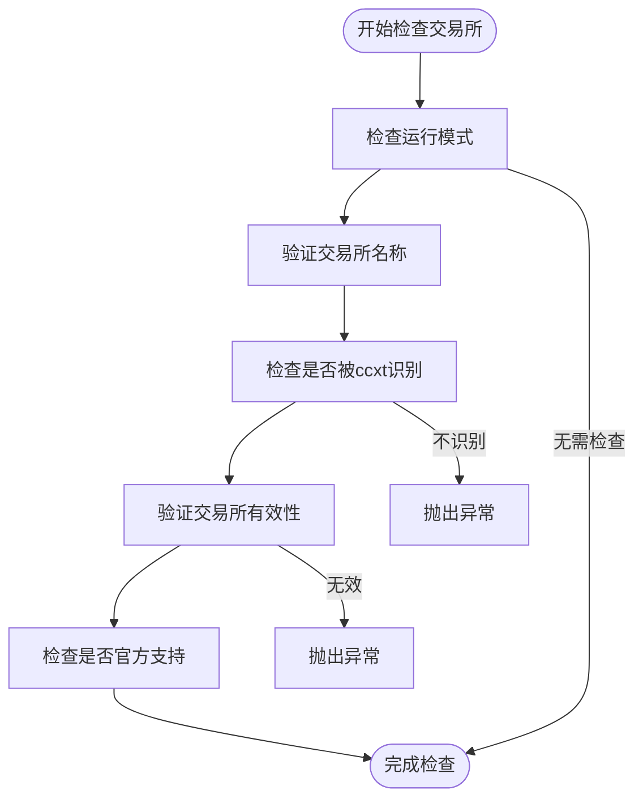

# 配置验证与合并

<cite>
**Referenced Files in This Document**   
- [configuration.py](file://freqtrade/configuration/configuration.py)
- [load_config.py](file://freqtrade/configuration/load_config.py)
- [config_validation.py](file://freqtrade/configuration/config_validation.py)
- [check_exchange.py](file://freqtrade/exchange/check_exchange.py)
- [deprecated_settings.py](file://freqtrade/configuration/deprecated_settings.py)
- [constants.py](file://freqtrade/constants.py)
</cite>

## 目录
1. [配置加载与合并流程](#配置加载与合并流程)
2. [配置验证流程](#配置验证流程)
3. [环境变量与配置文件合并策略](#环境变量与配置文件合并策略)
4. [关键参数默认值填充机制](#关键参数默认值填充机制)
5. [配置对象归一化过程](#配置对象归一化过程)
6. [配置冲突解决与错误提示](#配置冲突解决与错误提示)

## 配置加载与合并流程

配置加载流程始于 `Configuration` 类的 `load_config` 方法，该方法负责从多个来源加载和合并配置数据。首先，系统通过 `load_from_files` 函数加载指定的配置文件，这些文件按顺序加载，后加载的文件中的参数会覆盖先前文件中的同名参数（后定义优先原则）。



**Diagram sources**
- [configuration.py](file://freqtrade/configuration/configuration.py#L70-L120)
- [load_config.py](file://freqtrade/configuration/load_config.py#L79-L119)

**Section sources**
- [configuration.py](file://freqtrade/configuration/configuration.py#L70-L120)
- [load_config.py](file://freqtrade/configuration/load_config.py#L79-L119)

## 配置验证流程

配置验证流程包含多个关键检查点，确保配置的完整性和正确性。核心验证步骤包括交易所支持性检查、过期设置处理和运行模式兼容性验证。

### 交易所支持性检查

`check_exchange` 函数负责验证配置中指定的交易所是否被 Freqtrade 支持。该函数首先检查交易所名称是否被 ccxt 库识别，然后验证交易所是否在已知的"不良"交易所列表中。如果交易所不被支持，函数会抛出 `OperationalException` 异常。



**Diagram sources**
- [check_exchange.py](file://freqtrade/exchange/check_exchange.py#L12-L71)

**Section sources**
- [check_exchange.py](file://freqtrade/exchange/check_exchange.py#L12-L71)

### 过期设置处理

`process_temporary_deprecated_settings` 函数处理配置中的过期和已移除的设置。该函数会检测并处理各种已弃用的配置项，如 `forcebuy_enable` 已重命名为 `force_entry_enable`。对于已移除的设置，函数会抛出 `ConfigurationError` 异常。

**Section sources**
- [deprecated_settings.py](file://freqtrade/configuration/deprecated_settings.py#L78-L170)

### 运行模式兼容性验证

系统会根据不同的运行模式（如回测、超优化、实盘交易等）验证配置的兼容性。例如，在回测模式下，系统会检查是否提供了时间范围参数，而在超优化模式下，会验证超优化参数的正确性。

## 环境变量与配置文件合并策略

环境变量与配置文件的合并策略通过 `deep_merge_dicts` 函数实现。该函数采用深度合并算法，将源字典中的值合并到目标字典中，源字典中的值会覆盖目标字典中的同名值。

```python
def deep_merge_dicts(source, destination, allow_null_overrides: bool = True):
    """
    源字典中的值覆盖目标字典，返回并修改目标字典
    """
    for key, value in source.items():
        if isinstance(value, dict):
            node = destination.setdefault(key, {})
            deep_merge_dicts(value, node, allow_null_overrides)
        elif value is not None or allow_null_overrides:
            destination[key] = value
    return destination
```

环境变量的优先级高于配置文件，这意味着通过环境变量设置的配置项会覆盖配置文件中的相应设置。这种设计允许用户在不修改配置文件的情况下，通过环境变量快速调整配置。

**Section sources**
- [misc.py](file://freqtrade/misc.py#L97-L114)
- [configuration.py](file://freqtrade/configuration/configuration.py#L80-L85)

## 关键参数默认值填充机制

系统为多个关键参数提供了智能的默认值填充机制，确保配置的完整性和可用性。

### 日志级别

日志级别默认为0（INFO级别），可以通过命令行参数 `-v` 或 `--verbosity` 覆盖。系统使用 `safe_value_fallback` 函数来安全地获取日志级别值。

### 数据库URL

数据库URL根据运行模式自动设置：
- 实盘交易模式：默认使用 `sqlite:///tradesv3.sqlite`
- 模拟交易模式：默认使用 `sqlite:///tradesv3.dryrun.sqlite`

如果用户未指定数据库URL，系统会根据运行模式自动选择合适的默认值。

### 其他关键参数

- **用户数据目录**：默认为当前工作目录下的 `user_data` 文件夹
- **数据目录**：基于用户数据目录创建
- **最大同时交易数**：如果设置为-1或无穷大，表示无限制
- **交易金额**：如果设置为"unlimited"，表示使用无限金额

**Section sources**
- [constants.py](file://freqtrade/constants.py#L22-L228)
- [configuration.py](file://freqtrade/configuration/configuration.py#L144-L158)

## 配置对象归一化过程

配置对象归一化过程确保配置对象的结构完整和一致性。

### 'internals'字段初始化

如果配置中不存在 `internals` 字段，系统会自动创建一个空字典。`internals` 字段用于存储内部状态和配置，如 `sd_notify`（支持systemd通知）。

### 原始配置副本保存

系统会创建原始配置的深拷贝并保存在 `original_config` 字段中。这一机制允许系统在需要时访问未修改的原始配置，对于调试和审计非常有用。

### 配置结构验证

系统使用 JSON Schema 验证配置结构的正确性。不同的运行模式对应不同的验证模式：
- 交易模式：使用 `SCHEMA_TRADE_REQUIRED`
- 回测模式：使用 `SCHEMA_BACKTEST_REQUIRED`
- Web服务器模式：使用 `SCHEMA_MINIMAL_WEBSERVER`

**Section sources**
- [configuration.py](file://freqtrade/configuration/configuration.py#L90-L95)
- [config_validation.py](file://freqtrade/configuration/config_validation.py#L30-L70)

## 配置冲突解决与错误提示

系统实现了完善的配置冲突解决和错误提示机制，帮助用户快速识别和修复配置问题。

### 冲突解决策略

当检测到新旧配置项同时存在时，系统会抛出 `OperationalException` 异常，提示用户删除已弃用的配置项。例如，当同时存在 `use_sell_signal` 和 `use_exit_signal` 时，系统会提示用户使用新的 `use_exit_signal` 配置项。

### 错误提示机制

系统提供详细的错误提示信息，包括：
- **配置语法错误**：显示错误位置附近的配置片段，帮助用户定位问题
- **逻辑错误**：提供清晰的错误描述和修复建议
- **弃用警告**：提示用户配置项已弃用，并建议使用新的配置项

对于严重的配置错误，系统会终止执行并显示详细的错误信息，防止使用错误配置导致意外行为。

**Section sources**
- [deprecated_settings.py](file://freqtrade/configuration/deprecated_settings.py#L34-L75)
- [load_config.py](file://freqtrade/configuration/load_config.py#L44-L76)
- [config_validation.py](file://freqtrade/configuration/config_validation.py#L72-L97)