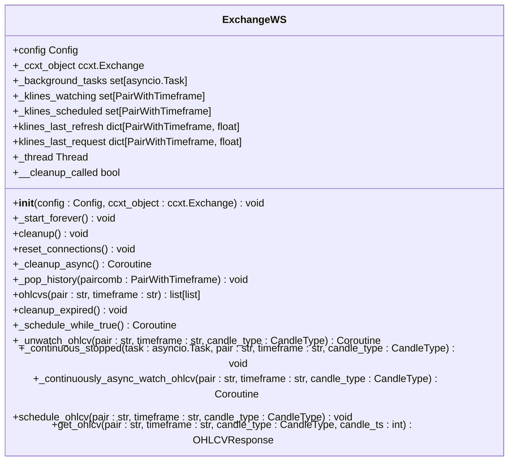
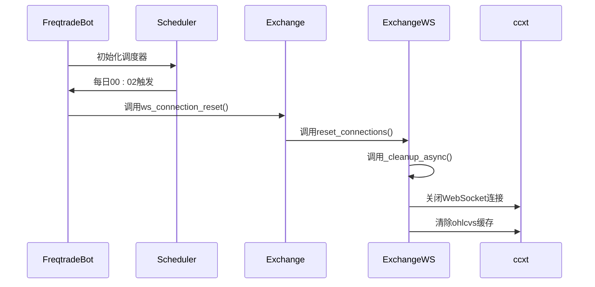
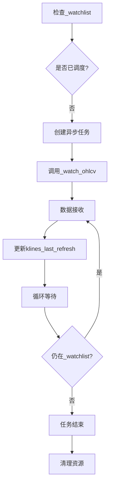

# WebSocket连接管理

<cite>
**Referenced Files in This Document**   
- [exchange_ws.py](file://freqtrade/exchange/exchange_ws.py)
- [exchange.py](file://freqtrade/exchange/exchange.py)
- [freqtradebot.py](file://freqtrade/freqtradebot.py)
</cite>

## 目录
1. [引言](#引言)
2. [WebSocket连接老化问题](#websocket连接老化问题)
3. [连接重置机制设计](#连接重置机制设计)
4. [定时任务调度](#定时任务调度)
5. [K线数据订阅与更新](#k线数据订阅与更新)
6. [异常恢复与监控](#异常恢复与监控)
7. [最佳实践](#最佳实践)
8. [结论](#结论)

## 引言

在高频交易场景中，WebSocket长连接是获取实时市场数据的关键通道。然而，长时间运行的连接会面临连接老化、心跳超时和数据漂移等问题。本文档深入分析`exchange.ws_connection_reset`定时任务（每日00:02执行）的设计原理与必要性，结合`exchange_ws.py`中的`_schedule_while_true`方法，说明如何通过定期重置连接来保障市场数据流的实时性与完整性。

## WebSocket连接老化问题

在高频交易系统中，WebSocket长连接面临着多种挑战：

**连接老化**：长时间运行的TCP连接可能因网络设备（如防火墙、NAT）的超时机制而被中断。许多网络基础设施对空闲连接的超时时间设置为数小时，超过此时间后连接会被强制关闭。

**心跳超时**：虽然WebSocket协议支持心跳机制，但某些交易所的实现可能存在缺陷，导致心跳包未能正确发送或响应。这会导致连接在客户端无感知的情况下断开。

**数据漂移**：长时间运行的连接可能出现数据同步问题，如K线数据缺失、重复或顺序错乱。这在高波动性市场中尤为危险，可能导致交易决策基于错误的市场信息。

这些问题的累积效应可能导致交易系统无法及时获取关键市场数据，从而影响交易策略的执行效果。

## 连接重置机制设计

### ExchangeWS类设计

`ExchangeWS`类是WebSocket连接管理的核心组件，负责维护与交易所的WebSocket连接，并处理市场数据的订阅与接收。

**Diagram sources**
- [exchange_ws.py](file://freqtrade/exchange/exchange_ws.py#L21-L226)

**Section sources**
- [exchange_ws.py](file://freqtrade/exchange/exchange_ws.py#L21-L226)

### 连接重置流程

`reset_connections`方法是连接重置机制的核心，其工作流程如下：

1. **异步清理**：通过`asyncio.run_coroutine_threadsafe`在事件循环中安全地调用`_cleanup_async`协程。
2. **关闭连接**：`_cleanup_async`协程调用`ccxt_object.close()`关闭所有WebSocket连接。
3. **清除缓存**：清除`ccxt_object.ohlcvs`缓存，避免使用陈旧数据。
4. **状态同步**：设置`__cleanup_called`标志，确保清理过程的原子性。

该机制通过完全重建连接和清除缓存，从根本上解决了连接老化和数据漂移问题。

## 定时任务调度

### 定时任务配置

`exchange.ws_connection_reset`定时任务由`freqtradebot.py`中的调度器配置，每日00:02执行。

**Diagram sources**
- [freqtradebot.py](file://freqtrade/freqtradebot.py#L173)
- [exchange.py](file://freqtrade/exchange/exchange.py#L644)
- [exchange_ws.py](file://freqtrade/exchange/exchange_ws.py#L59)

**Section sources**
- [freqtradebot.py](file://freqtrade/freqtradebot.py#L173)
- [exchange.py](file://freqtrade/exchange/exchange.py#L644)
- [exchange_ws.py](file://freqtrade/exchange/exchange_ws.py#L59)

### 调度时机选择

选择每日00:02执行重置任务具有以下优势：

- **市场低谷期**：此时全球主要交易所的交易量相对较低，重置连接对交易策略的影响最小。
- **避免开盘冲击**：避开各大交易所的开盘时间，防止在市场剧烈波动时进行连接操作。
- **规律性**：固定时间执行便于监控和故障排查。

## K线数据订阅与更新

### 数据订阅机制

`_schedule_while_true`方法负责管理K线数据的订阅，其核心逻辑如下：

**Diagram sources**
- [exchange_ws.py](file://freqtrade/exchange/exchange_ws.py#L121-L139)

**Section sources**
- [exchange_ws.py](file://freqtrade/exchange/exchange_ws.py#L121-L139)

### 增量更新处理

当连接重置后，系统会重新订阅所有活跃的交易对，确保K线数据的连续性。`get_ohlcv`方法在返回数据前会进行完整性检查：

- **时间戳验证**：检查接收到的K线时间戳是否大于最后刷新时间，若存在异常则发出警告。
- **数据完整性**：通过`drop_hint`标志指示数据是否可能不完整，供上层逻辑处理。

## 异常恢复与监控

### 异常处理策略

系统实现了多层次的异常处理机制：

- **连接异常**：捕获`ccxt.BaseError`等异常，记录日志但不中断主流程。
- **清理异常**：`_cleanup_async`中的异常被捕获并记录，确保重置过程的鲁棒性。
- **数据异常**：`ohlcvs`方法使用`@retrier`装饰器，对`RuntimeError`进行重试。

### 连接状态监控

建议实施以下监控措施：

- **日志监控**：监控`Resetting WS connections`和`Exception in _cleanup_async`等关键日志。
- **连接状态**：定期检查`_klines_watching`和`_klines_scheduled`集合的大小，确保订阅正常。
- **数据延迟**：监控`klines_last_refresh`时间戳，确保数据更新频率符合预期。

## 最佳实践

### 连接管理

- **定期重置**：遵循每日重置的实践，避免连接老化问题。
- **优雅关闭**：确保在程序退出时调用`cleanup`方法，正确释放资源。
- **错误重试**：对网络相关的操作实施适当的重试策略。

### 性能优化

- **批量订阅**：尽量减少频繁的单个交易对订阅/取消操作。
- **资源清理**：定期调用`cleanup_expired`清理过期的订阅，避免资源浪费。
- **并发控制**：合理设置`_background_tasks`的并发数，避免对交易所造成过大压力。

## 结论

`exchange.ws_connection_reset`定时任务是保障高频交易系统稳定性的关键机制。通过每日定期重置WebSocket连接，系统能够有效避免连接老化、心跳超时和数据漂移等问题，确保市场数据流的实时性与完整性。结合`_schedule_while_true`方法的智能订阅管理，该机制为K线数据的可靠获取提供了坚实基础。建议在实际部署中结合连接状态监控，形成完整的连接管理闭环。