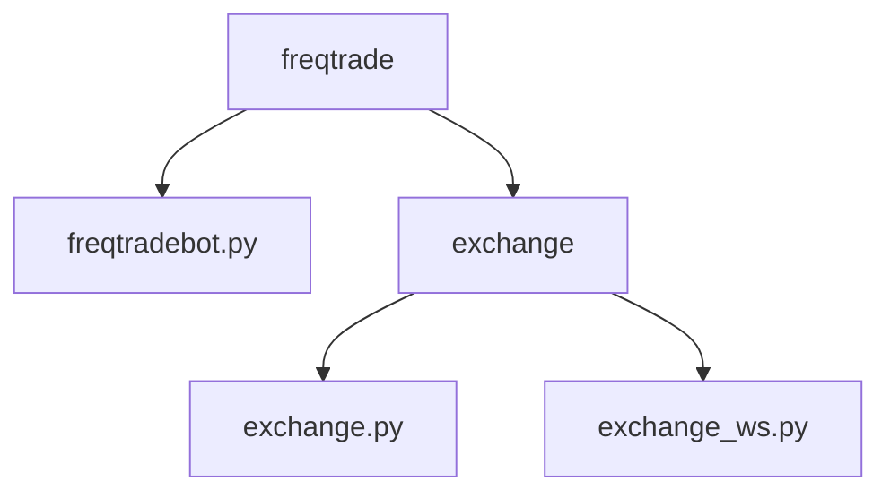
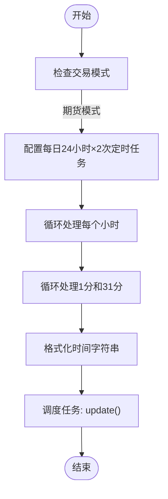
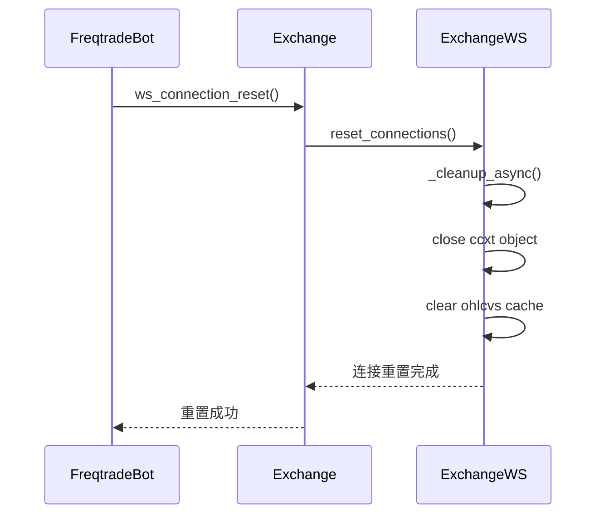
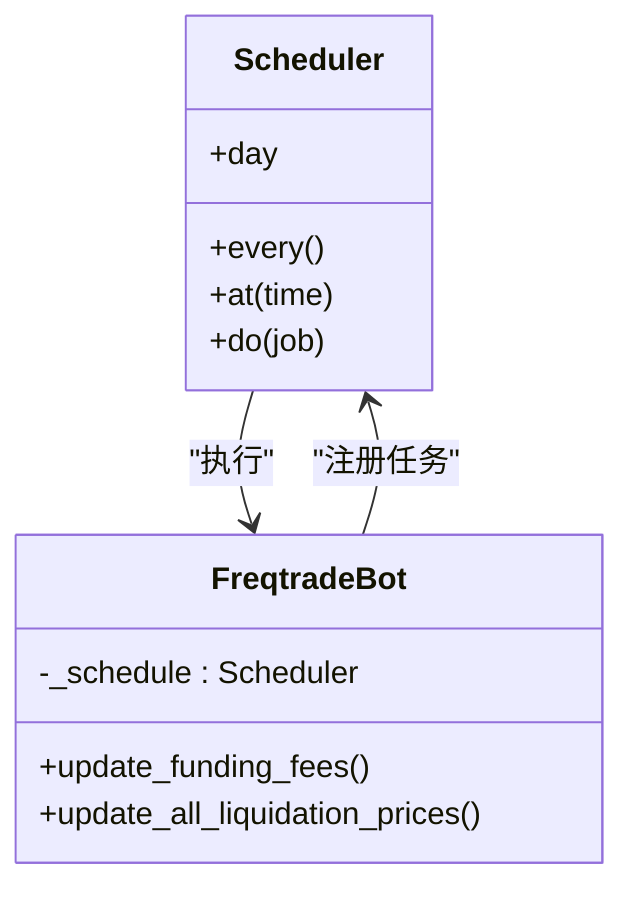
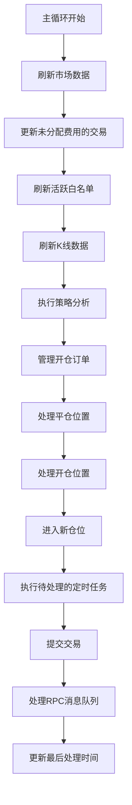
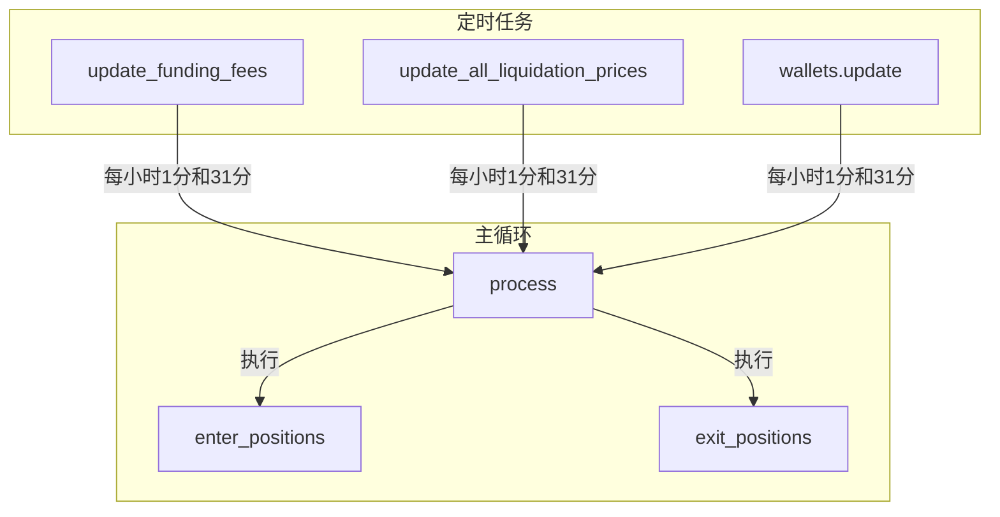

# 异步任务调度

<cite>
**本文档中引用的文件**   
- [freqtradebot.py](file://freqtrade/freqtradebot.py)
- [exchange.py](file://freqtrade/exchange/exchange.py)
- [exchange_ws.py](file://freqtrade/exchange/exchange_ws.py)
</cite>

## 目录
1. [项目结构](#项目结构)
2. [核心组件](#核心组件)
3. [定时任务配置逻辑](#定时任务配置逻辑)
4. [WebSocket连接重置机制](#websocket连接重置机制)
5. [Scheduler语法使用模式](#scheduler语法使用模式)
6. [任务执行集成时机](#任务执行集成时机)
7. [时间协调与业务意义](#时间协调与业务意义)

## 项目结构

**Diagram sources**
- [freqtradebot.py](file://freqtrade/freqtradebot.py)
- [exchange.py](file://freqtrade/exchange/exchange.py)
- [exchange_ws.py](file://freqtrade/exchange/exchange_ws.py)

**Section sources**
- [freqtradebot.py](file://freqtrade/freqtradebot.py)
- [exchange.py](file://freqtrade/exchange/exchange.py)
- [exchange_ws.py](file://freqtrade/exchange/exchange_ws.py)

## 核心组件

异步任务调度系统基于schedule库实现，主要包含三个核心组件：FreqtradeBot、Exchange和ExchangeWS。这些组件协同工作，确保期货模式下的资金费更新和强平价计算能够按时执行。

**Section sources**
- [freqtradebot.py](file://freqtrade/freqtradebot.py#L366-L377)
- [exchange.py](file://freqtrade/exchange/exchange.py#L644-L649)
- [exchange_ws.py](file://freqtrade/exchange/exchange_ws.py#L43-L79)

## 定时任务配置逻辑

_funding_fee_times定时任务的配置逻辑实现在FreqtradeBot类中。当交易模式为期货时，系统会为每天24小时的每个小时的1分和31分创建定时任务。这种设计确保了资金费用的更新频率足够高，以准确反映市场变化。

**Diagram sources**
- [freqtradebot.py](file://freqtrade/freqtradebot.py#L366-L377)

**Section sources**
- [freqtradebot.py](file://freqtrade/freqtradebot.py#L366-L377)

## WebSocket连接重置机制

exchange.ws_connection_reset每日00:02重置的必要性在于避免长时间运行后出现的"connection-reset"错误。该机制通过reset_connections方法实现，能够有效解决大约9天后可能出现的连接重置问题，确保WebSocket连接的稳定性和可靠性。

**Diagram sources**
- [exchange.py](file://freqtrade/exchange/exchange.py#L644-L649)
- [exchange_ws.py](file://freqtrade/exchange/exchange_ws.py#L43-L79)

**Section sources**
- [exchange.py](file://freqtrade/exchange/exchange.py#L644-L649)
- [exchange_ws.py](file://freqtrade/exchange/exchange_ws.py#L43-L79)

## Scheduler语法使用模式

Scheduler().every().day.at()语法的使用模式遵循链式调用原则。系统首先调用every().day表示每日执行，然后通过at()方法指定具体执行时间。这种方法提供了清晰的时间调度接口，使得定时任务的配置更加直观和易于维护。

**Diagram sources**
- [freqtradebot.py](file://freqtrade/freqtradebot.py#L366-L377)

**Section sources**
- [freqtradebot.py](file://freqtrade/freqtradebot.py#L366-L377)

## 任务执行集成时机

任务执行(run_pending)的集成时机位于主循环的process方法中。在处理完开仓和平仓逻辑后，系统会调用_schedule.run_pending()来执行所有待处理的定时任务。这种设计确保了定时任务不会干扰主交易逻辑的执行，同时又能保证任务的及时性。

**Diagram sources**
- [freqtradebot.py](file://freqtrade/freqtradebot.py#L366-L377)

**Section sources**
- [freqtradebot.py](file://freqtrade/freqtradebot.py#L366-L377)

## 时间协调与业务意义

定时任务与主循环的时间协调是确保系统稳定运行的关键。在期货模式下，资金费更新(update_funding_fees)和强平价计算(update_all_liquidation_prices)具有重要的业务意义。资金费更新确保了持仓成本的准确性，而强平价计算则帮助系统及时识别潜在的风险，从而采取相应的风险管理措施。

**Diagram sources**
- [freqtradebot.py](file://freqtrade/freqtradebot.py#L366-L377)

**Section sources**
- [freqtradebot.py](file://freqtrade/freqtradebot.py#L366-L377)