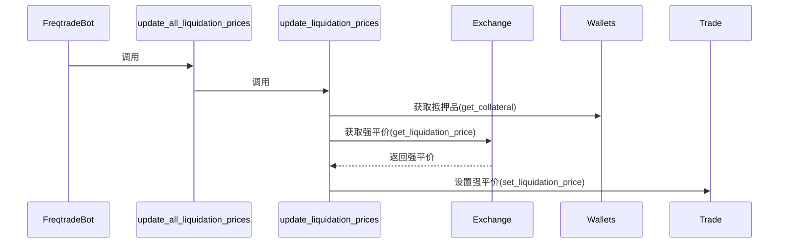
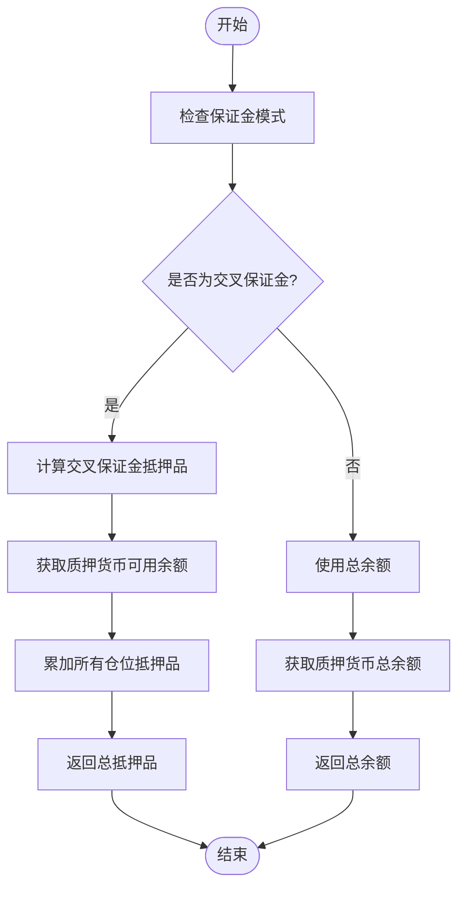
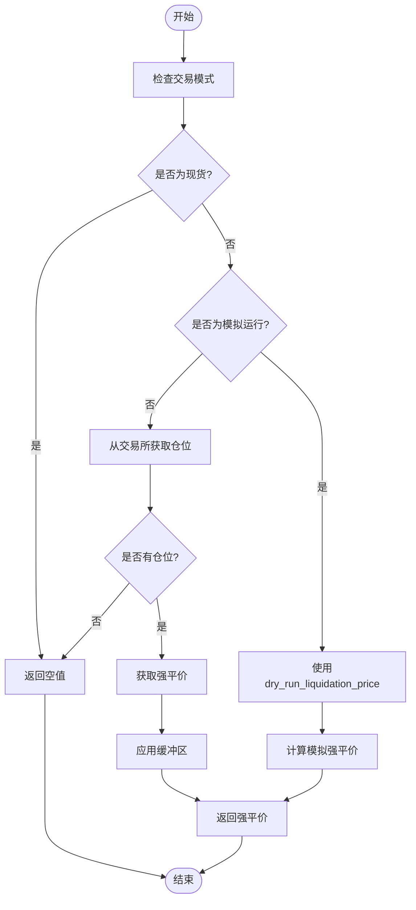

# 强平价计算逻辑

<cite>
**本文档中引用的文件**  
- [freqtradebot.py](file://freqtrade/freqtradebot.py)
- [liquidation_price.py](file://freqtrade/leverage/liquidation_price.py)
- [exchange.py](file://freqtrade/exchange/exchange.py)
- [wallets.py](file://freqtrade/wallets.py)
</cite>

## 目录
1. [交叉保证金模式下的强平机制](#交叉保证金模式下的强平机制)
2. [强平价更新流程分析](#强平价更新流程分析)
3. [钱包余额与抵押品计算](#钱包余额与抵押品计算)
4. [强平价计算实现细节](#强平价计算实现细节)
5. [不同杠杆水平下的强平价示例](#不同杠杆水平下的强平价示例)
6. [风险控制与市场波动应对](#风险控制与市场波动应对)
7. [结论](#结论)

## 交叉保证金模式下的强平机制

在交叉保证金模式下，强平机制通过整合账户内所有可用资金作为整体抵押品来评估每个交易的强平风险。该机制利用账户净值、杠杆率、持仓数量和维持保证金等参数，实时计算每个仓位的强平价格，从而有效防止在市场剧烈波动时出现过度亏损。

当启用交叉保证金模式时，系统会将整个账户的余额视为一个共享的抵押资金池，用于支持所有未平仓头寸。这种设计提高了资金使用效率，但也要求更精确的风险评估，因为单个仓位的亏损可能影响到整个账户的安全性。

**Section sources**
- [freqtradebot.py](file://freqtrade/freqtradebot.py#L356-L364)
- [liquidation_price.py](file://freqtrade/leverage/liquidation_price.py#L12-L68)

## 强平价更新流程分析

强平价的更新流程由 `update_all_liquidation_prices` 函数触发，该函数位于 `freqtradebot.py` 文件中。此函数负责协调整个强平价计算过程，确保在期货交易模式且使用交叉保证金的情况下，所有开放交易的强平价格都能被及时更新。

**Diagram sources**
- [freqtradebot.py](file://freqtrade/freqtradebot.py#L356-L364)
- [liquidation_price.py](file://freqtrade/leverage/liquidation_price.py#L12-L68)

`update_all_liquidation_prices` 函数首先检查当前是否处于期货交易模式和交叉保证金模式，如果是，则调用 `update_liquidation_prices` 函数。后者接收交易所实例、钱包实例、质押货币和是否为模拟运行等参数，并根据这些信息进行强平价计算。

**Section sources**
- [freqtradebot.py](file://freqtrade/freqtradebot.py#L356-L364)
- [liquidation_price.py](file://freqtrade/leverage/liquidation_price.py#L12-L68)

## 钱包余额与抵押品计算

钱包余额的获取与更新策略是强平价计算的关键组成部分。`Wallets` 类负责管理账户余额和仓位信息，其 `get_collateral` 方法专门用于计算交叉保证金模式下的总抵押品。

**Diagram sources**
- [wallets.py](file://freqtrade/wallets.py#L75-L85)

在交叉保证金模式下，总抵押品等于质押货币的可用余额加上所有仓位的抵押品之和。这一计算方式确保了系统能够准确反映账户的实际风险敞口。对于模拟运行，系统会从配置中获取初始资金，并结合已实现利润和未平仓交易的质押金额来计算当前可用资金。

**Section sources**
- [wallets.py](file://freqtrade/wallets.py#L75-L85)
- [wallets.py](file://freqtrade/wallets.py#L211-L230)

## 强平价计算实现细节

强平价的计算主要在 `Exchange` 类的 `get_liquidation_price` 方法中实现。该方法首先验证交易模式是否为期货交易，然后根据是否为模拟运行或交易所是否支持获取仓位信息来决定计算方式。

**Diagram sources**
- [exchange.py](file://freqtrade/exchange/exchange.py#L3796-L3843)

对于模拟运行，系统调用 `dry_run_liquidation_price` 方法进行计算。该方法基于以下公式：
- 做空：强平价 = (开仓价 + 价值) / (1 + 维持保证金率 + taker费率)
- 做多：强平价 = (开仓价 - 价值) / (1 - 维持保证金率 - taker费率)

其中，价值 = 钱包余额 / 持仓数量。维持保证金率通过 `get_maintenance_ratio_and_amt` 方法获取，该方法根据交易金额查找对应的杠杆层级。

**Section sources**
- [exchange.py](file://freqtrade/exchange/exchange.py#L3796-L3843)
- [exchange.py](file://freqtrade/exchange/exchange.py#L3880-L3947)

## 不同杠杆水平下的强平价示例

不同杠杆水平对强平价有显著影响。高杠杆会降低强平价与开仓价之间的距离，增加被强平的风险。例如：

- **低杠杆（5倍）**：维持保证金率较低，强平价距离开仓价较远，风险相对较小。
- **中等杠杆（10倍）**：维持保证金率适中，强平价距离开仓价适中，需要密切关注市场波动。
- **高杠杆（25倍及以上）**：维持保证金率较高，强平价非常接近开仓价，极易被市场小幅波动触发强平。

在实际应用中，交易者应根据自身的风险承受能力和市场预期选择合适的杠杆水平。过高的杠杆虽然可能带来更高的收益，但同时也大大增加了亏损风险，特别是在市场剧烈波动时。

**Section sources**
- [exchange.py](file://freqtrade/exchange/exchange.py#L3880-L3947)

## 风险控制与市场波动应对

该强平机制在风险控制中发挥着关键作用，特别是在市场剧烈波动时。通过实时计算和更新强平价，系统能够提前预警潜在的强平风险，帮助交易者及时采取措施，如追加保证金或主动平仓，以避免不必要的损失。

此外，系统还引入了强平缓冲区（liquidation_buffer），通过对计算出的强平价进行微调，提供了一定的安全边际。这有助于防止因市场瞬时波动而导致的误强平，提高了系统的稳定性和可靠性。

**Section sources**
- [exchange.py](file://freqtrade/exchange/exchange.py#L3796-L3843)

## 结论

Freqtrade 的强平价计算机制通过 `update_all_liquidation_prices` 和 `update_liquidation_prices` 函数的协同工作，实现了对交叉保证金模式下所有交易的实时风险评估。该机制综合考虑了账户净值、杠杆率、持仓数量和维持保证金等多个因素，确保了计算结果的准确性和可靠性。

钱包余额的获取与更新策略为强平价计算提供了必要的数据支持，而交易所层面的 `get_liquidation_price` 实现则确保了计算过程的标准化和一致性。通过合理设置杠杆水平和利用强平缓冲区，交易者可以在追求收益的同时有效控制风险，实现稳健的交易策略。