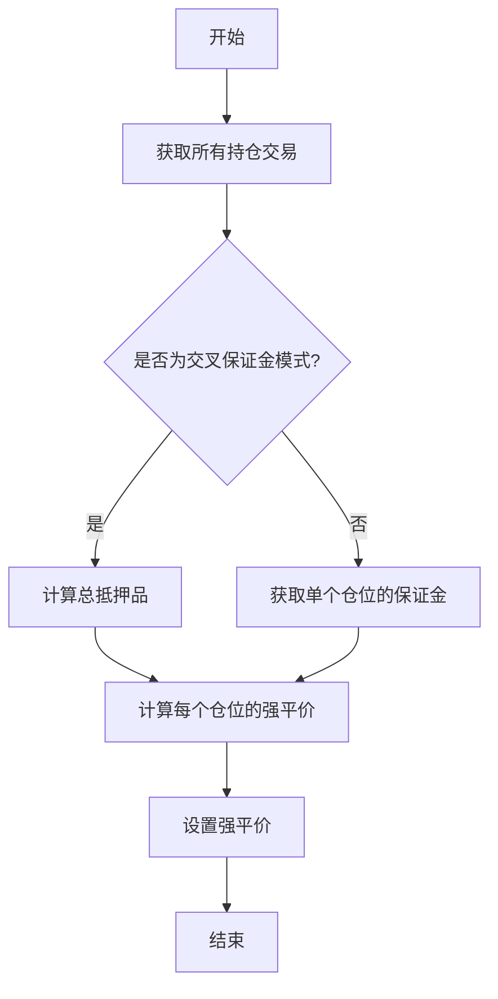

# 期货专用任务

<cite>
**本文档中引用的文件**   
- [interest.py](file://freqtrade/leverage/interest.py)
- [liquidation_price.py](file://freqtrade/leverage/liquidation_price.py)
- [exchange.py](file://freqtrade/exchange/exchange.py)
- [wallets.py](file://freqtrade/wallets.py)
- [trade_model.py](file://freqtrade/persistence/trade_model.py)
</cite>

## 目录
1. [引言](#引言)
2. [资金费率更新任务](#资金费率更新任务)
3. [强平价计算逻辑](#强平价计算逻辑)
4. [交叉保证金模式下的风险评估](#交叉保证金模式下的风险评估)
5. [任务协同与系统影响](#任务协同与系统影响)
6. [结论](#结论)

## 引言
本文档系统阐述了期货交易模式下的两个关键后台任务：`update_funding_fees` 和 `update_all_liquidation_prices`。详细解释了资金费率（Funding Fees）对持仓成本的动态影响及高频更新的必要性。深入剖析了强平价计算逻辑，包括交叉保证金模式下的账户净值、保证金率和维持保证金的实时评估。结合代码说明这些任务如何协同工作以确保风险控制的准确性，并讨论其对策略执行和钱包余额计算的连锁影响。

## 资金费率更新任务
资金费率是永续期货合约中一个核心机制，用于锚定合约价格与标的资产现货价格。`update_funding_fees` 任务负责计算并更新持仓交易的资金费用。该任务通过 `calculate_funding_fees` 方法实现，该方法接收包含资金费率和标记价格的DataFrame、交易数量、交易方向、开仓和平仓时间等参数。计算过程为：在开仓和平仓时间范围内，将每个资金费率周期内的资金费率、标记价格和交易数量相乘，然后求和得到总资金费用。对于多头仓位，资金费用为负值，表示支付费用；对于空头仓位，资金费用为正值，表示收取费用。此任务确保了持仓成本的精确计算，对策略的盈亏评估至关重要。

**Section sources**
- [exchange.py](file://freqtrade/exchange/exchange.py#L3741-L3768)
- [interest.py](file://freqtrade/leverage/interest.py#L9-L36)

## 强平价计算逻辑
强平价是期货交易中风险管理的关键指标，当市场价格触及此价格时，仓位将被强制平仓以防止进一步亏损。`update_all_liquidation_prices` 任务负责为所有持仓交易计算并更新强平价。该任务通过 `get_liquidation_price` 和 `dry_run_liquidation_price` 方法实现。在实盘交易中，系统会直接从交易所获取强平价；在回测或模拟交易中，则通过 `dry_run_liquidation_price` 方法进行计算。不同交易所的计算公式不同，例如Binance和Bybit的计算公式就有所差异。计算时需要考虑开仓价格、仓位大小、杠杆、保证金和维持保证金率等因素。计算出的强平价会加上一个缓冲区，以防止因市场波动而被误触发。

**Section sources**
- [liquidation_price.py](file://freqtrade/leverage/liquidation_price.py#L12-L68)
- [exchange.py](file://freqtrade/exchange/exchange.py#L3845-L3901)
- [bybit.py](file://freqtrade/exchange/bybit.py#L184-L208)
- [binance.py](file://freqtrade/exchange/binance.py#L450-L475)

## 交叉保证金模式下的风险评估
在交叉保证金模式下，账户中的所有资金都可作为保证金，这增加了资金的使用效率，但也增加了风险。`update_all_liquidation_prices` 任务在交叉保证金模式下会更新所有持仓交易的强平价。计算时需要考虑账户的总余额、其他仓位的维持保证金和未实现盈亏等因素。`Wallets` 类中的 `get_collateral` 方法用于获取总抵押品，即账户的总余额。`Trade` 类中的 `set_liquidation_price` 方法用于设置强平价。在交叉保证金模式下，一个仓位的亏损可能会影响其他仓位的强平价，因此需要实时评估整个账户的风险状况。

**Diagram sources**
- [liquidation_price.py](file://freqtrade/leverage/liquidation_price.py#L12-L68)
- [wallets.py](file://freqtrade/wallets.py#L100-L115)
- [trade_model.py](file://freqtrade/persistence/trade_model.py#L1000-L1015)

## 任务协同与系统影响
`update_funding_fees` 和 `update_all_liquidation_prices` 任务协同工作，共同确保期货交易的风险控制。`update_funding_fees` 任务通过计算资金费用，动态调整持仓成本，影响仓位的盈亏和保证金率。`update_all_liquidation_prices` 任务通过计算强平价，实时评估仓位的风险状况，防止因市场波动而被强制平仓。这两个任务的输出结果直接影响策略的执行和钱包余额的计算。例如，资金费用的支付会减少账户余额，而强平价的更新会影响止损单的设置。因此，这两个任务的准确性和及时性对期货交易的成功至关重要。

**Section sources**
- [exchange.py](file://freqtrade/exchange/exchange.py#L3796-L3843)
- [wallets.py](file://freqtrade/wallets.py#L35-L437)
- [trade_model.py](file://freqtrade/persistence/trade_model.py#L1000-L1015)

## 结论
`update_funding_fees` 和 `update_all_liquidation_prices` 是期货交易模式下的两个关键后台任务。它们通过精确计算资金费用和强平价，确保了风险控制的准确性。在交叉保证金模式下，这两个任务需要协同工作，实时评估整个账户的风险状况。其输出结果对策略执行和钱包余额计算有重要影响。因此，理解这两个任务的逻辑和实现，对于开发和优化期货交易策略具有重要意义。