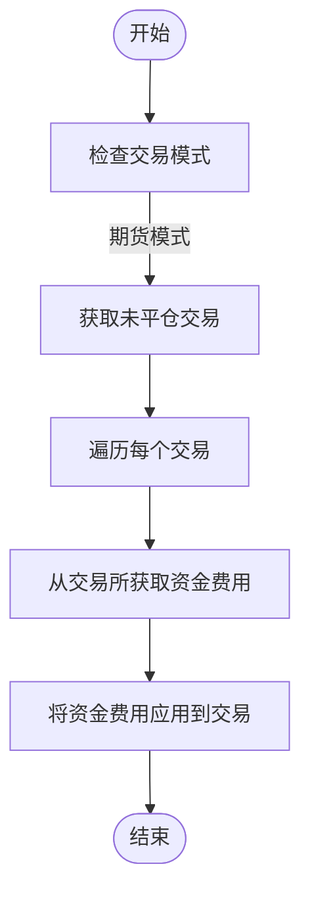

# 资金费率机制

<cite>
**本文档引用的文件**   
- [freqtradebot.py](file://freqtrade/freqtradebot.py)
- [exchange.py](file://freqtrade/exchange/exchange.py)
- [trade_model.py](file://freqtrade/persistence/trade_model.py)
- [bybit.py](file://freqtrade/exchange/bybit.py)
- [hyperliquid.py](file://freqtrade/exchange/hyperliquid.py)
- [interest.py](file://freqtrade/leverage/interest.py)
</cite>

## 目录
1. [引言](#引言)
2. [资金费率计算逻辑](#资金费率计算逻辑)
3. [更新机制与调度策略](#更新机制与调度策略)
4. [跨账户模式下的重要性](#跨账户模式下的重要性)
5. [实际交易场景示例](#实际交易场景示例)
6. [对策略盈亏的影响](#对策略盈亏的影响)
7. [结论](#结论)

## 引言
资金费率是永续合约交易中的核心机制，用于平衡多空双方的持仓成本。在永续合约市场中，由于没有到期日，资金费率通过定期支付的方式，使合约价格与标的资产现货价格保持一致。本文件详细阐述了资金费率的计算逻辑、更新机制及其在跨账户模式下的重要性，并结合代码说明`update_funding_fees`方法如何获取和应用资金费用。

## 资金费率计算逻辑
资金费率的计算基于名义价值和资金费率的乘积。具体公式为：`funding_fee = nominal_value * funding_rate`，其中`nominal_value = mark_price * size`。该计算逻辑在`freqtradebot.py`中的`update_funding_fees`方法中实现，通过调用交易所接口获取资金费用，并将其应用于每个未平仓交易中。

**Section sources**
- [freqtradebot.py](file://freqtrade/freqtradebot.py#L366-L377)

## 更新机制与调度策略
`update_funding_fees`方法通过每小时1分和31分执行的任务调度来更新资金费用。这一调度策略确保了资金费用的及时更新，避免了因延迟更新而导致的持仓成本偏差。在`freqtradebot.py`中，通过`Scheduler`类实现了这一调度机制。

**Diagram sources **
- [freqtradebot.py](file://freqtrade/freqtradebot.py#L366-L377)

**Section sources**
- [freqtradebot.py](file://freqtrade/freqtradebot.py#L366-L377)

## 跨账户模式下的重要性
在跨账户模式下，资金费率的准确计算和更新对于维持账户间的资金平衡至关重要。通过定期更新资金费用，可以确保各账户的资金流动与市场实际情况相符，从而避免因资金费率差异导致的套利机会或风险暴露。

**Section sources**
- [freqtradebot.py](file://freqtrade/freqtradebot.py#L366-L377)

## 实际交易场景示例
假设一个交易者持有一个价值30单位的LTC/USDT永续合约头寸，标记价格为3.3，资金费率为0.00032583，则名义价值为405.9，资金费用为0.132254397。此计算过程在`test_update_funding_fees`测试用例中得到了验证。

**Section sources**
- [test_freqtradebot.py](file://tests/freqtradebot/test_freqtradebot.py#L5109-L5142)

## 对策略盈亏的影响
资金费率直接影响交易者的持仓成本，进而影响整体策略的盈亏。正的资金费率意味着多头需向空头支付费用，反之亦然。因此，在设计交易策略时，必须考虑资金费率的影响，以优化收益并控制风险。

**Section sources**
- [interest.py](file://freqtrade/leverage/interest.py#L0-L36)

## 结论
资金费率机制在永续合约交易中扮演着至关重要的角色，它不仅影响着交易者的持仓成本，还关系到市场的整体稳定。通过精确的计算和及时的更新，可以有效管理资金流动，确保交易策略的稳健运行。