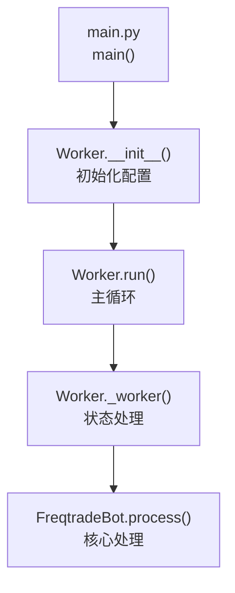
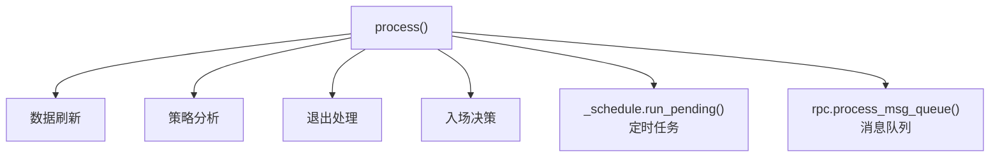
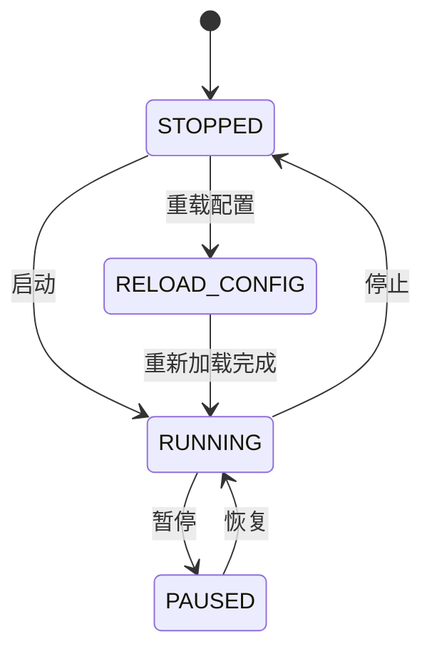
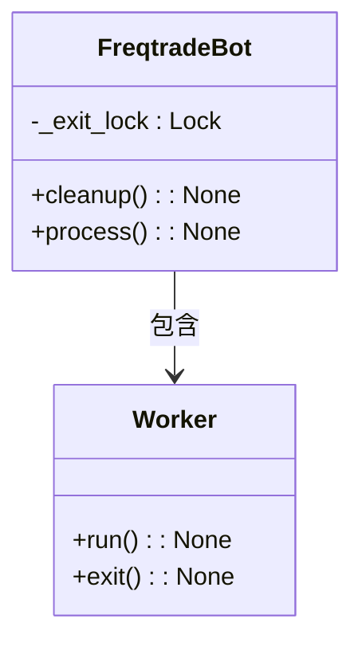
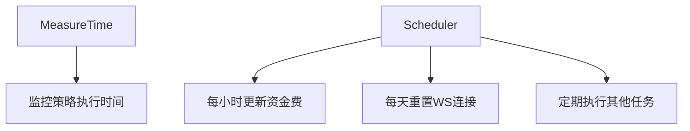
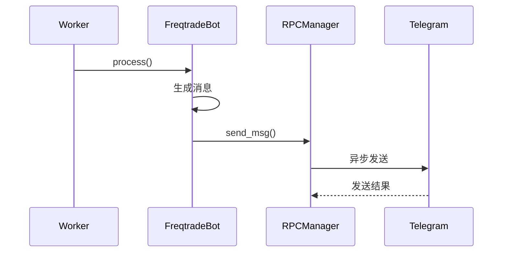

# 核心执行引擎架构

<cite>
**本文档中引用的文件**  
- [main.py](file://freqtrade/main.py)
- [worker.py](file://freqtrade/worker.py)
- [freqtradebot.py](file://freqtrade/freqtradebot.py)
- [measure_time.py](file://freqtrade/util/measure_time.py)
- [state.py](file://freqtrade/enums/state.py)
</cite>

## 目录
1. [启动流程与主控循环](#启动流程与主控循环)
2. [交易引擎主循环分析](#交易引擎主循环分析)
3. [状态机与生命周期管理](#状态机与生命周期管理)
4. [多线程安全与资源清理](#多线程安全与资源清理)
5. [性能监控与定时任务](#性能监控与定时任务)
6. [RPC异步消息集成](#rpc异步消息集成)

## 启动流程与主控循环

交易引擎的启动流程始于`main.py`中的`main()`函数，该函数负责初始化命令行参数、设置日志系统并调用相应的子命令。当执行交易模式时，系统会创建`Worker`实例并启动其运行循环。

**Diagram sources**
- [main.py](file://freqtrade/main.py#L24-L80)
- [worker.py](file://freqtrade/worker.py#L30-L43)

**Section sources**
- [main.py](file://freqtrade/main.py#L24-L80)
- [worker.py](file://freqtrade/worker.py#L30-L43)

## 交易引擎主循环分析

`FreqtradeBot.process()`方法是交易引擎的核心，它实现了四大阶段的协同工作机制：

1. **数据刷新阶段**：通过`dataprovider.refresh()`更新市场数据
2. **策略分析阶段**：执行`strategy.analyze()`进行信号计算
3. **退出处理阶段**：调用`exit_positions()`处理卖出信号
4. **入场决策阶段**：通过`enter_positions()`执行买入逻辑

**Diagram sources**
- [freqtradebot.py](file://freqtrade/freqtradebot.py#L246-L300)

**Section sources**
- [freqtradebot.py](file://freqtrade/freqtradebot.py#L246-L300)

## 状态机与生命周期管理

系统使用`State`枚举类实现状态机管理，包含四种状态：`STOPPED`、`RUNNING`、`PAUSED`和`RELOAD_CONFIG`。状态转换由`Worker._worker()`方法控制，确保系统在不同运行模式间安全切换。

**Diagram sources**
- [state.py](file://freqtrade/enums/state.py#L3-L14)
- [worker.py](file://freqtrade/worker.py#L82-L142)

**Section sources**
- [state.py](file://freqtrade/enums/state.py#L3-L14)
- [worker.py](file://freqtrade/worker.py#L82-L142)

## 多线程安全与资源清理

系统采用多线程安全设计，通过`_exit_lock`锁确保关键操作的原子性。资源清理机制在`cleanup()`方法中实现，确保在系统退出时正确释放所有资源。

**Diagram sources**
- [freqtradebot.py](file://freqtrade/freqtradebot.py#L151-L196)
- [worker.py](file://freqtrade/worker.py#L232-L238)

**Section sources**
- [freqtradebot.py](file://freqtrade/freqtradebot.py#L151-L196)
- [worker.py](file://freqtrade/worker.py#L232-L238)

## 性能监控与定时任务

系统集成`MeasureTime`性能监控工具，用于检测策略执行时间是否超限。同时使用`schedule`库管理定时任务，如资金费更新和交易所连接重置。

**Diagram sources**
- [measure_time.py](file://freqtrade/util/measure_time.py#L10-L44)
- [freqtradebot.py](file://freqtrade/freqtradebot.py#L156-L187)

**Section sources**
- [measure_time.py](file://freqtrade/util/measure_time.py#L10-L44)
- [freqtradebot.py](file://freqtrade/freqtradebot.py#L156-L187)

## RPC异步消息集成

RPC系统通过`RPCManager`实现异步消息队列，支持Telegram、Discord等多种通知方式。消息队列在主循环中被定期处理，确保及时发送状态更新。

**Diagram sources**
- [freqtradebot.py](file://freqtrade/freqtradebot.py#L121-L123)
- [rpc_manager.py](file://freqtrade/rpc/rpc_manager.py#L56-L63)

**Section sources**
- [freqtradebot.py](file://freqtrade/freqtradebot.py#L121-L123)
- [rpc_manager.py](file://freqtrade/rpc/rpc_manager.py#L56-L63)