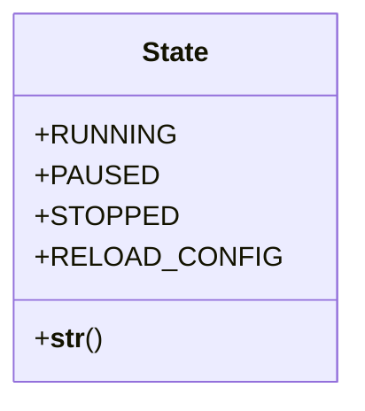
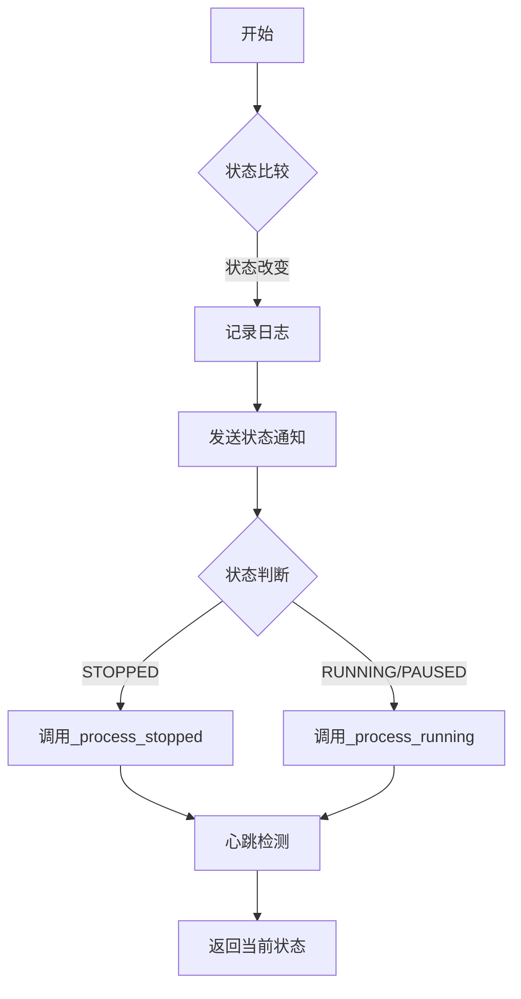
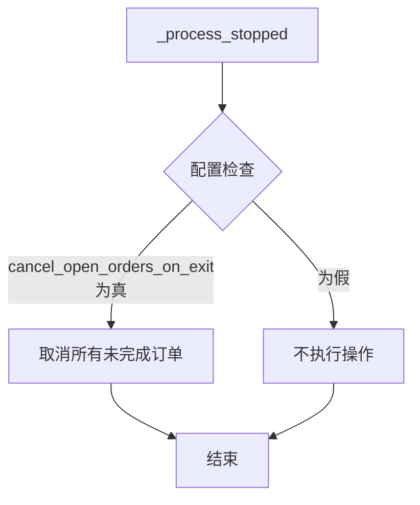
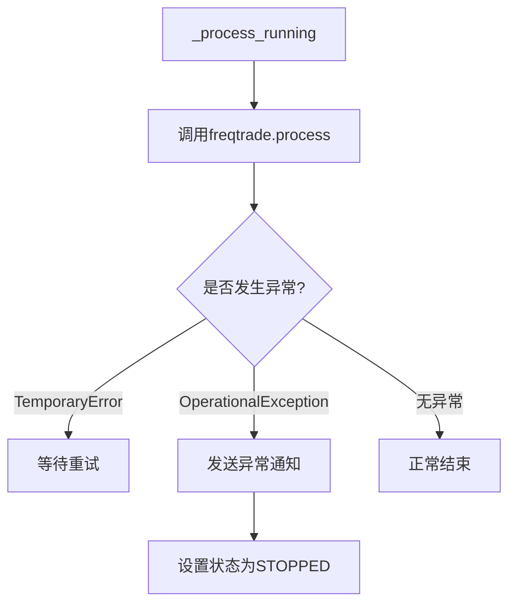

# 状态管理

<cite>
**本文档中引用的文件**  
- [state.py](file://freqtrade/enums/state.py)
- [worker.py](file://freqtrade/worker.py)
- [freqtradebot.py](file://freqtrade/freqtradebot.py)
</cite>

## 目录
1. [状态枚举定义](#状态枚举定义)
2. [状态机驱动逻辑](#状态机驱动逻辑)
3. [状态变更通知与日志](#状态变更通知与日志)
4. [RELOAD_CONFIG状态的特殊作用](#reload_config状态的特殊作用)
5. [STOPPED状态下的用户提示策略](#stopped状态下的用户提示策略)

## 状态枚举定义

`State` 枚举类定义了交易机器人的四种核心状态，分别代表了系统在不同运行阶段的行为模式。这些状态是整个系统状态机的基础，控制着机器人的主要行为流程。



**Diagram sources**  
- [state.py](file://freqtrade/enums/state.py#L3-L14)

**Section sources**  
- [state.py](file://freqtrade/enums/state.py#L1-L15)

### 状态语义说明

- **RUNNING (运行中)**: 机器人处于正常交易状态，会定期执行策略分析、处理订单和管理仓位。
- **PAUSED (暂停)**: 机器人暂停交易活动，但保持系统运行，不会创建新的交易，但会监控现有交易。
- **STOPPED (已停止)**: 机器人完全停止，不执行任何交易逻辑，用于安全关闭或维护。
- **RELOAD_CONFIG (重载配置)**: 一个瞬态状态，表示系统正在重新加载配置文件，完成后会自动恢复到之前的状态。

## 状态机驱动逻辑

`Worker._worker()` 方法是整个状态机的核心驱动器，它在一个循环中不断检查当前状态，并根据状态调用相应的处理逻辑。该方法通过 `throttle` 机制控制执行频率，确保系统不会过于频繁地执行操作。



**Diagram sources**  
- [worker.py](file://freqtrade/worker.py#L82-L142)

**Section sources**  
- [worker.py](file://freqtrade/worker.py#L82-L240)

### 不同状态下的处理逻辑

#### STOPPED 状态处理

当机器人处于 `STOPPED` 状态时，系统会调用 `_process_stopped` 方法。该方法的主要职责是清理系统资源，特别是取消所有未完成的订单。



**Diagram sources**  
- [worker.py](file://freqtrade/worker.py#L193-L194)
- [freqtradebot.py](file://freqtrade/freqtradebot.py#L302-L307)

#### RUNNING/PAUSED 状态处理

在 `RUNNING` 或 `PAUSED` 状态下，系统会调用 `_process_running` 方法。这是机器人最核心的业务逻辑，负责执行交易策略。



**Diagram sources**  
- [worker.py](file://freqtrade/worker.py#L196-L211)
- [freqtradebot.py](file://freqtrade/freqtradebot.py#L246-L300)

## 状态变更通知与日志

系统在状态变更时会执行一系列通知和日志记录操作，确保用户能够及时了解机器人的运行状态。

### 通知机制

当状态发生改变时，系统会通过 `notify_status` 方法向所有注册的RPC（远程过程调用）客户端发送状态变更通知。这使得Telegram、WebUI等外部接口能够实时更新机器人状态。

```python
self.freqtrade.notify_status(f"{state.name.lower()}")
```

**Section sources**  
- [worker.py](file://freqtrade/worker.py#L94-L95)
- [freqtradebot.py](file://freqtrade/freqtradebot.py#L189-L194)

### 日志记录

系统会详细记录状态变更的日志信息，包括从哪个状态切换到哪个状态，以及当前的机器人版本和PID等信息，便于故障排查和审计。

```python
logger.info(f"Changing state{f' from {old_state.name}' if old_state else ''} to: {state.name}")
```

**Section sources**  
- [worker.py](file://freqtrade/worker.py#L97-L100)

## RELOAD_CONFIG状态的特殊作用

`RELOAD_CONFIG` 状态在配置热更新中扮演着关键角色。当用户通过命令行或API请求重新加载配置时，系统会进入此状态。

### 配置热更新流程

1. 用户发送 `/reload_config` 命令
2. 系统将状态设置为 `RELOAD_CONFIG`
3. 在 `_worker` 循环中检测到此状态
4. 调用 `_reconfigure()` 方法重新加载配置
5. 清理旧的模块实例
6. 初始化新的配置和模块
7. 发送状态通知，恢复到之前的状态

此机制允许用户在不中断机器人运行的情况下更新配置，如修改交易对列表、调整风险参数等。

**Section sources**  
- [worker.py](file://freqtrade/worker.py#L213-L237)

## STOPPED状态下的用户提示策略

当机器人进入 `STOPPED` 状态时，系统会执行一项重要的用户提示策略，检查是否存在未平仓的交易。

### 开仓交易检查机制

`check_for_open_trades` 方法会查询数据库中所有未关闭的交易。如果发现存在开仓交易，系统会通过RPC发送警告消息，提醒用户需要手动处理这些交易。

```python
open_trades = Trade.get_open_trades()
if len(open_trades) != 0 and self.state != State.RELOAD_CONFIG:
    msg = {
        "type": RPCMessageType.WARNING,
        "status": f"{len(open_trades)} open trades active.\n\n"
        f"Handle these trades manually on {self.exchange.name}, "
        f"or '/start' the bot again and use '/stopentry' "
        f"to handle open trades gracefully."
    }
    self.rpc.send_msg(msg)
```

**Section sources**  
- [freqtradebot.py](file://freqtrade/freqtradebot.py#L309-L325)

### 用户提示策略要点

- **避免误报**: 当状态为 `RELOAD_CONFIG` 时不会发送警告，因为这是正常的配置重载过程。
- **提供解决方案**: 消息中明确告知用户两种处理方式：手动在交易所平仓，或重新启动机器人并使用 `/stopentry` 命令。
- **区分环境**: 在模拟交易（dry run）模式下，会特别注明"Note: Trades are simulated (dry run)."，避免用户混淆。
- **包含关键信息**: 消息中包含未平仓交易的数量和交易所名称，帮助用户快速定位问题。