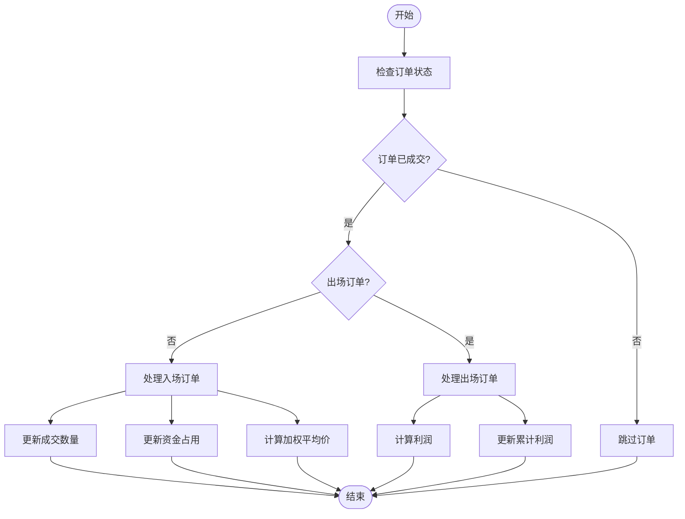

# 交易数据重新计算

<cite>
**本文档引用的文件**
- [trade_model.py](file://freqtrade/persistence/trade_model.py)
- [test_persistence.py](file://tests/persistence/test_persistence.py)
</cite>

## 目录
1. [简介](#简介)
2. [核心参数重新计算逻辑](#核心参数重新计算逻辑)
3. [订单处理与资金计算](#订单处理与资金计算)
4. [加权平均价格计算](#加权平均价格计算)
5. [实际计算示例](#实际计算示例)
6. [关联字段说明](#关联字段说明)

## 简介
`recalc_trade_from_orders` 方法是Freqtrade系统中用于根据订单列表重新计算交易核心参数的关键方法。该方法通过汇总所有已成交订单的数据，动态更新交易的总成交数量、成交均价、资金占用量等衍生字段。它支持处理多笔入场和出场订单，并能正确处理不同价格和数量的分批成交情况。本文档将深入分析该方法的实现逻辑和计算过程。

**Section sources**
- [trade_model.py](file://freqtrade/persistence/trade_model.py#L1207-L1283)

## 核心参数重新计算逻辑
`recalc_trade_from_orders` 方法通过遍历交易的所有订单，根据订单的成交情况进行核心参数的重新计算。该方法首先初始化一系列变量，包括当前数量、当前资金、最大资金量、平均价格等。然后，它按顺序处理每个已成交的订单，根据订单方向（入场或出场）更新相应的参数。

对于入场订单（buy orders），方法会累加成交数量和资金，并根据加权平均法计算新的成交均价。对于出场订单（sell orders），方法会计算每次卖出的利润，并更新累计利润。特别地，该方法能够处理分批买入（DCA）和分批卖出的情况，确保计算结果的准确性。

**Section sources**
- [trade_model.py](file://freqtrade/persistence/trade_model.py#L1207-L1283)

## 订单处理与资金计算
该方法在处理订单时，会区分入场和出场订单。对于每个已成交的订单，它首先检查订单是否已完全成交且非开放状态。然后，根据订单方向计算相应的数量和价格变化。

资金计算方面，方法使用 `_calc_open_trade_value` 函数来计算每笔订单的资金占用量。该函数考虑了交易手续费，确保资金计算的准确性。总资金占用量是所有入场订单资金占用量的总和。此外，方法还计算了最大资金量（`max_stake_amount`），这是所有入场订单成本的总和除以杠杆倍数。

**Diagram sources**
- [trade_model.py](file://freqtrade/persistence/trade_model.py#L1207-L1283)

## 加权平均价格计算
加权平均价格的计算是该方法的核心功能之一。当处理入场订单时，方法会根据每笔订单的成交数量和价格，动态更新加权平均价格。计算公式为：`加权平均价格 = 总资金 / 总数量`。

具体实现中，方法维护了 `current_amount`（当前总数量）和 `current_stake`（当前总资金）两个变量。每当处理一笔新的入场订单时，它会将订单的成交数量和资金加入到这两个变量中，然后重新计算加权平均价格。这种方法确保了即使在多次分批买入的情况下，也能得到准确的平均成本价格。

**Section sources**
- [trade_model.py](file://freqtrade/persistence/trade_model.py#L1207-L1283)

## 实际计算示例
以下是一个实际的计算示例，展示了 `recalc_trade_from_orders` 方法的计算过程：

假设一笔交易有三笔入场订单：
- 第一笔：数量100，价格10，成本1000
- 第二笔：数量125，价格9，成本1125
- 第三笔：数量150，价格8.5，成本1275

总数量 = 100 + 125 + 150 = 375
总成本 = 1000 + 1125 + 1275 = 3400
加权平均价格 = 3400 / 375 = 9.0667

该方法会正确计算出这些值，并更新交易对象的相关字段。测试用例验证了这一计算过程的正确性，确保在各种情况下都能得到准确的结果。

**Section sources**
- [test_persistence.py](file://tests/persistence/test_persistence.py#L2230-L2350)

## 关联字段说明
`recalc_trade_from_orders` 方法与多个关键字段相关联。`stake_amount` 字段表示当前的资金占用量，它是根据当前总资金除以杠杆倍数计算得出的。`fee_open_cost` 字段表示入场手续费成本，它是根据最大资金量和入场手续费率计算的。

`open_trade_value` 字段表示开仓交易价值，它包含了交易手续费。该字段通过 `recalc_open_trade_value` 方法重新计算，确保其值始终与当前的成交情况保持一致。这些字段的正确计算对于交易策略的执行和风险管理至关重要。

**Section sources**
- [trade_model.py](file://freqtrade/persistence/trade_model.py#L1207-L1283)