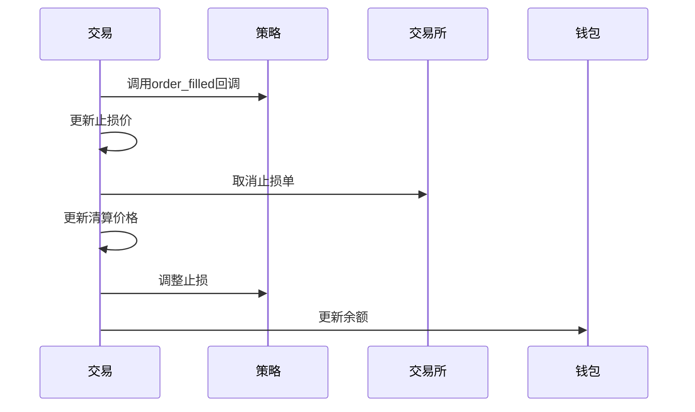

# 交易状态同步与更新

<cite>
**本文档引用的文件**
- [freqtradebot.py](file://freqtrade/freqtradebot.py)
- [trade_model.py](file://freqtrade/persistence/trade_model.py)
</cite>

## 目录
1. [交易状态同步机制](#交易状态同步机制)
2. [订单与交易模型更新逻辑](#订单与交易模型更新逻辑)
3. [订单费用处理流程](#订单费用处理流程)
4. [订单成交后触发操作](#订单成交后触发操作)

## 交易状态同步机制

`update_trade_state` 方法是交易状态同步的核心，负责将交易所的订单状态同步到本地数据库。该方法首先通过 `fetch_order_or_stoploss_order` 获取交易所的订单详情，然后调用 `trade.update_order` 更新本地订单信息。若订单已被取消，则返回 `True`；否则，继续处理订单费用、更新交易状态，并在订单成交后触发后续操作。

**Section sources**
- [freqtradebot.py](file://freqtrade/freqtradebot.py#L2288-L2340)

## 订单与交易模型更新逻辑

### Order模型的update_from_ccxt_object方法

`Order` 模型的 `update_from_ccxt_object` 方法用于从 CCXT 订单对象更新本地订单字段。该方法确保订单ID一致，并更新订单状态、价格、数量、成交额等关键字段。同时，根据订单状态判断是否已成交，并更新成交时间和订单更新时间。

**Section sources**
- [trade_model.py](file://freqtrade/persistence/trade_model.py#L64-L377)

### Trade模型的recalc_trade_from_orders方法

`Trade` 模型的 `recalc_trade_from_orders` 方法根据订单列表重新计算交易的总金额、已成交金额和费用。该方法遍历所有已成交的订单，累加成交金额和成本，并根据最后的成交订单计算总利润。此外，该方法还负责更新交易的开仓价、持仓量和止损价。

**Section sources**
- [trade_model.py](file://freqtrade/persistence/trade_model.py#L1641-L2125)

## 订单费用处理流程

### handle_order_fee方法

`handle_order_fee` 方法负责处理订单费用。该方法调用 `get_real_amount` 获取实际费用金额，并将其应用于订单的 `ft_fee_base` 字段。此方法特别适用于在基础货币中支付费用的交易所（如币安）。

**Section sources**
- [freqtradebot.py](file://freqtrade/freqtradebot.py#L2458-L2464)

### get_real_amount方法

`get_real_amount` 方法用于检测和更新交易费用。该方法首先检查订单是否已关闭，然后从订单对象中提取费用信息。如果费用率低于2%，则认为是有效的，并调用 `trade.update_fee` 更新交易费用。对于在基础货币中支付费用的情况，该方法还会计算并返回实际费用金额。

**Section sources**
- [freqtradebot.py](file://freqtrade/freqtradebot.py#L2466-L2510)

## 订单成交后触发操作

### _update_trade_after_fill方法

`_update_trade_after_fill` 方法在订单成交后触发一系列后续操作。首先，调用策略的 `order_filled` 回调函数。如果是一个入场订单，则更新止损价并取消交易所的止损单。接着，更新交易的止损价，并在必要时更新保证金模式下的清算价格。最后，更新钱包余额。

**Diagram sources**
- [freqtradebot.py](file://freqtrade/freqtradebot.py#L2342-L2382)

### cancel_stoploss_on_exchange方法

`cancel_stoploss_on_exchange` 方法用于取消交易所的止损单。该方法遍历交易的所有未完成止损单，尝试取消每个订单，并通过 `update_trade_state` 更新交易状态。

**Section sources**
- [freqtradebot.py](file://freqtrade/freqtradebot.py#L1065-L1078)

### 发送通知

#### _notify_enter方法

`_notify_enter` 方法在入场订单发生时发送RPC通知。该方法构建包含交易ID、方向、价格、数量等信息的消息，并通过RPC发送。

**Section sources**
- [freqtradebot.py](file://freqtrade/freqtradebot.py#L1181-L1233)

#### _notify_exit方法

`_notify_exit` 方法在出场订单发生时发送RPC通知。该方法构建包含交易ID、方向、价格、数量、收益等信息的消息，并通过RPC发送。

**Section sources**
- [freqtradebot.py](file://freqtrade/freqtradebot.py#L2157-L2221)