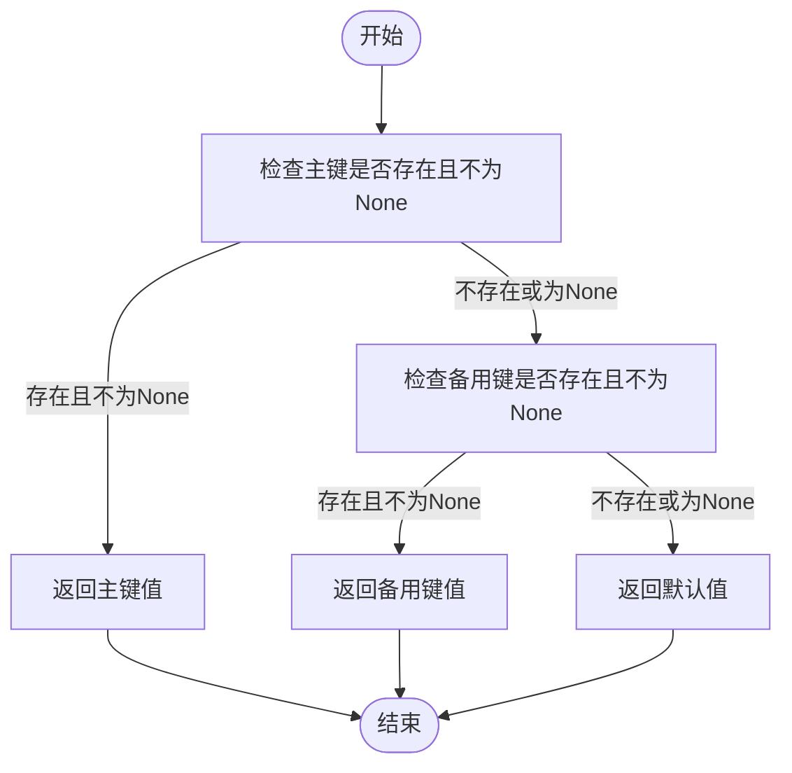
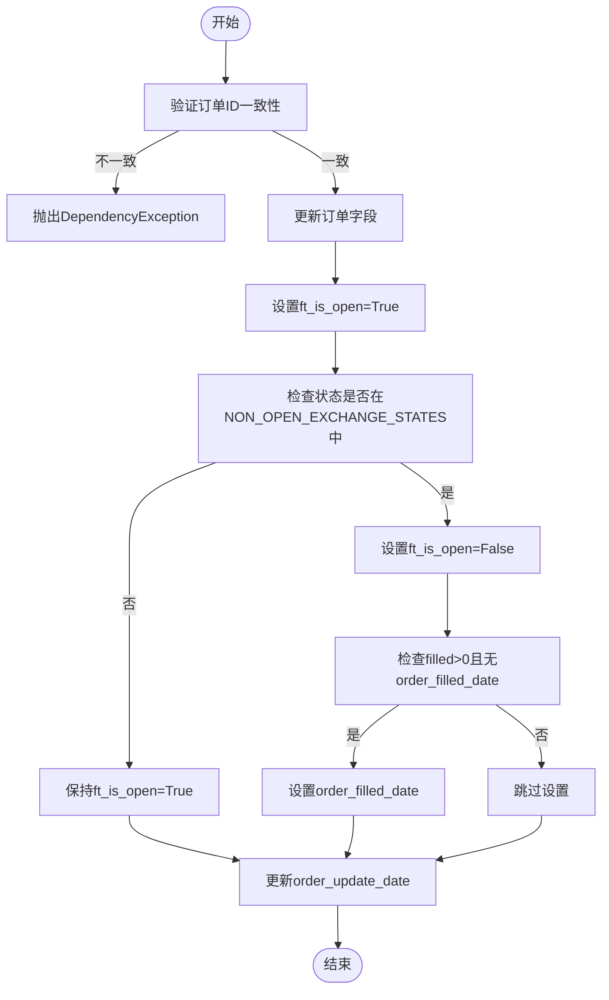

# 订单状态同步机制

<cite>
**Referenced Files in This Document**   
- [trade_model.py](file://freqtrade/persistence/trade_model.py)
- [misc.py](file://freqtrade/misc.py)
- [constants.py](file://freqtrade/constants.py)
</cite>

## Table of Contents
1. [核心功能概述](#核心功能概述)
2. [关键字段更新机制](#关键字段更新机制)
3. [安全值回退处理](#安全值回退处理)
4. [订单状态与时间戳管理](#订单状态与时间戳管理)
5. [状态变更逻辑流程](#状态变更逻辑流程)

## 核心功能概述

`Order`模型的`update_from_ccxt_object`方法负责将CCXT交易所返回的订单对象数据同步到本地数据库。该方法确保本地订单记录与交易所的实际状态保持一致，是交易系统数据一致性的核心组件。

**Section sources**
- [trade_model.py](file://freqtrade/persistence/trade_model.py#L204-L219)

## 关键字段更新机制

该方法通过一系列字段映射，将CCXT订单对象的关键属性同步到本地订单模型。主要更新的字段包括：

- **订单状态(status)**: 从CCXT对象的`status`字段获取
- **交易对(symbol)**: 从CCXT对象的`symbol`字段获取
- **订单类型(order_type)**: 从CCXT对象的`type`字段获取
- **买卖方向(side)**: 从CCXT对象的`side`字段获取
- **价格(price)**: 从CCXT对象的`price`字段获取
- **数量(amount)**: 从CCXT对象的`amount`字段获取
- **已成交数量(filled)**: 从CCXT对象的`filled`字段获取
- **剩余数量(remaining)**: 从CCXT对象的`remaining`字段获取
- **成交金额(cost)**: 从CCXT对象的`cost`字段获取
- **止损价格(stop_price)**: 从CCXT对象的`stopPrice`字段获取

这些字段的更新都通过`safe_value_fallback`函数进行安全处理，确保即使某些字段在CCXT响应中缺失，也能保持本地数据的完整性。

**Section sources**
- [trade_model.py](file://freqtrade/persistence/trade_model.py#L204-L219)

## 安全值回退处理

`safe_value_fallback`函数在处理缺失字段时发挥关键作用。该函数的逻辑如下：

1. 首先检查主键(key1)是否存在于对象中且值不为None
2. 如果主键不存在或值为None，则检查备用键(key2)是否存在且值不为None
3. 如果两个键都不存在或值为None，则返回提供的默认值

这种机制确保了在CCXT API响应中某些字段缺失时，系统能够优雅地处理，避免数据丢失或程序异常。

**Diagram sources **
- [misc.py](file://freqtrade/misc.py#L127-L138)

**Section sources**
- [misc.py](file://freqtrade/misc.py#L127-L138)

## 订单状态与时间戳管理

### ft_is_open标志位更新

`ft_is_open`标志位的更新逻辑如下：
1. 默认将订单状态设置为打开(True)
2. 检查订单状态是否属于`NON_OPEN_EXCHANGE_STATES`（包括已取消和已关闭状态）
3. 如果属于非开放状态，则将`ft_is_open`设置为False

### 订单成交时间确定

订单成交时间(`order_filled_date`)的确定机制：
1. 当订单状态为非开放状态且已成交数量大于0时
2. 检查本地订单是否已有成交时间记录
3. 如果没有成交时间记录，则从CCXT对象的`lastTradeTimestamp`字段获取
4. 使用`safe_value_fallback`函数获取时间戳，如果不存在则使用当前时间

订单更新时间(`order_update_date`)始终设置为当前UTC时间，用于追踪最后一次同步的时间。

**Section sources**
- [trade_model.py](file://freqtrade/persistence/trade_model.py#L219-L232)
- [constants.py](file://freqtrade/constants.py#L116)

## 状态变更逻辑流程

该方法在不同场景下的处理流程如下：

### 部分成交场景
- `status`保持为"open"
- `ft_is_open`保持为True
- `filled`和`remaining`字段更新为最新值
- `order_filled_date`保持不变（因为订单尚未完全成交）

### 完全成交场景
- `status`更新为"closed"
- `ft_is_open`更新为False
- `filled`等于`amount`
- `remaining`为0
- `order_filled_date`设置为最后一次成交的时间戳

### 取消订单场景
- `status`更新为"cancelled"或"canceled"
- `ft_is_open`更新为False
- `filled`为已成交的数量
- `remaining`为未成交的数量
- `order_filled_date`设置为最后一次成交的时间戳（如果有部分成交）

**Diagram sources **
- [trade_model.py](file://freqtrade/persistence/trade_model.py#L204-L232)

**Section sources**
- [trade_model.py](file://freqtrade/persistence/trade_model.py#L204-L232)
- [constants.py](file://freqtrade/constants.py#L116)