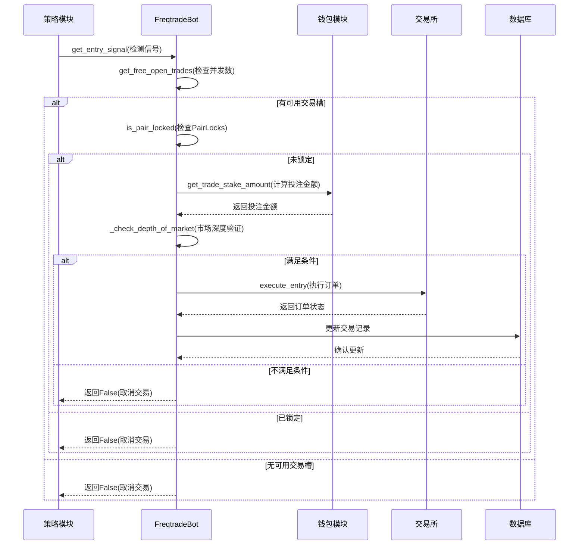

# 订单创建流程

<cite>
**本文档引用的文件**   
- [freqtradebot.py](file://freqtrade/freqtradebot.py)
- [interface.py](file://freqtrade/strategy/interface.py)
- [wallets.py](file://freqtrade/wallets.py)
- [pairlock_middleware.py](file://freqtrade/persistence/pairlock_middleware.py)
- [signaltype.py](file://freqtrade/enums/signaltype.py)
</cite>

## 目录
1. [流程概述](#流程概述)
2. [信号检测与交易方向映射](#信号检测与交易方向映射)
3. [并发交易数与资金校验](#并发交易数与资金校验)
4. [市场深度验证](#市场深度验证)
5. [订单执行](#订单执行)
6. [PairLocks 防频繁交易机制](#pairlocks-防频繁交易机制)
7. [完整流程时序图](#完整流程时序图)

## 流程概述
从交易信号触发到订单创建的完整流程始于 `create_trade` 方法。该方法首先通过策略接口 `get_entry_signal` 检测入场信号，随后结合钱包模块 `get_trade_stake_amount` 计算动态投注金额，并通过 `get_free_open_trades` 检查最大并发交易数限制。在执行订单前，系统会进行 `_depth_of_market` 市场深度验证。信号方向（`SignalDirection`）与交易方向（buy/sell）的映射逻辑由 `execute_entry` 方法处理。整个流程最终通过 `execute_entry` 调用完成订单创建。

**Section sources**
- [freqtradebot.py](file://freqtrade/freqtradebot.py#L652-L710)

## 信号检测与交易方向映射
`get_entry_signal` 方法负责计算当前的入场信号。该方法基于数据帧的信号列来确定信号，用于机器人获取进入交易的信号。当检测到 `ENTER_LONG` 信号时，返回 `SignalDirection.LONG`；当检测到 `ENTER_SHORT` 信号时，返回 `SignalDirection.SHORT`。`SignalDirection` 枚举定义了 `LONG` 和 `SHORT` 两个方向，分别对应多头和空头交易。在 `create_trade` 方法中，信号方向被映射为 `is_short` 布尔值，传递给 `execute_entry` 方法以确定交易方向。

**Section sources**
- [interface.py](file://freqtrade/strategy/interface.py#L1345-L1399)
- [signaltype.py](file://freqtrade/enums/signaltype.py#L0-L34)

## 并发交易数与资金校验
`get_free_open_trades` 方法用于返回当前可用的开放交易槽位数量。如果达到最大开放交易数，则返回 0。`create_trade` 方法在执行前会调用此方法检查是否可以开立新交易。`get_trade_stake_amount` 方法计算交易的投注金额。该方法首先更新钱包余额，然后根据配置的投注金额和可用资金计算实际投注金额。如果配置的投注金额为无限，则根据可用资金和最大开放交易数计算动态投注金额。最后，该方法会检查可用资金是否足够支持投注金额。

**Section sources**
- [freqtradebot.py](file://freqtrade/freqtradebot.py#L348-L354)
- [wallets.py](file://freqtrade/wallets.py#L353-L374)

## 市场深度验证
在执行订单前，系统会进行市场深度验证。`_check_depth_of_market` 方法负责检查市场深度。该方法首先获取指定交易对的 L2 订单簿数据，然后计算买单和卖单的总数量。根据信号方向，确定入口侧和出口侧的订单数量。计算入口侧与出口侧订单数量的比率（`bids_ask_delta`）。如果该比率大于或等于配置的阈值（`bids_to_ask_delta`），则认为市场深度满足条件，返回 `True`；否则返回 `False`。此验证机制确保在市场流动性充足的情况下才执行交易。

**Section sources**
- [freqtradebot.py](file://freqtrade/freqtradebot.py#L830-L860)

## 订单执行
`execute_entry` 方法负责执行给定交易对的入场订单。该方法首先根据交易方向确定订单的买卖方向和时间限制。然后，调用 `get_valid_enter_price_and_stake` 方法获取有效的入场价格和投注金额。如果用户通过 `confirm_trade_entry` 回调函数拒绝交易，则直接返回 `False`。接着，调用交易所的 `create_order` 方法创建订单。订单创建成功后，更新交易对象并将其保存到数据库。最后，发送交易通知并返回 `True` 表示订单创建成功。

**Section sources**
- [freqtradebot.py](file://freqtrade/freqtradebot.py#L862-L1063)

## PairLocks 防频繁交易机制
`PairLocks` 类提供了防止频繁交易的机制。该类通过数据库或内存列表维护交易对的锁定状态。`lock_pair` 方法用于创建交易对锁定，从当前时间到指定的结束时间。`is_pair_locked` 方法检查指定交易对是否被锁定。在 `create_trade` 方法中，如果检测到交易对被锁定，则记录日志并返回 `False`，阻止新交易的创建。`unlock_pair` 方法用于释放指定交易对的所有锁定。此机制可以有效防止在短时间内对同一交易对进行多次交易，避免因市场波动或策略缺陷导致的过度交易。

**Section sources**
- [pairlock_middleware.py](file://freqtrade/persistence/pairlock_middleware.py#L13-L189)

## 完整流程时序图

**Diagram sources**
- [freqtradebot.py](file://freqtrade/freqtradebot.py#L652-L710)
- [interface.py](file://freqtrade/strategy/interface.py#L1345-L1399)
- [wallets.py](file://freqtrade/wallets.py#L353-L374)
- [pairlock_middleware.py](file://freqtrade/persistence/pairlock_middleware.py#L13-L189)