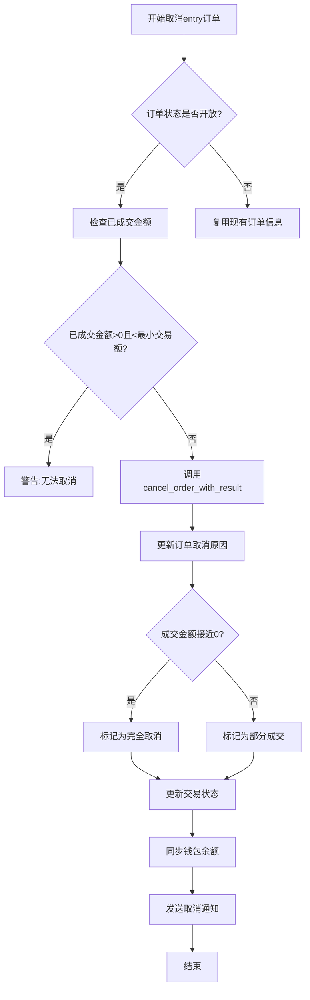
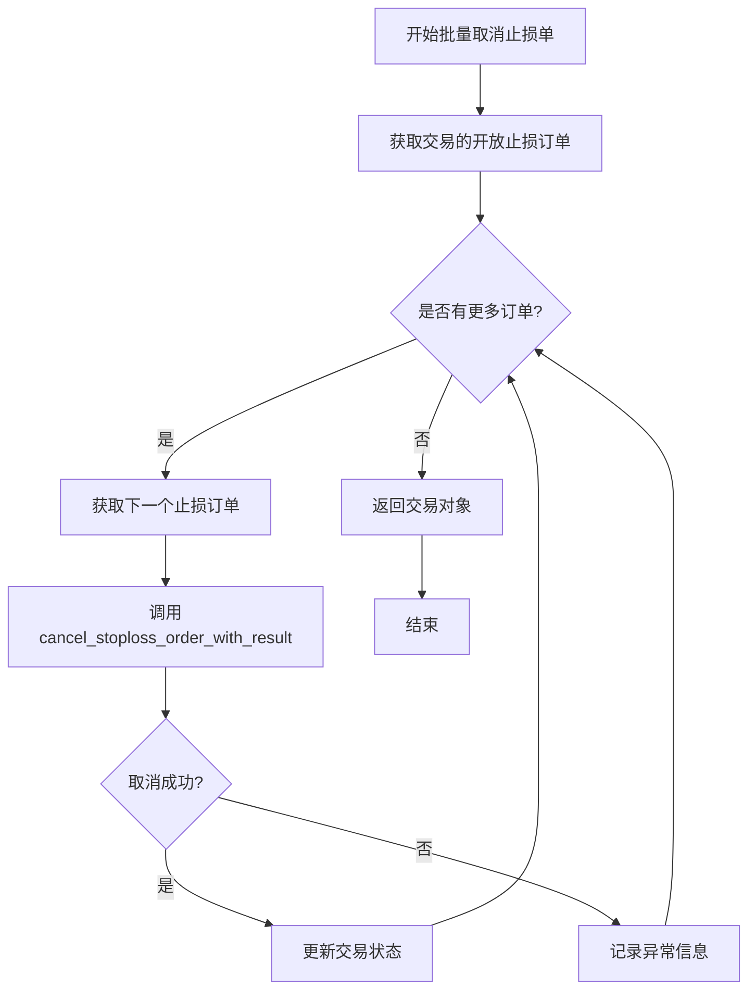
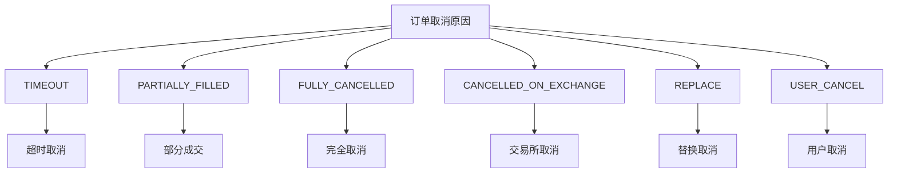

# 订单取消与异常处理

<cite>
**本文档引用的文件**
- [freqtradebot.py](file://freqtrade/freqtradebot.py#L1837-L1925)
- [exchange.py](file://freqtrade/exchange/exchange.py#L1682-L1711)
- [constants.py](file://freqtrade/constants.py#L191-L202)
</cite>

## 目录
1. [订单取消场景分析](#订单取消场景分析)
2. [entry订单取消处理](#entry订单取消处理)
3. [止损单批量取消](#止损单批量取消)
4. [订单取消原因分类](#订单取消原因分类)

## 订单取消场景分析

在Freqtrade系统中，订单取消主要分为两种场景：完全取消（fully cancelled）和部分成交后取消（partially filled）。这两种场景的处理逻辑在`handle_cancel_enter`方法中实现，该方法负责处理entry订单的取消操作。系统通过检查订单的成交状态和已成交金额来决定采取何种取消策略。

**Section sources**
- [freqtradebot.py](file://freqtrade/freqtradebot.py#L1837-L1925)

## entry订单取消处理

`handle_cancel_enter`方法是处理entry订单取消的核心逻辑。当系统需要取消一个entry订单时，该方法会首先检查订单的成交状态。如果订单状态不在`NON_OPEN_EXCHANGE_STATES`中，说明订单仍在开放状态，需要进一步处理。

关键处理步骤包括：
1. 检查已成交金额是否低于最小交易额（minstake），如果已成交金额大于0但成交金额对应的stake小于minstake，系统会发出警告并返回false，防止产生无法退出的交易。
2. 调用`exchange.cancel_order_with_result`方法取消订单，该方法会尝试取消订单并返回结果。
3. 更新数据库中的订单状态，设置取消原因（ft_cancel_reason）。
4. 根据成交情况更新交易状态：如果成交金额接近0，则视为完全取消；如果存在部分成交，则视为部分成交后取消。

钱包余额的同步在订单取消处理的最后阶段完成，通过调用`self.wallets.update()`方法确保钱包状态与交易所状态保持一致。

**Diagram sources**
- [freqtradebot.py](file://freqtrade/freqtradebot.py#L1837-L1925)

**Section sources**
- [freqtradebot.py](file://freqtrade/freqtradebot.py#L1837-L1925)
- [exchange.py](file://freqtrade/exchange/exchange.py#L1682-L1711)

## 止损单批量取消

`cancel_stoploss_on_exchange`方法负责批量取消交易所上的止损单。该方法遍历交易对象中的所有开放止损订单（open_sl_orders），对每个订单执行取消操作。

处理流程如下：
1. 遍历交易的所有开放止损订单
2. 尝试调用`exchange.cancel_stoploss_order_with_result`取消每个止损单
3. 更新交易状态，将取消结果应用到交易对象
4. 如果取消过程中发生`InvalidOrderException`异常，系统会记录异常信息但继续处理其他订单

该方法的设计考虑了异常处理的健壮性，即使某个止损单取消失败，也不会影响其他止损单的取消操作，确保了批量操作的可靠性。

**Diagram sources**
- [freqtradebot.py](file://freqtrade/freqtradebot.py#L1065-L1078)

**Section sources**
- [freqtradebot.py](file://freqtrade/freqtradebot.py#L1065-L1078)

## 订单取消原因分类

订单取消原因（CANCEL_REASON）在系统中被定义为一个常量字典，用于标准化各种取消场景的描述。这些原因在日志记录和用户通知中起着重要作用，帮助用户理解订单被取消的具体原因。

主要取消原因包括：
- **TIMEOUT**: 由于超时而取消
- **PARTIALLY_FILLED**: 部分成交
- **FULLY_CANCELLED**: 完全取消
- **CANCELLED_ON_EXCHANGE**: 在交易所上被取消
- **REPLACE**: 为被新限价单替换而取消
- **USER_CANCEL**: 用户请求取消订单

这些原因代码在系统各处被引用，确保了取消原因的一致性和可追溯性。例如，当`handle_cancel_enter`方法处理订单取消时，会根据具体情况设置相应的取消原因，这些信息随后会被用于生成日志条目和通知消息。

**Diagram sources**
- [constants.py](file://freqtrade/constants.py#L191-L202)

**Section sources**
- [constants.py](file://freqtrade/constants.py#L191-L202)