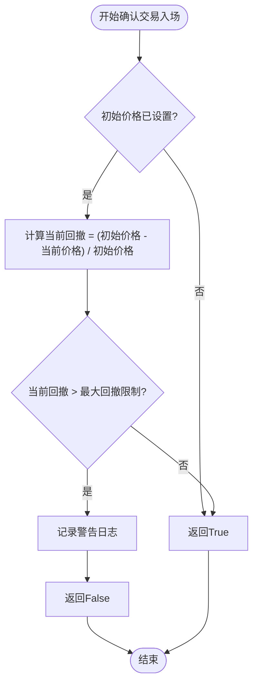

# 交易前用户确认机制

<cite>
**本文档中引用的文件**  
- [BTCGridStrategy.py](file://yccai/wang_ge/BTCGridStrategy.py)
- [FreqaiExampleStrategy.py](file://freqtrade/templates/FreqaiExampleStrategy.py)
- [interface.py](file://freqtrade/strategy/interface.py)
- [strategy_wrapper.py](file://freqtrade/strategy/strategy_wrapper.py)
- [freqtradebot.py](file://freqtrade/freqtradebot.py)
</cite>

## 目录
1. [介绍](#介绍)
2. [核心组件](#核心组件)
3. [执行流程分析](#执行流程分析)
4. [确认逻辑实现模式](#确认逻辑实现模式)
5. [默认行为与异常处理](#默认行为与异常处理)
6. [调试建议](#调试建议)

## 介绍
`confirm_trade_entry` 钩子函数是Freqtrade框架中策略开发者用于在订单执行前进行最终确认的关键机制。该函数允许策略基于实时市场条件（如价格偏离、最大回撤等）动态阻止交易执行，从而增强交易系统的风险控制能力。本文件将深入解析该钩子在`execute_entry`方法中的调用实现细节，并通过`FreqaiExampleStrategy`和`BTCGridStrategy`的实际示例展示不同业务场景下的确认逻辑设计模式。

## 核心组件

`confirm_trade_entry` 钩子函数作为策略接口的一部分，定义在`IStrategy`基类中，为所有策略提供统一的交易确认入口。该函数在交易执行流程中扮演着守门人的角色，确保只有满足特定条件的交易才能被提交到交易所。

**Section sources**
- [interface.py](file://freqtrade/strategy/interface.py#L352-L386)

## 执行流程分析

`confirm_trade_entry` 钩子在`FreqtradeBot.execute_entry`方法中被调用，其调用过程通过`strategy_safe_wrapper`包装器实现。当`mode`为"initial"时，系统会调用包装后的`confirm_trade_entry`函数，传入交易相关的参数。如果该函数返回`False`，则交易将被阻止，系统记录日志并返回`False`，从而中断交易创建流程。

```mermaid
sequenceDiagram
participant FreqtradeBot as FreqtradeBot
participant Strategy as 策略
participant Wrapper as strategy_safe_wrapper
FreqtradeBot->>Wrapper : 调用包装后的confirm_trade_entry
Wrapper->>Strategy : 执行用户定义的确认逻辑
Strategy-->>Wrapper : 返回布尔值
alt 返回False
Wrapper-->>FreqtradeBot : 返回False
FreqtradeBot->>FreqtradeBot : 记录"用户拒绝入场"日志
FreqtradeBot-->> : 返回False，阻止交易
else 返回True
Wrapper-->>FreqtradeBot : 返回True
FreqtradeBot->>FreqtradeBot : 继续执行订单创建
end
```

**Diagram sources**
- [freqtradebot.py](file://freqtrade/freqtradebot.py#L862-L1063)
- [strategy_wrapper.py](file://freqtrade/strategy/strategy_wrapper.py#L15-L42)

## 确认逻辑实现模式

### FreqaiExampleStrategy 实现模式
在`FreqaiExampleStrategy`中，`confirm_trade_entry`用于检查入场价格是否偏离当前收盘价超过0.25%。对于做多交易，如果请求价格高于收盘价的1.0025倍，则拒绝交易；对于做空交易，如果请求价格低于收盘价的0.9975倍，则拒绝交易。这种模式适用于防止因价格滑点过大而导致的不利入场。

**Section sources**
- [FreqaiExampleStrategy.py](file://freqtrade/templates/FreqaiExampleStrategy.py#L270-L292)

### BTCGridStrategy 实现模式
`BTCGridStrategy`利用`confirm_trade_entry`实现压力测试检查。该策略计算当前价格相对于初始价格的回撤幅度，如果回撤超过预设的最大回撤限制（由`max_drawdown`参数控制），则拒绝交易。此模式确保策略在市场大幅下跌时不会盲目入场，保护资金安全。



**Diagram sources**
- [BTCGridStrategy.py](file://yccai/wang_ge/BTCGridStrategy.py#L370-L383)

## 默认行为与异常处理

当策略未实现`confirm_trade_entry`方法时，系统将使用`IStrategy`基类中定义的默认实现，该实现始终返回`True`，即默认允许所有交易入场。`strategy_safe_wrapper`包装器确保了该函数的安全执行，它捕获所有异常并根据`default_retval`参数决定返回值。在`execute_entry`的调用中，`default_retval`被设置为`True`，这意味着即使确认函数抛出异常，系统也会默认允许交易，从而保证系统的健壮性。

**Section sources**
- [interface.py](file://freqtrade/strategy/interface.py#L352-L386)
- [strategy_wrapper.py](file://freqtrade/strategy/strategy_wrapper.py#L15-L42)

## 调试建议

当交易因确认失败而被阻塞时，应首先检查相关日志。系统会在`confirm_trade_entry`返回`False`时记录"User denied entry for {pair}"的日志信息。开发者应检查策略中`confirm_trade_entry`的实现逻辑，确保条件判断正确。同时，可通过在函数中添加调试日志来输出关键变量的值，如价格、回撤等，以定位问题。此外，应验证策略参数（如`max_drawdown`）的配置是否合理，避免因参数设置不当导致交易被意外阻止。

**Section sources**
- [freqtradebot.py](file://freqtrade/freqtradebot.py#L862-L1063)
- [BTCGridStrategy.py](file://yccai/wang_ge/BTCGridStrategy.py#L370-L383)