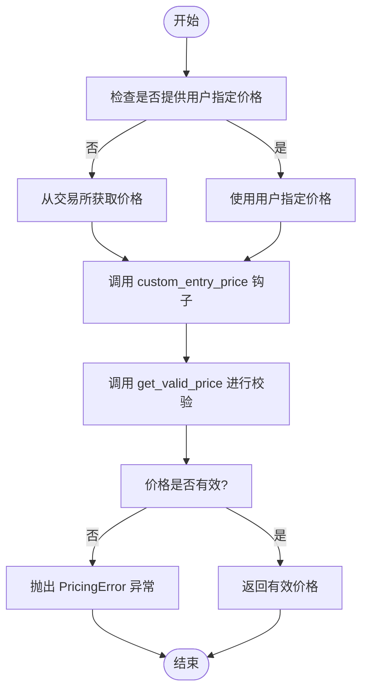
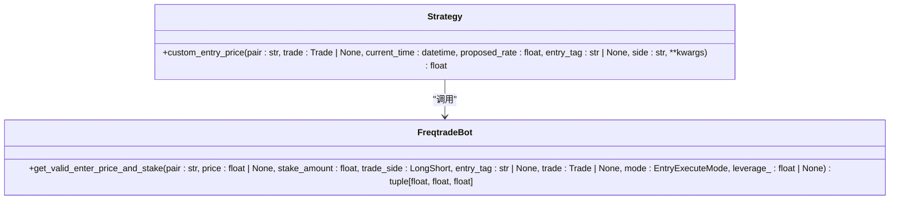
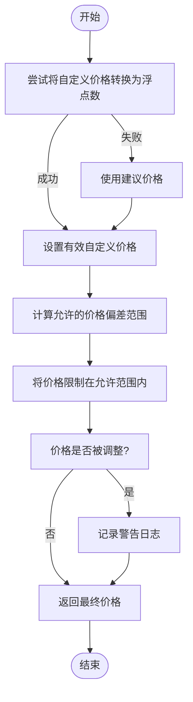
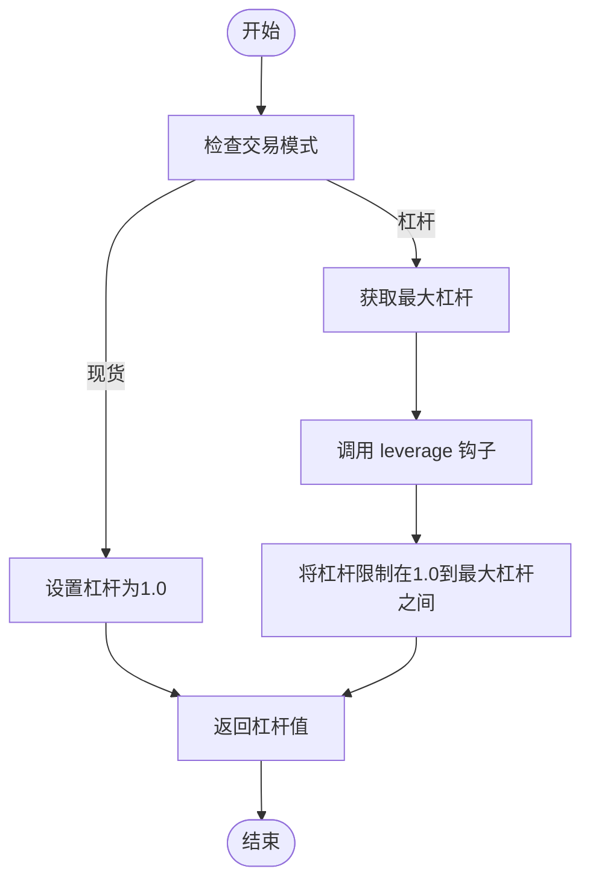
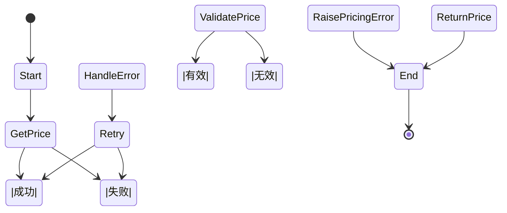

# 入场价格计算

<cite>
**本文档中引用的文件**  
- [freqtradebot.py](file://freqtrade/freqtradebot.py)
- [exchange.py](file://freqtrade/exchange/exchange.py)
- [exceptions.py](file://freqtrade/exceptions.py)
- [strategy_test_v3_custom_entry_price.py](file://tests/strategy/strats/strategy_test_v3_custom_entry_price.py)
- [test_pricing_conf.json](file://tests/testdata/testconfigs/test_pricing_conf.json)
</cite>

## 目录
1. [简介](#简介)
2. [价格计算流程](#价格计算流程)
3. [自定义价格干预机制](#自定义价格干预机制)
4. [价格校验机制](#价格校验机制)
5. [现货与杠杆交易场景](#现货与杠杆交易场景)
6. [异常处理路径](#异常处理路径)
7. [常见问题解决方案](#常见问题解决方案)

## 简介
本文档深入分析 `get_valid_enter_price_and_stake` 方法中的价格计算逻辑，涵盖用户指定价格与自动获取价格的处理流程。详细说明 `custom_entry_price` 策略钩子如何干预价格设定，并结合 `get_valid_price` 方法解释价格校验机制。通过代码示例展示现货与杠杆交易场景下的价格确定过程，涵盖不同订单方向的时间强制策略适配。解释当价格获取失败时的异常处理路径，并提供常见问题如价格偏差过大、API限流等情况的解决方案。

**Section sources**
- [freqtradebot.py](file://freqtrade/freqtradebot.py#L1080-L1179)

## 价格计算流程
`get_valid_enter_price_and_stake` 方法负责验证和调整入场价格、金额和杠杆。该方法首先检查是否提供了用户指定的价格，如果没有，则通过 `exchange.get_rate` 方法从交易所获取当前价格。获取价格后，如果执行模式不是 "replace"，则调用 `custom_entry_price` 策略钩子来获取自定义价格，并通过 `get_valid_price` 方法进行校验。

**Diagram sources**
- [freqtradebot.py](file://freqtrade/freqtradebot.py#L1080-L1179)

**Section sources**
- [freqtradebot.py](file://freqtrade/freqtradebot.py#L1080-L1179)

## 自定义价格干预机制
`custom_entry_price` 策略钩子允许用户在策略中自定义入场价格。当 `get_valid_enter_price_and_stake` 方法调用此钩子时，会传递当前交易对、交易对象、当前时间、建议价格、入场标签和交易方向等参数。钩子返回的价格将作为自定义价格参与后续的价格校验过程。

**Diagram sources**
- [freqtradebot.py](file://freqtrade/freqtradebot.py#L1080-L1179)
- [strategy_test_v3_custom_entry_price.py](file://tests/strategy/strats/strategy_test_v3_custom_entry_price.py#L30-L43)

**Section sources**
- [freqtradebot.py](file://freqtrade/freqtradebot.py#L1080-L1179)
- [strategy_test_v3_custom_entry_price.py](file://tests/strategy/strats/strategy_test_v3_custom_entry_price.py#L30-L43)

## 价格校验机制
`get_valid_price` 方法负责校验自定义价格的有效性。首先尝试将自定义价格转换为浮点数，如果转换失败则使用建议价格。然后根据配置中的 `custom_price_max_distance_ratio` 计算允许的价格偏差范围，将自定义价格限制在该范围内。如果最终价格与原始自定义价格不同，会记录一条警告日志。

**Diagram sources**
- [freqtradebot.py](file://freqtrade/freqtradebot.py#L2585-L2615)

**Section sources**
- [freqtradebot.py](file://freqtrade/freqtradebot.py#L2585-L2615)

## 现货与杠杆交易场景
在现货交易场景下，杠杆固定为1.0。而在杠杆交易场景下，系统会根据交易对和金额获取最大杠杆，并根据策略中的 `leverage` 钩子计算实际使用的杠杆。杠杆值会被限制在1.0到最大杠杆之间。

**Diagram sources**
- [freqtradebot.py](file://freqtrade/freqtradebot.py#L1080-L1179)

**Section sources**
- [freqtradebot.py](file://freqtrade/freqtradebot.py#L1080-L1179)

## 异常处理路径
当无法确定入场价格时，系统会抛出 `PricingError` 异常。该异常继承自 `DependencyException`，表示价格无法确定，隐含着买入/卖出操作的失败。在价格获取过程中，如果遇到交易所返回错误或网络问题，也会触发相应的异常处理机制。

**Diagram sources**
- [freqtradebot.py](file://freqtrade/freqtradebot.py#L1080-L1179)
- [exceptions.py](file://freqtrade/exceptions.py#L27-L32)

**Section sources**
- [freqtradebot.py](file://freqtrade/freqtradebot.py#L1080-L1179)
- [exceptions.py](file://freqtrade/exceptions.py#L27-L32)

## 常见问题解决方案
### 价格偏差过大
当自定义价格与建议价格的偏差超过 `custom_price_max_distance_ratio` 配置的阈值时，系统会自动将价格调整到允许范围内，并记录警告日志。用户可以通过调整该配置值来放宽或收紧价格偏差限制。

### API限流
当频繁调用交易所API导致限流时，系统会抛出 `DDosProtection` 异常。建议用户合理设置API调用频率，避免过于频繁的请求。对于支持WebSocket的交易所，可以考虑使用WebSocket来减少HTTP请求次数。

### 价格获取失败
当从交易所获取价格失败时，系统会尝试重试。如果重试多次后仍然失败，则会抛出 `PricingError` 异常。用户应检查网络连接和交易所API状态，确保能够正常访问交易所。

**Section sources**
- [freqtradebot.py](file://freqtrade/freqtradebot.py#L1080-L1179)
- [exchange.py](file://freqtrade/exchange/exchange.py#L2979-L3004)
- [test_pricing_conf.json](file://tests/testdata/testconfigs/test_pricing_conf.json#L1-L21)