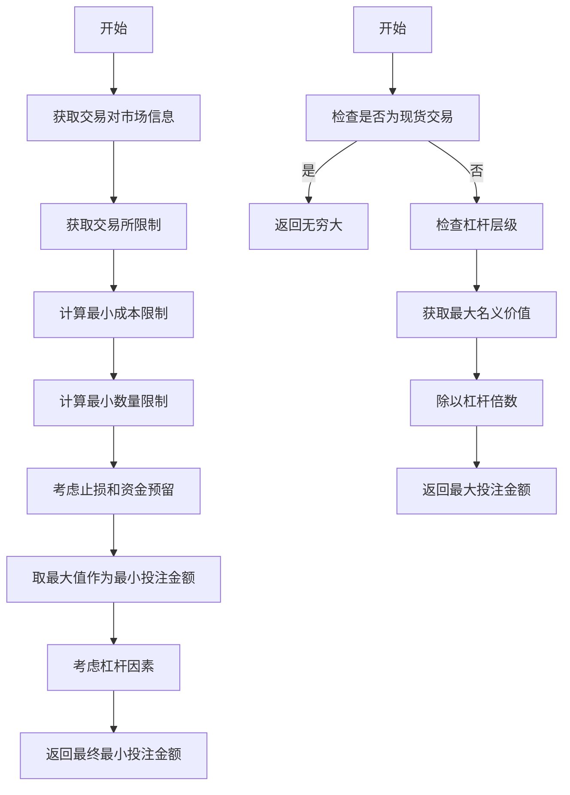

# 投注金额与资金校验

<cite>
**本文档引用的文件**  
- [freqtradebot.py](file://freqtrade/freqtradebot.py)
- [exchange.py](file://freqtrade/exchange/exchange.py)
- [wallets.py](file://freqtrade/wallets.py)
</cite>

## 目录
1. [投注金额计算与验证流程](#投注金额计算与验证流程)
2. [custom_stake_amount策略钩子调用机制](#custom_stake_amount策略钩子调用机制)
3. [最小与最大投注金额确定机制](#最小与最大投注金额确定机制)
4. [资金可用性检查逻辑](#资金可用性检查逻辑)
5. [异常场景处理](#异常场景处理)
6. [性能优化建议](#性能优化建议)

## 投注金额计算与验证流程

`get_valid_enter_price_and_stake`方法是投注金额计算的核心入口，负责协调价格、投注金额和杠杆的验证与调整。该方法首先确定入场价格，然后计算最小和最大投注金额限制，接着通过策略钩子调整投注金额，最后进行资金可用性验证。整个流程确保了交易请求符合交易所限制和用户资金状况。

**Section sources**
- [freqtradebot.py](file://freqtrade/freqtradebot.py#L1080-L1179)

## custom_stake_amount策略钩子调用机制

`custom_stake_amount`策略钩子在`get_valid_enter_price_and_stake`方法中被调用，其调用时机为新交易创建时（即`trade`参数为`None`）。该钩子接收多个参数，包括交易对、当前时间、当前价格、建议投注金额、最小投注金额、最大投注金额、杠杆倍数、入场标签和交易方向。策略实现可以基于这些参数动态计算投注金额，例如根据市场波动性或账户风险敞口调整投注规模。

```mermaid
sequenceDiagram
participant FreqtradeBot
participant Strategy
participant Wallets
FreqtradeBot->>FreqtradeBot : 确定入场价格
FreqtradeBot->>FreqtradeBot : 计算min/max投注金额
alt 新交易
FreqtradeBot->>Strategy : 调用custom_stake_amount
Strategy-->>FreqtradeBot : 返回调整后的投注金额
end
FreqtradeBot->>Wallets : 调用validate_stake_amount
Wallets-->>FreqtradeBot : 返回最终投注金额
FreqtradeBot-->> : 返回(价格, 金额, 杠杆)
```

**Diagram sources**
- [freqtradebot.py](file://freqtrade/freqtradebot.py#L1080-L1179)

**Section sources**
- [freqtradebot.py](file://freqtrade/freqtradebot.py#L1080-L1179)

## 最小与最大投注金额确定机制

最小投注金额（`min_stake_amount`）和最大投注金额（`max_stake_amount`）由交易所对象动态计算。`get_min_pair_stake_amount`方法结合止损率、杠杆倍数和交易所限制（如最小成本和最小数量）来确定最小投注金额。`get_max_pair_stake_amount`方法则主要基于交易所的杠杆层级（leverage tiers）中的最大名义价值（maxNotional）来确定最大投注金额。对于现货交易模式，最大投注金额通常设置为无穷大。



**Diagram sources**
- [exchange.py](file://freqtrade/exchange/exchange.py#L1000-L1022)

**Section sources**
- [exchange.py](file://freqtrade/exchange/exchange.py#L1000-L1022)

## 资金可用性检查逻辑

`wallets.validate_stake_amount`方法负责检查资金可用性，其逻辑在现货和期货模式下有所不同。在现货模式下，系统检查可用资金是否足够；在期货模式下，系统还需考虑已占用资金和最大开放交易数。该方法会检查投注金额是否低于最小限制或高于最大限制，并根据配置进行调整或拒绝交易。对于资金不足的情况，系统会抛出`DependencyException`异常。

**Section sources**
- [wallets.py](file://freqtrade/wallets.py#L0-L438)

## 异常场景处理

当出现资金不足或低于最小投注限制时，系统会进行相应处理。对于资金不足，`_check_available_stake_amount`方法会抛出`DependencyException`异常。对于投注金额过小，`validate_stake_amount`方法会记录警告并可能将投注金额调整至最小值，但如果调整幅度超过30%，则会直接拒绝交易以防止过度风险暴露。这些处理机制确保了交易系统的稳健性和风险控制。

**Section sources**
- [wallets.py](file://freqtrade/wallets.py#L0-L438)

## 性能优化建议

为减少频繁余额查询的开销，系统采用了多种优化策略。首先，余额信息被缓存，并设置了合理的刷新间隔（默认1小时）。其次，`get_available_stake_amount`等方法在计算时会复用已加载的余额数据，避免重复查询。建议在高频率交易场景下适当延长缓存时间，并在策略中批量处理交易请求，以进一步降低API调用频率和系统开销。

**Section sources**
- [wallets.py](file://freqtrade/wallets.py#L0-L438)
- [exchange.py](file://freqtrade/exchange/exchange.py#L1000-L1022)