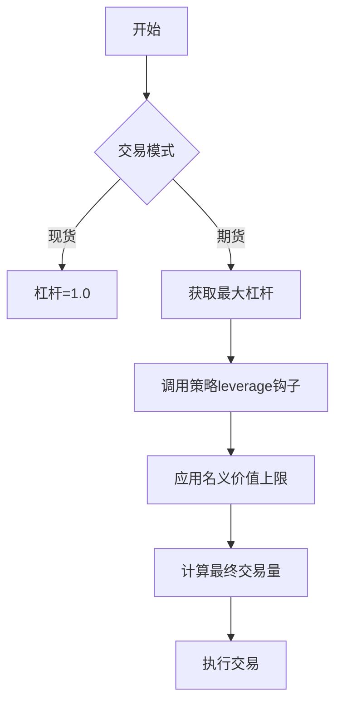

# 杠杆计算与管理

<cite>
**本文档引用文件**  
- [freqtradebot.py](file://freqtrade/freqtradebot.py)
- [exchange.py](file://freqtrade/exchange/exchange.py)
- [okx.py](file://freqtrade/exchange/okx.py)
- [interface.py](file://freqtrade/strategy/interface.py)
</cite>

## 目录
1. [杠杆值确定流程](#杠杆值确定流程)
2. [策略层杠杆钩子调用机制](#策略层杠杆钩子调用机制)
3. [杠杆对交易量的影响](#杠杆对交易量的影响)
4. [现货与期货模式差异](#现货与期货模式差异)
5. [名义价值上限限制](#名义价值上限限制)
6. [配置错误排查指南](#配置错误排查指南)

## 杠杆值确定流程
杠杆值的确定主要在`get_valid_enter_price_and_stake`方法中完成。该方法首先检查交易模式是否为现货模式，若非现货模式且为新交易（`trade is None`），则通过`exchange.get_max_leverage`获取当前交易对和投入金额对应的最大杠杆倍数。随后，若未传入外部指定的杠杆值（`leverage_`），则调用策略层的`leverage`钩子函数来确定杠杆值。最终，杠杆值会被限制在1.0到最大杠杆倍数之间。

**Section sources**
- [freqtradebot.py](file://freqtrade/freqtradebot.py#L1080-L1179)

## 策略层杠杆钩子调用机制
策略层通过实现`leverage`方法作为钩子函数，该方法在每次开仓时被调用。`leverage`函数接收多个参数，包括交易对、当前时间、当前价格、建议杠杆、最大杠杆、入场标签和交易方向。策略可以根据这些信息动态计算并返回一个合适的杠杆值。该返回值随后会被`get_valid_enter_price_and_stake`方法进行校验和限制，确保最终使用的杠杆值在交易所允许的范围内。

**Section sources**
- [interface.py](file://freqtrade/strategy/interface.py#L1200-L1230)

## 杠杆对交易量的影响
杠杆倍数直接影响实际交易量的计算。具体公式为：`amount = (stake_amount / price) * leverage`。其中，`stake_amount`是投入的保证金金额，`price`是入场价格，`leverage`是使用的杠杆倍数。这意味着，使用更高的杠杆可以在相同保证金下买入更多的基础货币数量，从而放大潜在的收益和风险。

**Section sources**
- [freqtradebot.py](file://freqtrade/freqtradebot.py#L862-L1063)

## 现货与期货模式差异
在现货（SPOT）模式下，杠杆功能被禁用，系统强制使用1.0倍杠杆。而在期货（FUTURES）模式下，杠杆功能被激活，系统会根据交易对和投入金额查询交易所的最大杠杆限制，并允许策略层通过钩子函数自定义杠杆值。此外，期货模式下的交易量计算会考虑杠杆因素，而现货模式则直接使用保证金金额除以价格。

**Section sources**
- [freqtradebot.py](file://freqtrade/freqtradebot.py#L1080-L1179)

## 名义价值上限限制
交易所通过`get_max_pair_stake_amount`方法对名义价值（即交易总额）设置上限。对于OKX等交易所，该上限由杠杆层级（leverage tiers）决定，计算公式为：`maxNotional / leverage`。这意味着，即使账户有足够的保证金，如果计算出的名义价值超过了该交易对在当前杠杆下的最大名义价值，交易也会被拒绝。此限制是交易所层面的硬性规定，用于控制市场风险。

**Diagram sources**
- [okx.py](file://freqtrade/exchange/okx.py#L183-L191)
- [exchange.py](file://freqtrade/exchange/exchange.py#L1015-L1022)

## 配置错误排查指南
当杠杆使用出现异常时，应首先检查配置文件中的`trading_mode`是否正确设置为`futures`。其次，确认策略文件中实现了`leverage`方法，并且返回值在1.0到交易所允许的最大杠杆之间。最后，检查日志中是否有`Stake amount too high`或`InvalidOrderException`等错误，这通常表明名义价值超过了交易所的限制，需要降低投入金额或使用更低的杠杆倍数。

**Section sources**
- [freqtradebot.py](file://freqtrade/freqtradebot.py#L1080-L1179)
- [exchange.py](file://freqtrade/exchange/exchange.py#L3505-L3530)