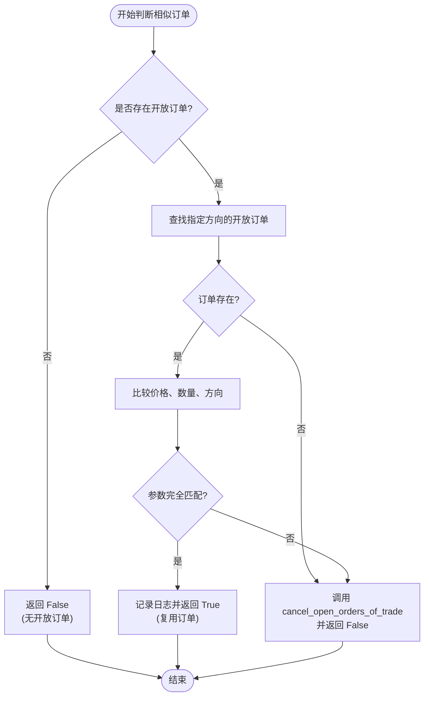
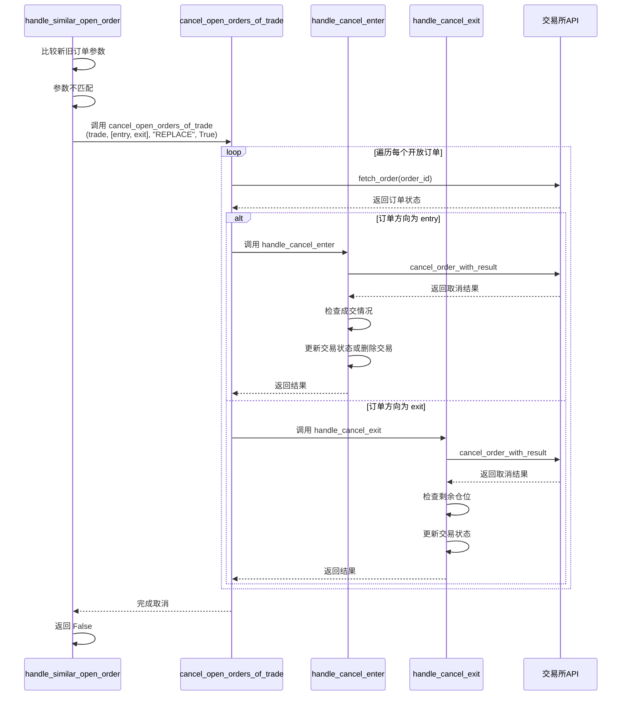

# 相似订单去重处理

<cite>
**Referenced Files in This Document**   
- [freqtradebot.py](file://freqtrade/freqtradebot.py)
- [trade_model.py](file://freqtrade/persistence/trade_model.py)
</cite>

## 目录
1. [订单去重逻辑概述](#订单去重逻辑概述)
2. [相似订单判断与复用机制](#相似订单判断与复用机制)
3. [订单替换与取消流程](#订单替换与取消流程)
4. [订单状态管理与数据一致性](#订单状态管理与数据一致性)
5. [实际交易场景中的最佳实践](#实际交易场景中的最佳实践)
6. [对DCA策略的支持能力分析](#对dca策略的支持能力分析)

## 订单去重逻辑概述

在自动化交易系统中，重复下单可能导致资金浪费、策略失效甚至违反交易所规则。Freqtrade通过`handle_similar_open_order`方法实现了智能的订单去重机制。该机制的核心在于通过比较新订单与现有开放订单的价格（price）、数量（amount）和方向（side）三个关键参数来判断订单的相似性，从而决定是复用现有订单还是取消并替换。

该逻辑主要在交易执行前进行判断，确保系统不会为同一交易对创建多个功能重复的订单。此机制不仅提高了交易效率，还保证了交易状态的清晰和可预测性，是系统稳定运行的重要保障。

**Section sources**
- [freqtradebot.py](file://freqtrade/freqtradebot.py#L1805-L1835)

## 相似订单判断与复用机制

`handle_similar_open_order`方法是订单去重逻辑的核心。当系统准备为一个已有开放订单的交易（Trade）创建新订单时，会调用此方法进行判断。

该方法首先检查交易对象的`has_open_orders`属性，确认是否存在任何开放订单。如果存在，它会调用`select_order`方法，根据指定的方向（side）和状态（is_open=True）查找最新的开放订单。随后，将新订单的`price`、`amount`和`side`与查找到的开放订单进行精确比较。

如果这三个参数完全匹配，系统会记录日志并直接返回`True`，表示找到了相似订单，从而复用现有订单，避免了不必要的重复下单。这种“完全匹配”的策略确保了只有在订单参数完全一致的情况下才会复用，避免了因微小差异导致的潜在风险。

**Diagram sources**
- [freqtradebot.py](file://freqtrade/freqtradebot.py#L1805-L1835)

**Section sources**
- [freqtradebot.py](file://freqtrade/freqtradebot.py#L1805-L1835)
- [trade_model.py](file://freqtrade/persistence/trade_model.py#L593-L600)
- [trade_model.py](file://freqtrade/persistence/trade_model.py#L1295-L1318)

## 订单替换与取消流程

当`handle_similar_open_order`方法发现新订单与现有开放订单不匹配时，它会触发一个订单替换流程。该流程的核心是调用`cancel_open_orders_of_trade`方法，该方法负责取消交易中所有指定方向的开放订单。

`cancel_open_orders_of_trade`方法会遍历交易对象的`open_orders`列表，对每一个开放订单，它首先通过交易所API查询订单的最新状态，以确保状态的准确性。然后，根据订单的方向（side），分别调用`handle_cancel_enter`或`handle_cancel_exit`方法进行具体的取消操作。

在取消过程中，系统会进行多重安全检查。例如，`handle_cancel_enter`会检查订单的已成交数量，如果已成交部分的金额过小，不足以支撑后续的平仓操作（低于交易所的最小交易额），则会放弃取消，以防止产生无法平仓的“僵尸”仓位。对于成功取消的订单，系统会更新交易状态，并根据情况决定是更新交易对象还是直接从数据库中删除该交易（例如，当订单完全未成交且是唯一订单时）。

**Diagram sources**
- [freqtradebot.py](file://freqtrade/freqtradebot.py#L1767-L1790)
- [freqtradebot.py](file://freqtrade/freqtradebot.py#L1837-L1925)
- [freqtradebot.py](file://freqtrade/freqtradebot.py#L1927-L2000)

**Section sources**
- [freqtradebot.py](file://freqtrade/freqtradebot.py#L1767-L1790)
- [freqtradebot.py](file://freqtrade/freqtradebot.py#L1837-L1925)
- [freqtradebot.py](file://freqtrade/freqtradebot.py#L1927-L2000)

## 订单状态管理与数据一致性

订单去重机制的可靠运行依赖于`Trade`模型提供的强大状态管理功能。`has_open_orders`和`select_order`这两个方法是实现数据一致性的关键。

`has_open_orders`属性通过过滤掉`stoploss`类型的订单，专门检查是否存在开放的入场或出场订单。它通过遍历`orders`列表并检查`ft_is_open`标志来确定状态，确保了状态判断的实时性和准确性。

`select_order`方法则提供了更精细的查询能力。它允许根据`order_side`（如'buy', 'sell', 'stoploss'）、`is_open`（是否开放）和`only_filled`（是否仅已成交）等条件来筛选订单，并返回符合条件的最新（最后一个）订单。这种方法确保了在去重逻辑中总能获取到最相关的订单进行比较。

此外，`Trade`模型还通过`orders`关系字段与`Order`模型建立了紧密的关联，保证了订单数据的完整性和一致性。所有对订单状态的更新（如取消、成交）都会通过`update_trade_state`等方法同步到`Trade`对象中，从而维护了整个交易生命周期的数据完整性。

**Section sources**
- [trade_model.py](file://freqtrade/persistence/trade_model.py#L593-L600)
- [trade_model.py](file://freqtrade/persistence/trade_model.py#L1295-L1318)
- [trade_model.py](file://freqtrade/persistence/trade_model.py#L1752-L1759)

## 实际交易场景中的最佳实践

在实际应用中，利用此去重机制的最佳实践包括：

1.  **策略设计**：在编写交易策略时，应确保在发出新的入场或出场信号前，检查当前交易的状态。可以利用`has_open_orders`来避免在已有订单的情况下重复发出信号。
2.  **参数稳定性**：保持订单参数（尤其是价格和数量）的计算逻辑稳定，可以最大化订单复用的机会，减少不必要的API调用和网络延迟。
3.  **错误处理**：理解`handle_cancel_enter`中的安全检查逻辑，避免因订单部分成交后金额过小而无法取消的情况。在策略中应设计合理的订单大小。
4.  **日志监控**：密切关注系统日志中关于“相似订单”和“订单取消”的信息，这有助于及时发现策略逻辑问题或市场异常。

## 对DCA策略的支持能力分析

该订单去重机制对DCA（平均成本）策略提供了良好的支持。DCA策略的核心是分批建仓，这会产生多个同方向的入场订单。

当DCA策略触发新的买入信号时，`handle_similar_open_order`会检查是否存在开放的买入订单。如果存在一个参数完全匹配的订单，系统会复用它，这在订单因网络延迟等原因未被立即确认时非常有用。如果新的DCA信号要求不同的价格或数量（例如，根据新的市场价调整），则会触发取消旧订单并创建新订单的流程，确保了建仓价格的准确性。

这种“精确匹配才复用”的策略，既保证了在订单状态不明时的稳健性，又允许策略根据市场变化灵活调整订单参数，完美契合了DCA策略的需求。