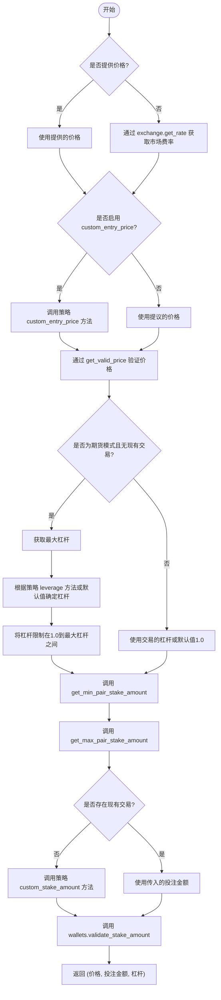
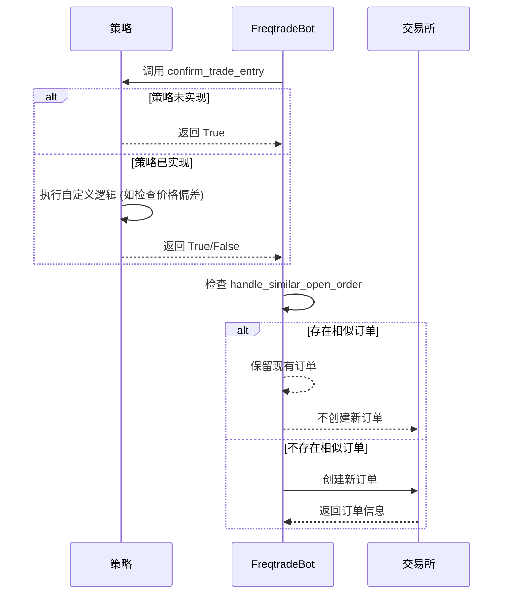

# 订单执行与价格计算

<cite>
**本文档中引用的文件**  
- [freqtradebot.py](file://freqtrade/freqtradebot.py)
- [interface.py](file://freqtrade/strategy/interface.py)
- [exchange.py](file://freqtrade/exchange/exchange.py)
- [BTCGridStrategy.py](file://yccai/wang_ge/BTCGridStrategy.py)
- [FreqaiExampleStrategy.py](file://freqtrade/templates/FreqaiExampleStrategy.py)
</cite>

## 目录
1. [订单执行逻辑分析](#订单执行逻辑分析)
2. [入场价格与投注金额计算](#入场价格与投注金额计算)
3. [用户确认与订单去重机制](#用户确认与订单去重机制)
4. [订单状态处理分支](#订单状态处理分支)

## 订单执行逻辑分析

`execute_entry` 方法是订单执行的核心入口，负责处理市场单（market）和限价单（limit）的创建。该方法根据交易方向（long/short）确定交易侧（buy/sell），并通过 `order_time_in_force["entry"]` 获取时间强制策略（time_in_force）。方法接收多个参数，包括交易对、投注金额、价格、是否做空、订单类型、入场标签、交易对象、执行模式和杠杆。

在执行过程中，首先调用 `get_valid_enter_price_and_stake` 方法获取有效的入场价格和投注金额。如果计算出的投注金额为零，则直接返回 `False`，表示订单创建失败。根据不同的执行模式（initial, pos_adjust, replace），生成相应的日志信息。随后，根据是否启用 `confirm_trade_entry` 钩子函数进行用户确认。如果存在现有交易且 `handle_similar_open_order` 检测到相似订单，则返回 `False` 以避免重复下单。

**Section sources**
- [freqtradebot.py](file://freqtrade/freqtradebot.py#L862-L1063)

## 入场价格与投注金额计算

`get_valid_enter_price_and_stake` 方法负责计算有效的入场价格和投注金额。当未提供价格时，通过 `exchange.get_rate` 获取当前市场费率。如果启用了自定义价格（`custom_entry_price`），则调用策略中的该方法，并通过 `get_valid_price` 确保价格在合理范围内（默认±2%）。对于非现货交易模式且无现有交易的情况，计算最大杠杆，并根据策略的 `leverage` 方法或默认值确定实际杠杆，最终将其限制在1.0到最大杠杆之间。

该方法还通过 `get_min_pair_stake_amount` 和 `get_max_pair_stake_amount` 获取最小和最大投注金额限制。如果不存在现有交易，调用 `custom_stake_amount` 方法获取自定义投注金额，否则使用传入的投注金额。最后，通过 `wallets.validate_stake_amount` 验证投注金额是否在允许范围内。

**Diagram sources**
- [freqtradebot.py](file://freqtrade/freqtradebot.py#L1080-L1179)
- [exchange.py](file://freqtrade/exchange/exchange.py#L1010-L1022)

## 用户确认与订单去重机制

`confirm_trade_entry` 钩子函数在下单前提供用户确认机制。该方法在 `IStrategy` 接口中定义，当未在具体策略中实现时，默认返回 `True`，即始终确认。策略可以重写此方法以添加自定义逻辑，例如检查当前价格与收盘价的偏差。例如，在 `FreqaiExampleStrategy` 中，做多时入场价格不能高于收盘价的1.0025倍，做空时不能低于收盘价的0.9975倍。在 `BTCGridStrategy` 中，通过检查价格回撤是否超过最大回撤限制来决定是否确认交易。

`handle_similar_open_order` 方法用于处理相似订单的去重。该方法检查交易是否存在未完成的订单，如果存在且新订单的价格、交易方向和数量与现有订单完全相同，则保留现有订单并返回 `True`。否则，取消现有订单并返回 `False`，以便创建新订单。

**Diagram sources**
- [interface.py](file://freqtrade/strategy/interface.py#L352-L386)
- [BTCGridStrategy.py](file://yccai/wang_ge/BTCGridStrategy.py#L370-L383)
- [FreqaiExampleStrategy.py](file://freqtrade/templates/FreqaiExampleStrategy.py#L270-L292)
- [freqtradebot.py](file://freqtrade/freqtradebot.py#L1805-L1835)

## 订单状态处理分支

`execute_entry` 方法在创建订单后，会根据订单状态进行不同的处理。如果订单状态为 "expired" 或 "rejected"，且已成交数量为0，则返回 `False` 表示订单完全失败。如果已成交数量大于0，则视为部分成交，使用 `safe_value_fallback` 更新成交数量和成交价格。如果订单状态为 "closed"，则同样更新成交数量和成交价格。

对于 "expired" 和 "rejected" 状态的订单，日志会记录相应的警告信息，包括订单状态、已成交数量、总数量和剩余数量。对于 "closed" 状态的订单，假设订单已立即完全成交。这些处理逻辑确保了系统能够正确处理各种订单状态，避免因订单状态异常而导致交易失败。

**Section sources**
- [freqtradebot.py](file://freqtrade/freqtradebot.py#L862-L1063)