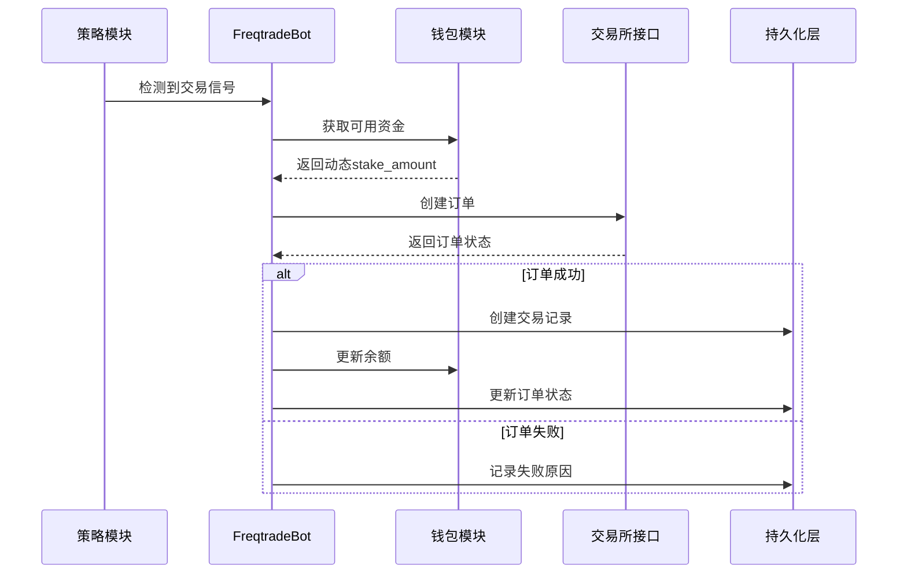
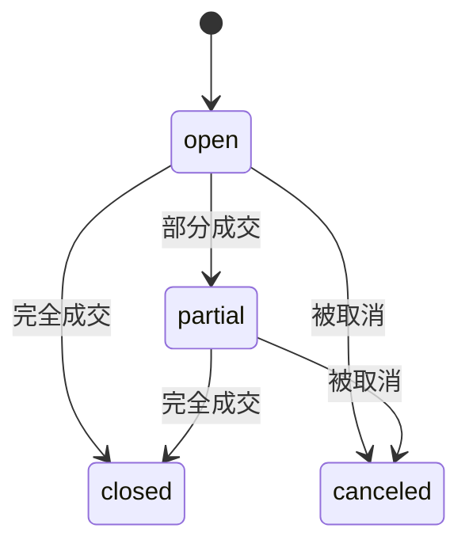
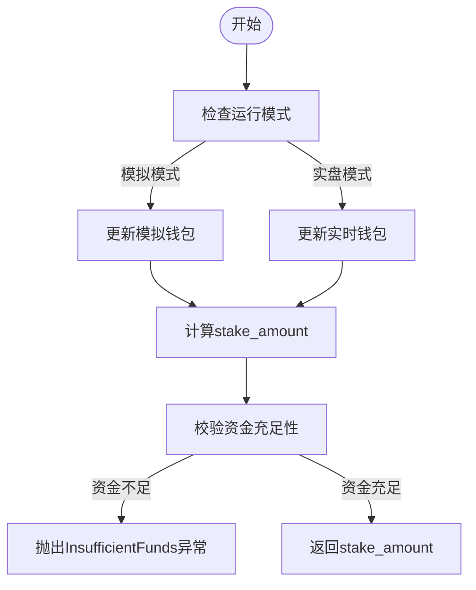
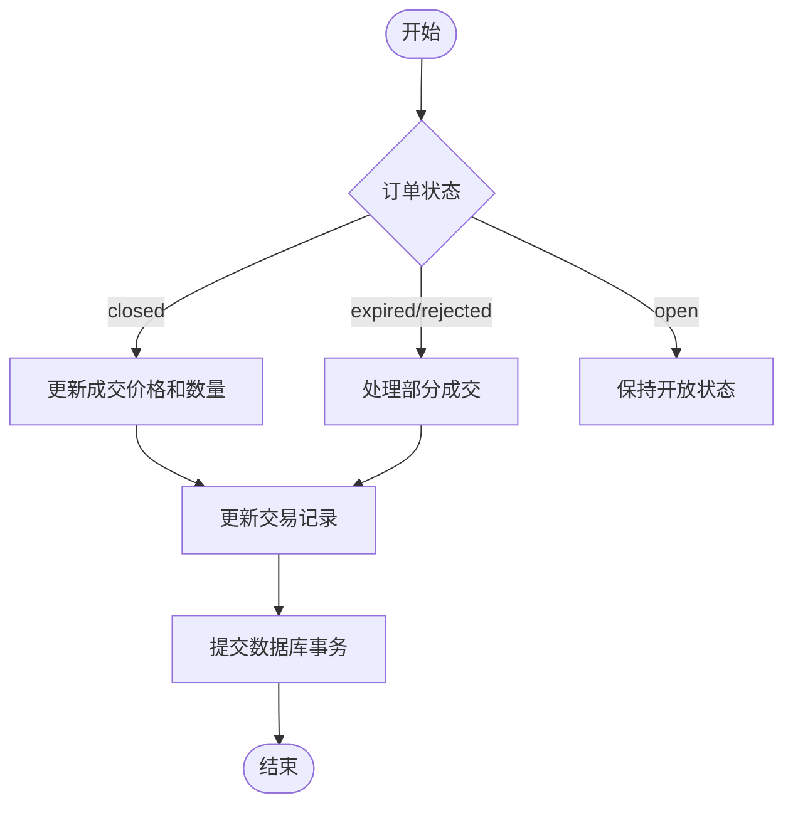

# 订单执行与状态管理

<cite>
**本文档引用的文件**
- [freqtradebot.py](file://freqtrade/freqtradebot.py)
- [wallets.py](file://freqtrade/wallets.py)
- [trade_model.py](file://freqtrade/persistence/trade_model.py)
- [models.py](file://freqtrade/persistence/models.py)
</cite>

## 目录
1. [订单生命周期概述](#订单生命周期概述)
2. [核心流程时序分析](#核心流程时序分析)
3. [订单与交易模型设计](#订单与交易模型设计)
4. [钱包与资金联动机制](#钱包与资金联动机制)
5. [订单状态变更处理](#订单状态变更处理)
6. [异常处理与恢复策略](#异常处理与恢复策略)

## 订单生命周期概述

订单生命周期管理是Freqtrade系统的核心功能，涵盖了从信号触发到订单执行、状态维护及异常处理的完整流程。该机制通过`create_trade`、`execute_entry`和`update_trade_state`等核心方法实现，确保交易指令的可靠执行和状态同步。

**Section sources**
- [freqtradebot.py](file://freqtrade/freqtradebot.py#L652-L710)
- [freqtradebot.py](file://freqtrade/freqtradebot.py#L862-L1063)
- [freqtradebot.py](file://freqtrade/freqtradebot.py#L2288-L2340)

## 核心流程时序分析

订单执行流程始于交易信号的检测，通过`create_trade`方法触发，随后调用`execute_entry`执行下单操作，最终通过`update_trade_state`维护订单状态。该流程确保了从信号到执行的完整闭环。

**Diagram sources**
- [freqtradebot.py](file://freqtrade/freqtradebot.py#L652-L710)
- [freqtradebot.py](file://freqtrade/freqtradebot.py#L862-L1063)
- [wallets.py](file://freqtrade/wallets.py#L0-L438)

## 订单与交易模型设计

持久化层的`Order`和`Trade`模型定义了订单和交易的数据结构，支持市价单、限价单等多种订单类型，并实现了开仓、部分成交、平仓、取消等状态机转换。

### 订单状态机

**Diagram sources**
- [trade_model.py](file://freqtrade/persistence/trade_model.py#L0-L799)
- [models.py](file://freqtrade/persistence/models.py#L0-L116)

### 数据库表结构

| 字段名 | 类型 | 描述 |
|--------|------|------|
| id | Integer | 主键 |
| ft_trade_id | Integer | 关联交易ID |
| ft_order_side | String | 订单方向（buy/sell/stoploss） |
| ft_pair | String | 交易对 |
| ft_is_open | Boolean | 是否开放 |
| order_id | String | 交易所订单ID |
| status | String | 订单状态（open/closed/canceled） |
| price | Float | 订单价格 |
| amount | Float | 订单数量 |
| filled | Float | 已成交数量 |
| remaining | Float | 剩余数量 |
| cost | Float | 订单成本 |
| order_date | DateTime | 订单创建时间 |
| order_filled_date | DateTime | 订单成交时间 |

**Section sources**
- [trade_model.py](file://freqtrade/persistence/trade_model.py#L0-L799)

## 钱包与资金联动机制

钱包模块（wallets.py）负责管理用户资金，与订单执行流程紧密联动。通过`get_trade_stake_amount`方法动态计算`stake_amount`，并校验可用资金。

### 动态stake_amount计算

**Diagram sources**
- [wallets.py](file://freqtrade/wallets.py#L0-L438)

### 资金校验逻辑

钱包模块通过`get_available_stake_amount`方法计算可用资金，考虑了已占用资金和可交易资金比例，确保订单执行不会超出可用余额。

**Section sources**
- [wallets.py](file://freqtrade/wallets.py#L0-L438)

## 订单状态变更处理

`update_trade_state`方法负责处理订单状态变更，包括订单成交、取消、部分成交等场景。该方法通过轮询交易所订单状态，更新本地数据库中的订单信息。

### 状态变更流程

**Diagram sources**
- [freqtradebot.py](file://freqtrade/freqtradebot.py#L2288-L2340)

## 异常处理与恢复策略

系统实现了完善的异常处理机制，包括InsufficientFunds资金不足、订单重试、stoploss_on_exchange挂单管理等。

### 常见错误恢复方案

| 错误类型 | 恢复策略 |
|---------|---------|
| InsufficientFunds | 更新钱包余额，重新计算可用资金 |
| 订单超时 | 取消订单，重新下单 |
| 交易所连接失败 | 重试连接，恢复订单状态 |
| 订单部分成交 | 更新交易记录，处理剩余数量 |

### stoploss_on_exchange挂单管理

当启用`stoploss_on_exchange`时，系统会在交易所创建止损单，通过`manage_trade_stoploss_orders`方法管理挂单状态，包括创建、取消和追踪止损。

**Section sources**
- [freqtradebot.py](file://freqtrade/freqtradebot.py#L862-L1063)
- [freqtradebot.py](file://freqtrade/freqtradebot.py#L2288-L2340)
- [wallets.py](file://freqtrade/wallets.py#L0-L438)