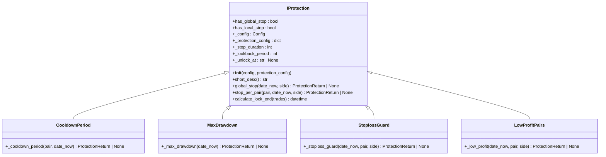
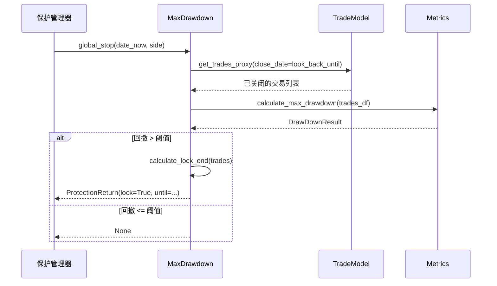

# 保护机制类型

<cite>
**本文档中引用的文件**  
- [iprotection.py](file://freqtrade/plugins/protections/iprotection.py)
- [cooldown_period.py](file://freqtrade/plugins/protections/cooldown_period.py)
- [max_drawdown_protection.py](file://freqtrade/plugins/protections/max_drawdown_protection.py)
- [stoploss_guard.py](file://freqtrade/plugins/protections/stoploss_guard.py)
- [low_profit_pairs.py](file://freqtrade/plugins/protections/low_profit_pairs.py)
- [trade_model.py](file://freqtrade/persistence/trade_model.py)
- [metrics.py](file://freqtrade/data/metrics.py)
</cite>

## 目录
1. [引言](#引言)
2. [保护插件接口契约](#保护插件接口契约)
3. [冷却期控制机制](#冷却期控制机制)
4. [最大回撤保护机制](#最大回撤保护机制)
5. [连续止损检测机制](#连续止损检测机制)
6. [低收益交易对过滤机制](#低收益交易对过滤机制)
7. [配置参数与运行行为](#配置参数与运行行为)
8. [总结](#总结)

## 引言
Freqtrade 提供了一套内置的保护插件系统，用于在交易过程中实施风险控制。这些保护机制通过分析历史交易数据，在特定条件满足时暂停交易，从而防止在不利市场条件下继续开仓。本文档详细解析了四种核心保护插件的实现机制：`cooldown_period`（冷却期）、`max_drawdown_protection`（最大回撤保护）、`stoploss_guard`（连续止损检测）和 `low_profit_pairs`（低收益交易对过滤）。所有保护插件都遵循 `IProtection` 接口定义的契约，确保了统一的调用方式和行为模式。

## 保护插件接口契约
所有保护插件都必须实现 `IProtection` 接口，该接口定义了保护机制的核心方法和属性。`IProtection` 是一个抽象基类，继承自 `LoggingMixin`，提供了日志记录功能。

### 核心方法契约
`IProtection` 接口强制要求所有子类实现以下三个抽象方法：

- **`short_desc()`**: 返回一个简短的描述字符串，用于启动时的消息输出。
- **`global_stop(date_now: datetime, side: LongShort)`**: 判断是否应全局停止所有交易对的开仓。如果返回 `ProtectionReturn` 对象且 `lock` 为 `True`，则整个机器人将暂停交易。
- **`stop_per_pair(pair: str, date_now: datetime, side: LongShort)`**: 判断是否应停止指定交易对的开仓。如果返回 `ProtectionReturn` 对象且 `lock` 为 `True`，则该交易对将被锁定。

### 公共时间窗口管理
`IProtection` 基类负责管理所有保护插件共用的时间窗口配置，包括：

- **`_lookback_period`**: 回溯分析的时间窗口，单位为分钟。插件通过此窗口查找历史交易。配置项 `lookback_period` 或 `lookback_period_candles` 用于设置此值。
- **`_stop_duration`**: 触发保护后，暂停交易的持续时间，单位为分钟。配置项 `stop_duration` 或 `stop_duration_candles` 用于设置此值。
- **`_unlock_at`**: 可选配置，指定一个固定时间点（如 "04:00"），保护将在该时间点自动解除，而非基于持续时间。

这些时间窗口的计算在 `__init__` 方法中完成，根据配置和策略的时间框架（`timeframe`）进行转换。例如，如果 `timeframe` 为 "5m"，`stop_duration_candles` 为 12，则 `_stop_duration` 将被计算为 60 分钟。

**图表来源**  
- [iprotection.py](file://freqtrade/plugins/protections/iprotection.py#L24-L140)
- [cooldown_period.py](file://freqtrade/plugins/protections/cooldown_period.py#L11-L73)
- [max_drawdown_protection.py](file://freqtrade/plugins/protections/max_drawdown_protection.py#L15-L101)
- [stoploss_guard.py](file://freqtrade/plugins/protections/stoploss_guard.py#L13-L108)
- [low_profit_pairs.py](file://freqtrade/plugins/protections/low_profit_pairs.py#L12-L101)

**章节来源**  
- [iprotection.py](file://freqtrade/plugins/protections/iprotection.py#L24-L140)

## 冷却期控制机制
`cooldown_period` 插件用于在交易对完成一次交易后，强制进入一段冷却期，在此期间内禁止再次开仓。这有助于防止过度交易和追涨杀跌。

### 实现机制
该插件通过 `stop_per_pair` 方法实现其逻辑。当被调用时，它会执行以下步骤：

1.  计算回溯时间点：`look_back_until = date_now - timedelta(minutes=self._lookback_period)`。
2.  查询数据库，获取指定交易对在过去 `_lookback_period` 分钟内已关闭的所有交易。
3.  如果存在符合条件的交易，则获取最近一次交易的 `close_date`。
4.  调用基类的 `calculate_lock_end` 方法，计算锁定结束时间。该方法会将最近一次交易的结束时间加上 `_stop_duration`，得到最终的解锁时间。
5.  返回一个 `ProtectionReturn` 对象，其中 `lock` 为 `True`，`until` 为计算出的解锁时间，`reason` 为相应的提示信息。

该插件仅支持按交易对（`has_local_stop=True`）的局部暂停，不支持全局暂停（`has_global_stop=False`）。

**章节来源**  
- [cooldown_period.py](file://freqtrade/plugins/protections/cooldown_period.py#L11-L73)

## 最大回撤保护机制
`max_drawdown_protection` 插件用于监控账户的整体回撤情况。当账户在指定时间窗口内的最大回撤超过预设阈值时，将触发全局暂停，停止所有交易对的开仓。

### 实现机制
该插件的核心是 `global_stop` 方法，其工作流程如下：

1.  计算回溯时间点：`look_back_until = date_now - timedelta(minutes=self._lookback_period)`。
2.  查询数据库，获取在过去 `_lookback_period` 分钟内已关闭的所有交易。
3.  将查询到的交易数据转换为 Pandas DataFrame。
4.  调用 `calculate_max_drawdown` 函数，计算这段时间内的最大回撤绝对值（`drawdown_abs`）。
5.  将计算出的回撤值与配置的阈值 `_max_allowed_drawdown` 进行比较。
6.  如果回撤值超过阈值，则调用 `calculate_lock_end` 方法，以所有相关交易中最晚的结束时间为基准，计算全局锁定的结束时间，并返回 `ProtectionReturn` 对象。

该插件实现了全局暂停（`has_global_stop=True`），但不支持按交易对的局部暂停（`has_local_stop=False`）。

**图表来源**  
- [max_drawdown_protection.py](file://freqtrade/plugins/protections/max_drawdown_protection.py#L15-L101)
- [trade_model.py](file://freqtrade/persistence/trade_model.py#L1641-L2125)
- [metrics.py](file://freqtrade/data/metrics.py#L190-L252)

**章节来源**  
- [max_drawdown_protection.py](file://freqtrade/plugins/protections/max_drawdown_protection.py#L15-L101)

## 连续止损检测机制
`stoploss_guard` 插件用于检测在短时间内发生的连续止损事件。当在指定时间窗口内，止损交易的数量超过阈值时，将触发保护，暂停相关交易对或全局交易。

### 统计检测逻辑
该插件的 `_stoploss_guard` 方法是其核心，其检测逻辑如下：

1.  计算回溯时间点。
2.  查询数据库，获取在过去 `_lookback_period` 分钟内已关闭的交易。
3.  筛选出满足以下条件的交易：
    - 退出原因（`exit_reason`）为 `stop_loss`、`trailing_stop_loss`、`stoploss_on_exchange` 或 `liquidation`。
    - 交易利润（`close_profit`）存在且小于配置的 `_profit_limit`（通常为0，即亏损）。
4.  如果配置了 `only_per_side=True`，则进一步筛选出与当前交易方向（`side`）相同的交易。
5.  统计满足条件的交易数量。如果数量达到或超过 `_trade_limit`，则触发保护。

该插件同时支持全局暂停和按交易对暂停。是否触发全局暂停由 `only_per_pair` 配置项控制。

**章节来源**  
- [stoploss_guard.py](file://freqtrade/plugins/protections/stoploss_guard.py#L13-L108)

## 低收益交易对过滤机制
`low_profit_pairs` 插件用于动态过滤掉那些在近期表现不佳、收益过低的交易对。它通过分析单个交易对的历史交易总利润来决定是否暂停该交易对的交易。

### 动态过滤策略
该插件的 `_low_profit` 方法实现了其过滤策略：

1.  计算回溯时间点。
2.  查询数据库，获取指定交易对在过去 `_lookback_period` 分钟内已关闭的所有交易。
3.  如果交易数量少于 `_trade_limit`，则不触发保护。
4.  计算这些交易的总利润（`profit`）。如果配置了 `only_per_side=True`，则只计算与当前交易方向相同的交易利润。
5.  将总利润与配置的 `_required_profit` 阈值进行比较。
6.  如果总利润低于阈值，则触发保护，锁定该交易对。

该策略有助于将资金从表现不佳的交易对转移到更有潜力的交易对上。

**章节来源**  
- [low_profit_pairs.py](file://freqtrade/plugins/protections/low_profit_pairs.py#L12-L101)

## 配置参数与运行行为
以下是各保护机制的关键配置参数、触发条件计算公式和运行时行为示例。

### 配置参数说明
| 保护机制 | 配置参数 | 类型 | 默认值 | 说明 |
| :--- | :--- | :--- | :--- | :--- |
| **通用** | `lookback_period` | int | 60 | 回溯分析的时间窗口（分钟） |
| | `lookback_period_candles` | int | 无 | 回溯分析的时间窗口（K线数量） |
| | `stop_duration` | int | 60 | 暂停交易的持续时间（分钟） |
| | `stop_duration_candles` | int | 无 | 暂停交易的持续时间（K线数量） |
| | `unlock_at` | str | 无 | 暂停交易的解除时间点（如 "04:00"） |
| **cooldown_period** | 无 | - | - | 仅使用通用参数 |
| **max_drawdown_protection** | `max_allowed_drawdown` | float | 0.0 | 允许的最大回撤阈值 |
| | `trade_limit` | int | 1 | 触发保护所需的最少交易数量 |
| **stoploss_guard** | `required_profit` | float | 0.0 | 触发保护的利润阈值（通常为负数） |
| | `trade_limit` | int | 10 | 触发保护所需的止损交易数量 |
| | `only_per_pair` | bool | False | 是否仅对单个交易对暂停（禁用全局暂停） |
| | `only_per_side` | bool | False | 是否仅针对特定交易方向（多/空）进行统计 |
| **low_profit_pairs** | `required_profit` | float | 0.0 | 触发保护的总利润阈值 |
| | `trade_limit` | int | 1 | 触发保护所需的最少交易数量 |
| | `only_per_side` | bool | False | 是否仅针对特定交易方向进行统计 |

### 触发条件与行为示例
- **`cooldown_period`**: 假设配置 `stop_duration=30`，`lookback_period=60`。当交易对 BTC/USDT 在 14:00 完成一笔交易后，从 14:00 开始的 30 分钟内（即 14:00-14:30），该交易对将被锁定，无法开新仓。
- **`max_drawdown_protection`**: 假设配置 `max_allowed_drawdown=0.1`（10%），`lookback_period=120`。如果在过去 2 小时内，所有交易的累计回撤达到 10.5%，则整个机器人将暂停交易 60 分钟（`stop_duration` 的默认值）。
- **`stoploss_guard`**: 假设配置 `trade_limit=3`，`required_profit=0.0`，`lookback_period=30`。如果在过去 30 分钟内，有 3 笔或更多交易以亏损（利润 < 0）的方式止损退出，则触发保护。
- **`low_profit_pairs`**: 假设配置 `required_profit=0.01`（1%），`trade_limit=5`。如果某个交易对在过去 60 分钟内的 5 笔交易总利润为 0.5%，低于 1% 的阈值，则该交易对将被锁定。

## 总结
Freqtrade 的保护插件系统通过 `IProtection` 接口提供了一套统一且灵活的风险控制框架。`cooldown_period` 通过简单的冷却期防止过度交易；`max_drawdown_protection` 从账户整体风险角度出发，实施严格的全局风控；`stoploss_guard` 和 `low_profit_pairs` 则分别从止损频率和收益表现两个维度，对交易对进行动态筛选和管理。这些机制在不同市场波动场景下各有优势：在震荡行情中，`cooldown_period` 和 `low_profit_pairs` 能有效减少无效交易；在单边下跌行情中，`max_drawdown_protection` 和 `stoploss_guard` 能及时止损，保护账户本金。合理配置和组合使用这些保护插件，可以显著提升交易策略的稳健性和抗风险能力。