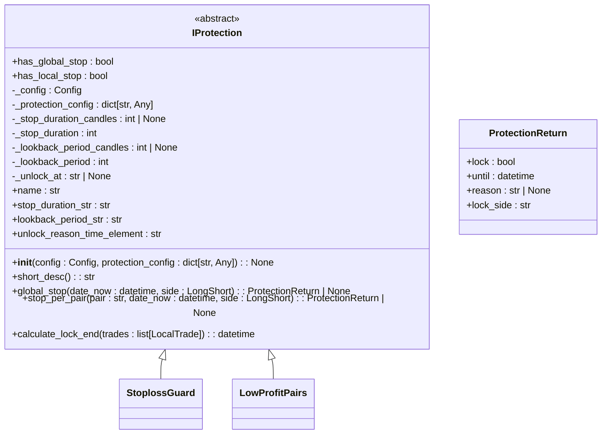
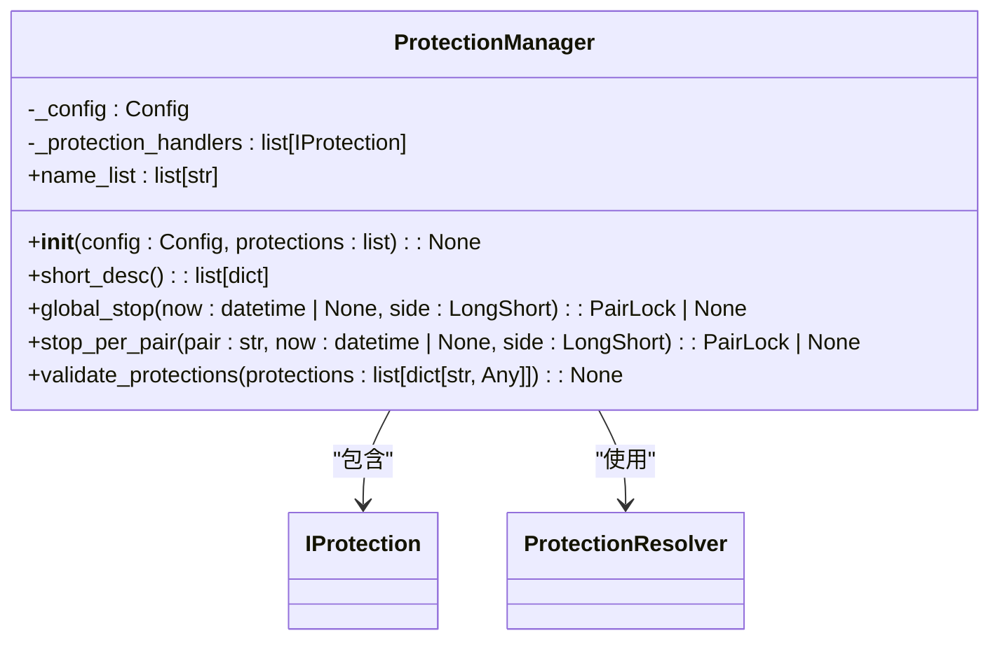
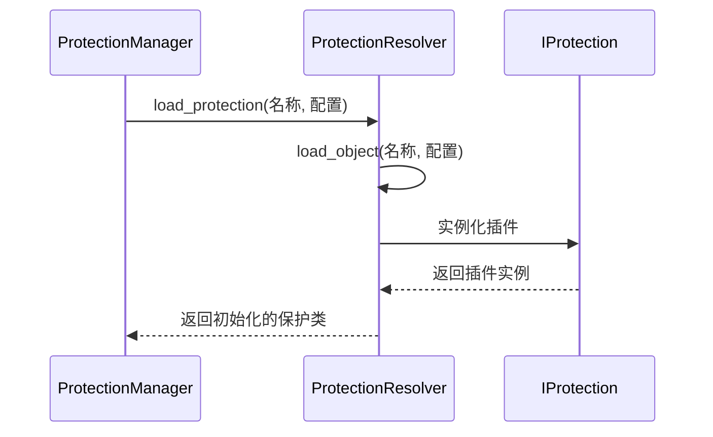
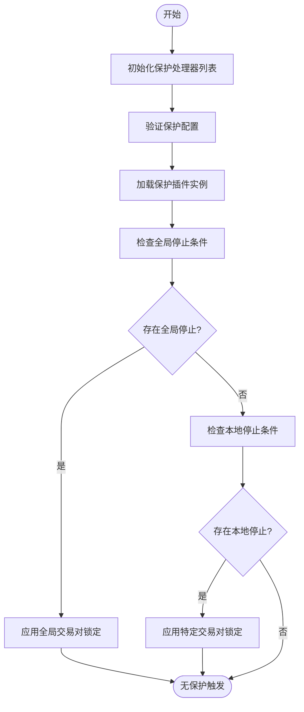

# 自定义保护插件开发

<cite>
**本文档引用的文件**  
- [iprotection.py](file://freqtrade/plugins/protections/iprotection.py)
- [protection_resolver.py](file://freqtrade/resolvers/protection_resolver.py)
- [protectionmanager.py](file://freqtrade/plugins/protectionmanager.py)
- [stoploss_guard.py](file://freqtrade/plugins/protections/stoploss_guard.py)
- [low_profit_pairs.py](file://freqtrade/plugins/protections/low_profit_pairs.py)
</cite>

## 目录
1. [引言](#引言)
2. [核心组件分析](#核心组件分析)
3. [自定义插件开发指南](#自定义插件开发指南)
4. [插件解析与加载机制](#插件解析与加载机制)
5. [保护管理器执行流程](#保护管理器执行流程)
6. [实战示例：大额转账监控插件](#实战示例大额转账监控插件)
7. [配置与集成](#配置与集成)

## 引言
本文档旨在为开发人员提供完整的自定义保护插件开发指南。基于Freqtrade框架的保护系统，详细说明如何通过继承抽象基类创建新的风险控制策略，并阐述插件的动态加载、批量评估和决策广播机制。

## 核心组件分析

### 抽象基类 IProtection
`IProtection` 是所有保护插件的抽象基类，定义了保护策略必须实现的核心接口和通用功能。



**Diagram sources**  
- [iprotection.py](file://freqtrade/plugins/protections/iprotection.py#L24-L140)

**Section sources**  
- [iprotection.py](file://freqtrade/plugins/protections/iprotection.py#L1-L141)

### 保护管理器 ProtectionManager
`ProtectionManager` 负责管理所有已加载的保护插件实例，协调它们的批量评估和结果聚合。



**Diagram sources**  
- [protectionmanager.py](file://freqtrade/plugins/protectionmanager.py#L19-L114)

**Section sources**  
- [protectionmanager.py](file://freqtrade/plugins/protectionmanager.py#L1-L115)

## 自定义插件开发指南

### 继承与实现核心方法
要创建新的保护插件，必须继承 `IProtection` 抽象基类并实现以下核心方法：

#### should_apply 方法（通过 stop_per_pair 实现）
`stop_per_pair` 方法决定了特定交易对是否应应用保护机制。该方法在每次交易决策前被调用。

```python
def stop_per_pair(
    self, pair: str, date_now: datetime, side: LongShort
) -> ProtectionReturn | None:
    """
    停止此交易对的交易（位置进入）
    必须在整个“冷却期”内评估为真。
    :return: ProtectionReturn对象，如果为真，则此交易对将被锁定
    """
```

#### trigger 方法（通过 global_stop 实现）
`global_stop` 方法决定了是否应全局停止所有交易对的交易。这通常用于系统级风险控制。

```python
def global_stop(self, date_now: datetime, side: LongShort) -> ProtectionReturn | None:
    """
    停止所有交易对的交易（位置进入）
    必须在整个“冷却期”内评估为真。
    """
```

### 配置参数处理
插件通过 `protection_config` 字典接收配置参数。基类自动处理以下通用参数：

- `stop_duration`: 停止持续时间（分钟）
- `stop_duration_candles`: 停止持续时间（蜡烛数）
- `lookback_period`: 回溯周期（分钟）
- `lookback_period_candles`: 回溯周期（蜡烛数）
- `unlock_at`: 解锁时间点（HH:MM格式）

**Section sources**  
- [iprotection.py](file://freqtrade/plugins/protections/iprotection.py#L35-L85)

## 插件解析与加载机制

### ProtectionResolver 解析器
`ProtectionResolver` 类负责动态加载和实例化保护插件，实现了插件系统的可扩展性。



**Diagram sources**  
- [protection_resolver.py](file://freqtrade/resolvers/protection_resolver.py#L15-L43)

**Section sources**  
- [protection_resolver.py](file://freqtrade/resolvers/protection_resolver.py#L1-L44)

### 命名规范要求
插件的命名必须遵循以下规范：
- 插件文件必须位于 `plugins/protections/` 目录下
- 类名必须与文件名匹配（不包括.py扩展名）
- 在配置中引用时，使用类名作为方法名

## 保护管理器执行流程

### 批量评估与结果聚合
`ProtectionManager` 按照配置顺序批量评估所有保护插件，并聚合结果。



**Diagram sources**  
- [protectionmanager.py](file://freqtrade/plugins/protectionmanager.py#L19-L114)

**Section sources**  
- [protectionmanager.py](file://freqtrade/plugins/protectionmanager.py#L1-L115)

### 决策广播机制
当保护条件被触发时，系统通过 `PairLocks.lock_pair` 方法广播决策，阻止相关交易对的交易。

## 实战示例：大额转账监控插件

### 插件设计思路
创建一个基于链上大额转账监控的流动性风险预警插件，当检测到特定地址的大额转账时，暂停相关交易对的交易。

```python
class LargeTransferMonitor(IProtection):
    has_global_stop = False
    has_local_stop = True
    
    def __init__(self, config: Config, protection_config: dict[str, Any]) -> None:
        super().__init__(config, protection_config)
        self._threshold = protection_config.get("threshold", 100000)  # 大额阈值
        self._monitor_address = protection_config.get("monitor_address", "")
    
    def short_desc(self) -> str:
        return f"{self.name} - 大额转账监控，阈值 {self._threshold} USDT"
    
    def stop_per_pair(
        self, pair: str, date_now: datetime, side: LongShort
    ) -> ProtectionReturn | None:
        # 模拟链上数据查询
        large_transfer_detected = self._check_large_transfer(date_now)
        
        if large_transfer_detected:
            until = self.calculate_lock_end([LocalTrade()])
            return ProtectionReturn(
                lock=True,
                until=until,
                reason=f"检测到大额转账，暂停交易 {self.unlock_reason_time_element}",
                lock_side="*"
            )
        return None
    
    def _check_large_transfer(self, date_now: datetime) -> bool:
        # 实现链上数据监控逻辑
        # 这里简化为模拟检测
        return False  # 实际实现应查询区块链数据
```

**Section sources**  
- [iprotection.py](file://freqtrade/plugins/protections/iprotection.py#L24-L140)
- [stoploss_guard.py](file://freqtrade/plugins/protections/stoploss_guard.py#L1-L109)

## 配置与集成

### 插件配置注入
在策略配置文件中添加保护插件配置：

```json
{
  "protections": [
    {
      "method": "LargeTransferMonitor",
      "threshold": 50000,
      "monitor_address": "0x123...",
      "lookback_period": 60,
      "stop_duration": 30
    }
  ]
}
```

### 运行时集成
1. 将插件文件 `large_transfer_monitor.py` 放入 `plugins/protections/` 目录
2. 在配置文件中引用插件类名
3. 启动交易机器人，系统将自动加载和初始化插件

**Section sources**  
- [protectionmanager.py](file://freqtrade/plugins/protectionmanager.py#L1-L115)
- [protection_resolver.py](file://freqtrade/resolvers/protection_resolver.py#L1-L44)