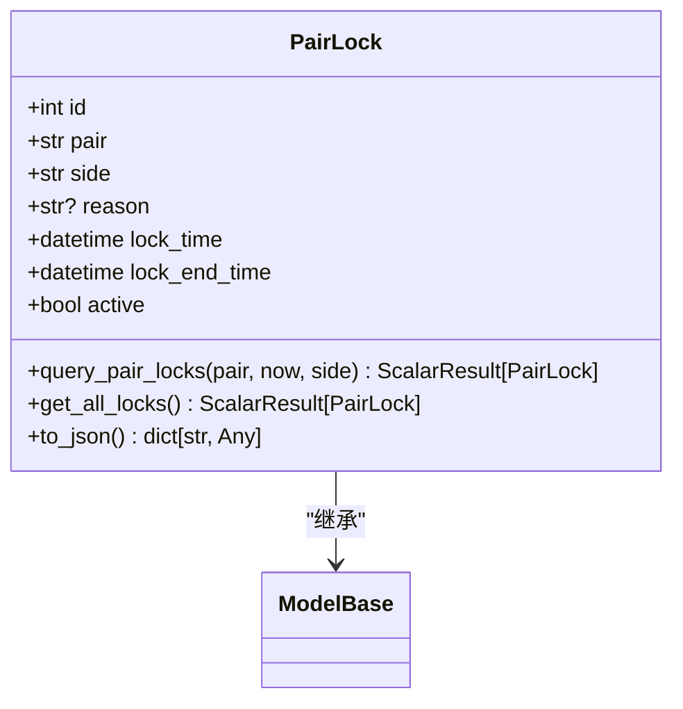
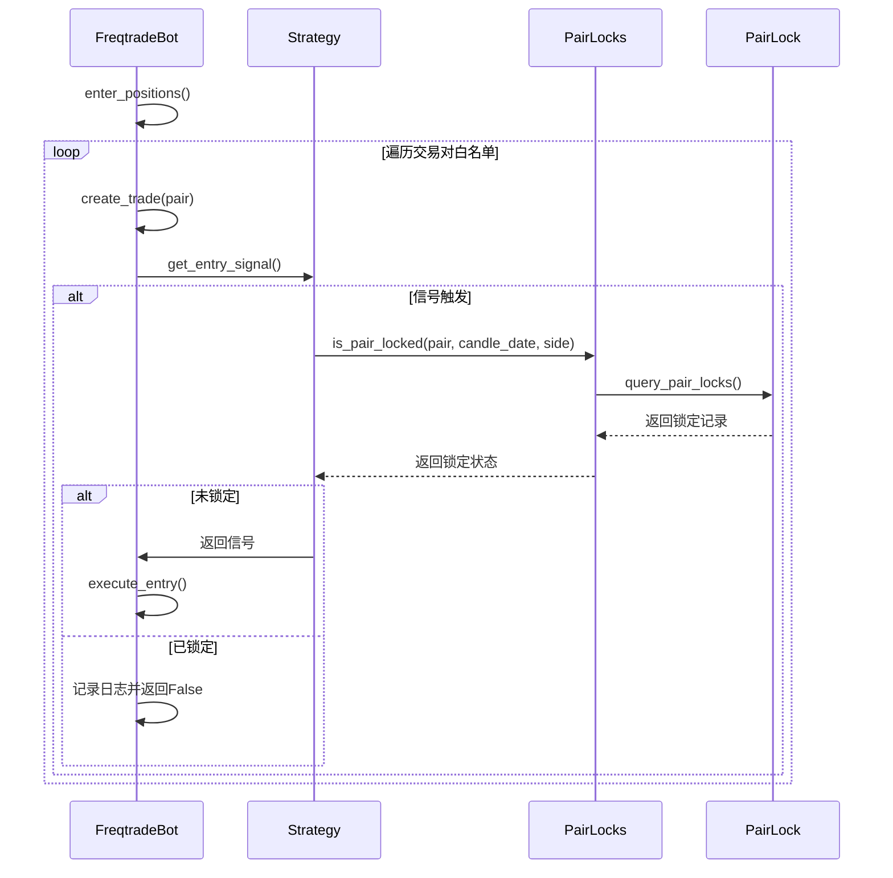
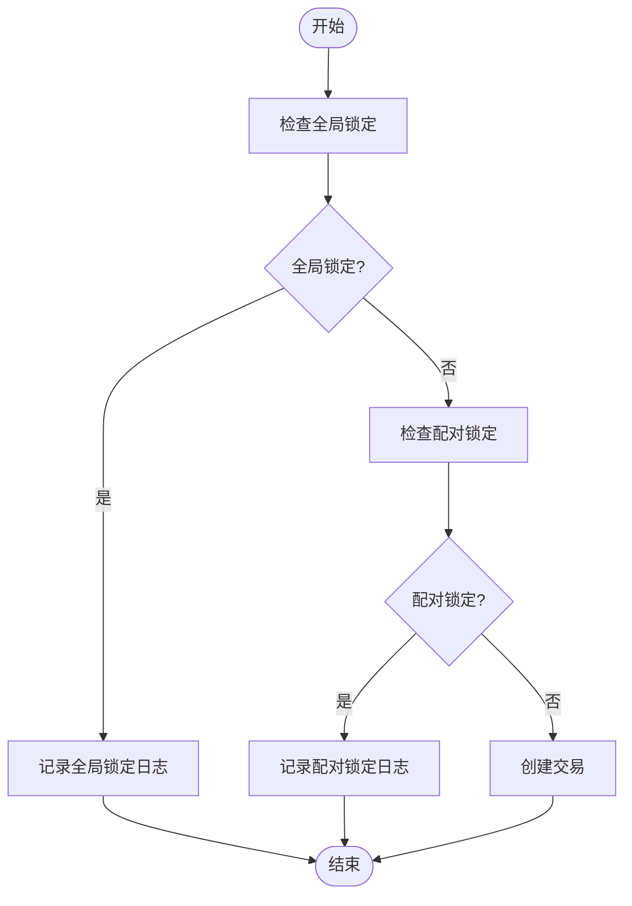

# 配对锁定机制

<cite>
**本文档中引用的文件**  
- [pairlock.py](file://freqtrade/persistence/pairlock.py)
- [pairlock_middleware.py](file://freqtrade/persistence/pairlock_middleware.py)
- [freqtradebot.py](file://freqtrade/freqtradebot.py)
- [models.py](file://freqtrade/persistence/models.py)
- [base.py](file://freqtrade/persistence/base.py)
</cite>

## 目录
1. [引言](#引言)
2. [配对锁定数据结构设计](#配对锁定数据结构设计)
3. [交易流程中的拦截机制](#交易流程中的拦截机制)
4. [全局锁定与配对级别锁定](#全局锁定与配对级别锁定)
5. [数据库事务与锁竞争规避](#数据库事务与锁竞争规避)
6. [锁定记录管理最佳实践](#锁定记录管理最佳实践)
7. [结论](#结论)

## 引言
配对锁定机制是Freqtrade交易系统中的关键安全组件，用于在特定条件下阻止交易对的交易活动。该机制通过数据库持久化存储锁定状态，在交易创建入口处进行拦截检查，有效防止在不利市场条件或系统维护期间执行交易。本文档深入解析配对锁定的实现原理、数据结构设计和在交易流程中的作用。

## 配对锁定数据结构设计

配对锁定模型（PairLock）定义了交易对锁定的核心数据结构，包含交易对、锁定原因、过期时间等关键字段。该模型继承自ModelBase，使用SQLAlchemy ORM进行数据库映射。



**Diagram sources**
- [pairlock.py](file://freqtrade/persistence/pairlock.py#L10-L77)

**Section sources**
- [pairlock.py](file://freqtrade/persistence/pairlock.py#L10-L77)

### 核心字段定义
- **pair**: 交易对名称，如"ETH/BTC"，使用String(25)类型并建立索引
- **side**: 锁定方向，可为"long"、"short"或"*"（双向），默认为"*"
- **reason**: 锁定原因描述，可为空，最大长度255字符
- **lock_time**: 锁定开始时间，不可为空
- **lock_end_time**: 锁定结束时间，不可为空并建立索引
- **active**: 锁定状态标志，布尔类型，默认为True并建立索引

### 数据库交互方法
- **query_pair_locks**: 查询指定交易对的当前有效锁定，通过组合过滤条件实现高效查询
- **get_all_locks**: 获取所有锁定记录，包括已过期的记录
- **to_json**: 将锁定对象转换为JSON格式，便于API输出

## 交易流程中的拦截机制

配对锁定机制在交易创建流程中扮演着关键的拦截角色，通过PairLockMiddleware在create_trade入口处检查交易对的锁定状态。



**Diagram sources**
- [freqtradebot.py](file://freqtrade/freqtradebot.py#L602-L710)
- [pairlock_middleware.py](file://freqtrade/persistence/pairlock_middleware.py#L167-L189)
- [pairlock.py](file://freqtrade/persistence/pairlock.py#L40-L60)

**Section sources**
- [freqtradebot.py](file://freqtrade/freqtradebot.py#L602-L710)
- [pairlock_middleware.py](file://freqtrade/persistence/pairlock_middleware.py#L167-L189)

### 拦截流程分析
1. **入口检查**: 在`enter_positions`方法中，首先检查是否存在全局锁定
2. **配对检查**: 对每个交易对调用`create_trade`方法
3. **信号验证**: 执行策略的`get_entry_signal`获取交易信号
4. **锁定验证**: 通过`is_pair_locked`方法检查交易对是否被锁定
5. **决策执行**: 若未锁定则执行交易，否则记录日志并跳过

### 时间处理逻辑
锁定检查考虑了K线时间对齐问题，通过`timeframe_to_next_date`将锁定时间向上取整到下一个K线周期，避免在K线切换时出现信号延迟执行的漏洞。

## 全局锁定与配对级别锁定

配对锁定系统支持两种锁定级别：全局锁定和配对级别锁定，满足不同场景的需求。



**Diagram sources**
- [freqtradebot.py](file://freqtrade/freqtradebot.py#L602-L650)
- [pairlock_middleware.py](file://freqtrade/persistence/pairlock_middleware.py#L157-L165)

**Section sources**
- [freqtradebot.py](file://freqtrade/freqtradebot.py#L602-L650)
- [pairlock_middleware.py](file://freqtrade/persistence/pairlock_middleware.py#L157-L165)

### 全局锁定
- 使用特殊交易对"*"表示
- 影响所有交易对的交易活动
- 在`enter_positions`中优先检查
- 通常用于系统维护或极端市场条件

### 配对级别锁定
- 针对特定交易对
- 可以指定锁定方向（做多、做空或双向）
- 在`create_trade`中检查
- 常用于保护特定资产或执行策略限制

### 锁定优先级
全局锁定具有最高优先级，即使某个交易对没有单独锁定，只要存在全局锁定，所有交易创建都会被阻止。这种设计确保了系统级安全措施的强制执行。

## 数据库事务与锁竞争规避

配对锁定机制在数据库事务处理中采用了多种策略来避免锁竞争，确保系统的高并发性能。

### 事务处理策略
- **读写分离**: 查询操作使用`ScalarResult`返回结果集，减少数据库连接占用
- **批量提交**: 多个锁定操作可以批量提交，减少数据库I/O开销
- **索引优化**: 在`lock_end_time`和`active`字段上建立索引，加速锁定状态查询

### 锁竞争规避
- **乐观锁**: 使用`active`标志位而非数据库行锁，减少锁冲突
- **无锁读取**: 在非数据库模式下（如回测），使用内存列表存储锁定状态
- **异步处理**: 锁定状态检查与交易执行分离，避免长时间持有数据库连接

```mermaid
erDiagram
PAIRLOCKS {
int id PK
string pair
string side
string? reason
datetime lock_time
datetime lock_end_time
bool active
}
PAIRLOCKS ||--o{ TRADES : "影响"
```

**Diagram sources**
- [pairlock.py](file://freqtrade/persistence/pairlock.py#L10-L77)
- [models.py](file://freqtrade/persistence/models.py#L1-L116)

**Section sources**
- [pairlock.py](file://freqtrade/persistence/pairlock.py#L10-L77)
- [models.py](file://freqtrade/persistence/models.py#L1-L116)

## 锁定记录管理最佳实践

### 查询锁定记录
- 使用`get_all_locks`方法获取所有锁定记录
- 通过`query_pair_locks`查询特定交易对的当前锁定状态
- 利用`get_pair_longest_lock`获取特定交易对的最长锁定记录

### 手动解除锁定
- `unlock_pair`: 解除指定交易对的所有锁定
- `unlock_reason`: 根据原因批量解除锁定
- 操作会将`active`标志位设置为False而非删除记录，便于审计

### 自动过期管理
- 系统自动检查`lock_end_time`与当前时间
- 过期锁定在查询时自动过滤（`lock_end_time > now`）
- 定期清理任务可归档或删除过期记录

### 最佳实践建议
1. **合理设置过期时间**: 避免设置过长的锁定时间影响正常交易
2. **明确锁定原因**: 提供清晰的`reason`便于后续分析和审计
3. **监控锁定状态**: 定期检查锁定记录，确保没有意外的长期锁定
4. **测试锁定逻辑**: 在策略开发中充分测试锁定机制的影响

## 结论
配对锁定机制是Freqtrade系统中重要的安全控制组件，通过精心设计的数据结构和高效的拦截流程，有效保护交易系统免受不利条件的影响。该机制支持灵活的锁定策略，从全局锁定到配对级别锁定，满足不同场景的需求。通过优化的数据库事务处理和锁竞争规避策略，确保了系统在高并发环境下的稳定性和性能。合理的锁定记录管理实践有助于维护系统的健康运行和可审计性。