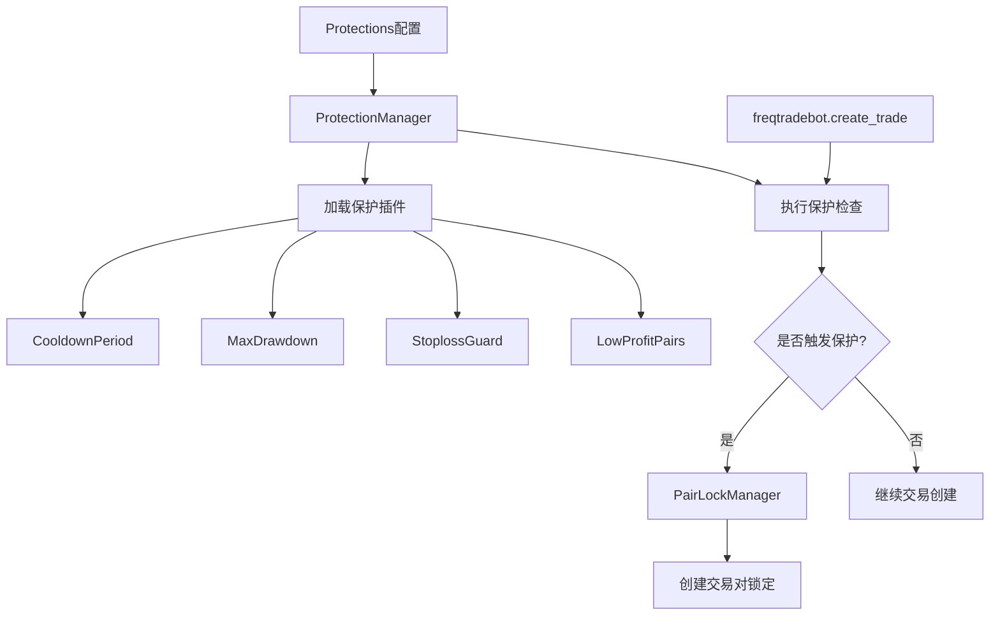
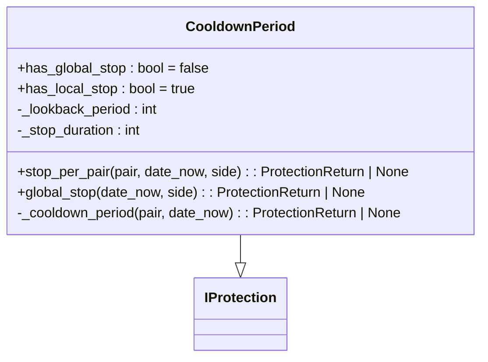
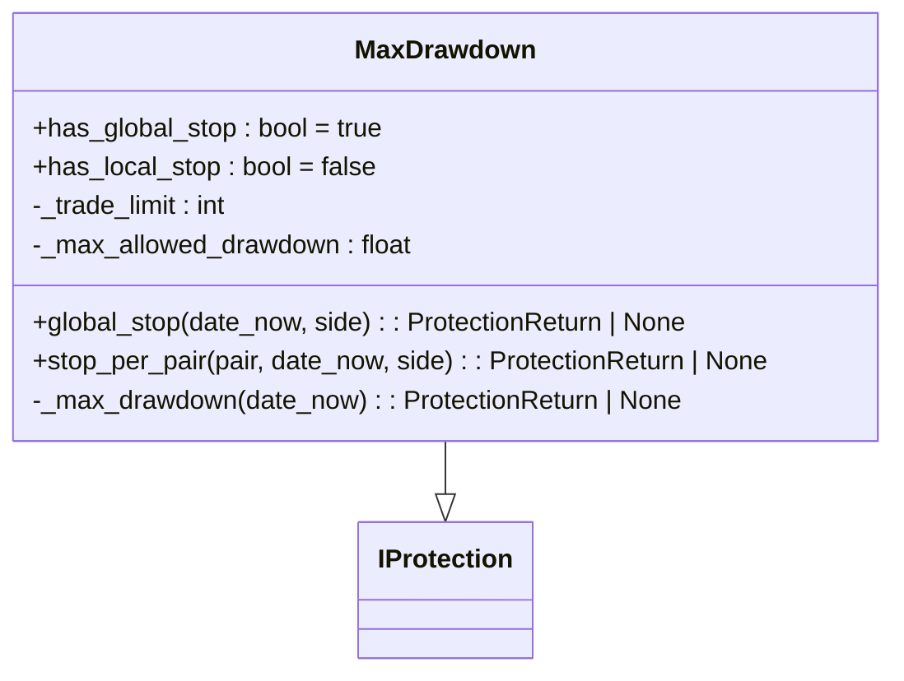
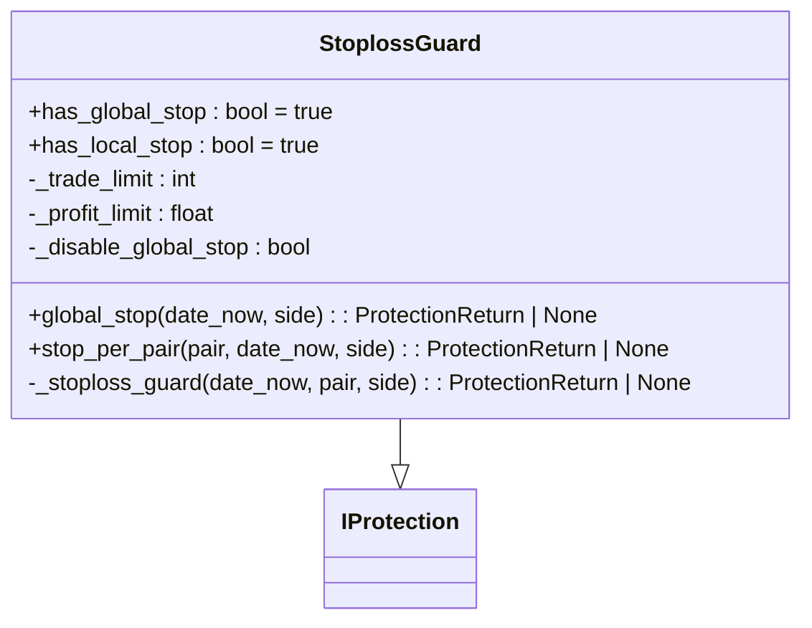
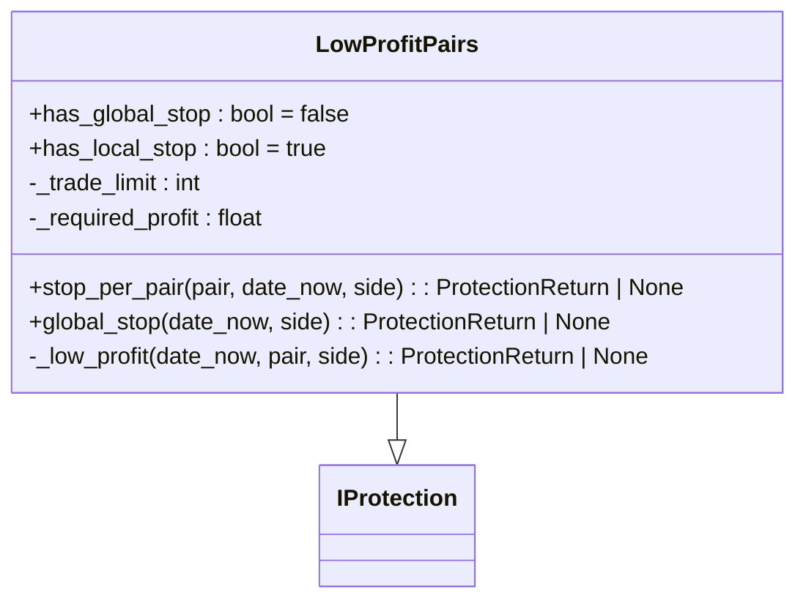
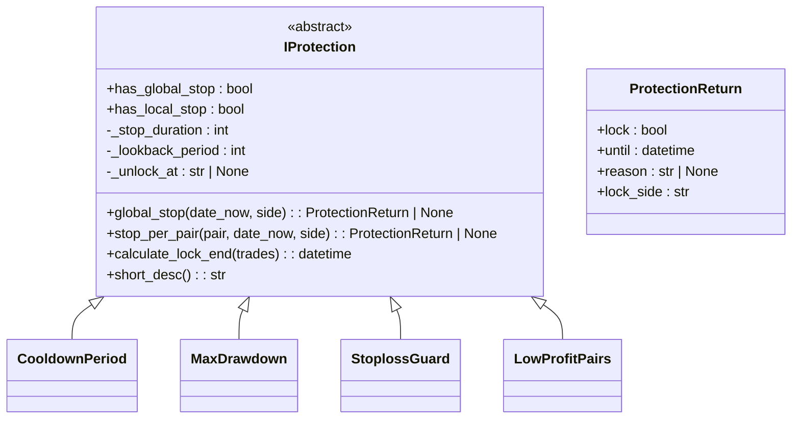
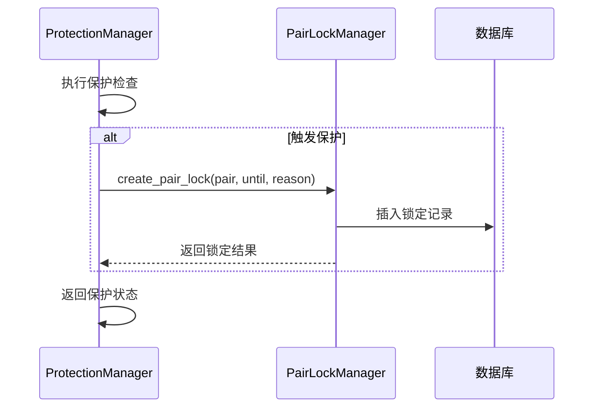
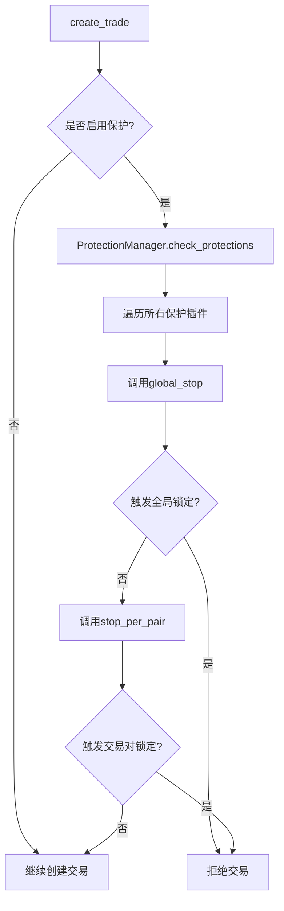
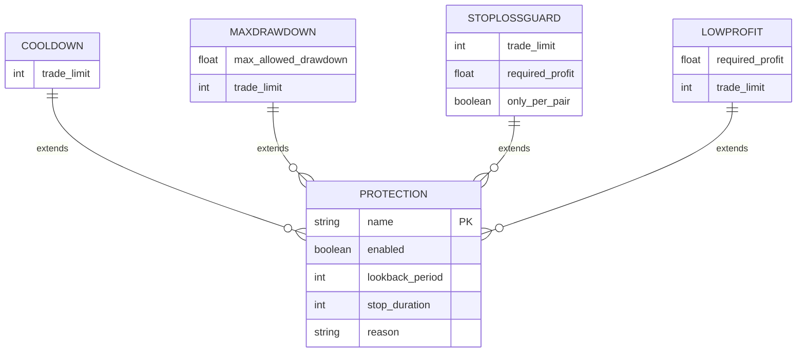

# 风险管理与保护机制

<cite>
**本文档引用文件**  
- [freqtradebot.py](file://freqtrade/freqtradebot.py)
- [protectionmanager.py](file://freqtrade/plugins/protectionmanager.py)
- [iprotection.py](file://freqtrade/plugins/protections/iprotection.py)
- [cooldown_period.py](file://freqtrade/plugins/protections/cooldown_period.py)
- [max_drawdown_protection.py](file://freqtrade/plugins/protections/max_drawdown_protection.py)
- [stoploss_guard.py](file://freqtrade/plugins/protections/stoploss_guard.py)
- [low_profit_pairs.py](file://freqtrade/plugins/protections/low_profit_pairs.py)
- [pairlock.py](file://freqtrade/persistence/pairlock.py)
- [pairlock_middleware.py](file://freqtrade/persistence/pairlock_middleware.py)
- [config_schema.py](file://freqtrade/config_schema/config_schema.py)
</cite>

## 目录
1. [引言](#引言)
2. [保护机制架构概览](#保护机制架构概览)
3. [ProtectionManager 核心组件分析](#protectionmanager-核心组件分析)
4. [保护插件类型与实现](#保护插件类型与实现)
5. [PairLock 交易对锁定机制](#pairlock-交易对锁定机制)
6. [保护规则拦截逻辑分析](#保护规则拦截逻辑分析)
7. [配置结构与触发条件](#配置结构与触发条件)
8. [自定义保护插件开发指南](#自定义保护插件开发指南)
9. [极端行情应对策略](#极端行情应对策略)
10. [资金安全最佳实践](#资金安全最佳实践)

## 引言
Freqtrade 提供了一套完整的多层次风险控制体系，旨在防止在不利市场条件下进行交易，避免过度亏损和频繁止损。该体系通过 ProtectionManager 统一管理各类保护插件，并结合 PairLock 机制实现交易对级别的锁定策略。本文档将深入解析其内部实现机制、调用链路和配置方法。

## 保护机制架构概览

**Diagram sources**
- [protectionmanager.py](file://freqtrade/plugins/protectionmanager.py)
- [pairlock.py](file://freqtrade/persistence/pairlock.py)

## ProtectionManager 核心组件分析

ProtectionManager 是整个保护系统的核心协调者，负责加载、初始化和调度所有启用的保护插件。它根据配置动态实例化各类保护策略，并在交易创建前统一执行检查。

**Section sources**
- [protectionmanager.py](file://freqtrade/plugins/protectionmanager.py)
- [resolvers/protection_resolver.py](file://freqtrade/resolvers/protection_resolver.py)

## 保护插件类型与实现

### 冷却期保护 (CooldownPeriod)
防止在最近交易关闭后立即重新开仓，避免短期重复亏损。

**Diagram sources**
- [cooldown_period.py](file://freqtrade/plugins/protections/cooldown_period.py)

### 最大回撤保护 (MaxDrawdown)
当近期交易累计回撤超过设定阈值时，全局暂停所有交易。

**Diagram sources**
- [max_drawdown_protection.py](file://freqtrade/plugins/protections/max_drawdown_protection.py)

### 止损守卫 (StoplossGuard)
监控频繁止损行为，当指定周期内止损次数过多且盈利不足时触发保护。

**Diagram sources**
- [stoploss_guard.py](file://freqtrade/plugins/protections/stoploss_guard.py)

### 低利润对保护 (LowProfitPairs)
针对特定交易对，若近期交易总利润低于阈值，则暂停该对交易。

**Diagram sources**
- [low_profit_pairs.py](file://freqtrade/plugins/protections/low_profit_pairs.py)

### 保护插件基类 (IProtection)
定义所有保护插件必须实现的接口和公共功能。

**Diagram sources**
- [iprotection.py](file://freqtrade/plugins/protections/iprotection.py)

## PairLock 交易对锁定机制

PairLock 机制用于记录和管理被保护规则锁定的交易对。它支持交易对级别和全局级别的锁定，并持久化到数据库中。

**Section sources**
- [pairlock.py](file://freqtrade/persistence/pairlock.py)
- [pairlock_middleware.py](file://freqtrade/persistence/pairlock_middleware.py)

## 保护规则拦截逻辑分析

### create_trade 入口拦截流程

**Section sources**
- [freqtradebot.py](file://freqtrade/freqtradebot.py#L1500-L1550)

## 配置结构与触发条件

### Protections 配置结构

**Section sources**
- [config_schema.py](file://freqtrade/config_schema/config_schema.py#L200-L300)

## 自定义保护插件开发指南

开发者可通过继承 `IProtection` 基类创建自定义保护策略。需实现 `global_stop` 和 `stop_per_pair` 方法，并正确设置 `has_global_stop` 和 `has_local_stop` 标志位。

**Section sources**
- [iprotection.py](file://freqtrade/plugins/protections/iprotection.py)
- [protectionmanager.py](file://freqtrade/plugins/protectionmanager.py)

## 极端行情应对策略

### 熔断机制
通过 MaxDrawdown 保护实现全局熔断，当账户回撤超过安全阈值时自动暂停所有交易。

### API 限流应对
保护系统本身不直接处理 API 限流，但可通过 StoplossGuard 防止因频繁交易导致的限流风险。

**Section sources**
- [max_drawdown_protection.py](file://freqtrade/plugins/protections/max_drawdown_protection.py)
- [stoploss_guard.py](file://freqtrade/plugins/protections/stoploss_guard.py)

## 资金安全最佳实践

1. 合理配置最大回撤阈值（建议 5%-10%）
2. 设置适当的冷却期防止报复性交易
3. 使用 StoplossGuard 避免连续止损
4. 定期审查保护规则的有效性
5. 在实盘环境中逐步调整保护参数