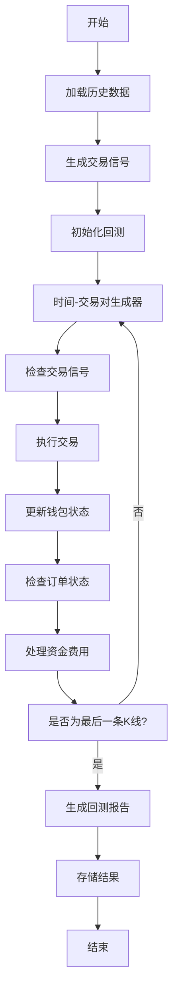
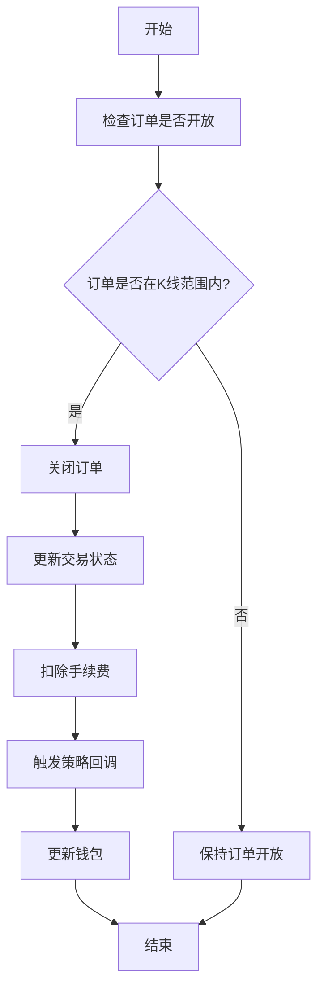
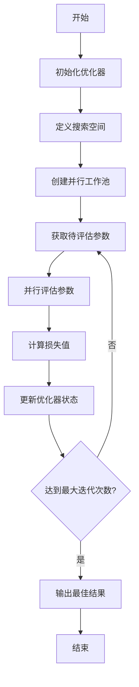

# 回测与参数优化

<cite>
**本文档引用的文件**
- [backtesting.py](file://freqtrade/optimize/backtesting.py)
- [hyperopt.py](file://freqtrade/optimize/hyperopt/hyperopt.py)
- [optimize_commands.py](file://freqtrade/commands/optimize_commands.py)
- [hyperopt_loss_sharpe.py](file://freqtrade/optimize/hyperopt_loss/hyperopt_loss_sharpe.py)
- [hyperopt_loss_max_drawdown.py](file://freqtrade/optimize/hyperopt_loss/hyperopt_loss_max_drawdown.py)
</cite>

## 目录
1. [引言](#引言)
2. [回测工作流](#回测工作流)
3. [模拟交易引擎](#模拟交易引擎)
4. [贝叶斯优化算法](#贝叶斯优化算法)
5. [优化任务启动](#优化任务启动)
6. [损失函数模块](#损失函数模块)
7. [结果分析与评估](#结果分析与评估)
8. [结论](#结论)

## 引言
本文档系统化地阐述了Freqtrade框架中从数据准备到结果分析的完整回测与参数优化工作流。重点解析了回测模块如何精确复现历史市场条件，以及超参数优化模块如何通过贝叶斯优化算法寻找最优策略参数。文档涵盖了手续费计算、滑点模拟、订单执行逻辑、并行计算机制、统计指标解读和过拟合风险识别等核心内容，为用户提供性能评估的最佳实践。

## 回测工作流
回测工作流始于数据加载，通过`load_bt_data`方法从指定目录加载指定交易对的历史K线数据。数据加载完成后，系统会进行信号生成，通过`_get_ohlcv_as_lists`方法将处理后的数据帧转换为列表以提高性能。随后进入核心的回测循环，通过`time_pair_generator`生成器按时间顺序遍历每个交易对的每个K线。在每个时间点，系统会检查是否有新的交易信号，并根据策略逻辑执行交易。回测结束后，通过`generate_backtest_stats`生成统计报告，并将结果存储到指定目录。

**回测工作流图**

**图表来源**
- [backtesting.py](file://freqtrade/optimize/backtesting.py#L303-L341)
- [backtesting.py](file://freqtrade/optimize/backtesting.py#L458-L513)
- [backtesting.py](file://freqtrade/optimize/backtesting.py#L1565-L1676)

## 模拟交易引擎
模拟交易引擎的核心在于精确复现历史市场条件，包括手续费计算、滑点模拟和订单执行逻辑。

### 手续费计算
手续费在订单创建时计算，作为订单成本的一部分。在`_enter_trade`方法中，订单的`cost`字段被设置为`amount * close_rate * (1 + self.fee)`，其中`self.fee`是交易所的手续费率。该值在`set_fee`方法中初始化，优先使用配置文件中的手续费，否则从交易所获取maker和taker费率中的最大值。

### 滑点模拟
滑点模拟主要体现在止损和止盈的执行价格计算上。在`_get_close_rate_for_stoploss`方法中，对于在开仓K线内触发的追踪止损，系统会假设最悲观的价格走势，即价格刚好触及止损偏移量后立即下跌到止损价格，从而计算出一个更保守的成交价格。

### 订单执行逻辑
订单执行逻辑通过`_try_close_open_order`方法实现。该方法检查订单价格是否在当前K线的高低范围内，如果是，则认为订单已成交。成交后，系统会更新交易状态，扣除手续费，并触发相关的策略回调函数。对于部分成交的订单，系统会重新计算交易的持仓和成本。

**交易执行流程图**

**图表来源**
- [backtesting.py](file://freqtrade/optimize/backtesting.py#L238-L251)
- [backtesting.py](file://freqtrade/optimize/backtesting.py#L538-L590)
- [backtesting.py](file://freqtrade/optimize/backtesting.py#L748-L780)

**本节来源**
- [backtesting.py](file://freqtrade/optimize/backtesting.py#L1066-L1221)
- [backtesting.py](file://freqtrade/optimize/backtesting.py#L538-L590)
- [backtesting.py](file://freqtrade/optimize/backtesting.py#L748-L780)

## 贝叶斯优化算法
贝叶斯优化算法通过`Hyperopt`类实现，利用Optuna库进行超参数搜索。

### 搜索空间定义
搜索空间由`HyperOptimizer`类的`init_spaces`方法定义。该方法根据配置中的`spaces`参数，从策略的`buy_indicator_space`、`sell_indicator_space`等方法中获取相应的搜索维度。这些维度被转换为Optuna的分布类型，如`ft_FloatDistribution`、`ft_IntDistribution`等，并合并到一个统一的搜索空间中。

### 损失函数选择
损失函数的选择决定了优化的目标。系统提供了多种内置的损失函数，如夏普比率（Sharpe）、最大回撤（MaxDrawdown）等。在`hyperopt_optimizer.py`中，`calculate_loss`属性被设置为所选损失函数的`hyperopt_loss_function`方法。例如，`SharpeHyperOptLoss`通过`calculate_sharpe`函数计算夏普比率，并返回其负值作为损失，因为Optuna默认进行最小化优化。

### 并行计算机制
并行计算通过`joblib`库的`Parallel`类实现。在`Hyperopt.start`方法中，系统创建一个`Parallel`实例，并使用`run_optimizer_parallel`方法将优化任务分发到多个工作进程中。每个工作进程独立运行`generate_optimizer`方法，评估一组超参数组合的性能。这种并行化大大加快了超参数搜索的速度。

**贝叶斯优化流程图**

**图表来源**
- [hyperopt.py](file://freqtrade/optimize/hyperopt/hyperopt.py#L247-L351)
- [hyperopt_optimizer.py](file://freqtrade/optimize/hyperopt/hyperopt_optimizer.py#L185-L212)
- [hyperopt_optimizer.py](file://freqtrade/optimize/hyperopt/hyperopt_optimizer.py#L148-L159)

**本节来源**
- [hyperopt.py](file://freqtrade/optimize/hyperopt/hyperopt.py#L49-L91)
- [hyperopt_optimizer.py](file://freqtrade/optimize/hyperopt/hyperopt_optimizer.py#L110-L180)
- [hyperopt_optimizer.py](file://freqtrade/optimize/hyperopt/hyperopt_optimizer.py#L200-L250)

## 优化任务启动
优化任务通过`optimize_commands.py`中的`start_hyperopt`函数启动。该函数首先调用`setup_optimize_configuration`初始化配置，然后创建`Hyperopt`实例并调用其`start`方法。为了防止多个实例同时运行，系统使用`filelock`库创建一个锁文件。如果另一个实例正在运行，新实例将无法获取锁并退出。启动后，系统会初始化Optuna研究（study），并根据配置的`epochs`数量开始优化循环。

**本节来源**
- [optimize_commands.py](file://freqtrade/commands/optimize_commands.py#L50-L80)

## 损失函数模块
系统提供了多种损失函数模块，适用于不同的优化目标。

### SharpeHyperOptLoss
该模块使用夏普比率作为优化目标。夏普比率衡量单位风险带来的超额收益，值越高越好。该损失函数返回夏普比率的负值，以便Optuna进行最小化优化。

### MaxDrawDownHyperOptLoss
该模块优化最大回撤和利润的比率。它首先计算总利润，然后计算最大回撤。如果存在回撤，则返回总利润与回撤绝对值的比值的负值；如果不存在回撤（即没有亏损交易），则直接返回总利润的负值。

### 其他损失函数
系统还提供了`hyperopt_loss_calmar`（卡玛比率）、`hyperopt_loss_sortino`（索提诺比率）、`hyperopt_loss_profit_drawdown`（利润回撤比）等多种损失函数，用户可以根据策略特点选择最合适的优化目标。

**本节来源**
- [hyperopt_loss_sharpe.py](file://freqtrade/optimize/hyperopt_loss/hyperopt_loss_sharpe.py#L1-L40)
- [hyperopt_loss_max_drawdown.py](file://freqtrade/optimize/hyperopt_loss/hyperopt_loss_max_drawdown.py#L1-L46)

## 结果分析与评估
回测结果的分析与评估是验证策略有效性的关键步骤。

### 统计指标解读
核心统计指标包括总交易数、胜率、平均利润、总利润、平均持仓时间和最大回撤。`generate_strategy_stats`函数计算这些指标，并通过`format_results_explanation_string`格式化为可读的字符串。例如，"1234 trades. 600/100/534 Wins/Draws/Losses. Avg profit 2.10%. Total profit 0.12345678 BTC (24.68%)." 这样的字符串清晰地展示了策略的性能。

### 过拟合风险识别
过拟合风险主要通过以下方式识别：首先，检查最佳参数组合是否在搜索空间的边界上，这可能表明模型过度拟合；其次，通过`lookahead_analysis`模块检查策略是否存在未来数据泄露；最后，进行参数稳定性测试，观察参数在不同时间段的表现是否一致。

### 参数稳定性测试
参数稳定性测试通过在不同历史时期运行回测来实现。如果策略在训练集上表现优异但在测试集上表现不佳，则说明存在过拟合。用户应选择在多个时间段都表现稳健的参数组合。

**本节来源**
- [hyperopt_tools.py](file://freqtrade/optimize/hyperopt_tools.py#L300-L350)
- [backtesting.py](file://freqtrade/optimize/backtesting.py#L1739-L1794)

## 结论
Freqtrade框架提供了一套完整且强大的回测与参数优化工作流。其模拟交易引擎能够精确复现历史市场条件，包括手续费和滑点的模拟。贝叶斯优化算法通过并行计算机制高效地搜索超参数空间，并支持多种损失函数以适应不同的优化目标。用户应结合统计指标解读、过拟合风险识别和参数稳定性测试，全面评估策略性能，避免过度优化。最佳实践是选择在多个时间段都表现稳健的参数组合，并在实盘交易前进行充分的纸面交易验证。