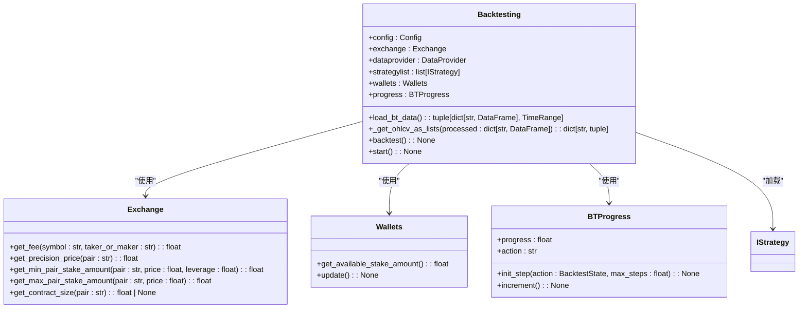
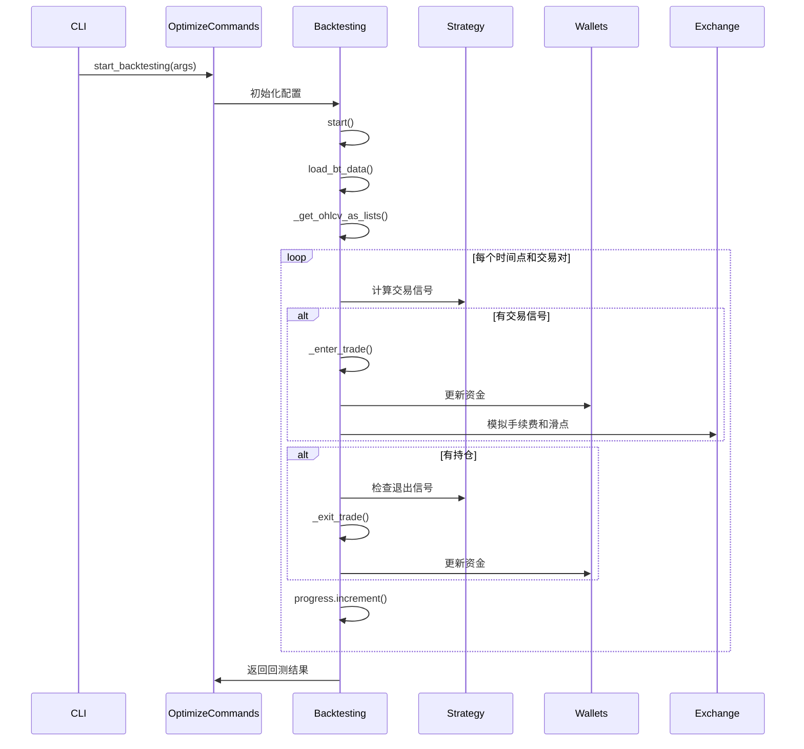
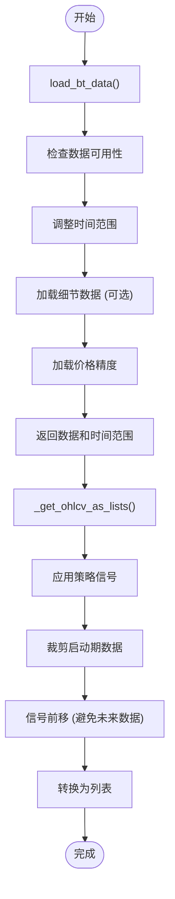
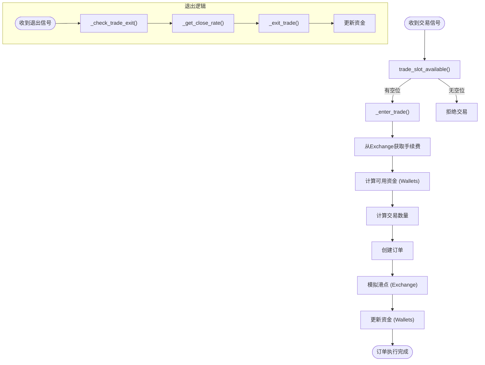
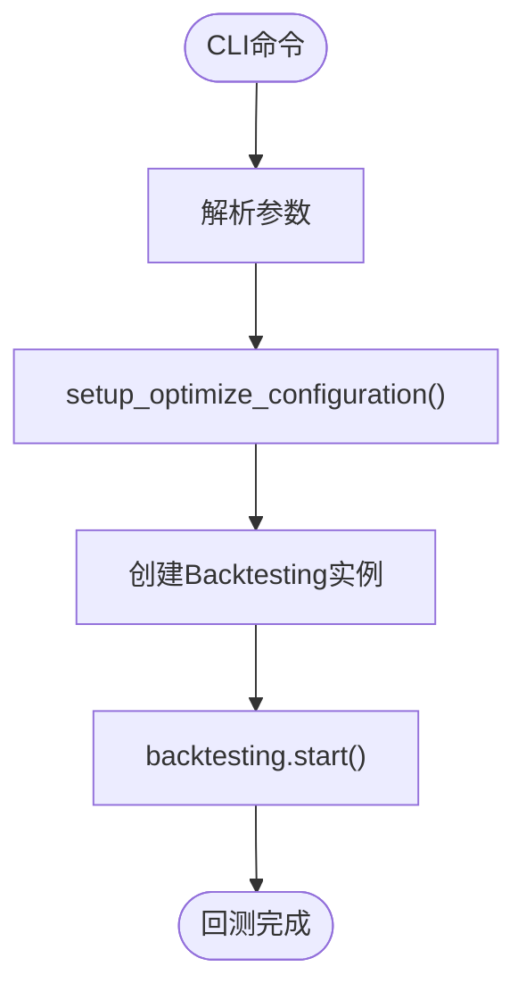
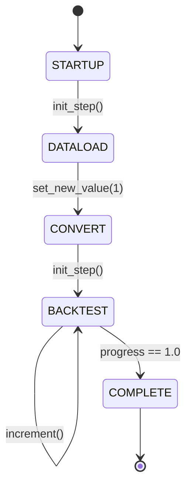

# 回测引擎

<cite>
**Referenced Files in This Document**   
- [backtesting.py](file://freqtrade\optimize\backtesting.py)
- [optimize_commands.py](file://freqtrade\commands\optimize_commands.py)
- [wallets.py](file://freqtrade\wallets.py)
- [exchange.py](file://freqtrade\exchange\exchange.py)
- [bt_progress.py](file://freqtrade\optimize\bt_progress.py)
</cite>

## 目录
1. [回测引擎架构概览](#回测引擎架构概览)
2. [核心回测流程](#核心回测流程)
3. [数据加载与预处理](#数据加载与预处理)
4. [交易信号处理与订单执行](#交易信号处理与订单执行)
5. [CLI配置与启动流程](#cli配置与启动流程)
6. [回测进度追踪](#回测进度追踪)

## 回测引擎架构概览

`Backtesting` 类是 Freqtrade 回测系统的核心，它负责协调数据加载、策略执行、订单模拟和资金管理。该类通过与 `Exchange` 和 `Wallets` 组件的交互，精确复现真实交易环境。

**Diagram sources**
- [backtesting.py](file://freqtrade\optimize\backtesting.py#L110-L216)
- [exchange.py](file://freqtrade\exchange\exchange.py#L119-L216)
- [wallets.py](file://freqtrade\wallets.py#L35-L437)
- [bt_progress.py](file://freqtrade\optimize\bt_progress.py#L3-L33)

**Section sources**
- [backtesting.py](file://freqtrade\optimize\backtesting.py#L110-L216)

## 核心回测流程

回测的核心流程由 `Backtesting` 类的 `start` 和 `backtest` 方法驱动。`start` 方法是入口点，它负责加载数据、初始化策略并启动回测循环。`backtest` 方法则实现了逐K线的事件驱动模拟。

**Diagram sources**
- [backtesting.py](file://freqtrade\optimize\backtesting.py#L1823-L1883)
- [backtesting.py](file://freqtrade\optimize\backtesting.py#L1678-L1737)
- [optimize_commands.py](file://freqtrade\commands\optimize_commands.py#L44-L60)

**Section sources**
- [backtesting.py](file://freqtrade\optimize\backtesting.py#L1823-L1883)

## 数据加载与预处理

回测引擎通过 `load_bt_data` 和 `_get_ohlcv_as_lists` 方法完成数据加载和预处理。`load_bt_data` 负责从磁盘加载历史K线数据，并进行时间范围校准。`_get_ohlcv_as_lists` 则将处理后的Pandas DataFrame转换为列表，以提高循环性能。

**Diagram sources**
- [backtesting.py](file://freqtrade\optimize\backtesting.py#L303-L341)
- [backtesting.py](file://freqtrade\optimize\backtesting.py#L458-L513)

**Section sources**
- [backtesting.py](file://freqtrade\optimize\backtesting.py#L303-L341)
- [backtesting.py](file://freqtrade\optimize\backtesting.py#L458-L513)

## 交易信号处理与订单执行

交易信号的处理是通过 `_long_entry` 和 `_short_exit` 等方法实现的。这些方法与 `Exchange` 和 `Wallets` 组件紧密交互，以模拟真实的交易环境。订单执行过程包括手续费计算、滑点模拟和资金变动。

**Diagram sources**
- [backtesting.py](file://freqtrade\optimize\backtesting.py#L1066-L1221)
- [backtesting.py](file://freqtrade\optimize\backtesting.py#L880-L923)
- [backtesting.py](file://freqtrade\optimize\backtesting.py#L969-L1064)
- [wallets.py](file://freqtrade\wallets.py#L35-L437)
- [exchange.py](file://freqtrade\exchange\exchange.py#L119-L216)

**Section sources**
- [backtesting.py](file://freqtrade\optimize\backtesting.py#L1066-L1221)

## CLI配置与启动流程

`optimize_commands.py` 文件中的 `start_backtesting` 函数是CLI启动回测的入口。它负责解析命令行参数，初始化配置，并创建 `Backtesting` 实例来启动回测。

最佳实践：
- **配置时间范围**：使用 `--timerange` 参数指定回测的时间范围，例如 `20200101-20231231`。
- **配置交易对列表**：在配置文件中设置 `pair_whitelist`，或使用 `--pairs` CLI参数。
- **配置手续费模型**：在配置文件中设置 `fee` 参数，或让系统自动从交易所获取最高档位的手续费。

**Diagram sources**
- [optimize_commands.py](file://freqtrade\commands\optimize_commands.py#L44-L60)

**Section sources**
- [optimize_commands.py](file://freqtrade\commands\optimize_commands.py#L44-L60)

## 回测进度追踪

`BTProgress` 类负责追踪回测的进度。它通过 `init_step`、`increment` 和 `progress` 属性来管理不同阶段的进度。

**Diagram sources**
- [bt_progress.py](file://freqtrade\optimize\bt_progress.py#L3-L33)

**Section sources**
- [bt_progress.py](file://freqtrade\optimize\bt_progress.py#L3-L33)