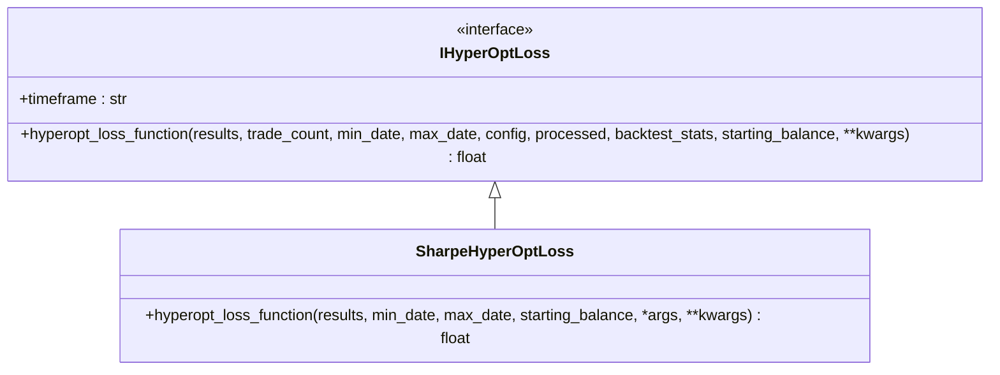
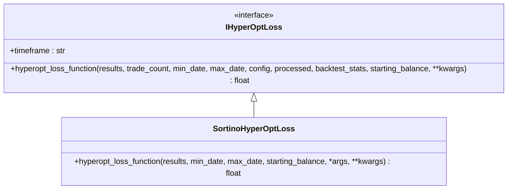
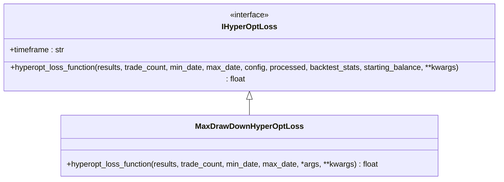
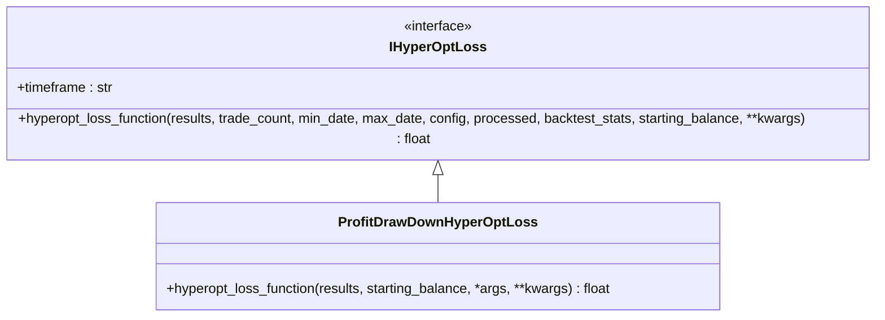
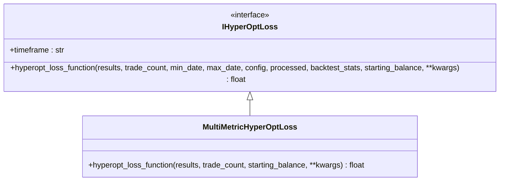
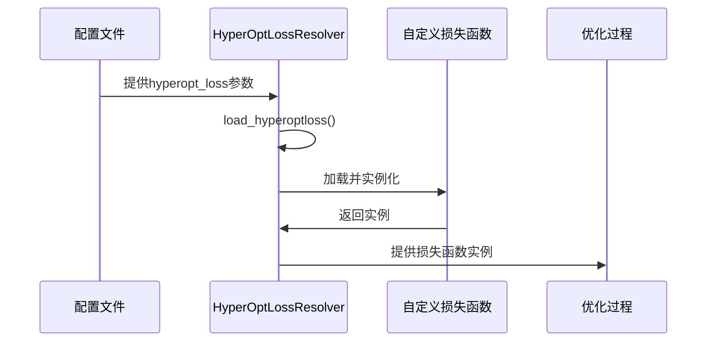

# 损失函数体系

<cite>
**本文档中引用的文件**  
- [hyperopt_loss_interface.py](file://freqtrade/optimize/hyperopt_loss/hyperopt_loss_interface.py)
- [sample_hyperopt_loss.py](file://freqtrade/templates/sample_hyperopt_loss.py)
- [hyperopt_loss_sharpe.py](file://freqtrade/optimize/hyperopt_loss/hyperopt_loss_sharpe.py)
- [hyperopt_loss_sortino.py](file://freqtrade/optimize/hyperopt_loss/hyperopt_loss_sortino.py)
- [hyperopt_loss_max_drawdown.py](file://freqtrade/optimize/hyperopt_loss/hyperopt_loss_max_drawdown.py)
- [hyperopt_loss_profit_drawdown.py](file://freqtrade/optimize/hyperopt_loss/hyperopt_loss_profit_drawdown.py)
- [hyperopt_loss_multi_metric.py](file://freqtrade/optimize/hyperopt_loss/hyperopt_loss_multi_metric.py)
- [hyperopt_resolver.py](file://freqtrade/resolvers/hyperopt_resolver.py)
</cite>

## 目录
1. [IHyperOptLoss接口规范](#ihyperoptloss接口规范)
2. [内置损失函数分析](#内置损失函数分析)
3. [夏普比率损失函数](#夏普比率损失函数)
4. [索提诺比率损失函数](#索提诺比率损失函数)
5. [最大回撤优化逻辑](#最大回撤优化逻辑)
6. [收益与回撤平衡](#收益与回撤平衡)
7. [多目标优化策略](#多目标优化策略)
8. [自定义损失函数创建](#自定义损失函数创建)
9. [损失函数选择建议](#损失函数选择建议)

## IHyperOptLoss接口规范

`IHyperOptLoss`接口定义了超参数优化过程中损失函数的基本规范。该接口继承自抽象基类（ABC），要求所有实现类必须提供`hyperopt_loss_function`静态方法。该方法在每次优化周期（epoch）都会被调用，用于评估当前参数组合的性能。

接口中定义了`timeframe`类属性，用于指定策略的时间框架。`hyperopt_loss_function`方法接收多个参数，包括交易结果数据框、交易次数、时间范围、配置对象、处理后的数据字典、回测统计信息和起始余额等。该方法返回一个浮点数，数值越小表示优化结果越优。

**Section sources**
- [hyperopt_loss_interface.py](file://freqtrade/optimize/hyperopt_loss/hyperopt_loss_interface.py#L14-L38)

## 内置损失函数分析

系统提供了多种内置的损失函数实现，每种都针对不同的优化目标。这些实现都继承自`IHyperOptLoss`接口，包括`SharpeHyperOptLoss`、`SortinoHyperOptLoss`、`MaxDrawdownHyperOptLoss`、`ProfitDrawDownHyperOptLoss`和`MultiMetricHyperOptLoss`等。这些类位于`freqtrade/optimize/hyperopt_loss/`目录下，通过不同的数学方法来评估策略性能。

**Section sources**
- [hyperopt_loss_interface.py](file://freqtrade/optimize/hyperopt_loss/hyperopt_loss_interface.py#L14-L38)

## 夏普比率损失函数

`SharpeHyperOptLoss`类实现了基于夏普比率的损失函数。夏普比率是衡量风险调整后收益的重要指标，计算公式为超额收益与收益波动率的比值。该实现通过调用`calculate_sharpe`函数计算夏普比率，并返回其负值作为损失值，从而实现优化目标。

夏普比率考虑了整体收益波动，适用于评估在承担单位总风险下获得的超额收益。该损失函数适合追求稳定收益的策略优化，能够有效平衡收益与风险。

**Diagram sources**
- [hyperopt_loss_interface.py](file://freqtrade/optimize/hyperopt_loss/hyperopt_loss_interface.py#L14-L38)
- [hyperopt_loss_sharpe.py](file://freqtrade/optimize/hyperopt_loss/hyperopt_loss_sharpe.py#L15-L38)

**Section sources**
- [hyperopt_loss_sharpe.py](file://freqtrade/optimize/hyperopt_loss/hyperopt_loss_sharpe.py#L15-L38)

## 索提诺比率损失函数

`SortinoHyperOptLoss`类实现了基于索提诺比率的损失函数。索提诺比率是夏普比率的改进版本，只考虑下行风险（负收益的波动），而不惩罚上行波动。该实现通过调用`calculate_sortino`函数计算索提诺比率，并返回其负值作为损失值。

与夏普比率相比，索提诺比率更能反映投资者对亏损的厌恶心理，因为它只关注有害的波动。这种损失函数特别适合那些希望最大化上行潜力同时最小化下行风险的策略。

**Diagram sources**
- [hyperopt_loss_interface.py](file://freqtrade/optimize/hyperopt_loss/hyperopt_loss_interface.py#L14-L38)
- [hyperopt_loss_sortino.py](file://freqtrade/optimize/hyperopt_loss/hyperopt_loss_sortino.py#L15-L38)

**Section sources**
- [hyperopt_loss_sortino.py](file://freqtrade/optimize/hyperopt_loss/hyperopt_loss_sortino.py#L15-L38)

## 最大回撤优化逻辑

`MaxDrawdownHyperOptLoss`类实现了针对最大回撤的优化逻辑。该损失函数通过计算总利润与最大回撤绝对值的比值来评估策略性能。当存在亏损交易时，使用利润加权的最大回撤；当没有亏损交易时，则直接优化利润比率。

最大回撤是衡量策略风险的重要指标，表示账户从峰值到谷值的最大损失百分比。该损失函数通过最小化回撤来提高策略的稳定性，特别适合风险厌恶型投资者。

**Diagram sources**
- [hyperopt_loss_interface.py](file://freqtrade/optimize/hyperopt_loss/hyperopt_loss_interface.py#L14-L38)
- [hyperopt_loss_max_drawdown.py](file://freqtrade/optimize/hyperopt_loss/hyperopt_loss_max_drawdown.py#L15-L44)

**Section sources**
- [hyperopt_loss_max_drawdown.py](file://freqtrade/optimize/hyperopt_loss/hyperopt_loss_max_drawdown.py#L15-L44)

## 收益与回撤平衡

`ProfitDrawDownHyperOptLoss`类实现了收益与回撤的平衡优化。该损失函数通过一个复合公式来同时考虑总利润和相对账户回撤。公式中包含`DRAWDOWN_MULT`参数，用于调节对回撤的惩罚程度。

该实现通过`calculate_max_drawdown`函数计算最大回撤，并将其与总利润结合。较小的`DRAWDOWN_MULT`值会对回撤施加更严厉的惩罚，使优化过程更加注重风险控制。这种平衡方法适合需要在收益和风险之间取得折衷的策略。

**Diagram sources**
- [hyperopt_loss_interface.py](file://freqtrade/optimize/hyperopt_loss/hyperopt_loss_interface.py#L14-L38)
- [hyperopt_loss_profit_drawdown.py](file://freqtrade/optimize/hyperopt_loss/hyperopt_loss_profit_drawdown.py#L20-L37)

**Section sources**
- [hyperopt_loss_profit_drawdown.py](file://freqtrade/optimize/hyperopt_loss/hyperopt_loss_profit_drawdown.py#L20-L37)

## 多目标优化策略

`MultiMetricHyperOptLoss`类实现了多目标优化策略，综合考虑了利润、回撤、盈利因子、期望值比率、胜率和交易数量等多个指标。该损失函数通过一个复杂的加权公式将这些指标结合起来，形成最终的损失值。

该实现包含多个可调节参数，如`DRAWDOWN_MULT`、`TARGET_TRADE_AMOUNT`、`EXPECTANCY_CONST`、`PF_CONST`和`WINRATE_CONST`，允许用户根据具体需求调整各指标的权重。例如，`PF_CONST`值越高，盈利因子的影响越小。这种多维度的优化方法适合复杂的交易策略。

**Diagram sources**
- [hyperopt_loss_interface.py](file://freqtrade/optimize/hyperopt_loss/hyperopt_loss_interface.py#L14-L38)
- [hyperopt_loss_multi_metric.py](file://freqtrade/optimize/hyperopt_loss/hyperopt_loss_multi_metric.py#L53-L103)

**Section sources**
- [hyperopt_loss_multi_metric.py](file://freqtrade/optimize/hyperopt_loss/hyperopt_loss_multi_metric.py#L53-L103)

## 自定义损失函数创建

用户可以通过`sample_hyperopt_loss.py`模板创建自定义损失函数。首先需要继承`IHyperOptLoss`接口，并实现`hyperopt_loss_function`方法。在类中可以定义`timeframe`属性来指定时间框架。

`hyperopt_loss_function`方法需要返回一个浮点数，数值越小表示优化结果越优。用户可以根据自己的需求定义复杂的评估逻辑，如结合交易次数、平均交易时长等指标。创建完成后，需要在配置文件中通过`hyperopt_loss`参数指定自定义损失函数的名称。

**Diagram sources**
- [sample_hyperopt_loss.py](file://freqtrade/templates/sample_hyperopt_loss.py#L1-L57)
- [hyperopt_resolver.py](file://freqtrade/resolvers/hyperopt_resolver.py#L1-L50)

**Section sources**
- [sample_hyperopt_loss.py](file://freqtrade/templates/sample_hyperopt_loss.py#L1-L57)

## 损失函数选择建议

对于高频交易策略，建议使用`ShortTradeDurHyperOptLoss`来优化交易时长，或使用`ProfitDrawDownHyperOptLoss`来平衡收益与风险。对于低频交易策略，`SharpeHyperOptLoss`或`SortinoHyperOptLoss`更适合评估长期稳定收益。

套利策略通常追求稳定的低风险收益，建议使用`MaxDrawdownHyperOptLoss`来最小化最大回撤，或使用`MultiMetricHyperOptLoss`进行多维度优化。用户应根据策略特点和风险偏好选择合适的损失函数，并可通过调整参数来微调优化目标。

**Section sources**
- [hyperopt_loss_interface.py](file://freqtrade/optimize/hyperopt_loss/hyperopt_loss_interface.py#L14-L38)
- [hyperopt_loss_sharpe.py](file://freqtrade/optimize/hyperopt_loss/hyperopt_loss_sharpe.py#L15-L38)
- [hyperopt_loss_sortino.py](file://freqtrade/optimize/hyperopt_loss/hyperopt_loss_sortino.py#L15-L38)
- [hyperopt_loss_max_drawdown.py](file://freqtrade/optimize/hyperopt_loss/hyperopt_loss_max_drawdown.py#L15-L44)
- [hyperopt_loss_profit_drawdown.py](file://freqtrade/optimize/hyperopt_loss/hyperopt_loss_profit_drawdown.py#L20-L37)
- [hyperopt_loss_multi_metric.py](file://freqtrade/optimize/hyperopt_loss/hyperopt_loss_multi_metric.py#L53-L103)