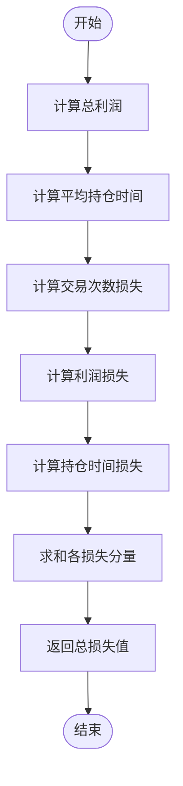
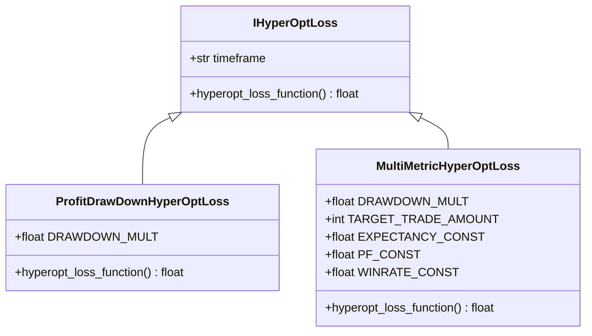

# 自定义损失函数开发

<cite>
**Referenced Files in This Document**   
- [sample_hyperopt_loss.py](file://freqtrade/templates/sample_hyperopt_loss.py)
- [hyperopt_loss_interface.py](file://freqtrade/optimize/hyperopt_loss/hyperopt_loss_interface.py)
- [hyperopt_loss_multi_metric.py](file://freqtrade/optimize/hyperopt_loss/hyperopt_loss_multi_metric.py)
- [hyperopt_loss_profit_drawdown.py](file://freqtrade/optimize/hyperopt_loss/hyperopt_loss_profit_drawdown.py)
- [hyperopt.py](file://freqtrade/optimize/hyperopt/hyperopt.py)
</cite>

## 目录
1. [简介](#简介)
2. [核心接口与模板](#核心接口与模板)
3. [timeframe属性详解](#timeframe属性详解)
4. [损失函数参数签名](#损失函数参数签名)
5. [自定义指标构建复合损失函数](#自定义指标构建复合损失函数)
6. [损失函数归一化处理](#损失函数归一化处理)
7. [调试技巧与收敛观察](#调试技巧与收敛观察)
8. [混合损失函数实例](#混合损失函数实例)

## 简介
本文档旨在指导开发者如何基于IHyperOptLoss接口创建自定义损失函数，以优化交易策略。通过深入分析Freqtrade框架中的核心组件，我们将详细阐述如何利用`sample_hyperopt_loss.py`模板构建高效的损失函数，实现对策略特定行为的精确引导。

## 核心接口与模板

Freqtrade框架通过`IHyperOptLoss`接口定义了超参数优化过程中损失函数的规范。开发者需继承此接口并实现`hyperopt_loss_function`方法，该方法在每次优化迭代时被调用，返回一个浮点数作为优化目标——数值越小代表结果越优。

`sample_hyperopt_loss.py`模板文件提供了一个完整的实现示例，展示了如何结合交易次数、总利润和平均持仓时间等多个指标构建复合损失函数。该模板不仅作为开发起点，也体现了框架推荐的最佳实践模式。

**Section sources**
- [hyperopt_loss_interface.py](file://freqtrade/optimize/hyperopt_loss/hyperopt_loss_interface.py#L14-L38)
- [sample_hyperopt_loss.py](file://freqtrade/templates/sample_hyperopt_loss.py#L1-L57)

## timeframe属性详解

`timeframe`属性在`IHyperOptLoss`接口中被定义为类属性，用于指定损失函数所关联的时间框架。该属性的主要作用是确保损失函数的计算逻辑与策略回测所使用的时间周期保持一致。

在实际应用中，`timeframe`属性的值通常由配置文件或命令行参数传入，并在初始化损失函数实例时进行设置。开发者可以通过访问该属性来调整损失函数内部的计算逻辑，例如根据不同的时间框架动态调整交易频率的惩罚阈值或最大可接受持仓时间。

**Section sources**
- [hyperopt_loss_interface.py](file://freqtrade/optimize/hyperopt_loss/hyperopt_loss_interface.py#L16-L17)

## 损失函数参数签名

`hyperopt_loss_function`方法接受多个关键参数，这些参数提供了构建复杂损失函数所需的所有信息：

- `results`: 包含所有交易结果的DataFrame，包含`profit_ratio`、`trade_duration`等关键字段
- `trade_count`: 总交易次数，用于评估策略活跃度
- `min_date`和`max_date`: 回测时间范围的起止日期
- `config`: 当前配置对象，包含策略和优化器的所有设置
- `processed`: 预处理后的数据字典，可用于访问原始市场数据
- `backtest_stats`: 回测统计信息字典，包含更详细的性能指标
- `starting_balance`: 初始资金，用于计算相对收益

该方法返回一个浮点数，代表当前参数组合的"损失值"，优化器将努力最小化此值。

**Section sources**
- [hyperopt_loss_interface.py](file://freqtrade/optimize/hyperopt_loss/hyperopt_loss_interface.py#L20-L38)

## 自定义指标构建复合损失函数

开发者可以引入多种自定义指标来构建更复杂的复合损失函数。常见的指标包括：

- **胜率**: 通过计算盈利交易数占总交易数的比例来评估策略稳定性
- **交易频率**: 监控单位时间内的交易次数，避免过度交易
- **持仓时间**: 分析平均持仓周期，引导策略向期望的交易风格靠拢

在`sample_hyperopt_loss.py`模板中，我们看到如何将这些指标组合成一个加权损失函数，其中每个分量都经过归一化处理，确保不同量纲的指标能够公平比较。

**Diagram sources**
- [sample_hyperopt_loss.py](file://freqtrade/templates/sample_hyperopt_loss.py#L36-L56)

**Section sources**
- [sample_hyperopt_loss.py](file://freqtrade/templates/sample_hyperopt_loss.py#L36-L56)

## 损失函数归一化处理

归一化处理是构建有效复合损失函数的关键步骤。由于不同指标（如利润、交易次数、持仓时间）具有不同的量纲和数量级，直接相加会导致某些指标主导优化过程。

在`sample_hyperopt_loss.py`中，我们看到三种归一化技术：
1. **指数衰减函数**: 用于交易次数损失，平滑处理偏离目标值的情况
2. **线性归一化**: 用于利润损失，将实际利润与期望最大利润进行比较
3. **比例截断**: 用于持仓时间损失，将实际时间与最大可接受时间的比例限制在[0,1]区间

这种归一化确保了各个损失分量在相似的数量级上，使优化器能够均衡地考虑所有优化目标。

**Section sources**
- [sample_hyperopt_loss.py](file://freqtrade/templates/sample_hyperopt_loss.py#L49-L54)

## 调试技巧与收敛观察

在开发自定义损失函数时，有效的调试技巧至关重要。虽然框架本身没有直接在损失函数中集成日志记录，但开发者可以通过以下方式验证逻辑正确性：

- **单元测试**: 参考`test_hyperoptloss.py`中的测试用例，创建针对特定场景的测试
- **参数敏感性分析**: 系统性地改变输入参数，观察损失值的变化是否符合预期
- **收敛行为观察**: 通过监控多轮优化过程中的损失值变化，判断优化是否稳定收敛

在`hyperopt.py`中，框架提供了详细的日志输出，记录每次迭代的评估结果和最优值更新情况，这有助于理解优化过程的整体行为。

**Section sources**
- [hyperopt.py](file://freqtrade/optimize/hyperopt/hyperopt.py#L221-L256)

## 混合损失函数实例

一个典型的混合损失函数实例是结合最大回撤约束与夏普比率提升的优化目标。`hyperopt_loss_profit_drawdown.py`文件展示了如何实现这一目标：

该损失函数首先计算总利润，然后尝试计算最大回撤。如果成功计算出回撤，则返回一个综合了利润和回撤的复合指标；如果无法计算（如无亏损交易），则直接返回负的总利润。通过调整`DRAWDOWN_MULT`常数，可以控制对回撤的惩罚力度。

另一个更复杂的例子是`hyperopt_loss_multi_metric.py`，它同时考虑了利润、回撤、盈利因子、期望值比率、胜率和交易数量等多个指标，通过自然对数变换和加权乘积的方式构建最终的损失函数。

**Diagram sources**
- [hyperopt_loss_profit_drawdown.py](file://freqtrade/optimize/hyperopt_loss/hyperopt_loss_profit_drawdown.py#L1-L37)
- [hyperopt_loss_multi_metric.py](file://freqtrade/optimize/hyperopt_loss/hyperopt_loss_multi_metric.py#L1-L71)

**Section sources**
- [hyperopt_loss_profit_drawdown.py](file://freqtrade/optimize/hyperopt_loss/hyperopt_loss_profit_drawdown.py#L1-L37)
- [hyperopt_loss_multi_metric.py](file://freqtrade/optimize/hyperopt_loss/hyperopt_loss_multi_metric.py#L1-L71)