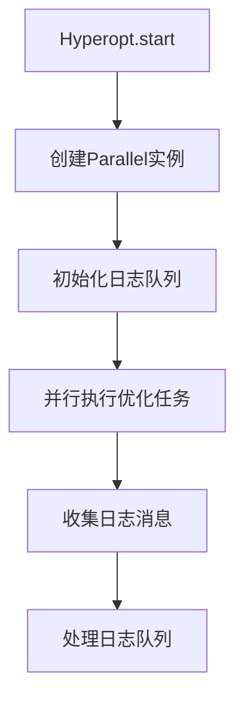
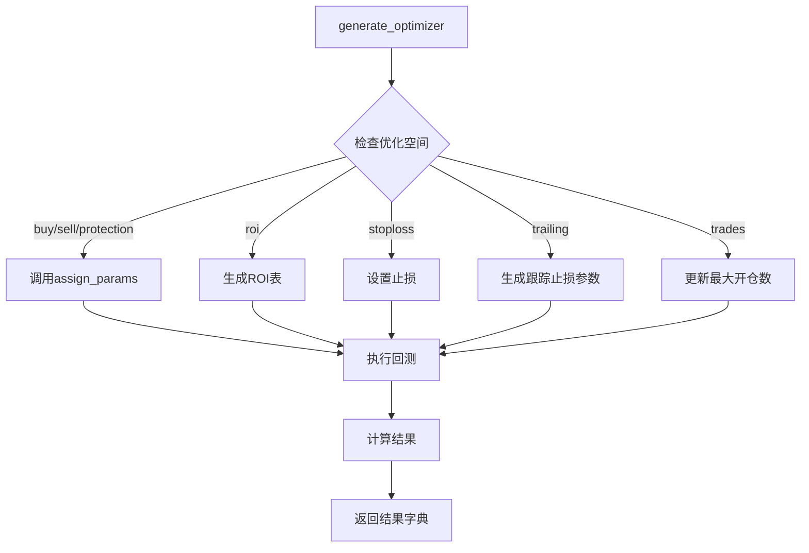
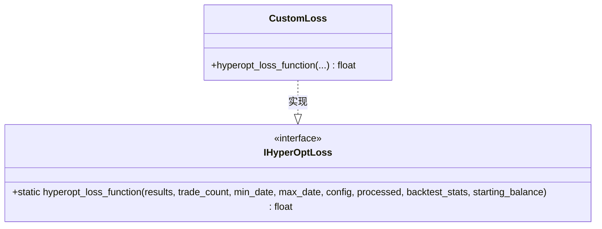
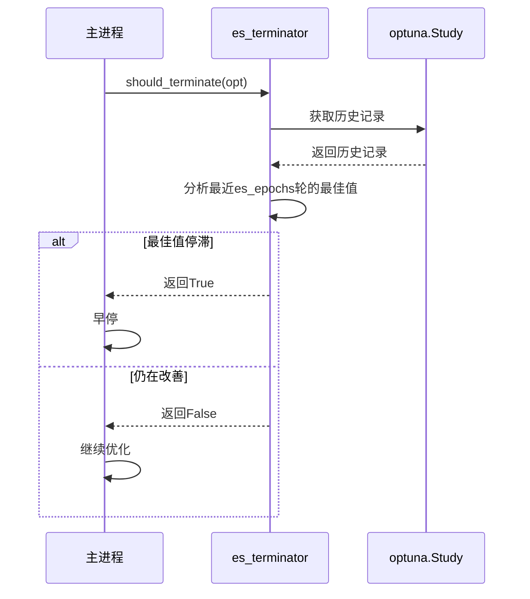

# 优化执行流程

<cite>
**本文档引用的文件**
- [hyperopt.py](file://freqtrade/optimize/hyperopt/hyperopt.py)
- [hyperopt_optimizer.py](file://freqtrade/optimize/hyperopt/hyperopt_optimizer.py)
- [hyperopt_loss_interface.py](file://freqtrade/optimize/hyperopt_loss/hyperopt_loss_interface.py)
- [backtesting.py](file://freqtrade/optimize/backtesting.py)
- [optimize_reports.py](file://freqtrade/optimize/optimize_reports/optimize_reports.py)
</cite>

## 目录
1. [并行优化执行](#并行优化执行)
2. [参数分配与回测流程](#参数分配与回测流程)
3. [损失函数与惩罚机制](#损失函数与惩罚机制)
4. [早停机制分析](#早停机制分析)

## 并行优化执行

`Hyperopt`类中的`run_optimizer_parallel`方法利用`joblib`库的`Parallel`功能实现多进程并行评估。该方法在`Hyperopt.start()`中被调用，通过创建`Parallel`实例并行执行多个优化任务。`Parallel`实例的`n_jobs`参数由配置中的`hyperopt_jobs`决定，若未设置则默认使用所有可用CPU核心。

为了在多进程环境中正确传递日志队列，`Hyperopt`类在`_setup_logging_mp_workaround`方法中创建了一个全局的`Manager.Queue`实例，并将其赋值给全局变量`log_queue`。此队列在子进程中通过`logging_mp_setup`函数进行设置，确保所有子进程的日志消息都能被主进程收集和处理。在每次并行执行批次后，主进程通过`logging_mp_handle(log_queue)`处理日志队列中的消息，实现调试信息的同步。

**Diagram sources**
- [hyperopt.py](file://freqtrade/optimize/hyperopt/hyperopt.py#L351-L351)

**Section sources**
- [hyperopt.py](file://freqtrade/optimize/hyperopt/hyperopt.py#L351-L351)

## 参数分配与回测流程

`HyperOptimizer.generate_optimizer`方法是优化流程的核心，它实现了参数分配、回测执行与结果计算的完整闭环。该方法首先根据配置中定义的优化空间（如"buy"、"sell"、"roi"等）调用相应的`assign_params`或直接设置策略属性。

`assign_params`方法是参数注入的关键。它通过调用策略实例的`enumerate_parameters`方法获取指定类别（如"buy"）的所有可优化参数，然后根据传入的`params_dict`字典更新这些参数的值。这实现了将优化参数从`params_dict`动态注入到策略实例中。

完成参数设置后，方法从预加载的数据文件中读取处理好的K线数据，并根据配置决定是否重新运行指标计算。随后，调用`backtesting.backtest`方法执行回测，得到交易结果。最后，通过`_get_results_dict`方法计算并返回包含损失值、参数详情和统计指标的结果字典。

**Diagram sources**
- [hyperopt_optimizer.py](file://freqtrade/optimize/hyperopt/hyperopt_optimizer.py#L268-L342)
- [hyperopt_optimizer.py](file://freqtrade/optimize/hyperopt/hyperopt_optimizer.py#L254-L261)

**Section sources**
- [hyperopt_optimizer.py](file://freqtrade/optimize/hyperopt/hyperopt_optimizer.py#L268-L342)
- [hyperopt_optimizer.py](file://freqtrade/optimize/hyperopt/hyperopt_optimizer.py#L254-L261)

## 损失函数与惩罚机制

`MAX_LOSS`是一个预定义的常量，其值为100000，代表一个足够大的数值，用作损失优化中的“坏结果”基准。在`_get_results_dict`方法中，如果回测产生的交易次数少于配置中指定的`hyperopt_min_trades`，则直接将损失值设为`MAX_LOSS`。这是一种惩罚机制，旨在避免优化出交易次数过少的“持有”（hodl）策略，确保优化过程倾向于产生活跃且有效的交易策略。

`calculate_loss`方法在`HyperOptimizer`的初始化过程中被设置为`custom_hyperoptloss.hyperopt_loss_function`。这意味着实际的损失计算逻辑由用户自定义的损失函数类（实现`IHyperOptLoss`接口）提供。`hyperopt_loss_function`是一个静态抽象方法，接收回测结果、交易次数、时间范围、配置、处理后的数据、回测统计和起始余额等参数，并返回一个浮点数作为损失值。目标是最小化这个损失值，因此一个好的策略应返回一个较小的数字。

**Diagram sources**
- [hyperopt_optimizer.py](file://freqtrade/optimize/hyperopt/hyperopt_optimizer.py#L49-L49)
- [hyperopt_optimizer.py](file://freqtrade/optimize/hyperopt/hyperopt_optimizer.py#L102-L102)
- [hyperopt_loss_interface.py](file://freqtrade/optimize/hyperopt_loss/hyperopt_loss_interface.py#L14-L38)

**Section sources**
- [hyperopt_optimizer.py](file://freqtrade/optimize/hyperopt/hyperopt_optimizer.py#L49-L49)
- [hyperopt_optimizer.py](file://freqtrade/optimize/hyperopt/hyperopt_optimizer.py#L102-L102)
- [hyperopt_loss_interface.py](file://freqtrade/optimize/hyperopt_loss/hyperopt_loss_interface.py#L14-L38)

## 早停机制分析

早停机制由`es_terminator`对象管理，该对象在`HyperOptimizer.get_optimizer`方法中被创建。如果配置中设置了`early_stop`且其值大于0，`get_optimizer`会创建一个`Terminator`实例，并将其赋值给`self.es_terminator`。`Terminator`使用`BestValueStagnationEvaluator`作为评估器，该评估器的参数为`es_epochs`，即允许最佳值停滞的轮数。

在`Hyperopt.start`方法的主循环中，每完成一批次的并行优化后，都会调用`es_terminator.should_terminate(self.opt)`来检查是否应该提前终止。`should_terminate`方法会分析`opt`（一个`optuna.Study`对象）的历史记录，如果在最近的`es_epochs`轮中，最佳损失值没有显著改善，则返回`True`，触发早停。这可以显著提高优化效率，避免在已经收敛的区域进行不必要的计算。

**Diagram sources**
- [hyperopt_optimizer.py](file://freqtrade/optimize/hyperopt/hyperopt_optimizer.py#L414-L447)
- [hyperopt.py](file://freqtrade/optimize/hyperopt/hyperopt.py#L40-L351)

**Section sources**
- [hyperopt_optimizer.py](file://freqtrade/optimize/hyperopt/hyperopt_optimizer.py#L414-L447)
- [hyperopt.py](file://freqtrade/optimize/hyperopt/hyperopt.py#L40-L351)