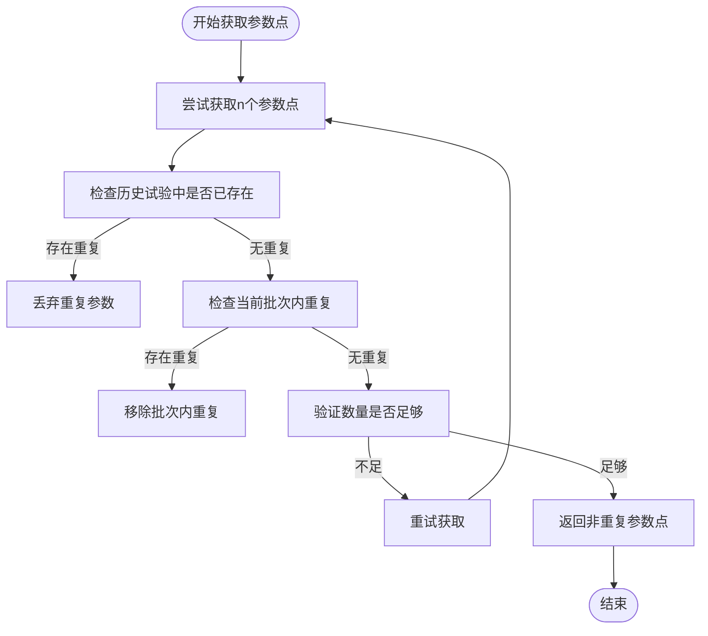
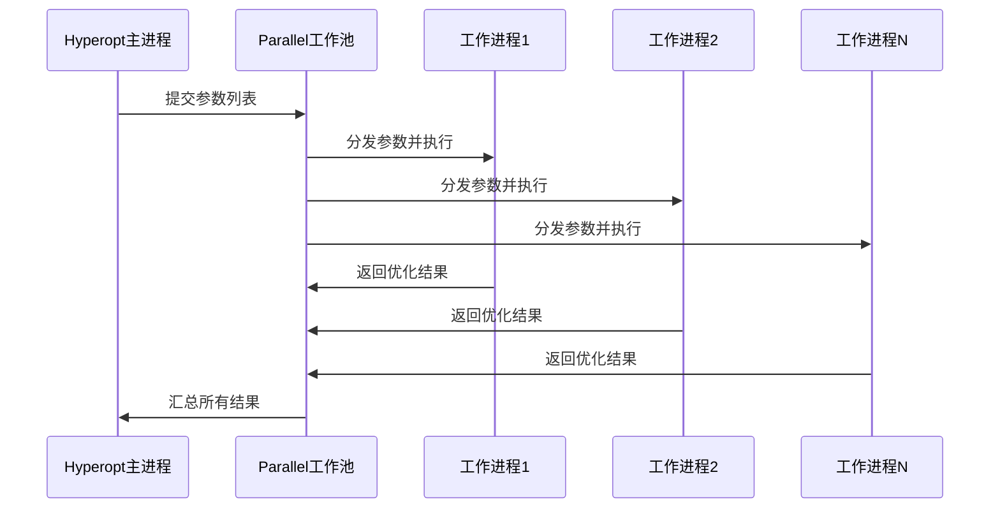
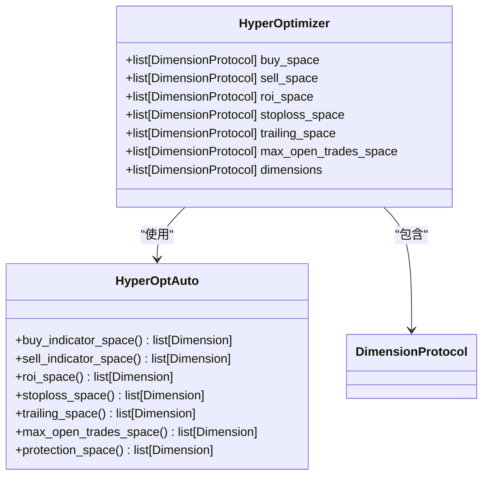
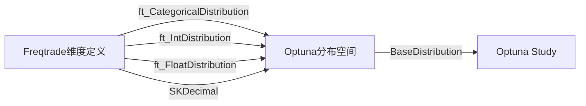
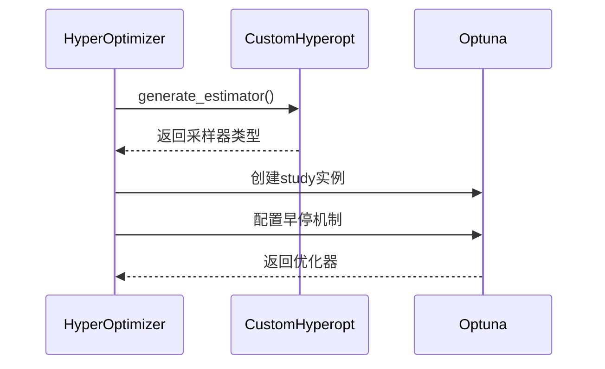
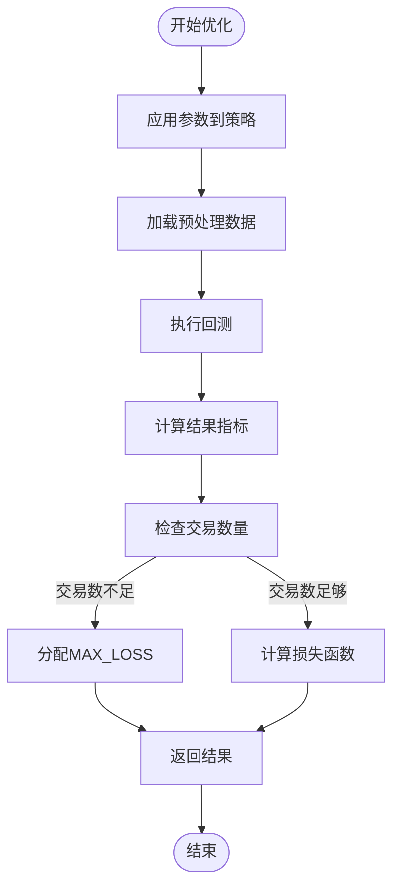
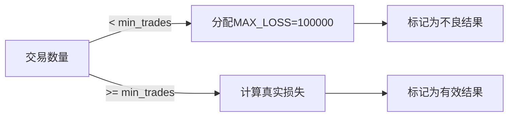

# 超参数优化核心算法

<cite>
**本文档引用的文件**  
- [hyperopt.py](file://freqtrade/optimize/hyperopt/hyperopt.py)
- [hyperopt_optimizer.py](file://freqtrade/optimize/hyperopt/hyperopt_optimizer.py)
- [optunaspaces.py](file://freqtrade/optimize/space/optunaspaces.py)
- [hyperopt_interface.py](file://freqtrade/optimize/hyperopt/hyperopt_interface.py)
</cite>

## 目录
1. [Hyperopt与HyperOptimizer协同机制](#hyperopt与hyperoptimizer协同机制)
2. [避免参数重复采样机制](#避免参数重复采样机制)
3. [多进程并行评估实现](#多进程并行评估实现)
4. [优化空间初始化](#优化空间初始化)
5. [维度转换与采样器初始化](#维度转换与采样器初始化)
6. [参数分配与回测流程](#参数分配与回测流程)
7. [损失计算与阈值作用](#损失计算与阈值作用)

## Hyperopt与HyperOptimizer协同机制

Hyperopt类作为主控制器，负责协调整个超参数优化流程。它通过实例化HyperOptimizer类来执行具体的优化任务，形成主从式协同架构。Hyperopt在初始化时创建HyperOptimizer实例，并在优化过程中调用其方法进行参数空间初始化、优化器生成和结果评估。

HyperOptimizer类作为工作进程的核心，被设计为可序列化的对象，能够被发送到多进程环境中执行。它封装了回测引擎、策略配置和优化逻辑，确保在并行执行时保持上下文一致性。这种分离设计使得Hyperopt可以专注于流程控制，而HyperOptimizer专注于具体的优化计算。

**Section sources**
- [hyperopt.py](file://freqtrade/optimize/hyperopt/hyperopt.py#L40-L351)
- [hyperopt_optimizer.py](file://freqtrade/optimize/hyperopt/hyperopt_optimizer.py#L61-L482)

## 避免参数重复采样机制

Hyperopt通过_get_asked_points方法实现参数去重机制，确保不会对已评估的参数组合进行重复计算。该机制包含两个层次的检查：首先检查历史已完成的试验，然后检查当前批次中的重复项。

**Diagram sources**
- [hyperopt.py](file://freqtrade/optimize/hyperopt/hyperopt.py#L185-L212)
- [hyperopt.py](file://freqtrade/optimize/hyperopt/hyperopt.py#L170-L183)

**Section sources**
- [hyperopt.py](file://freqtrade/optimize/hyperopt/hyperopt.py#L164-L212)

## 多进程并行评估实现

_run_optimizer_parallel方法实现了基于Joblib的多进程并行评估机制。该方法通过Parallel上下文管理器创建并行工作池，将优化任务分发到多个CPU核心上同时执行，显著提升超参数搜索效率。

**Diagram sources**
- [hyperopt.py](file://freqtrade/optimize/hyperopt/hyperopt.py#L148-L159)
- [hyperopt.py](file://freqtrade/optimize/hyperopt/hyperopt.py#L247-L351)

**Section sources**
- [hyperopt.py](file://freqtrade/optimize/hyperopt/hyperopt.py#L148-L159)

## 优化空间初始化

HyperOptimizer中的init_spaces方法根据配置文件中的优化空间设置，初始化buy、sell、roi等各个维度的搜索空间。该方法通过检查配置中的"spaces"字段，动态构建相应的参数空间列表。

**Diagram sources**
- [hyperopt_optimizer.py](file://freqtrade/optimize/hyperopt/hyperopt_optimizer.py#L208-L252)
- [hyperopt_interface.py](file://freqtrade/optimize/hyperopt/hyperopt_interface.py#L70-L217)

**Section sources**
- [hyperopt_optimizer.py](file://freqtrade/optimize/hyperopt/hyperopt_optimizer.py#L208-L252)

## 维度转换与采样器初始化

convert_dimensions_to_optuna_space方法负责将Freqtrade的维度定义转换为Optuna的分布空间。该转换过程确保了Freqtrade自定义的搜索空间能够与Optuna优化框架兼容。

get_optimizer方法初始化TPESampler、GPSampler等采样器，并配置早停机制。当配置了early_stop参数时，系统会创建Terminator实例，监控优化过程中的最佳值停滞情况。

**Diagram sources**
- [hyperopt_optimizer.py](file://freqtrade/optimize/hyperopt/hyperopt_optimizer.py#L399-L412)
- [hyperopt_optimizer.py](file://freqtrade/optimize/hyperopt/hyperopt_optimizer.py#L414-L447)
- [optunaspaces.py](file://freqtrade/optimize/space/optunaspaces.py#L1-L59)

**Section sources**
- [hyperopt_optimizer.py](file://freqtrade/optimize/hyperopt/hyperopt_optimizer.py#L399-L447)

## 参数分配与回测流程

generate_optimizer方法展示了从参数分配到回测执行的完整流程。该方法首先根据参数字典更新策略配置，然后加载预处理的数据，执行回测并计算结果。

**Diagram sources**
- [hyperopt_optimizer.py](file://freqtrade/optimize/hyperopt/hyperopt_optimizer.py#L268-L342)
- [hyperopt_optimizer.py](file://freqtrade/optimize/hyperopt/hyperopt_optimizer.py#L344-L397)

**Section sources**
- [hyperopt_optimizer.py](file://freqtrade/optimize/hyperopt/hyperopt_optimizer.py#L268-L397)

## 损失计算与阈值作用

_loss计算中MAX_LOSS阈值用于处理交易数量不足的情况。当回测产生的交易数量少于配置的hyperopt_min_trades时，系统会直接返回MAX_LOSS作为损失值，从而避免优化"HODL"类策略。

**Diagram sources**
- [hyperopt_optimizer.py](file://freqtrade/optimize/hyperopt/hyperopt_optimizer.py#L344-L397)
- [hyperopt_optimizer.py](file://freqtrade/optimize/hyperopt/hyperopt_optimizer.py#L147-L206)

**Section sources**
- [hyperopt_optimizer.py](file://freqtrade/optimize/hyperopt/hyperopt_optimizer.py#L344-L397)